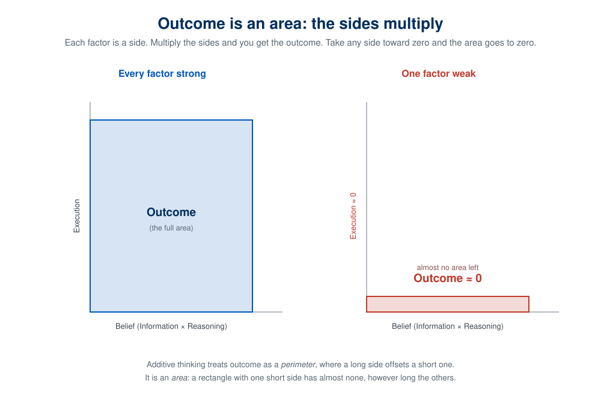
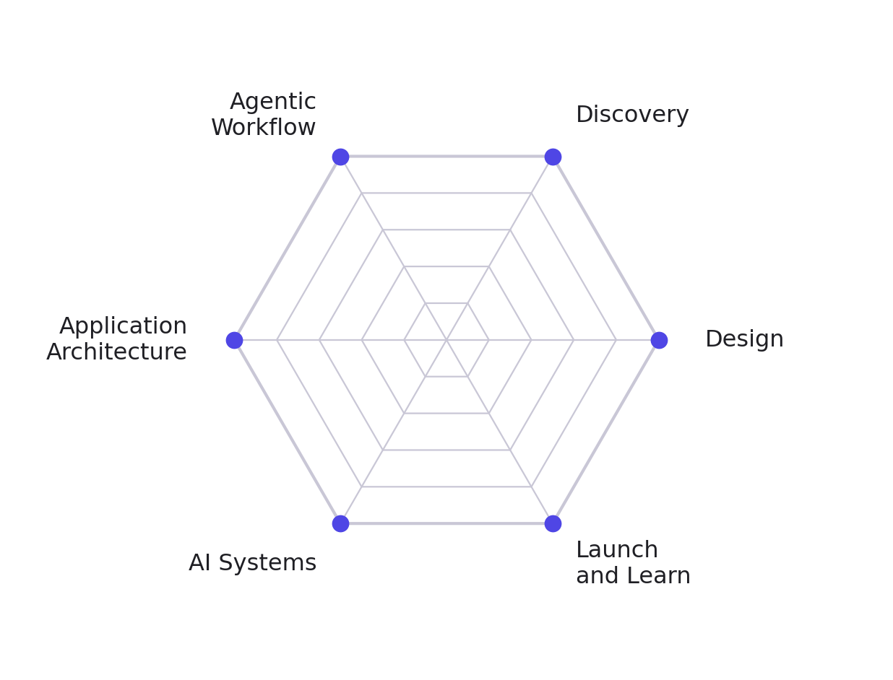
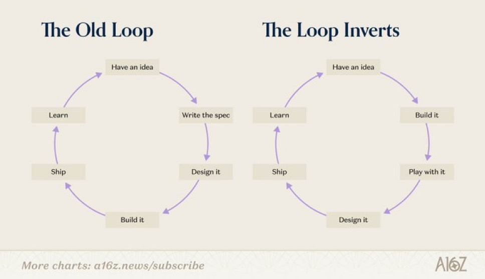
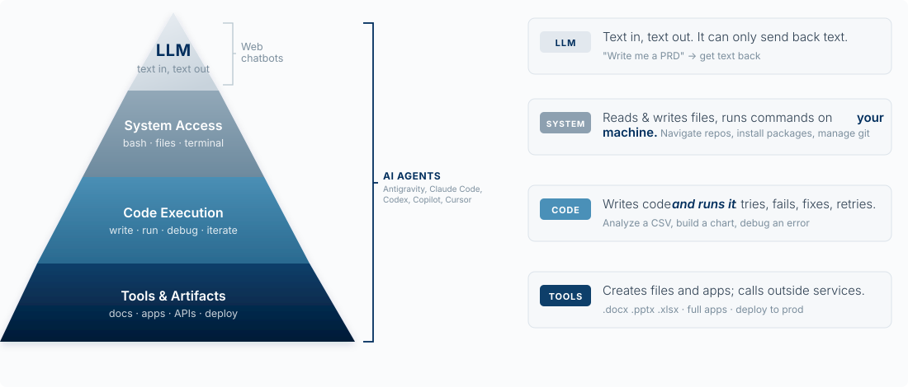

## Why This Matters

This is a course about building products, and you are going to start building in week one,
before you know what a backend is. That is not an accident. The instrument you build with
is an AI agent, and learning to direct one well is the skill everything else in this course
sits on top of.

<!-- learn -->

## The Loop: How This Course Works

Before the history and the frameworks, here is the one idea the whole course runs on. Strip product management down to its core and it is this: **figure out what is true, and act on it.** True about a customer, a problem, a market. Everything else, the interviews, the specs, the MVPs, the metrics, is machinery for that.

We run that machinery as a single loop, and it has a name: **AIRE**. Each step is a question, except the last, which is what happens when you have answered the first three:

- **Aim.** *What do you want?* The goal, and the values behind it: what value you are trying to create, for whom, and how much you mean to capture.
- **Inform.** *What is true?* Go find out what is actually true about your customer and their problem. Gather evidence.
- **Reason.** *What's the best option?* Lay out the real alternatives and choose among them. If there was only ever one option, you have not reasoned, you have rationalized.
- **Enact.** *What happened?* Build it, ship it, and watch. The answer becomes the next turn's evidence, so you loop back with a sharper aim, better information, and clearer reasoning.

Say it in one breath: what do you want, what is true, what's the best option, what happened. Three questions and a turn.

**Aim comes first, and that is not an accident.** Information is endless; without an aim you have no way to tell which facts matter, and discovery with no destination is just wandering. Lewis Carroll made the point in *Alice's Adventures in Wonderland* [@carroll1865], when Alice reaches a fork and asks the Cheshire Cat which way to go. President Thomas S. Monson retold it this way:

> The cat answers, "That depends where you want to go. If you do not know where you want to go, it doesn't matter which path you take."

Alice does not know where she wants to go, so for her it truly does not matter. Monson's turn on the story is the whole reason Aim leads: "Unlike Alice, we know where we want to go, and it does matter which way we go, for by choosing our path, we choose our destination" [@monson2016]. Answer *what do you want* first, and every question after it has a criterion. Skip it, and any road looks as good as any other.

The course *is* this loop, and the parts you see in the sidebar are its steps:

| The loop | The question | The part of the course |
|---|---|---|
| **Aim** | what do you want? | **Aim**: choose what is worth building, strategically and morally |
| **Inform** | what is true? | **Discover**: go learn what is true about the customer |
| **Reason** | what's the best option? | **Build**: decide what to build, then build it |
| **Enact** | what happened? | **Build**, then **Grow**: ship it, measure, and learn on the live product |

The **Aim**, what is worth building at all, is where strategy and values meet. What value you create and for whom, and how much of it you can capture, is the [create-versus-capture](03-what-is-worth-building.qmd#creating-value-and-capturing-it) choice in [Product Strategy](03-what-is-worth-building.qmd); whether it is worth building at all is [Product Morality](03-what-is-worth-building.qmd). And you will run the whole loop many times across the semester, once per sprint, because a single turn tells you little; the arc is what reveals whether you are getting good.

Two things about the loop are worth knowing up front.

First, **the middle three multiply, they do not add.** How good a decision turns out is roughly Information × Reasoning × Execution, and because those multiply, a zero anywhere sinks the whole. Brilliant reasoning on evidence you never gathered is a confident mistake. A great idea you never ship is worth nothing. Think of it as an area, not a perimeter: a rectangle with one short side has almost no area however long the others are.

{fig-alt="Two rectangles. The left, with all sides full, is a large shaded area labeled Outcome. The right, with the Execution side near zero, collapses to a thin sliver labeled Outcome near zero."}

Second, **most of the loop is about telling what you believe from what is true.** You will always have beliefs about your customer. Some are right, some are wrong, and the work of Inform and Reason is to close the gap. [Chapter 3](04-finding-and-validating-the-problem.qmd) gives you a picture of exactly that: a map of where a belief can sit relative to the truth, and how to move it.

AIRE is the loop *you* run, across a sprint. Later in this chapter you will meet a second, much faster loop: the one the *agent* runs on every turn (gather context, act, check). Keep the two apart. AIRE decides what is worth building; the agent loop is how a piece of it gets built.

### How we run class

Class meets once a week: short bursts of full attention to install a skill, then live building with Claude Code. Each class has one emphasis, and we open it with a scripture and a quote tied to that emphasis.

The scripture is not decoration, and it is not separate from the craft. This is BYU, and we take seriously Brigham Young's charge to Karl G. Maeser as he left to found this university: to "not teach even the alphabet or the multiplication tables without the Spirit of God." All truth is God's truth, and seeking it honestly, about a customer, a market, or anything else, is a spiritual act as much as a technical one. Faith, in the oldest sense, is not the absence of evidence; it is belief carried all the way into action. That is the Enact in AIRE: a belief you will not act on is dead. We will treat the whole loop that way, as work worth doing well and worth doing in good faith.

<!-- learn -->

## The Six Builder Axes

This course tracks six skills. Together they are what a full-stack AI product builder can
do, and they are the frame for everything that follows.

{width=60%}

| Axis | The question it answers |
|---|---|
| **Agentic Workflow** | How do I put AI to work, as the way I build and inside the product? |
| **Discovery** | What should I build, for whom, and should I? |
| **Design** | What does the surface look like, and how does it flow? |
| **Application Architecture** | How is it structured, shipped, and kept safe? |
| **AI Systems** | How do the models work, and why do they behave the way they do? |
| **Launch and Learn** | How do people find it, and did it work? |

Each axis gets two weeks. You will rate yourself on all six this week and again at the end
of the semester, and you will get back a six-sided chart of your profile both times. The
point of the baseline is not to judge you. It is so you know which axis is your weakest and
can spend your discretionary effort there.

Agentic Workflow comes first because you need the instrument before anything else is
possible. You will ship something in week one that you do not fully understand, and that is
deliberate. Understanding arrives later, and it arrives faster when you already have
something running to understand.

<!-- learn -->

## History of Product Management

Product management is the work of identifying customer needs, aligning them with business goals, and leading a cross-functional team to build a product that succeeds in the market. The person responsible is the Product Manager (PM), sometimes called the "CEO of the product." The comparison is loose: PMs usually lead without formal authority and have few direct reports. The skills are broad, though:

-   Strategic thinking: setting vision, making trade-offs, aligning with business goals
-   Customer insight: understanding user needs and pain points
-   Analytical ability: using data and critical thinking to guide decisions
-   Technical and design fluency: working effectively with engineers and designers
-   Execution: planning, prioritizing, and delivering
-   Communication and leadership: influencing, storytelling, managing stakeholders

The principles apply to hardware and software alike, but this course is about software products built with AI's help.

Product management as a job title traces to Hewlett-Packard in the 1940s. The idea is older: a 1931 Procter & Gamble memo described "Brand Men" whose responsibilities foreshadowed the role [@mcelroy1931].


Later influences, including the [Scrum development process](https://en.wikipedia.org/wiki/Scrum_(software_development)), the [Agile Manifesto](https://agilemanifesto.org/) [@beck2001], Google's Associate Product Manager (APM) program, and a shelf of influential books, standardized how the work is done.


Each computing wave widened the field: personal computers in the 1980s, the internet in the 1990s, broadband and cloud computing in the 2000s, and the iPhone in 2007. In 2011, Marc Andreessen of the venture firm Andreessen Horowitz (a16z) wrote that [*Software Is Eating the World*](https://a16z.com/why-software-is-eating-the-world/) [@andreessen2011]. The launch of ChatGPT on November 30, 2022 began the next wave, and with it the AI Product Manager. Andreessen now argues that [*AI Will Save the World*](https://a16z.com/ai-will-save-the-world/) [@andreessen2023]. It will not do so on its own; people will use the same tools to do harm. We are living in the time when:

> “Discoveries latent with such potent power, either for the blessing or the destruction of human beings as to make men’s responsibility in controlling them the most gigantic ever placed in human hands. … This age is fraught with limitless perils, as well as untold possibilities.” *--David O. McKay, in Conference Report, Oct. 1966, 4.* [@mckay1966]

**You have the opportunity to harness AI to improve the world. This class will help prepare you to take it.**

For two decades many companies built software with a *product trio*: a product manager who sets vision, strategy, and priorities; a designer who owns usability and the experience; and engineers who turn ideas into working, scalable systems. AI is changing both the division of labor inside the trio and how much one person can do.

<!-- learn -->

## AI Product Management

With AI, a PM can produce wireframes, mockups, and working demos without waiting on design or engineering, and can put a tangible idea in front of users in days. Designers and engineers are still needed; what changes is when they are engaged. Some ambitious individuals will wear all three hats.


::: embed-center
<iframe src="https://www.linkedin.com/embed/feed/update/urn:li:ugcPost:7362122859722256384?collapsed=1" height="567" width="504" frameborder="0" allowfullscreen title="Embedded post">

</iframe>
:::

Two kinds of AI PM are emerging.

#### AI-Powered PM

An AI-Powered PM uses AI tools as a core part of their own workflow: prototyping, coding, analysis. Most PMs will become AI-powered, at different speeds at different companies. Shopify made it part of hiring:

::: tweet-center
<blockquote class="twitter-tweet">

<p lang="en" dir="ltr">

We are adding a coding section to all of our Product Managers interviews at <a href="https://twitter.com/Shopify?ref_src=twsrc%5Etfw">\@Shopify</a>.<br><br> We'll start with APM interviews. We expect candidates to build a prototype of the product they suggested in the case interview.<br><br> There is no excuse for PMs not building prototypes.

</p>

— Kaz Nejatian (\@CanadaKaz) <a href="https://twitter.com/CanadaKaz/status/1955629733460562404?ref_src=twsrc%5Etfw"> August 13, 2025 </a>

</blockquote>
:::

```{=html}
<script async src="https://platform.twitter.com/widgets.js" charset="utf-8"></script>
```

#### AI Product PM

An AI Product PM builds products where AI is a core feature. On top of the traditional job (define the problem, lead the team, ship), they need to know what AI can and cannot do, how to measure its performance, and how to design around its limits, balancing accuracy, speed, cost, and safety. That is a high bar, and it is the bar this course aims at. Paweł Huryn's roadmap lays out what it takes:


<!-- learn -->

## Where Vibe Coding Came From

Andrej Karpathy, a founding member of OpenAI, coined "vibe coding" on February 2, 2025:

::: tweet-center
<blockquote class="twitter-tweet">

<p lang="en" dir="ltr">

There's a new kind of coding I call "vibe coding", where you fully give in to the vibes, embrace exponentials, and forget that the code even exists. It's possible because the LLMs (e.g. Cursor Composer w Sonnet) are getting too good. Also I just talk to Composer with SuperWhisper…

</p>

— Andrej Karpathy (\@karpathy) <a href="https://twitter.com/karpathy/status/1886192184808149383">February 2, 2025</a>

</blockquote>
:::

```{=html}
<script async src="https://platform.twitter.com/widgets.js" charset="utf-8"></script>
```

The term spread fast as a name for having AI write your code, often by voice. Collins Dictionary made it its 2025 Word of the Year. Karpathy had earlier described [English as the new programming language](https://x.com/karpathy/status/1617979122625712128?lang=en).

The practice is contested. Skeptics say it encourages a shallow relationship with code: builders who do not understand their systems, more bugs, and unclear accountability when something breaks. Supporters see the next step in a long trend. Compilers freed programmers from assembly; language models free them from typing every character of syntax, so they can spend their attention on intent, design, and impact. Both camps are partly right, and this course is built on the overlap: let the agent write the syntax, and keep the understanding for yourself.

Paul Graham, co-founder of Y Combinator (YC), came around:

::: tweet-center
<blockquote class="twitter-tweet">

<p lang="en" dir="ltr">

Vibe coding is here to stay. I'd been worried it might be a fad, but I talked to the founder of an infrastructure company who's in a position to see how well vibe-coded apps are doing, and he said a lot of them are making money.

</p>

— Paul Graham (\@paulg) <a href="https://twitter.com/paulg/status/1956458026652799173?ref_src=twsrc%5Etfw"> August 15, 2025 </a>

</blockquote>
:::

```{=html}
<script async src="https://platform.twitter.com/widgets.js" charset="utf-8"></script>
```

In March 2025, YC managing partner Jared Friedman said that a quarter of the Winter 2025 batch had codebases that were 95% AI-generated:



A wave of companies now sells tools for this. Dan Olsen's chart sorts them from less technical to more technical: browser-based app builders on the left, then IDE extensions, desktop apps, and command-line agents such as Claude Code on the right. This course works on the right side, and it is often useful to borrow from the left.


The clearest gain for a PM is fast, high-fidelity prototyping. A saying at the design firm IDEO explains why that matters:

::: tweet-center
<blockquote class="twitter-tweet">
<p lang="en" dir="ltr">
"If a picture is worth 1000 words, a prototype is worth 1000 meetings." —saying at <a href="https://twitter.com/ideo?ref_src=twsrc%5Etfw">\@ideo</a>
</p>
— John Maeda (\@johnmaeda) <a href="https://twitter.com/johnmaeda/status/518556402902925313?ref_src=twsrc%5Etfw">October 5, 2014</a>
</blockquote>
:::

```{=html}
<script async src="https://platform.twitter.com/widgets.js" charset="utf-8"></script>
```

Shopify's interview change (above) shows the skill is becoming expected. Beyond prototypes, a developer tool like Claude Code also gives a PM fast data analysis, automation, and more precise use of models than a chat window allows.

When building gets this cheap, the order of the work changes. The loop used to run idea, spec,
design, build, ship, learn: you wrote the thing down because building it was the expensive step,
so you wanted to be sure before anyone started. a16z calls what is happening now the inversion of
that loop.

{fig-alt="Two circular diagrams. The old loop reads have an idea, write the spec, design it, build it, ship, learn. The inverted loop reads have an idea, build it, play with it, design it, ship, learn."}

Madhu Guru described the same shift happening inside Google:

::: tweet-center
<blockquote class="twitter-tweet">

<p lang="en" dir="ltr">
At <a href="https://twitter.com/Google?ref_src=twsrc%5Etfw">\@Google</a>, we are moving from a writing-first culture to a building-first one.<br><br>Writing was a proxy for clear thinking, optimized for scarce eng resources and long dev cycles - you had to get it right before you built.<br><br>Now, when time to vibe-code prototype ≈ time to write PRD,…
</p>

— Madhu Guru (\@realmadhuguru) <a href="https://twitter.com/realmadhuguru/status/1950336434126336154?ref_src=twsrc%5Etfw">July 29, 2025</a>

</blockquote>
:::

```{=html}
<script async src="https://platform.twitter.com/widgets.js" charset="utf-8"></script>
```

In the inverted loop you build first and the artifact becomes the way you think. You play with a
working thing, and only then do you design it, because now you have something real to react to.
The prototype is the argument.

Read this as a change in sequence. The writing does not go away;
it moves. You still write down what the thing is supposed to do, you just write it after you have
learned something from a build instead of guessing beforehand, and you write it before the code is
something you intend to keep. The rule for the rest of the course: **explore to learn, then spec anything you intend to keep.** [Chapter 2](02-directing-the-agent.qmd) is about that discipline.

<!-- learn -->

## Where This Is Going

Who owns which piece of product work is now an open question:

::: tweet-center
<blockquote class="twitter-tweet">
<p lang="en" dir="ltr">
The fight over what a product manager does is going to among the first major AI organizational design problems faced by companies.<br><br>It is a job right at the center of what AI can do with first pass coding, marketing, design, ideation, etc. Who will own which pieces up for grabs. <a href="https://t.co/XkJQYOu9N9">https://t.co/XkJQYOu9N9</a>
</p>
— Ethan Mollick (\@emollick) <a href="https://twitter.com/emollick/status/1984682445946421505?ref_src=twsrc%5Etfw">November 1, 2025</a>
</blockquote>
:::

```{=html}
<script async src="https://platform.twitter.com/widgets.js" charset="utf-8"></script>
```

With the right tools, one person can credibly wear all three trio hats and become what LinkedIn's Tomer Cohen calls a [Full-Stack Product Builder](https://www.linkedin.com/pulse/bringing-full-stack-builder-life-tomer-cohen-gy5nf/).

The table below lists what product work actually consists of, question by question, and marks which
role does each piece. The highlighted column is the full-stack product builder: the same discovery,
planning, go-to-market, and analytics work a business PM does, plus the architecture and engineering
execution rows that used to belong to someone else. Those added rows are the ones this course is
built to cover.

{fig-alt="A large table. Rows are grouped by the question they answer: what should we build, how should we build it, how do we build it, how do we align and communicate, how do we bring it to market, how do we measure success, how do we improve or retire it, how do we build product culture. Columns are roles: a highlighted full-stack product builder column, then business PM, technical PM, product marketing manager, project manager, engineering, designer, data scientist, and customer success manager. The full-stack column is checked for every row, including the architecture and engineering execution rows that other PM columns leave blank."}

Boris Cherny, who created Claude Code, has said the team building it is staffed on this assumption:

::: tweet-center
<blockquote class="twitter-tweet"><p lang="en" dir="ltr">As always, a very thoughtful and well reasoned take. I read till the end.<br><br>I think the Claude Code team itself might be an  indicator of where things are headed. We have directional answers for some (not all) of the prompts:<br><br>1. We hire mostly generalists. We have a mix of senior…</p>&mdash; Boris Cherny (\@bcherny) <a href="https://twitter.com/bcherny/status/2015979257038831967?ref_src=twsrc%5Etfw">January 27, 2026</a></blockquote>
:::

```{=html}
<script async src="https://platform.twitter.com/widgets.js" charset="utf-8"></script>
```

::: tweet-center
<blockquote class="twitter-tweet">

<p lang="en" dir="ltr">

Builder’s high is back...

</p>

— Madhu Guru (\@realmadhuguru) <a href="https://twitter.com/realmadhuguru/status/1955451011323314641">August 13, 2025</a>

</blockquote>
:::

```{=html}
<script async src="https://platform.twitter.com/widgets.js" charset="utf-8"></script>
```

That is the ambition for you in this course: to become a full-stack product builder who uses AI to build products that improve people's lives.

<!-- learn -->

## Vibe Coding Terminology

The term "vibe coding" sounds unserious, and often the practice is. Some engineers now advertise themselves as "Vibe Code Cleanup Specialists," hired to clean up [AI slop](https://en.wikipedia.org/wiki/AI_slop): code or content generated carelessly.


Don't be the reason your boss has to bring in a Vibe Code Cleanup Specialist.

This course uses terms like "building with AI," "agentic coding," "AI builder," and "full-stack product builder" instead, and holds the work to a standard: code an agent wrote for you should stand up to review in a serious engineering organization.

<!-- learn -->

## What Makes an Agent an Agent

**An agent is a model in a loop with tools.** A web chatbot and a coding agent run on the same underlying models. What separates them is access: the chatbot can only send text back to you, while the agent can read your files, run commands, and see what happened.

{fig-alt="A four-layer pyramid. The small top layer is LLM, text in and text out. Below it, System Access: bash, files, terminal. Below that, Code Execution: write, run, debug, iterate. The wide base is Tools and Artifacts: docs, apps, APIs, deploy. A bracket marks the top layer alone as web chatbots, and a bracket spanning all four layers as AI agents."}

A chatbot can write you a PRD. An agent can read your repo, write the code, run it, watch it fail,
fix it, and deploy the result. That gap is why this course runs in a terminal instead
of a browser tab.

### The agent loop: gather context, act, check

Every agent turn has three phases. Claude Code's documentation names them **gather context, take action, and verify results**, and the loop repeats until the task is done or you interrupt.

| Phase | What the agent does | The tools it uses | What goes wrong here |
|---|---|---|---|
| **Gather context** | Reads files, searches the code, reads your instructions | Read, search, CLAUDE.md, web fetch | It never looked at the file that mattered, or your instruction was not in front of it |
| **Act** | Changes something | Edit, Write, Bash (run a command) | It edited the wrong file, or ran a command you did not want |
| **Check** | Looks at the result of its action | Run the tests, run the app, read the error output | It skipped the check, or the check could not detect the problem |

Two building blocks make this work. The **model** reasons and decides the next step. The **tools** act and report back: every tool result goes into the conversation and shapes the model's next decision. Claude Code is the layer around the model that supplies the tools and manages what the model sees; the docs call that layer the *agentic harness*.

**Worked example.** You tell Claude Code: "The delete button on my to-do app doesn't work." A good run looks like this:

1. *Context:* it reads `app.py`, finds the delete handler, and reads `todos.json`.
2. *Act:* it notices the handler removes the item from the list but never saves the file, and adds the save.
3. *Check:* it runs the app (or a small test), deletes an item, reloads, and confirms the item is gone.
4. The check passes, so it stops and reports.

Now three bad runs, one per phase. It "fixes" the wrong button because it never opened `app.py` (context). It rewrites the whole file and breaks the add feature (act). It announces "Fixed!" without ever reloading the app (check). The loop gives you a debugging checklist for the agent itself: **when a result is wrong, ask which phase failed.** Did it lack context, take the wrong action, or skip the check? Each has a different fix: give it the file or the rule, narrow the request, or give it a way to verify.

You are part of the loop too. You can interrupt at any point (press `Esc`), add context, or redirect. A good builder treats the agent like a fast, capable new hire with no memory who takes you literally: brief it well, check its work, and do not assume it knows what you did not tell it. The analogy breaks in one useful place: unlike a new hire, the agent does not learn from yesterday unless you write the lesson down where it will read it (Chapter 2).

::: {.callout-tip title="Try it"}
Ask Claude Code to make a small change in your project, then watch the transcript instead of the result. Label each step it takes as context, action, or check. Did it check its own work before saying it was done? If not, what check would you have asked for?
:::

<!-- learn -->

## The Command Line

To direct an agent you need to read what it is doing, and most of what a coding agent does happens on the [command line](https://en.wikipedia.org/wiki/Command-line_interface): a text-based way to control your computer by typing commands instead of clicking. The program that shows it is a **terminal**: Terminal on macOS; Command Prompt, PowerShell, or Git Bash on Windows; or the terminal panel built into VS Code.

The command line gives direct access to files, programs, and system functions, many of which have no graphical interface at all. That is why AI made it more important: Claude Code, Codex, and Gemini CLI all live there, and when the agent runs a command you approve or reject it based on whether you can read it.

You do not need to memorize commands, since the agent will type them. You need to recognize the core ones:

| Command | What it does |
|---|---|
| `pwd` | Print the folder you are in |
| `ls` | List files in the current folder (`ls -la` includes hidden files like `.claude`) |
| `cd foldername`, `cd ..`, `cd ~` | Move into a folder, up one level, or to your home folder |
| `mkdir my-project` | Make a folder |
| `echo "text" > file.txt` | Write text to a file, **overwriting** it |
| `echo "text" >> file.txt` | **Append** text to the end of a file |
| `cat file.txt` | Show a file's contents |
| `cp a.txt b.txt` | Copy a file |
| `rm file.txt`, `rm -r folder` | Delete a file, or a folder and everything in it |
| `open my-project` (macOS), `explorer.exe my-project` (Windows) | Open a folder in Finder or File Explorer |

#### Gotchas

-   Paths with spaces need quotes: `cd "My Folder"`.
-   macOS and Linux are usually case-sensitive; Windows is not.
-   `rm` deletes permanently. Nothing goes to the Trash. Keep this in mind when an agent asks to run it; Chapter 2's section on blast radius explains why a deleted file is one of the few things you cannot undo with Claude Code's rewind.

::: {.callout-tip title="Try it"}
Predict the contents of `notes/journal.txt` after these four commands, then run them and check:

```bash
mkdir -p problem-tracker/notes && cd problem-tracker
echo "Day 1: Problems I noticed today" > notes/journal.txt
echo "- Spent 10 min finding a parking spot" >> notes/journal.txt
echo "Day 2" > notes/journal.txt
```

(Answer: only `Day 2`. The last line used `>`, which overwrites.)
:::

::: {.callout-note collapse="true" title="Windows only: set up Git Bash so these commands work"}
In a VS Code terminal, run `winget install --id Git.Git -e --source winget`, then confirm with `git --version`. In VS Code press `Ctrl + Shift + P`, choose **Terminal: Select Default Profile**, pick **Git Bash**, and open a new terminal (`Ctrl + ~`). It should start with `bash$` or `MINGW64` instead of `PS`. The commands above then work as on macOS.
:::

#### Package management

A **package manager** installs, updates, and removes software from the command line, so you type one command instead of clicking through an installer. On macOS the standard one is *Homebrew* (installed from [brew.sh](https://brew.sh); check it with `brew --version`). On Windows 10 and 11, *winget* comes pre-installed (`winget --version`). When Claude Code installs `git`, `node`, or `python` for you, it is calling one of these.

<!-- learn -->

## VS Code

Visual Studio Code is a free code editor from Microsoft and the home base for this course: a file browser, an editor, a built-in terminal, and the Claude Code extension in one window. Installation is in [Computer Setup](00-computer-setup.qmd). (On macOS, `brew install --cask visual-studio-code` installs it from the command line; `--cask` tells Homebrew it is a graphical app.)

<!-- learn -->

## Claude Code

Claude Code is Anthropic's coding agent. You describe what you want in plain language; it reads your project, plans, edits files across the codebase, runs commands and tests, and reports back, asking your permission for actions you have not pre-approved. It will not build a polished, complicated application by itself, but it gives you something like a crane and power tools for building the house.



You installed it in [Computer Setup](00-computer-setup.qmd): a Claude Pro (or higher) subscription, the install script in the VS Code terminal, then `claude` to sign in. As a reminder of what that looked like, the terminal opens as a pane inside VS Code:


After you sign in, you see the welcome screen:


When Claude wants to run something, such as installing git, node, and python, it asks first and you press **Enter** to approve:


That approval prompt is the permission system at work. Chapter 2 explains how to decide what the agent may do without asking.

::: {.callout-note collapse="true" title="Other AI CLI agents (optional)"}
Instruction in this course uses Claude Code, but the same model applies to other terminal agents. Install commands are in [Computer Setup](00-computer-setup.qmd#optional-other-ai-coding-agents).

**Google Gemini CLI** ([free for students](https://gemini.google/students/)):


**GitHub Copilot CLI**:


**OpenAI Codex**:


:::

### One engine, many surfaces

**Claude Code is one engine with several front ends.** The agent loop, the tools, and the configuration are the same everywhere; what changes is the window around it and a short list of features each one adds or lacks.

| Surface | What it is | Pick it when |
|---|---|---|
| **Terminal (CLI)** | `claude` typed in any terminal, including VS Code's | You want every feature, scripting (`claude -p`), or a terminal workflow. The docs call it the most complete surface |
| **VS Code extension** | A chat panel in the editor, opened from the Spark icon | You want inline diffs next to your code and to stay in the editor |
| **Desktop app** | The Code tab in the Claude desktop app | You want a visual diff viewer, an app preview, and several sessions side by side |
| **Web** ([claude.ai/code](https://claude.ai/code)) | A session that runs in Anthropic's cloud on a fresh clone of your GitHub repo | A long task that should keep running after you close the laptop |

What carries across: the terminal, the VS Code extension, and the desktop app read the **same configuration files** on your machine: `CLAUDE.md`, skills, hooks, MCP servers, and `settings.json`. Learn them once in the terminal and you have learned them for the app. A web session is different because it runs on another computer: it sees what is committed to your repo (the project `CLAUDE.md` and `.claude/settings.json`, for example) and not what lives only on your laptop (`~/.claude/settings.json`, `.claude/settings.local.json`, your `.env`).

Three gotchas students hit:

- The VS Code extension bundles its own private copy of Claude Code. Installing only the extension does **not** let you type `claude` in a terminal; that needs the standalone install from Computer Setup.
- `Shift+Tab` cycles permission modes in the terminal. The desktop app uses a mode menu instead.
- Some terminal commands, such as `/permissions`, are not available in the desktop app; you edit the settings file instead.

::: {.callout-tip title="Try it"}
Predict, then check: you add a line to your project's `CLAUDE.md` while working in the terminal. Will a session in the VS Code extension see it? Will a web session at claude.ai/code see it if you have not committed and pushed the file? (Yes; no.)
:::

<!-- learn -->

## Code your first app

Open VS Code and create a new folder for your app.

::: {.callout-tip collapse="true" title="File and folder naming principles"}
Agents usually name files for you, but when you name them yourself:

- **Use lowercase** to avoid cross-platform issues.
- **Use hyphens (`-`)**, not spaces or underscores: `data-cleaning`, not `Data_Cleaning` or `data cleaning`.
- **Be descriptive but concise**: `customer-surveys-2025.csv` beats `cs25.csv`.
- **Avoid special characters**: letters, numbers, and hyphens.
- **Be consistent**: plural folder names (`scripts/`, `images/`).

Common folders: `src/` (source code), `data/`, `docs/`, `tests/`, `scripts/`, `configs/`, `assets/`. Name files for what they contain or do (`train-model.py`, `db-settings.json`), number notebooks to keep order (`01-data-exploration.ipynb`), and keep `README.md` in the root folder.
:::

Make the folder, move into it, and start Claude Code:

```bash
mkdir my-project
cd my-project
claude
```

Turn on the [Explanatory output style](https://code.claude.com/docs/en/output-styles), which makes Claude add short *Insight* notes explaining the choices behind the code it writes:

```bash
/output-style explanatory
```

Run `ls -la` in a second terminal and you will see a new hidden **folder** named `.claude`. Claude Code saved your choice to a settings file inside it, `.claude/settings.local.json` (the *local* file holds your personal settings for this project and is not meant to be committed). The `.claude` folder is where a project's Claude Code configuration lives: settings, and later skills, hooks, and subagents. It is separate from `CLAUDE.md`, the instructions file Claude reads at the start of every session, which you will write in Chapter 2.

Now paste this prompt into Claude Code:

> Build me a simple todo list app using streamlit. Use a json file as the database.

As it works, label the loop: when is it gathering context, when is it acting, and does it check that the app runs before it says it is done?

::: {.callout-tip collapse="true" title="What is streamlit?"}
Streamlit is an open-source Python framework for building interactive, data-driven web apps without front-end code (HTML, CSS, or JavaScript). A Python script becomes a web app; built-in widgets (sliders, dropdowns, checkboxes, file uploaders) collect input; it works with Pandas, Matplotlib, Plotly, and similar libraries; and apps can be hosted on Streamlit Community Cloud.
:::

::: {.callout-tip collapse="true" title="What is JSON?"}
JSON (JavaScript Object Notation) is a lightweight format for storing and sending data as keys and values:

`{"name": "Alice", "age": 20, "isStudent": true}`

Here "name" is a key and "Alice" its value. JSON is easy for people to read and for programs to parse, which is why apps use it to exchange data.
:::

<!-- learn -->

## Code Your Second App

Spend the next 15 minutes building another application. For now, keep using streamlit (say so in your prompt).

<!-- learn -->

## AI Dev Tools Landscape

Claude Code is the primary tool in this course. The wider field, roughly sorted:

| Tool | Type | Best for |
|------|------|----------|
| **Claude Code** | Coding agent (terminal, VS Code, desktop, web) | Full-stack building; the course's main tool |
| **Codex**, **Gemini CLI**, **GitHub Copilot** | Coding agents from OpenAI, Google, and GitHub | The same agent-loop model, different vendors |
| **Cursor** | AI code editor (a VS Code fork) | Editing with AI built into the editor |
| **Lovable**, **v0** | Browser app builders | Quick UI prototypes from a prompt |
| **Figma** | Design tool | Mockups and user flows |

When you want to see a UI idea in seconds before building it properly, a browser app builder like Lovable is a reasonable first stop.

<!-- learn -->

## Key Concepts

- **Product Management**: identifying customer needs, aligning with business goals, and leading a team to build products that succeed
- **Product Trio**: PM + designer + engineer collaboration model
- **AI-Powered PM**: uses AI tools in their own workflow (prototyping, coding, analysis)
- **AI Product PM**: builds products where AI is a core feature
- **Vibe coding and the inverted loop**: build to learn first, then spec what you intend to keep
- **Agent**: a model in a loop with tools
- **Agent loop**: gather context, act, check; when a result is wrong, ask which phase failed
- **Command Line / CLI**: text-based interface to your computer, run in a terminal
- **Package Manager**: tool for installing software from the command line (Homebrew, winget)
- **VS Code**: the code editor used throughout the course
- **Claude Code**: Anthropic's coding agent; one engine across the terminal, VS Code extension, desktop app, and web, sharing CLAUDE.md, skills, hooks, and settings on your machine
- **`.claude` folder**: where a project's Claude Code settings, skills, hooks, and subagents live
- **Explanatory output style**: adds *Insight* notes explaining the choices behind the code

<!-- learn -->
