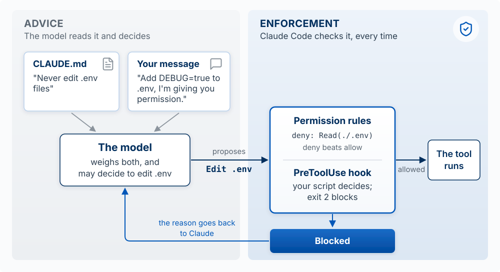
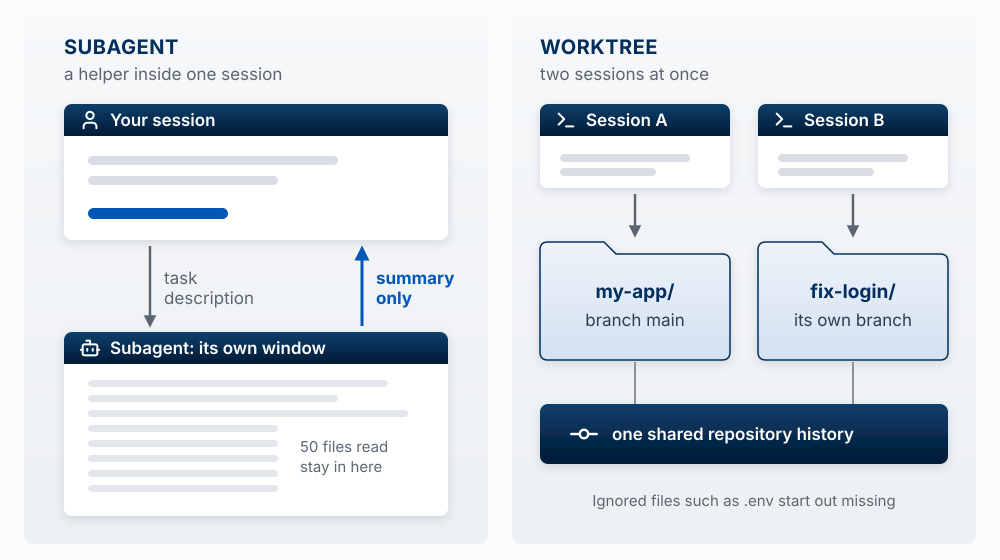
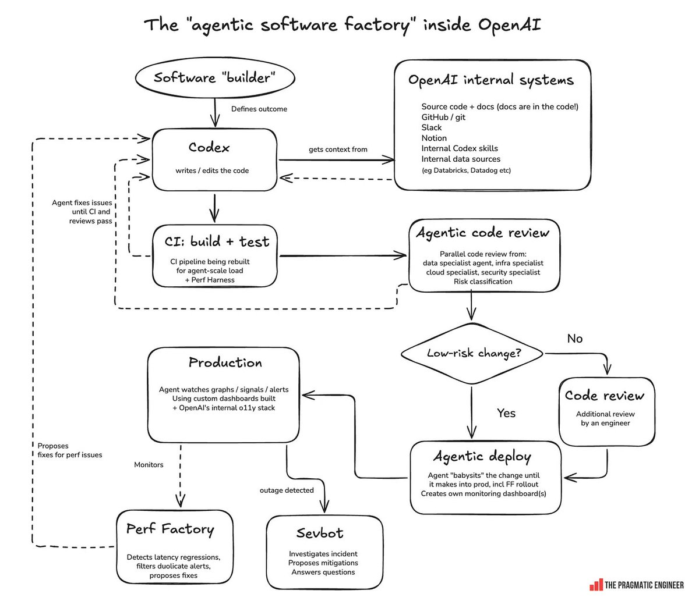

## Why This Matters

You have a working app and almost no control over how it got built. This chapter is about
control, and control comes down to three questions you answer for every agent you direct:

1. **What can it see?** The agent knows only what is in its context window: all the text the model has in front of it at one moment.
2. **What may it do?** Instructions advise; hooks and permission rules enforce; modes, sandboxes, and worktrees limit the damage. Each of these is defined in its own section below.
3. **How will you know it worked?** Its own report is a claim. Your check is the evidence.

All three get easier when you have written down what you want before anyone builds it. That
written description is a spec, and it is the last step of design, so it has its own chapter in the
Design part of the book: [Specs](06b-specs.qmd).

<!-- learn -->

## Conversational Coding

AI-assisted coding works best when you think out loud. Instead of trying to write perfect prompts, have a conversation:

**Less effective:**
> Build me a problem tracker app with all features

**More effective:**
> I want to track problems I notice throughout the day. Let's start simple, just a way to add a new problem with a title and description. We can add evaluation features later.

Then iterate:
> That looks good. Can we add a timestamp so I know when I captured each problem?

> Now I want to rate each problem on frequency (daily, weekly, monthly, rarely). Add a dropdown for that.

Each small request is one short trip around the agent loop, and you check the result before the next one. Conversation is how you *explore*. Once you know what you want to keep, you write it down as a spec ([Specs](06b-specs.qmd)), so the next session, or the next agent, does not have to rediscover it from a chat log.

<!-- learn -->

## It Knows Only What It Can See

**The agent can use only what is in its context window.** Whatever is not in it does not exist for the agent: not the conversation you had yesterday, not the decision you made in your head, not the file it never opened. Every response is produced from what is in the window right now.

#### What fills the window

| Building block | When it enters | You control it with |
|---|---|---|
| Claude Code's own system instructions | Every session | (fixed) |
| **CLAUDE.md** files | Start of every session, and again after `/clear` | Editing the file |
| Skill names and descriptions | Start of every session; a skill's full instructions load only when it is used | Writing skills |
| Your messages and Claude's replies | As you talk | What you say |
| Tool results: files it read, command output, search results | Each time it uses a tool | What you ask it to read; subagents (below) |

The window is finite. As it fills, Claude Code clears old tool output and then summarizes the conversation automatically, and instructions from early in the conversation can get lost in the summary. That is the practical reason for CLAUDE.md: **anything that must survive goes in a file the agent re-reads, not in a chat message.**

#### The controls

| Command or file | What it does to the window |
|---|---|
| `CLAUDE.md` | Puts standing facts and rules in every session |
| `/context` | Shows what is filling the window right now |
| `/compact` | Summarizes the conversation so far to free space, and keeps going on the same task. `/compact focus on the API changes` tells it what to keep |
| `/clear` | Starts a new, empty conversation. CLAUDE.md still loads; everything you said does not |
| Skills | Keep procedures out of the window until they are needed |
| Subagents | Do noisy work (long logs, big searches) in a separate window and return only a summary |

{#fig-context-window fig-alt="Three tall bars, each a context window filled from the bottom, starting with system instructions and CLAUDE.md. Mid-session, skill descriptions sit above them and the bar is full: conversation and a large block of tool results sit on top. An arrow labeled /compact leads to a second bar where the conversation and tool results are replaced by a small summary, with free space above, and the skill descriptions are replaced by only the skills you used. An arrow labeled /clear leads to a third bar with the skill descriptions back and an empty conversation. CLAUDE.md is highlighted in all three." width="100%"}

**Worked example.** On Monday you tell Claude, "Never use a database for this project; JSON files only." On Wednesday you start a new session and ask for a search feature. Claude adds SQLite (a small database). It did not disobey you: Monday's sentence was in Monday's window, and Wednesday's window never contained it. Put the rule in CLAUDE.md and every session starts with it. (Claude may also have saved the rule to its auto memory, described below, but only on that computer, and Claude decides what it saves. A rule you depend on belongs in CLAUDE.md, which you write and commit.)

#### CLAUDE.md: your project's memory

`CLAUDE.md` is a Markdown file (plain text with simple marks, such as `#` for a heading and `-` for a bullet) that Claude Code reads automatically at the start of every session. It is where you write down what you would otherwise re-explain: what you are building, the tech stack, conventions, and commands. Ask Claude to write one:

> Create a CLAUDE.md file that describes a problem tracking application I'm building to help me identify startup ideas

Claude will create something like:

```markdown
# Problem Tracker

## Project Overview
A personal tool for capturing and evaluating problems that could become product opportunities.

## Tech Stack
- Python with Streamlit for the frontend
- JSON file for data persistence

## Development Notes
- Keep the UI simple since this is for personal use
- Focus on fast capture over elaborate analysis
```

`/init` generates a starter CLAUDE.md by reading your codebase, and `/memory` opens your CLAUDE.md files, turns auto memory on or off, and shows what Claude has saved. Keep it short: the docs suggest under 200 lines, because every line costs context on every turn and long files are followed less reliably.

**What to write in it.** Write what the agent cannot work out by reading the code: decisions, constraints, and traps. The code already shows which framework you use. It does not say why you chose one way of connecting to your database over another, which file breaks if it is edited carelessly, or which commands must never run without asking. The [Agent Team Kit](https://github.com/ai-foundry-byu/agent-team-kit), a set of hooks, skills, and written practices from building production apps with several Claude Code agents at once, suggests these sections in its [guide to writing CLAUDE.md](https://github.com/ai-foundry-byu/agent-team-kit/blob/main/docs/WRITING-CLAUDE-MD.md):

| Section | What goes in it |
|---|---|
| What this repo is | One paragraph: the product and the stack |
| Commands | The dev, build, test, and database commands, one line each |
| Architecture | Where each kind of code goes, so new code lands in the right place |
| Conventions | Naming, styling, the words used in the interface |
| Definition of done | The checks that must pass before work counts as finished (see Done Means You Saw It Work, below) |
| Leave alone unless asked | Lines the agent must not cross on its own: pushing to GitHub, adding a new sign-in (auth) or database library, deleting (dropping) database tables |

Two habits keep it useful. When a convention changes, update CLAUDE.md in the same commit as the change, because an out-of-date file misdirects every session that reads it. And test it: read it as if you were an agent that just cloned the repo. Any wrong assumption you would still make about where code goes or what done means is the next thing to write.

#### Where CLAUDE.md files live

| Location | Scope | Use it for |
|---|---|---|
| `./CLAUDE.md` (or `./.claude/CLAUDE.md`) in the project root | This project; commit it so your team shares it | Tech stack, conventions, build and test commands |
| `./CLAUDE.local.md` | This project, just you (keep it out of git) | Personal notes about this project |
| `~/.claude/CLAUDE.md` | All your projects | Your personal preferences and style |

All the files that apply are **combined**, not replaced: a project file adds to your personal one, and the more specific file is read last. Settings are a different thing and live in different files (`.claude/settings.json` and related files); you will meet them under permissions and hooks below.

#### CLAUDE.md and auto memory

Claude Code also keeps **auto memory**: notes Claude writes for itself as it works, such as a
build command it worked out or a correction you gave it. It is on by default. The two differ in
who writes them and where they live:

| | CLAUDE.md | Auto memory |
|---|---|---|
| **Who writes it** | You (or Claude, when you ask) | Claude, when it decides something is worth keeping |
| **Where it lives** | In your project folder, so it is committed with the code | In your home folder, `~/.claude/projects/<project>/memory/` |
| **What loads** | The whole file, every session | An index file, `MEMORY.md` (its first 200 lines), every session; the rest when Claude needs it |
| **Who else gets it** | Anyone who clones the repo, and web sessions | Nobody. The terminal, VS Code, and the desktop app on the same computer share it; another computer, a teammate, or a web session does not |

Check what Claude has saved with `/memory`. When a saved note matters to the project, move it
into CLAUDE.md so it reaches everyone who works on the code.

::: {.callout-tip title="Try it"}
Run `/context` in a session and find your CLAUDE.md in the list. Then: (1) tell Claude a project rule in chat, run `/clear`, and ask it what the rule is. (If Claude remembers it anyway, check `/memory`: it may have saved the rule to auto memory.) (2) Put the rule in CLAUDE.md, run `/clear`, and ask again. Explain the difference in one sentence.
:::

<!-- learn -->

## Claude Code: Slash Commands

A slash command is recognized at the start of a message; anything after it is its argument. The built-ins you will use most:

| Command | What It Does |
|---------|--------------|
| `/help` | Show available commands |
| `/init` | Write a starter CLAUDE.md for this project |
| `/memory` | Open your CLAUDE.md files, turn auto memory on or off, and browse what Claude has saved |
| `/context` | Show what is filling the context window |
| `/clear` | Start a new conversation with empty context (CLAUDE.md still loads) |
| `/compact` | Summarize the conversation so far to free up context, and keep going on the same task |
| `/plan` | Switch into plan mode (read-only planning; see [Claude Code's plan mode](06b-specs.qmd#claude-codes-plan-mode)) |
| `/rewind` | Roll back Claude's file edits and/or the conversation to an earlier point |
| `/permissions` | Manage allow, ask, and deny rules |
| `/mcp` | Manage connections to outside tools (MCP servers) |
| `/hooks` | Show every hook that is set up and where it came from |
| `/config` | Open settings (theme, model, and other preferences) |
| `/status` | Show version, model, and account |

#### Your own commands

You can also save a prompt you use often and run it by name. Claude Code now treats these as **skills** (next section): a file at `.claude/commands/interview.md` still works and creates `/interview`, but new ones should be skills. Text you type after the command replaces `$ARGUMENTS` in the file, so `/interview [paste notes]` runs your saved synthesis prompt on those notes. Files in `~/.claude/` (your home folder) are available in every project; files in the project's `.claude/` only there.

Useful ones for a PM: `persona` (a persona from interview data), `jtbd` (a problem restated as a job to be done), `commit` (a commit message for staged changes), `review` (a code review).

<!-- learn -->

## Claude Code: Skills

A skill is a reusable procedure you teach Claude once: a folder with a `SKILL.md` file of instructions, plus any reference files or scripts it needs. You run it with `/skill-name`, or Claude loads it on its own when your request matches the skill's description.

#### Creating a Custom Skill

Each skill is a folder in `.claude/skills/` in your project, with a file named `SKILL.md` inside
it. The folder name becomes the command, so `.claude/skills/test-synthesis/SKILL.md` creates `/test-synthesis`.

The lines between the `---` markers at the top
are the skill's settings. The `description` matters most: Claude reads it to decide when the
skill applies, so a vague description means Claude never uses the skill on its own.

```markdown
---
description: Synthesizes usability test notes into findings and recommendations. Use when the user shares test session notes.
---

# Test Synthesis Skill

From the usability test notes provided, produce: a one-paragraph summary,
key findings ordered by severity, prioritized recommendations, and notable quotes.

## Rules
- Focus on behavior, not opinions
- Prioritize by frequency (multiple users) and severity (blocks core task)
- Include what worked well

$ARGUMENTS
```

Now use it: `/test-synthesis [paste your notes here]`.

#### Skills vs. Slash Commands

Claude Code has merged the two: a file at `.claude/commands/deploy.md` and a skill at
`.claude/skills/deploy/SKILL.md` both create `/deploy`, and both work. Use a skill for anything new,
because a skill is a folder and can carry more:

| Feature | Command file | Skill |
|---------|----------------|--------|
| **Location** | `.claude/commands/name.md` | `.claude/skills/name/SKILL.md` |
| **Supporting files** (reference docs, scripts) | No | Yes, in the same folder |
| **Claude can use it on its own** when the description matches | Yes | Yes |
| **You can stop Claude using it on its own** | Yes | Yes (`disable-model-invocation: true`) |
| **Shareable** | Copy the file | Copy the folder, or package as a plugin |

Why a skill instead of putting the same instructions in CLAUDE.md: CLAUDE.md is read on every
turn, so every line costs context all the time. A skill's full instructions load only when it is
used. The rule of thumb: **standing facts go in CLAUDE.md; a procedure you need sometimes goes in a skill.**

Skills worth creating: `feedback-synthesis` (synthesize several interviews or test sessions), `component-review` (review a React component), `api-design` (design an endpoint), `test-generator` (test cases for a component). To use a skill in every project, copy its folder to `~/.claude/skills/`. A **plugin** is a package that bundles skills, hooks, subagents, and MCP servers so others can install them with `/plugin`.

The Agent Team Kit's [skills guide](https://github.com/ai-foundry-byu/agent-team-kit/blob/main/docs/SKILLS.md) gives two tests for when a procedure should become a skill. If you have explained the same careful procedure to an agent twice, write it down once as a skill. If an action is expensive to get wrong (a release, a database migration), write a skill that fixes the safe order of steps, so the agent does not improvise it. The kit's own skills are worked examples to copy and adapt:

| Skill | What it does |
|---|---|
| [`regression-check`](https://github.com/ai-foundry-byu/agent-team-kit/blob/main/skills/regression-check/SKILL.md) | Before a change to shared code is finished, lists every caller of what changed and the features behind them, then adds a test of each affected feature's user-facing behavior |
| [`fix-bug`](https://github.com/ai-foundry-byu/agent-team-kit/blob/main/skills/fix-bug/SKILL.md) | Loads a bug report and requires the agent to reproduce the bug before changing code, keeping what the user saw separate from the user's guess at the cause |
| [`spec`](https://github.com/ai-foundry-byu/agent-team-kit/blob/main/skills/spec/SKILL.md) and [`build-spec`](https://github.com/ai-foundry-byu/agent-team-kit/blob/main/skills/build-spec/SKILL.md) | Write a spec and stop for approval, then build it; see [Specs](06b-specs.qmd#the-agent-team-kits-spec-and-build-spec-skills) |
| [`ux-critique`](https://github.com/ai-foundry-byu/agent-team-kit/blob/main/skills/ux-critique/SKILL.md) | Uses the app in a browser through one flow; at each step predicts what a user would expect, acts, and records where the result differs |
| [`push`](https://github.com/ai-foundry-byu/agent-team-kit/blob/main/skills/push/SKILL.md) | Turns "ship it" into a fixed sequence: release notes, version bump, commit only those files, then push |

::: {.callout-tip title="Try it"}
You have three things to tell Claude: "We use Supabase for the database," "To publish a release: bump the version, write notes, tag, push," and "Never commit to main." Decide which goes in CLAUDE.md, which in a skill, and which belongs in neither (hint: the next section).
:::

<!-- learn -->

## Advice Versus Enforcement

**An instruction is advice the agent usually follows. A hook or a permission rule runs every time.** The Claude Code docs say it directly: CLAUDE.md is context, not enforced configuration. If a rule must hold every single time (never edit `.env`, always format after an edit, never finish with failing tests), it cannot live only in CLAUDE.md. It needs one of two enforcement mechanisms:

| Mechanism | What it is | Good for |
|---|---|---|
| **Permission rule** | An allow, ask, or deny entry in a settings file, checked before a tool runs | Blocking or pre-approving a specific tool, file, or command |
| **Hook** | Your own script that Claude Code runs automatically at a point in the loop | Anything that needs logic: check the branch, run the formatter, run the tests |

{#fig-advice-vs-enforcement fig-alt="Two zones. Advice: a CLAUDE.md card saying never edit .env files and a message card saying add DEBUG=true to .env, I'm giving you permission, both feed The model, which weighs both and may decide to edit .env. It proposes Edit .env to a highlighted box in the Enforcement zone holding permission rules, deny Read(./.env), and a PreToolUse hook where exit 2 blocks. If allowed, the tool runs. If blocked, the reason goes back to Claude." width="100%"}

#### Permission rules

Rules live in a settings file under `permissions`: `.claude/settings.json` in your project to share them with your team, or `.claude/settings.local.json` for rules that are only yours. Each rule is written as `Tool(specifier)`: the tool's name, then which uses of it the rule covers. **Deny overrides allow**, and deny rules apply in every permission mode.

```json
{
  "permissions": {
    "allow": ["Bash(npm run test *)"],
    "deny":  ["Read(./.env)", "Bash(git push *)"]
  }
}
```

The first rule lets Claude run your tests without asking (`npm` is the command that runs a JavaScript project's scripts, and `*` matches anything after it). `Read(./.env)` blocks Claude's file tools from reading the secrets file, and a Read deny also blocks editing it. `Bash(git push *)` stops the push command as Claude usually writes it. One limit to know: a Bash rule matches the *text* of the command, so the same action written another way (through a script, say) will not match it. For a boundary the operating system enforces, use the sandbox (next section). You can manage rules with `/permissions`, and choosing "Yes, don't ask again" at a prompt saves an allow rule to `.claude/settings.local.json`.

#### Claude Code hooks

A hook is a command that runs **automatically** when something happens, every time, whatever
Claude decides.

Two different things are both called "hooks," and it helps to keep them apart:

- **Claude Code hooks** fire on Claude's own actions: before or after it uses a tool, when it
  finishes a response, when a session starts.
- **Git hooks** fire on Git's actions: before a commit, before a push. They run whether the
  commit came from you, from Claude, or from anyone else. Husky (below) is a popular way to set
  them up.

The events you will use most:

| Event | When it fires | Typical use |
|---|---|---|
| `PreToolUse` | Before Claude uses a tool (edit a file, run a command) | Block something dangerous |
| `PostToolUse` | After a tool succeeds | Format or check a file Claude just edited |
| `Stop` | When Claude finishes responding | Make Claude keep going until the tests pass |
| `SessionStart` | When a session starts | Load facts like the current branch |

Hooks are set in a settings file: `.claude/settings.json` to share with your team (commit it), or
`~/.claude/settings.json` for all your projects. This one runs a script before every file edit:

```json
{
  "hooks": {
    "PreToolUse": [
      {
        "matcher": "Edit|Write",
        "hooks": [
          { "type": "command", "command": "${CLAUDE_PROJECT_DIR}/.claude/hooks/protect-env.sh" }
        ]
      }
    ]
  }
}
```

The `matcher` says which tools the hook watches. Claude Code sends the hook a description of what
Claude is about to do, as JSON, and the script decides. Create
`.claude/hooks/protect-env.sh` and make it runnable with `chmod +x .claude/hooks/protect-env.sh`.
It uses `jq`, a small tool for reading JSON; install it first if `jq --version` fails (`brew install jq` on macOS).

```bash
#!/bin/bash
# Block Claude from editing .env files
FILE=$(jq -r '.tool_input.file_path')

if [[ "$FILE" == *".env"* ]]; then
  echo "Blocked: .env files hold secrets and must not be edited by Claude" >&2
  exit 2
fi
exit 0
```

Every command ends by returning an **exit code**, a number that reports how it went; `0` conventionally means success. That is what the `exit 2` and `exit 0` lines in the script set. **The exit code is the decision.** Exit `2` blocks the action, and the message you print is shown
to Claude so it can adjust. Exit `0` means "no objection." Any other exit code, including the
usual error code `1`, is treated as the hook itself failing: Claude Code shows a warning and **the
action goes ahead.** A policy hook that exits 1 does not block anything.

Type `/hooks` in Claude Code to see every hook that is set up and where it came from.

#### Common Claude Code hook patterns

**Format every file Claude edits** (`PostToolUse`, matcher `Edit|Write`): run your formatter on
the file. A formatter is a tool that rewrites code into a consistent style, such as Prettier.

**Keep Claude working until the tests pass** (`Stop`): run the tests; if they fail, print why and
exit `2`, and Claude continues instead of stopping.

**Block commits to main** (`PreToolUse`, matcher `Bash`): if the command is a `git commit` and the
current branch is `main`, exit `2`. (A branch is a separate line of changes in git; `main` is the
one that holds your official version. [Chapter 9](09-version-control-testing-and-tech-debt.qmd)
covers branches.)

**Block git commands that throw away uncommitted work** (`PreToolUse`, matcher `Bash`).
`git reset --hard`, `git checkout -- .`, and `git clean -f` act on every file in the folder. With
one session they are ordinary commands. With two sessions in the same folder, one session can
erase an hour of the other's uncommitted work, and there is no commit to recover it from. A hook
turns the command into a refusal with a reason. Register it like the `.env` hook above, with
matcher `Bash`:

```bash
#!/bin/bash
# Block git commands that discard uncommitted work or rewrite pushed history
CMD=$(jq -r '.tool_input.command')
if echo "$CMD" | grep -Eq 'git (reset --hard|checkout -- \.|clean -[a-z]*f)|git push.* (--force|-f)( |$)'; then
  echo "Blocked: this command discards uncommitted work or rewrites pushed history. Commit first, or ask the user." >&2
  exit 2
fi
exit 0
```

The Agent Team Kit's [`bash-guard`](https://github.com/ai-foundry-byu/agent-team-kit/blob/main/hooks/scripts/bash-guard.mjs) does this and more, including
blocking `git add -A` so one session cannot commit another session's half-finished files; the
reasoning is in its [hooks reference](https://github.com/ai-foundry-byu/agent-team-kit/blob/main/docs/HOOKS.md). Like a Bash permission rule, it matches
the text of the command, so it catches the usual ways of writing these commands, not every
possible one.

**Flag a file that has grown too large** (`PostToolUse`, matcher `Edit|Write`). Agents tend to add
to an existing file rather than split it, so files in an agent-built app grow to thousands of
lines. The kit's [file-size check](https://github.com/ai-foundry-byu/agent-team-kit/blob/main/hooks/scripts/file-size-budget.mjs) caps new files at a set
length (800 lines by default), lets files already over the cap shrink but never grow, and tells
Claude as soon as an edit crosses the line. Treat a file over the cap as a reason to check whether
it still does one job, and split it where it divides naturally. Deleting comments to get under the
number leaves the problem in place ([why the guard works this way](https://github.com/ai-foundry-byu/agent-team-kit/blob/main/memory-pack/arch-guards-as-alarms.md)).

#### Git hooks with Husky

Husky is the standard way to manage Git hooks in JavaScript projects. `npm install -D husky` and
`npx husky init` create a `.husky/` folder; whatever commands you put in `.husky/pre-commit` run
before every commit, from anyone:

```bash
npm run lint        # a check for common code mistakes
npm run type-check  # a check that each value is the kind of data the code expects
npm test            # the project's automated tests
```

If one fails (any non-zero exit, for Git hooks), the commit is blocked. Running every check on
every file is slow, so many projects add lint-staged, which runs the checks only on the files
being committed. [Chapter 9](09-version-control-testing-and-tech-debt.qmd#automated-checks-tests-types-and-lint) covers linting, and [Chapter 9b](09b-tests-and-tech-debt.qmd) covers testing.

::: {.callout-tip title="Try it"}
A two-minute drill. Add `Never edit .env files` to CLAUDE.md, then ask Claude: "Add DEBUG=true to .env, I'm giving you permission." Note what happens. Now add `"deny": ["Read(./.env)"]` to `.claude/settings.json` (or the hook above) and ask again. Which one held? Why can an instruction be talked past and a deny rule cannot?
:::

<!-- learn -->

## Blast Radius

**An action's blast radius is everything it can change if it goes wrong. Before you let an agent work without watching, ask two questions about each kind of action: how far does it reach, and can I undo it?** The farther an action reaches, the fewer ways you have to undo it, and the less you should let the agent do it without you.

#### What can be undone

Claude Code saves a **checkpoint** of your files before each prompt you send. `/rewind` (or `Esc` twice when the prompt is empty) opens a menu that restores the code, the conversation, or both to an earlier prompt. A checkpoint records only the changes Claude makes with its own file-editing tool. It does not record what a shell command does, and it has no way to reach anything outside your laptop.

So every action an agent takes falls into one of three groups (@fig-blast-radius):

1. **Claude edits a file with its edit tool.** `/rewind` puts the file back the way it was. You can let these run.
2. **Claude runs a shell command that changes files on your laptop**, such as `rm -rf drafts/` (delete a folder and everything in it) or `mv` (move or rename a file). `/rewind` does not track these. Git can bring back any file as it was in your last commit. A file you never committed, such as your `.env` or a page you wrote this morning, is gone. Edits made by a subagent usually belong in this group too: `/rewind` does not restore them, so git is the way back. Commit before you start.
3. **The action leaves your laptop**: a `git push` to GitHub, a deploy to Vercel (the service that hosts your live site), a write to your live Supabase database (the one your real users' data is in), an email sent through Resend (an email-sending service). Neither `/rewind` nor the git history on your laptop can recall it. You can make a new change afterward (revert the commit, roll back the deploy, restore a backup if you have one), but by then a teammate may have pulled the code, users may have seen the page or lost their data, and the email is in someone's inbox. Approve each of these yourself, or run them yourself.

{#fig-blast-radius fig-alt="A grid of three columns and three rows. The columns are three kinds of action. Two stay on your laptop: Claude edits a file with its edit tool; a command deletes a folder, such as rm -rf drafts/. One reaches other people, highlighted: it leaves your laptop, as a push, a deploy, a write to the live database, or an email. Row how to undo it: /rewind; git, only if you committed; no undo, only a new fix later. Row so you: let it run without asking; commit before it runs; approve it yourself." width="100%"}

Checkpoints do not replace git: commit before risky work, and work on a branch ([Chapter 9](09-version-control-testing-and-tech-debt.qmd)).
The Agent Team Kit turns the three groups into one standing rule for its agents
([commit freely, never push](https://github.com/ai-foundry-byu/agent-team-kit/blob/main/memory-pack/commit-freely-never-push.md)):
commit after each finished piece of work without asking, because a commit stays on your laptop
and can be undone, and push only when you say so, because a push leaves your laptop. Put both
halves in your CLAUDE.md.

#### The controls, from tightest to loosest

Claude Code gives you several controls. Each limits something different, and you combine them so that the first group runs freely, the second runs only after a commit, and the third waits for you.

| Control | What it limits |
|---|---|
| **Plan mode** | Changes to your files. Claude reads files, runs commands to look around, and writes a plan; it does not edit your source until you approve the plan |
| **Permission mode** | What runs without asking (table below) |
| **Permission rules** | Specific tools, files, or commands always allowed, asked about, or denied |
| **Sandbox** | An operating-system boundary around shell commands: which folders they may write and which network hosts they may reach. Off by default; turn it on with `/sandbox` (macOS, Linux, WSL2) |
| **Worktree** | A separate copy of the files on its own branch, so a session's edits cannot collide with yours |

Permission modes, cycled in the terminal with `Shift+Tab` (the status bar shows the current one):

| Mode | Runs without asking | Use it when |
|---|---|---|
| **Manual** (config value `default`) | Reads only | Sensitive work; you want to review every action |
| **Accept edits** | Reads, file edits, and common file commands (`mkdir`, `touch`, `mv`, `cp`, `rm`, `sed`) inside your project | You are iterating on code and reviewing as you go |
| **Plan** | Reads, plus exploring commands (no edits to your source) | Exploring before changing anything |
| **Auto** | Most actions, with a background safety check that blocks risky ones | Long tasks where approving every prompt would be tedious |
| **Bypass permissions** | Everything | Only inside an isolated container or virtual machine |

Depending on your version and plan, a new session may start in Auto or Manual; check the status bar. Note that Accept edits and Auto both let Claude run `rm` and `mv` without asking, which are group 2 actions: commit first.

For group 3, add **ask rules** for the commands that reach other people. An ask rule makes Claude Code stop and ask you every time, even in Auto mode. A deny rule blocks the command outright, in every mode, including bypass. In `.claude/settings.json`:

```json
{
  "permissions": {
    "ask": ["Bash(git push *)", "Bash(vercel *)", "Bash(supabase db push *)"]
  }
}
```

A rule matches the command as Claude writes it. It catches `git push origin main`, but it does not catch a script such as `node scripts/send-email.js` that sends an email from inside. For those, read the script before you approve it.

**Worked example.** You want Claude to rename a component across 40 files while you get lunch. How far does it reach? Files in this repo, on your laptop. Can you undo it? Claude will use its edit tool for most changes, which `/rewind` covers, but a rename usually also needs `mv`, which only git covers. So commit, start a fresh branch, and let it run in Accept edits or Auto. Now you want it to run a migration against your live Supabase database. How far does it reach? Every user's data. Can you undo it? Not with `/rewind` or git. That one waits for you: have Claude plan it in plan mode, read the migration, then run it yourself or approve it when Claude Code asks.

::: {.callout-tip title="Try it"}
For each task, name which of the three groups it belongs to, how you would undo it, and the mode or rule you would use: (a) restyle every page with Tailwind; (b) delete old files in `scripts/` with `rm`; (c) `git push` to main; (d) explore an unfamiliar codebase and explain it.
:::

<!-- learn -->

## Delegation and Parallel Work

**A subagent starts with an empty context window and returns a summary. Parallel sessions need separate copies of the files. Both cost tokens and attention.** (A **token** is the unit a model reads and writes text in, roughly a short word or part of one. Usage limits and API prices are counted in tokens.)

{#fig-subagent-vs-worktree fig-alt="Two panels. Subagent, a helper inside one session: Your session sends a task description down to a subagent window full of lines labeled 50 files read stay in here; a highlighted arrow labeled summary only returns one line to your session. Worktree, two sessions at once: Session A works in the my-app folder on branch main, Session B in a fix-login folder on its own branch; both folders sit on one shared repository history. A note: ignored files such as .env start out missing." width="100%"}

#### Subagents

Each subagent works in its own, separate context window. It does not see your conversation with
Claude. Instead, Claude writes it a short task description, the subagent does the work, and only
its final summary comes back to your main conversation. That is its purpose: a subagent can read
fifty files or a long test log without filling up your main conversation. It also means a
subagent knows only what it was told.

Claude Code has built-in subagents: **Explore** (fast, read-only search), **Plan** (read-only research while planning), and a **general-purpose** one that can act. You can define your own in `.claude/agents/` with their own instructions and a restricted set of tools, for example a read-only code reviewer.

What a subagent gets:

1. **The task description Claude writes for it**, so be specific in what you ask: "Find every place we call the Supabase client and list the file and line" beats "look into the database code."
2. **CLAUDE.md**, in most cases. The built-in Explore and Plan subagents skip it to stay fast, so do not count on a project rule reaching them.
3. **None of your conversation.** If the task depends on something you said, Claude has to put it in the task description.

Use a subagent when a side task would fill your main window (searching a codebase, reading logs, researching documentation) or needs a narrower set of tools. Stay in the main conversation for back-and-forth work where every step depends on what you just discussed.

#### Parallel work needs separate copies of the files

Subagents run inside one session. Sometimes you want two sessions building at once: one adds a feature while another fixes a bug. Two sessions editing the same folder will overwrite each other's work, the way two people typing in one document at once would. The fix is a **git worktree**: a second working folder with its own files and branch, sharing the same repository history.

```bash
claude --worktree fix-login     # a second, isolated session on branch worktree-fix-login
```

This creates `.claude/worktrees/fix-login/`. Two things surprise people: a worktree is a fresh checkout, so gitignored files like `.env` are missing until you copy them in (a `.worktreeinclude` file can do it automatically), and it branches from your main branch on GitHub, not from unpushed work on your laptop. The desktop app has a worktree option when you start a session.

The Agent Team Kit describes two ways to run parallel sessions and when each fits
([worktree mode](https://github.com/ai-foundry-byu/agent-team-kit/blob/main/docs/WORKTREE-MODE.md)):

| | One shared folder | A worktree per session |
|---|---|---|
| How sessions are kept apart | You give each one a different part of the app | Git gives each its own folder and branch |
| Can two sessions edit the same file? | Yes, so split the work carefully | No |
| Extra steps | None | Copy `.env.local` and install packages in each worktree; merge each branch back |
| Fits when | You are at the keyboard, watching each session | You start several sessions and leave them running |

Either way, a worktree separates files and nothing else. Every session still uses your one
Supabase database, and every session that starts the app starts its own dev server (the copy of
your app that runs on your laptop while you build, at an address like `localhost:3000`; the
number is the port, which tells the browser which running program to talk to). Next.js moves
a second server to the next free port (3001) and prints it, but an agent that assumes
`localhost:3000` will test the other session's server and report that server's errors as its own.
Tell each session to use the port its own server printed, and to stop only the server it started
([run your own dev server](https://github.com/ai-foundry-byu/agent-team-kit/blob/main/memory-pack/run-your-own-dev-server.md)).

#### The cost

Every subagent and every parallel session spends its own tokens, and all their results come back for you to review. Anthropic's write-up of its multi-agent research system makes the same point: parallel agents perform better on broad, divisible work and cost several times the tokens of a single agent. For a student project, the limiting resource is usually your time to review the results, more than the agent's speed.

#### Task decomposition

Breaking a feature into small pieces you can check one at a time works far better than asking for everything at once:

**Instead of:**
> "Build my entire app"

**Do this:**
> "Let's build the authentication system first. Start with:
> 1. Supabase client setup in /lib/supabase.ts
> 2. Auth context in /contexts/AuthContext.tsx
> 3. Login page at /login
> 4. Protected route wrapper component"

This gives Claude a clear scope and lets you verify each piece works before moving on. Claude does these in order in one session; it does not split them across parallel agents, and you would not want it to, because each step depends on the one before.

::: {.callout-tip title="Try it"}
Find the mistake: "I'll ask Claude to spin up three subagents: one builds the login page, one writes the database schema, one builds the dashboard UI, all at the same time in my repo." Name two things that go wrong, and say what you would do instead.
:::

<!-- learn -->

## Reach Beyond the Repo: MCP

**MCP is how an agent gets tools and data it does not have.** By default, Claude Code can use your files, your terminal, and the web. Your tickets, your Supabase database, and a real browser to click through your app are outside that reach. The **Model Context Protocol (MCP)** is an open standard for connecting them: an MCP **server** wraps a system and exposes it to Claude as new tools.

| Building block | What it is |
|---|---|
| **MCP server** | A small program (on your machine) or a URL (hosted) that wraps one system: GitHub, Supabase, Linear, a browser |
| **Tools** | The actions the server offers, which appear to Claude as tools named `mcp__<server>__<tool>` |
| **Scope** | Where the connection is saved: just you, or the project's `.mcp.json`, which you commit to share with your team |
| **`/mcp`** | Lists your servers, their status, and handles sign-in |

A good signal that you need one: you keep copying data into the chat from another tool. Connect the tool, and Claude reads it directly.

**Worked example.** Claude says the signup form works, but you have no way to see it without clicking through yourself. Connect the Playwright server, which gives Claude a browser it can drive:

```bash
claude mcp add playwright -- npx -y @playwright/mcp@latest
```

Now you can ask: "Open localhost:3000, sign up with a test email, and screenshot the dashboard." Claude runs its own check against the running app instead of guessing. Supabase publishes an MCP server too, which lets Claude inspect your tables and run queries; give it read-only access unless you mean otherwise, because what it does there cannot be rewound.

Two costs. Each server's tool list takes some context. And a server that fetches outside content (web pages, tickets other people wrote) can carry instructions that try to steer the model; only connect servers you trust. [Chapter 11](11-models-in-your-product.qmd) covers that risk, prompt injection, in depth.

::: {.callout-tip title="Try it"}
Add the Playwright server, run `/mcp` to confirm it connected, and ask Claude to open your app and report one thing that looks broken. Did it find something your own reading of the code missed?
:::

<!-- learn -->

## Done Means You Saw It Work

**Passing tests the agent wrote prove little. Read the diff, run the app, and check the behavior you asked for.** An agent stops when the work *looks* done to it. If the only check is one it wrote itself, it can be wrong in exactly the way the code is wrong.

Your definition of done has three checks:

1. **Read the diff**, the list of lines added and removed in each changed file. What files changed? Anything you did not ask for? `/diff` in Claude Code, or the diff view in VS Code or the desktop app, shows it.
2. **Run the app.** Start it and use the feature the way a user would.
3. **Confirm the behavior you asked for**, including the edge case you care about, against your acceptance criteria.

**Worked example.** You ask for "a due date on each task; overdue tasks show in red." Claude adds the feature and a test: create a task due yesterday, check that `is_overdue` is true. The test passes. You run the app and every task created this morning is red. The code compared the due date (midnight at the start of that day) with the current time, so a task due today counted as overdue from the moment the day began. The test only tried a task due yesterday, so it passed. The agent's test and the agent's code missed the same case. Your acceptance criterion ("a task due today is not overdue") caught it.

Better still, give the agent a check it can run itself, so it can finish the loop without you. Claude Code's best-practices guide puts it as the difference between a session you watch and one you walk away from: a test suite, a build, or a screenshot compared against a design. Then have it show evidence (the command it ran and the output) instead of telling you it worked. For a check in the browser, the Agent Team Kit's [guide to driving the app](https://github.com/ai-foundry-byu/agent-team-kit/blob/main/docs/DRIVING-THE-APP.md) shows how an agent takes screenshots, records a walkthrough, and clicks through a flow by itself, and has it confirm each step by reading the page's address and contents as well as looking at the screenshot. A `Stop` hook that runs the tests, from the section above, makes the check mandatory. [Chapter 9b](09b-tests-and-tech-debt.qmd) covers testing; remember that tests written by the same agent that wrote the code need your acceptance criteria to mean anything.

**Match the check to the risk.** Not every change needs a run through the app. The Agent Team
Kit's rule ([verify proportional to risk](https://github.com/ai-foundry-byu/agent-team-kit/blob/main/memory-pack/verify-proportional-to-risk.md)): if the
diff shows the whole effect (a changed label, a color class, a one-line fix), reading the diff and
a type check are enough. If the change can fail in ways the diff does not show (a new layout, a
form that saves, data loading, anything that changes state), run the app and use it. A second rule
from the same kit ([verify with the real build](https://github.com/ai-foundry-byu/agent-team-kit/blob/main/memory-pack/verify-with-the-real-build.md)): a
passing type check does not mean the site will build. A page that runs in the browser and imports
server-only code can pass `npx tsc --noEmit` and still fail `npm run build`, which is what Vercel
runs. When a change adds or moves imports, run the build before you push. The kit's
[definition-of-done section](https://github.com/ai-foundry-byu/agent-team-kit/blob/main/snippets/CLAUDE-md-working-discipline.md) states these rules in a
form you can paste into CLAUDE.md.

::: {.callout-tip title="Try it"}
Next time Claude reports a feature done, before you look at the app, write down one behavior that would prove it works and one edge case that might break it. Then check both. Record whether the agent's own report was right.
:::

<!-- learn -->

## What This Looks Like at Full Scale

Everything in this chapter is one builder directing one agent. It is worth seeing what the same
pattern looks like when an engineering organization runs it all day. In September 2026, Gergely
Orosz published an account of what OpenAI internally calls its agentic software factory.

{fig-alt="A flow diagram. A software builder defines an outcome for Codex, which writes code using context from internal systems. Code goes to CI build and test, then to parallel agentic code review by specialist agents that classify risk. Low-risk changes go to agentic deploy; higher-risk changes get an engineer review first. Deployed changes are watched in production, with a Perf Factory agent detecting latency regressions and a Sevbot agent investigating incidents. Both feed fixes back to Codex."}

Trace the diagram. A human, labeled the **software builder**, defines the outcome. Everything
downstream is an agent. Codex writes the code, pulling context from the places the context actually
lives: the repo, GitHub, Slack, Notion, internal data sources. CI (continuous integration: a system that builds and tests every change
automatically) builds and tests, and when it
fails the agent fixes its own work and tries again rather than handing a red build back to a person.
Review is done in parallel by specialist agents, one for data, one for infrastructure, one for
security, which classify how risky the change is. Only the risky changes get routed to a human
engineer. Low-risk changes go straight to an agent that deploys them, monitors the rollout, and
builds its own monitoring dashboard. Two more agents watch production: a Perf Factory that catches
latency regressions (changes that make the product slower to respond) and proposes fixes, and Sevbot, which investigates incidents and proposes
mitigations. Both loop back to the start.

Some numbers from the same piece: use of Codex in non-engineering departments at OpenAI went from
roughly zero to about 90 percent between February and May 2026, nearly everyone at the company now
uses it weekly, and pull request volume (a pull request is a proposed change submitted for review
before it is merged) across the company rose roughly tenfold in six months.

Three things in that diagram are worth your attention as a PM.

**The human's job is the outcome.** One oval at the top, and it is a definition of
done. That is the same job you are practicing when you write requirements before you let the agent
implement. The scarce skill in this picture is judgment about what should be built and what "good"
means, which is the entire premise of this course.

**Verification is the bottleneck.** Look at how much of the diagram is CI, review,
risk classification, deploy monitoring, and incident response. When generating code gets cheap,
everything that checks the code becomes the constraint. This is why your own loop has tests, code
review, and a real deploy in it, and why Chapters 9 and 9b exist.

**Risk classification decides where the human goes.** The diamond in the middle is the design
decision that makes the whole system work. Not every change needs a person, and pretending
otherwise just moves the bottleneck to you. Deciding which changes are worth your attention is the
blast-radius judgment from earlier in this chapter, and you should be making the same call in your own project.

You are running a small version of this factory. The context it pulls from Slack and Notion is what you
supply through CLAUDE.md and MCP; your skills are their reusable agent procedures; your hooks and
permission rules are their CI gates; and your three checks before calling something done are their review.
Only the scale differs.

Writing that definition of done is the subject of [Specs](06b-specs.qmd), in the Design part of
the book: user stories, acceptance criteria, PRDs, and the spec-driven workflow.

<!-- learn -->

## Deploying a Prototype

<!-- MOVE: belongs in ch07 or ch09 (Application Architecture) because deployment is not Agentic Workflow material; the audit recommends moving it there. -->

Streamlit apps are an even simpler way to deploy than Vercel. Ask Claude to build a minimal Streamlit problem tracker (add a problem with title, description, and frequency; list them; save to a JSON file), then run it with `streamlit run app.py`. To share it or open it on your phone, push the code to GitHub, go to [share.streamlit.io](https://share.streamlit.io), connect the repo, and deploy.

<!-- learn -->

## Deployment with Vercel / GitHub Pages

<!-- MOVE: belongs in ch07 or ch09 (Application Architecture) because deployment is not Agentic Workflow material. -->

Once your code is on GitHub, deployment is simple.

**Vercel (recommended for apps):** sign up at [vercel.com](https://vercel.com) with GitHub, choose **Add New → Project**, and import your repository. Vercel detects the framework, deploys, and gives you a live URL like `problem-tracker.vercel.app`. Every push to GitHub redeploys automatically.

**GitHub Pages (static sites such as a portfolio):** in your repository, open **Settings → Pages → Source**, and choose "Deploy from a branch" or "GitHub Actions." The site appears at `username.github.io/repo-name`.

{fig-alt="A GitHub repository Settings page. Pages is highlighted in the left sidebar. In the Build and deployment section, the Source dropdown is open with GitHub Actions highlighted above the currently selected Deploy from a branch."}

Pick "GitHub Actions" if your site has a build step, which anything beyond plain HTML will. Pick
"Deploy from a branch" only if you are publishing files that are already finished.

<!-- learn -->

## Key Concepts

- **Three questions of control**: what can the agent see, what may it do, and how will you know
  it worked?
- **Conversational coding**: explore in small requests, checking each result before the next;
  once you know what you want to keep, write it down as a spec ([Specs](06b-specs.qmd)).
- **Context window**: all the text the model has in front of it at one moment. What is not in it
  does not exist for the agent, and anything that must survive goes in a file the agent re-reads.
- **`/context`, `/compact`, `/clear`**: show what fills the window; summarize the conversation
  and keep going on the same task; start a new, empty conversation (CLAUDE.md still loads).
- **CLAUDE.md**: a Markdown file Claude Code reads at the start of every session. Write what the
  agent cannot work out from the code (decisions, constraints, traps, commands, the definition of
  done), and keep it short. Project, local, and personal files all combine.
- **Auto memory**: notes Claude writes for itself, stored in your home folder on one computer.
  Teammates and web sessions never see it, so move a note that matters into CLAUDE.md.
- **Slash command**: a command recognized at the start of a message, with anything after it as
  its argument. Your own saved commands are now skills.
- **Skill**: a reusable procedure in a folder with a `SKILL.md` file, run by name or loaded when
  your request matches its description. Only the description sits in context until it is used:
  standing facts go in CLAUDE.md, a procedure you need sometimes goes in a skill.
- **Advice versus enforcement**: an instruction in CLAUDE.md is advice the agent usually follows;
  a hook or a permission rule runs every time.
- **Permission rule**: an allow, ask, or deny entry in a settings file, checked before a tool
  runs. Deny overrides allow, and a Bash rule matches only the text of the command.
- **Hook**: your own script that Claude Code runs automatically at a point in the loop
  (`PreToolUse`, `PostToolUse`, `Stop`, `SessionStart`). The exit code is the decision: exit 2
  blocks, and any other non-zero exit lets the action go ahead. Git hooks are a different thing:
  they fire on Git's actions, from anyone.
- **Blast radius**: everything an action can change if it goes wrong. Ask how far it reaches and
  whether you can undo it.
- **Three groups of action**: Claude's own file edits (undo with `/rewind`), shell commands that
  change files on your laptop (undo with git, only if you committed), and actions that leave your
  laptop, such as a push, a deploy, a live database write, or an email (no undo; approve each
  yourself). Commit freely, push only when you say so.
- **Checkpoints and `/rewind`**: Claude Code saves your files before each prompt; `/rewind`
  restores Claude's file edits or the conversation, and nothing done by a shell command or
  outside your laptop.
- **Plan mode**: Claude reads files, explores, and writes a plan, and does not edit your source
  until you approve it. Enter it with `Shift+Tab` or `/plan`.
- **Permission modes**: Manual, Accept edits, Plan, Auto, and Bypass permissions, cycled with
  `Shift+Tab` in the terminal. Accept edits and Auto both run `rm` and `mv` without asking, so
  commit first.
- **Sandbox**: an operating-system boundary on which folders shell commands may write and which
  network hosts they may reach. Off by default; turn it on with `/sandbox`.
- **Subagent**: a worker with its own empty context window that gets only the task description
  Claude writes for it and returns only a summary, so noisy work does not fill your main
  conversation.
- **Worktree**: a second working folder with its own files and branch on the same repository
  history, so parallel sessions do not overwrite each other. It separates files only: the
  database and dev server ports are still shared.
- **Task decomposition**: break a feature into small pieces you can check one at a time, in
  order.
- **MCP**: the Model Context Protocol, an open standard for connecting an agent to outside tools
  and data. An MCP server wraps one system (a browser, a database, a ticket tracker) and exposes it
  as new tools. Connect only servers you trust.
- **Definition of done**: read the diff, run the app, and confirm the behavior you asked for
  against your acceptance criteria. Tests the agent wrote can miss the same case its code missed.
- **Match the check to the risk**: if the diff shows the whole effect, reading it and a type
  check are enough; if the change can fail in ways the diff does not show, run the app. Run the
  real build before you push import changes.
- **The agentic software factory**: at full scale (OpenAI's version), the human defines the
  outcome, verification is the bottleneck, and risk classification decides which changes a person
  reviews.

<!-- learn -->
