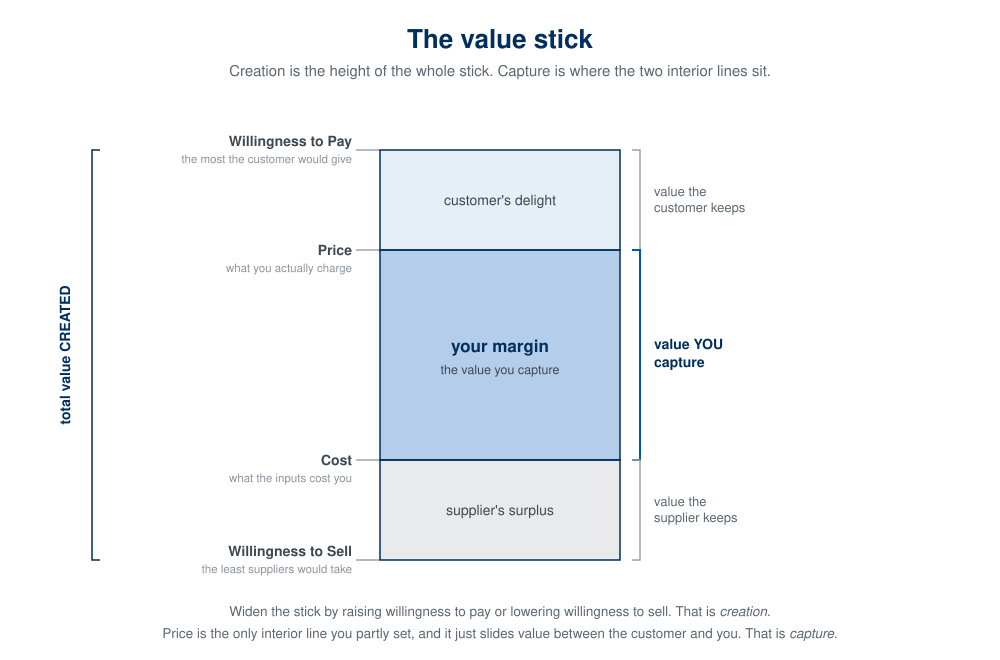
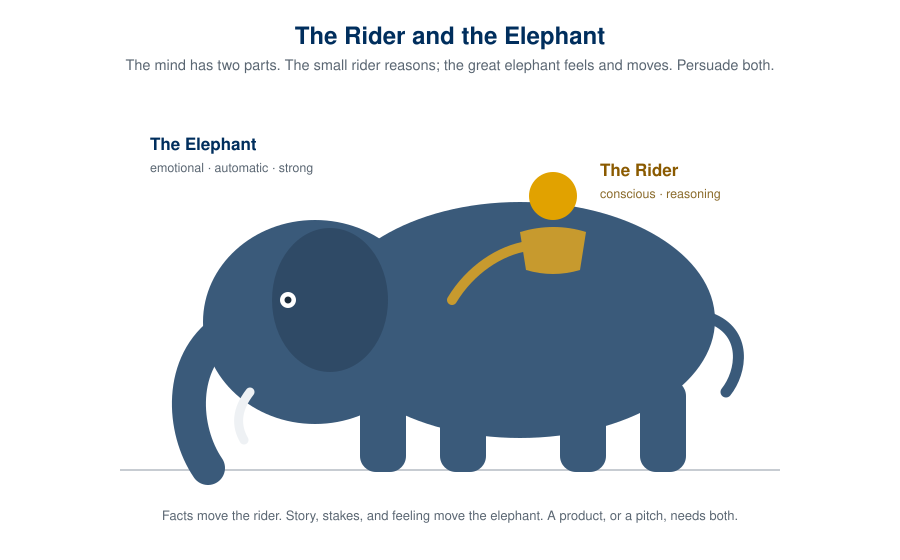

## Why This Matters

Before you can build well, you have to decide what deserves to exist. This chapter is the
Aim end of the loop: what game you are playing, how a product creates and captures value,
and whether the thing you are considering is good for the people who will use it. Those are
one question, not two.

## Why Most Products Fail

According to CB Insights' analysis of over 100 startup post-mortems, the number one reason startups fail is **"No Market Need"**, cited by 42% of failed founders [@cbinsights2026]. Not lack of funding. Not competition. Not bad teams. Simply building something people didn't want.

This happens because of what we call **The Idea Trap**: falling in love with a solution before understanding the problem. It looks like this:

> "I have a great idea for an app that does X!"

The problem? You're starting with a solution. You've already decided what to build before asking whether anyone actually needs it. This is backwards.

## Problem vs. Solution Thinking

**Solution thinking** starts with technology or features:

- "Let's build an AI-powered calendar app"
- "We should make a blockchain-based voting system"
- "What if we created a social network for pet owners?"

**Problem thinking** starts with pain:

- "Professionals waste 5+ hours weekly scheduling meetings"
- "Voters distrust election integrity and want verifiable results"
- "Pet owners struggle to find trustworthy sitters when they travel"

The difference seems subtle, but it's profound. Solution thinking leads you to build features. Problem thinking leads you to understand customers.

## Strategy is choosing what not to do

Michael Porter's foundational point: the essence of strategy is choosing what *not* to do [@porter1996strategy]. Strategy is not a list of everything good you could do; it is a small set of hard choices that fit together, which you then defend against the constant temptation to do everything. If your "strategy" has no sacrifices in it, it is not a strategy. It is a wish list.

## Where to play, and how to win

Roger Martin and A.G. Lafley (*Playing to Win*) [@lafley2013playing] reduce strategy to a cascade of five linked choices:

1. **What is your winning aspiration?** The purpose. What does winning look like?
2. **Where will you play?** Which customers, segments, channels. (Your beachhead, from Go-to-Market, is a where-to-play choice.)
3. **How will you win?** Your source of advantage in that arena: cheaper, far better at one job, a network others cannot match.
4. **What capabilities must you have?** The few things you must be great at.
5. **What management systems are required?** How you keep it running.

For a student product, the first three are the ones that bite. Answer "where will you play" and "how will you win" in a sentence each, and you already have a strategy most startups never bother to write down.

## Creating value, and capturing it

Strategy has to answer two different questions, and it is easy to collapse them into one. The first is whether your product *creates* value: is anyone genuinely better off for it existing? The second is whether you can *capture* any of that value: does enough of it come back to you to keep the business alive? These are not the same question, and a product can pass the first and fail the second.

Adam Brandenburger and Harborne Stuart gave this its foundation, defining value created as willingness to pay minus willingness to sell [@brandenburger1996]. Felix Oberholzer-Gee later turned that into the clean picture now used to teach it, the value stick [@oberholzergee2021]. At the top sits the customer's willingness to pay. At the bottom sits the cost of what you use to build, your suppliers' and your own willingness to sell. The gap between them is the value your product *creates*. How that gap gets divided, how much the customer keeps as a good deal, how much suppliers take, and how much is left for you, is the value you *capture*.

{fig-alt="A vertical bar. Its top edge is labeled Willingness to Pay and its bottom edge Willingness to Sell; the full height is bracketed as total value created. Two interior lines, Price near the top and Cost near the bottom, split the bar into three bands: customer's delight at the top, the firm's margin in the middle labeled the value you capture, and supplier's surplus at the bottom."}

The value stick is a picture, and it rests on real economics. If you want the full derivation, how producer surplus, accounting profit, economic profit, and the finance world's return above the cost of capital are all one idea seen at different depths, and how they connect up to willingness to pay, it is worked out in the appendix, [The Logic of Value](A1-logic-of-value.qmd).

The trap is assuming creation is the hard part and capture takes care of itself. It does not. Peter Thiel's example is the sharpest: US airlines create enormous value and keep almost none of it, while a single search company creates less and keeps far more [@thiel2014]. David Teece made the same point about innovators decades earlier: you can invent something genuinely new, create real value, and watch imitators and the owners of the pieces you depend on take all the capture [@teece1986]. Creating value is necessary. It is not sufficient.

So where on the value stick do you land? That is a choice, but a *constrained* one. You do not simply decide to keep more of the gap. How much you can capture is set by structure you did not build and cannot wish away, and the first job of strategy is to read that structure honestly. In [AIRE](01-building-with-ai-agents.qmd) terms, the width of the band you can capture is something you *Inform* on, and where you position inside it is the *Aim*. Misreading the band is an information failure. Landing in a band that is genuinely thin, after reading it correctly, is not a mistake. It is a signal to go find a different band.

## The five forces: how wide is the band?

What sets the width of the band? Michael Porter's five forces [@porter1979competitive], read this way, are a diagnostic of exactly that: how much of the value an industry creates it will actually let you keep. Under the practitioner's language, the variable is market power. Perfect competition drives price down to cost, hands the whole gap to customers, and leaves you almost nothing. Market power is what lets you hold price up toward willingness to pay and keep the gap.

The five forces measure that power at two points:

- **Rivalry, new entrants, and substitutes** decide whether the industry as a whole can hold price above cost, or whether competition and easy entry compete it away.
- **Buyer power and supplier power** decide whether an adjacent player, a dominant customer or a must-have supplier, can bargain your share away even when the industry is otherwise attractive.

All five are the same variable, market power, at different points in the chain, either yours to hold or someone else's to take. One caution: the five forces describe the *industry*, the attractiveness of the pond, not whether you are the best fish in it. Two products in the same structure can capture very differently based on their own advantage, which is where moats come in.

## Blue oceans: widening the band

There is a third move, and it is the one worth aiming for. Instead of accepting the band the current industry allows and fighting for position inside it, you can redraw the boundary so you are measured against a different structure entirely. W. Chan Kim and Renée Mauborgne call the crowded, well-mapped markets *red oceans*, where rivals fight over a fixed pie, and the uncontested space you create *blue oceans*, where for a while there are no direct rivals, no established substitutes, and no one has entered yet [@kim2005blue]. You do not win the competition. You leave it.

Their engine for this is *value innovation*: pursue differentiation and low cost at the same time instead of trading one for the other. On the value stick that means moving both ends at once, lifting willingness to pay while cutting cost, by dropping the factors your industry over-serves and adding factors it never offered. Cirque du Soleil cut the animals and star performers that made circuses expensive and added theatrical story and production that circuses never had, and landed in a space where neither circuses nor theater competed with it.

In AIRE this is a discovery discipline pointed at the Aim rather than at the customer. Where the Mom Test informs you about needs *inside* a category, the blue ocean question informs you about where the category boundary could be *moved*: look across substitute industries, adjacent buyer groups, and complementary offerings for space no one is contesting. It is *Inform* in service of choosing a better place to play.

But a blue ocean has a built-in problem, and it sets up everything that follows. By definition it has no barriers, you just created open space, which is the same as saying entry is wide open. If you cannot build a reason for the ocean to stay yours, imitators pour in, the water reddens, and your capture erodes back toward zero. Creating the uncontested space is only half the move. Keeping it is the other half, which is Thiel's real point: create a new market *and* own it. The first half is a blue ocean. The second is a moat.

## Moats: why the win lasts

Winning once is not enough; the win has to hold. Hamilton Helmer (*7 Powers*) [@helmer2016powers] catalogs the sources of durable advantage, or moats:

- **Network effects** — the product gets more valuable as more people use it; each new user improves it for the others.
- **Switching costs** — leaving is painful, so customers stay.
- **Scale economies** — you get cheaper per unit as you grow.
- **Brand** — trust and meaning competitors cannot quickly copy.
- **Counter-positioning, cornered resources, and process power** — the subtler ones.

Ask honestly: once you are winning, what stops the next student with the same AI tools from copying you next week? If the answer is "nothing," you have a feature, not a moat. In the AI era this question is sharper than ever, because copying has never been cheaper. Strategy is largely the work of building an answer to it.

## A test worth memorizing: DHM

Gibson Biddle, from leading product at Netflix, offers a compact test for a good product strategy: **DHM** [@biddle2018]. Does it **D**elight customers, in **H**ard-to-copy, **M**argin-enhancing ways? All three at once:

- **Delight** — customers genuinely love it, not merely tolerate it.
- **Hard to copy** — there is a moat, so the delight is defensible.
- **Margin-enhancing** — it makes the business healthier, not just busier.

A product can delight and still lose (easily copied), or be defensible and still lose (nobody cares). DHM forces all three.

## Vision before strategy

Under the strategy sits a **product vision**: the compelling picture of the better world your product creates, usually a few years out. Marty Cagan argues the vision is what recruits people, aligns decisions, and carries you through the hard middle [@cagan2017inspired]. Strategy is how you get there; vision is where "there" is, and why it is worth the trip. Write the vision first, then let the strategy serve it.

## Putting it to work

Draft a one-page product strategy for your product:

- **Vision** (one paragraph): the better world you are building toward.
- **Where you play** (one sentence): your specific customer and beachhead.
- **How you win** (one sentence): your source of advantage.
- **Your moat** (one sentence): why the win lasts.
- **What you will NOT do** (a short list): the sacrifices.

Then pressure-test it with AI, but adversarially. Do not ask "is this a good strategy?", it will flatter you. Ask: "Attack this strategy. Where is the moat weakest? What would a competitor with the same AI tools do to beat it? What am I refusing to sacrifice that I should?" The job of a strategy is to survive that attack before the market runs it for real.

## Understanding human nature cuts both ways

To build something people actually use, you have to understand how people actually work: the emotional elephant beneath the rational rider [@haidt2006happiness] (Daniel Kahneman's fast, automatic System 1 and slow, deliberate System 2 [@kahneman2011thinking]), the cognitive shortcuts and defaults, the cravings and the loops. That knowledge is exactly what makes a product feel effortless and worth returning to.

{fig-alt="An illustration of a small rider seated on a large elephant. The rider is labeled conscious and reasoning; the elephant is labeled emotional, automatic, and strong."}

It is also exactly what makes a product manipulative. The same understanding of human defaults that lets you remove friction lets you engineer compulsion. The line between a product that serves a person and one that exploits them runs right through the knowledge you are gaining in this class. Which is why the knowledge comes with a responsibility.

### Moral Foundations Theory

People are not blank slates about right and wrong. Research on moral foundations finds a handful of intuitions that recur across cultures: care versus harm, fairness versus cheating, loyalty, authority, sanctity, and liberty [@haidt2012righteous]. You need not adopt the theory wholesale to take its practical point: your users bring moral intuitions to your product, and they feel it when a product treats them unfairly, wastes them, or degrades them, even when they cannot name why. Building against those intuitions costs you trust, which is the one asset a product cannot fake.

### Hooked: engagement or exploitation

Habit-forming products run a loop: a trigger, an action, a variable reward, and an investment that brings the user back [@eyal2014hooked]. The mechanics are neutral. A fitness app and a slot machine use the same loop. The difference is entirely in the aim.

The honest test is simple: **would your user, in a calm and reflective moment, be glad you designed it this way?** A habit that helps someone do the thing they already want to do is a gift. A habit engineered to override their judgment and consume time they never meant to give is a harm, no matter how good the retention numbers look. This is where engagement metrics can lie to you, the ones you will learn to track later in [Measuring What Matters](14-measuring-what-matters.qmd): engagement a user would disown on reflection is not success, it is extraction.

### Algorithms and amplification

The moment your product recommends, ranks, or personalizes, it stops being a neutral tool and starts shaping what people see, want, and believe. An algorithm optimized purely for engagement will reliably discover that outrage, anxiety, and compulsion engage. If you build one, you own what it amplifies. Optimizing for a number without asking what that number does to a person is not a technical decision; it is a moral one you made by declining to make it.

## Aiming well: virtue and the golden mean

If the aim is a question of values, it helps to be precise about what a good aim looks like. Aristotle gave the most durable answer [@aristotlenicomachean]. A virtue, he argued, is not a feeling or a one-time act but a **settled disposition to choose well**, and it lies in a **mean between two vices**: one of excess and one of deficiency. Courage is the mean between cowardice and recklessness. Generosity is the mean between stinginess and waste. His formal definition: virtue is "a state concerned with choice, lying in a mean relative to us, this being determined by reason." The vices are the two ways of missing.

That structure maps onto a working table of virtues, each flanked by the vice of too little and the vice of too much:

| Deficiency (too little) | Virtue (the mean) | Excess (too much) | Category |
|---|---|---|---|
| Corrupt | Honest | Legalistic | Integrity |
| Foolish | Discerning | Judgmental | Discernment |
| Selfish | Loving | Enabling | Love / Care |
| Self-abasing | Humble | Prideful | Self-regard |
| Slothful | Diligent | Overworked | Work / Industry |
| Self-indulgent | Temperate | Austere | Pleasure / Appetite |
| Cowardly | Courageous | Foolhardy | Courage |
| Stingy | Generous | Wasteful | Generosity |
| Cynical | Trusting | Naïve | Trust |
| Halting | Decisive | Impulsive | Action / Initiative |
| Deceptive | Truthful | Blunt | Honesty about Self |
| Cold | Friendly | Ingratiating | Sociability |
| Short-tempered | Patient | Indifferent | Anger / Emotion |

The point for a builder is twofold. First, **most product decisions are a mean, not a maximum.** More engagement is not always better; the virtue of engagement design is temperance, the mean between exploitation and neglect. Persuasion is a mean between manipulation and passivity. Honest marketing is a mean between deception and tactless bluntness. When you find yourself maximizing a single quantity, ask what vice of excess you are walking into.

Second, and this is where Aristotle meets [the Hooked loop](#hooked-engagement-or-exploitation): we become what we repeatedly do. "Excellence," in Will Durant's well-known summary of Aristotle, "is not an act, but a habit." [@durant1926philosophy] Aristotle held that character is built by habituation, by doing courageous things until courage becomes a disposition. A product that shapes a habit is therefore shaping its users' character, a little, in one direction or another. That is an enormous thing to hold in your hands. Aim the habits your product builds at something the user, on reflection, would choose to become.

### A directional test

The Sprint 2 framework gives you a practical way to check your aim. For the needs your product touches, ask:

- **Agency.** Does it expand what users can do and choose, or does it quietly narrow them?
- **Becoming.** Does it help them grow and become more capable, or keep them dependent and stuck?
- **Connection.** Does it strengthen real relationships, or substitute a thinner thing for them?

Not every product touches all three. The question is directional: for the needs you do touch, are you on the right side of them? A product that expands agency, supports becoming, and deepens connection is aimed well, and it tends to earn the durable trust that cheaper tactics never can.

## Key Concepts

- **Strategy is choosing what not to do** (Michael Porter)
- **Where to play / how to win** (Roger Martin & A.G. Lafley, *Playing to Win*)
- **Create value vs. capture value, the value stick** (Adam Brandenburger & Harborne Stuart; sharpened by Peter Thiel, and by David Teece for innovators): creating value is necessary but not sufficient; capture is a separate, constrained choice.
- **Five forces as a market-power reading** (Michael Porter): how wide a share of the created value the industry lets you keep.
- **Blue ocean / value innovation** (W. Chan Kim & Renée Mauborgne): widen the band by redrawing the market boundary instead of fighting for position inside it.
- **Moats / durable advantage** (Hamilton Helmer, *7 Powers*): network effects, switching costs, scale, brand
- **DHM**: Delight, Hard to copy, Margin-enhancing (Gibson Biddle)
- **Product vision before strategy** (Marty Cagan)
- **The AI-era shift**: cheap building commoditizes features; strategy, moats, taste, and distribution are the durable advantages

- **The aim is a values question**: truth-seeking tells you what is; it does not tell you what to build.
- **Human nature cuts both ways**: the knowledge that removes friction can also engineer compulsion.
- **The reflection test**: would your user, calm and reflective, be glad you built it this way?
- **Engagement can lie**: retention a user would disown is extraction, not success.
- **You own what your algorithm amplifies.**
- **The golden mean**: most product virtues are a mean between a vice of excess and a vice of deficiency.
- **Habits build character**: a product that shapes habits is shaping who its users become.
