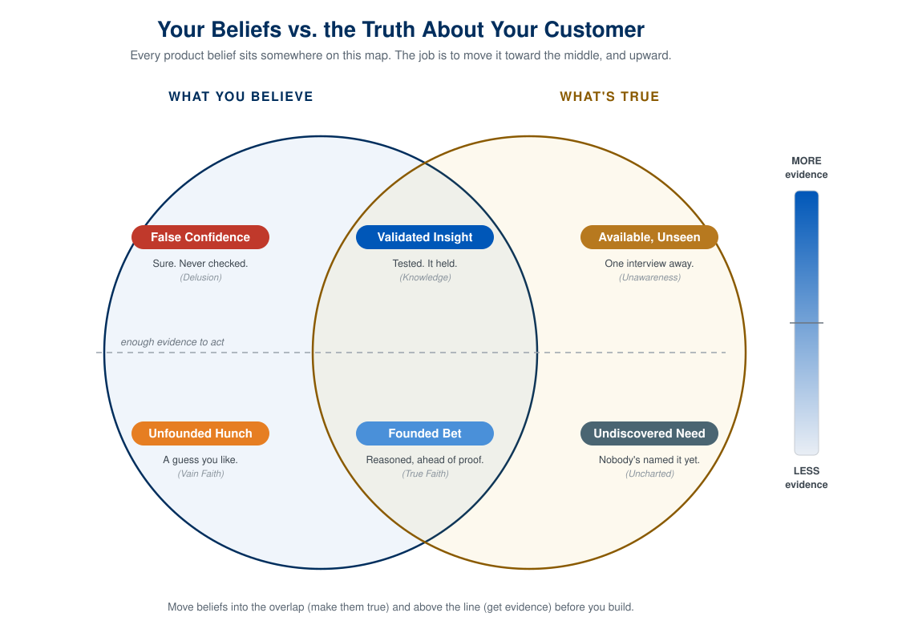

## Why This Matters

You've identified problems you personally experience. But how do you know if others share that pain? And even if they do, have you understood the problem deeply enough to solve it well?

Problem discovery is the process of moving from *I think this is a problem* to *I know this is a problem worth solving*. It requires talking to real people, asking the right questions, and synthesizing what you learn into actionable insights.

This chapter teaches you the Jobs-to-be-Done framework for understanding customer motivations, the Mom Test approach for conducting honest interviews, and the Git skills you need to version control your work as your projects grow.

## The Five Discovery Skills

Where do good problems come from? Jeff Dyer and his colleagues studied disruptive innovators and found they are not born with a creativity gene, they *behave* in five particular ways, and those behaviors are mostly learnable (their research puts creativity at roughly one-third genetic, versus about four-fifths for raw IQ). The five skills:

- **Questioning** — relentlessly asking why, why not, and what if, keeping a high ratio of questions to answers.
- **Observing** — watching customers and their workarounds like an anthropologist, noticing what people actually do rather than what they say.
- **Networking** — talking with people whose perspective differs from yours, to borrow ideas from other worlds.
- **Experimenting** — trying things, taking them apart, running small tests.
- **Associating** — the payoff skill: connecting the inputs from the other four into a new idea.

This whole course is a program for practicing these. Your problem journal is Questioning and Observing; the interviews in the next chapter are Observing and Networking; your prototypes and MVP tests are Experimenting. That is the point of the practice model, and it is Dyer's finding too: these are skills you build with reps, not gifts you are born with.

*The five discovery skills are from Jeff Dyer, Hal Gregersen, and Clayton Christensen, ["The Innovator's DNA,"](https://hbr.org/2009/12/the-innovators-dna) Harvard Business Review, December 2009. [@dyer2009dna]*

## You Are Your Best First Customer

You don't necessarily need to conduct elaborate market research to find a problem worth solving. You're surrounded by problems every day, and you just need to find one you are passionate about fixing.

Many of the best products come from founders who were frustrated by something in their own lives:

- **Slack** came from a gaming company's internal communication frustrations
- **Dropbox** came from Drew Houston constantly forgetting his USB drive
- **Airbnb** came from founders who couldn't afford their San Francisco rent

When you're your own customer, you have unfair advantages:

1. **Faster feedback loops**: You can test ideas immediately on yourself
2. **Authentic insight**: You truly understand the problem's nuances
3. **Built-in motivation**: You actually want the solution to exist

## Problem Journaling

Start keeping a **problem journal**. For the next week, write down every moment of friction, frustration, or inefficiency you experience. Don't filter, just capture.

Ask yourself:

- What did I just waste time on?
- What task felt harder than it should be?
- What made me say "there has to be a better way"?
- What workaround did I create because existing tools failed me?

Your journal entries might look like:

- "Spent 20 minutes trying to split a dinner bill with friends because everyone uses different payment apps"
- "Had to manually copy data from one spreadsheet to another AGAIN"
- "Missed a package delivery because I didn't know it was coming"

These small frustrations are seeds for products.

## Diverge Before You Converge

There is a rhythm to good discovery: **open wide before you narrow.** Generate many candidate problems before you judge any of them, then converge deliberately on the most promising. Most people do the opposite. They seize the first idea and spend months defending it, which is just premature convergence wearing a confident face.

So resist the urge to pick early. Your problem journal is the diverging half: capture dozens of frictions without filtering. Casting a wide net, across different people, contexts, and moments, surfaces problems you would never have reasoned your way to from your desk. Only once you have a real pile do you start scoring and cutting (the next section). The wider you diverge, the better the thing you eventually converge on.

*Diverge/converge discipline adapted from Nile Hatch, [Expeditionary Innovation](https://github.com/nilehatch/exp_innov/). [@hatch_expeditionary]*

## Evaluating Your Problems

Not every problem is worth solving. Whether a problem is worth solving can be evaluted from these four factors:

| Criteria | Question to Ask |
|----------|-----------------|
| **Frequency** | How often does this problem occur? |
| **Intensity** | How painful is it when it happens? |
| **Willingness to Pay** | Would someone pay to make this go away? |
| **Addressability** | Can software actually solve this? |

A problem that happens rarely but is extremely painful (like planning a wedding) can be worth solving. A problem that happens constantly but is mildly annoying (like seeing ads) can also be worth solving. The sweet spot is **frequent AND painful AND people will pay**.

## The Importance-Satisfaction Framework

Another helpful way to evaluate problems comes from Dan Olsen's *Lean Product Playbook* [@olsen2015lean]. Plot potential problems on a 2x2 matrix:

- **Y-axis: Importance**: How much does this matter to the customer?
- **X-axis: Satisfaction**: How well do current solutions address it?

The opportunity zone is **high importance + low satisfaction**. These are problems people care deeply about but can't solve well today.

## From Problems to Opportunities

Once you've identified a promising problem, frame it as a **Jobs-to-be-Done (JTBD)** statement:

> When I'm **[situation]**, I want to **[motivation]**, so I can **[desired outcome]**.

For example:
> When I'm **trying to expense a business meal**, I want to **quickly capture the receipt and categorize it**, so I can **avoid the monthly expense report nightmare**.

This framing keeps you focused on the customer's goal, not your solution. It reminds you that customers don't want your product, they want progress in their lives. Your product is just a means to that end.

## Discovery Is Truth-Seeking

Before the frameworks, the mindset. Strip away the tools and a product manager has one core job: to know what is actually true about a customer and their problem before spending real time and money building. Discovery is how you do that job. Everything else in this chapter, Jobs-to-be-Done, the Mom Test, interview synthesis, is machinery for replacing what you *believe* about your users with what is *true* about them, as cheaply and quickly as possible. Steve Blank gave this discipline its name, *customer development*, and its blunt motto: get out of the building [@blank2005four]. The facts you need are outside, with real people, not inside your head.

It helps to see where a belief can sit.

{fig-alt="A two-circle Venn diagram. The left circle is What You Believe, the right is What's True. A horizontal evidence line crosses both. Six regions: False Confidence (believe, false, high evidence), Unfounded Hunch (believe, false, low evidence), Validated Insight (believe and true, high evidence), Founded Bet (believe and true, low evidence), Available but Unseen (true, not believed, high evidence), and Undiscovered Need (true, not believed, low evidence)."}

Those six regions each show up in real product work:

| Region | What it is in product terms |
|---|---|
| **Validated Insight** | True, and you have strong evidence. You believed it, you tested it, it held. This is what you want under your roadmap before you commit. |
| **Founded Bet** | True, but the evidence is still thin. A reasoned conviction you act on ahead of full proof. You cannot validate everything. |
| **Unfounded Hunch** | You believe it, it is not true, little evidence. A guess you are fond of. Cheap to hold, cheap to drop, if you are honest. |
| **False Confidence** | You believe it, it is not true, and you feel sure. "I *know* users want this." The most dangerous place to build from, because the certainty hides the mistake. |
| **Available but Unseen** | True, evidence exists, you have not gone to get it. A competitor already solved it, or a user would tell you in five minutes. |
| **Undiscovered Need** | True, but no one has evidence yet. The frontier. The biggest opportunities and the biggest risks both live here. |

The job has a shape. **Grow the overlap** by making more of your beliefs true, which means killing the false ones. **Pull truths into it** by going and finding what you do not yet know. And **push your beliefs above the evidence line**, from founded bet toward validated insight, before you bet the semester on them.

Two failure modes account for most dead products. The first is building from **False Confidence**: shipping a thing you were sure about and never checked. The second is never leaving **Available but Unseen**: a truth was one interview away and you built on a guess instead.

#### Six ways of knowing, all flawed

If the map tells you where a belief sits, the next question is how you gather the evidence to move it. You have six tools, and every one of them can lie to you.

| Way of knowing | How a PM uses it | How it lies to you |
|---|---|---|
| **Logical reasoning** | Your own analysis, the internal logic of the idea | Armchair theorizing, confirmation bias. Feels airtight, has never met a user. |
| **Trial and error** | Shipping, A/B tests, MVP experiments | Slow and costly, and you can optimize into a dead end. |
| **Word of others** | Competitors, analysts, "best practices," the loudest stakeholder | Cargo-culting. Their context is not your context. |
| **Sensory experience** | Watching real users, usability tests | Tiny samples, the observer effect. You see what you expect. |
| **Intuition** | Product sense, taste | Your gut is not your user's gut. |
| **Epiphany** | The insight in the shower | Seductive precisely because it is unvalidated. |

Because each tool fails in its own way, **you triangulate**: you treat a belief as validated only when independent sources converge, an interview, plus a behavior in the data, plus a test that survives. The most common mistake is trusting a single source, usually your own logic or one enthusiastic user, and promoting it straight to certainty. That is the road to False Confidence.

How much evidence is enough depends on the stakes. A throwaway prototype needs almost none: go build it and learn. Committing the rest of the semester to one product needs a preponderance: real interviews, a customer who lives the problem, some signal they would pay. That is exactly what the Sprint 2 conviction scoring is asking you to weigh. The posture throughout is to hold beliefs as probabilities, not verdicts: not "this is a great idea" but "I am maybe sixty percent sure," and let each conversation move the number.

::: {.callout-note title="Thinking in probabilities"}
This is the Bayesian habit, and it comes with one practical rule: **good evidence is evidence that would look different if you were wrong.** "Tell me about the last time you dealt with this" is strong evidence, because someone who does not really have the problem cannot answer it convincingly. "Would you use an app that does this?" is weak evidence, because people say yes whether the problem is real or not. Seek the evidence that actually moves the number; discount the flattery that does not. That single test is why the Mom Test works.
:::

The rest of this chapter is the *how*. Jobs-to-be-Done gives you a sharper hypothesis about what is true. The Mom Test gathers evidence that actually moves the number instead of flattery that does not.

## Jobs-to-be-Done Framework

The Jobs-to-be-Done (JTBD) framework, popularized by Clayton Christensen [@christensen2016luck], shifts focus from *what customers buy* to *why they buy it*. The core insight: customers don't want products, they "hire" products to do a job.

The classic example is the milkshake [@christensen2016luck]. A fast-food chain wanted to sell more milkshakes, so they improved the recipe. Sales didn't budge. Then they asked a different question: *What job are people hiring the milkshake to do?*

They discovered that most milkshakes were bought in the morning by commuters. The "job" wasn't *enjoy a delicious treat*. It was *make my boring commute more interesting while keeping me full until lunch*. Suddenly, the milkshake's competition wasn't other milkshakes; it was bananas, bagels, and donuts. The solution? Make it thicker (lasts longer), add fruit chunks (more interesting), and offer it at the drive-through (more convenient).

#### The JTBD Formula

Frame customer needs as jobs using this structure:

> When I'm **[situation]**, I want to **[motivation]**, so I can **[desired outcome]**.

For example:
- When I'm **planning a trip with friends**, I want to **easily see everyone's availability**, so I can **pick dates that work for everyone**.
- When I'm **starting a new exercise routine**, I want to **follow a structured program**, so I can **build strength without figuring out what to do each day**.
- When I'm **managing a team project**, I want to **see who's blocked on what**, so I can **unblock them before deadlines slip**.

#### Three Types of Jobs

Every job has three dimensions:

| Job Type | Description | Example |
|----------|-------------|---------|
| **Functional** | What they want to accomplish | "Get from home to work" |
| **Emotional** | How they want to feel | "Feel in control of my day" |
| **Social** | How they want to be perceived | "Appear professional to colleagues" |

Most products focus only on functional jobs. But emotional and social jobs often drive purchasing decisions. Someone might buy a Tesla for the functional job (transportation) but the real motivation is social (appear environmentally conscious) or emotional (feel like an innovator).

## The Five Kinds of Pain

Jobs come in three types; the *pain* behind a job comes in five kinds, and naming them gives you a checklist of what to probe for. A single problem often hurts in more than one way:

| Kind of pain | What it costs the person |
|---|---|
| **Physical** | effort, fatigue, discomfort |
| **Functional** | time, steps, things that don't work |
| **Financial** | money, waste, missed earnings |
| **Emotional** | stress, anxiety, embarrassment, frustration |
| **Social** | status, belonging, how others see them |

When you interview, listen across all five. The pains people mention first are usually functional; the ones that actually drive them to pay are often emotional or social. This complements the Self-Determination lens in [Sprint 2](00-assessments.qmd#sprint-2-validate-commit) (autonomy, competence, relatedness): that lens explains *why* a pain matters; these five categories catalog *how* it hurts.

*Five pain categories from Nile Hatch, [Expeditionary Innovation](https://github.com/nilehatch/exp_innov/) [@hatch_expeditionary].*

## Problem Interviews (The Mom Test)

Once you have a hypothesis about the job customers are trying to do, you need to validate it with real conversations. This is where most people fail, they ask bad questions that produce misleading answers.

Rob Fitzpatrick's book *The Mom Test* [@fitzpatrick2013mom] identifies the core problem: if you tell your mom about your business idea, she'll say it's great. She loves you. She doesn't want to hurt your feelings. And her feedback is useless.

The solution is to ask questions that even your mom couldn't lie about, questions about their actual behavior, not hypothetical futures.

#### Rules of The Mom Test

1. **Talk about their life, not your idea**
2. **Ask about specifics in the past, not generics about the future**
3. **Talk less, listen more**

#### Bad Questions vs. Good Questions

| Bad Question | Why It's Bad | Good Question |
|--------------|--------------|---------------|
| "Would you use an app that does X?" | Hypothetical, everyone says yes | "Tell me about the last time you tried to do X" |
| "Do you think this is a good idea?" | Asking for opinions, not facts | "What solutions have you tried? What happened?" |
| "How much would you pay for this?" | They'll guess to be nice | "What are you currently paying to solve this?" |
| "Would you recommend this to friends?" | Future promise, not behavior | "Have you ever told anyone about this problem?" |

#### The Magic Question

The most powerful interview question is:

> "Walk me through the last time you experienced this problem."

This forces specificity. You'll learn:
- How often it really happens
- What they actually did (not what they say they'd do)
- What emotions came up
- What solutions they tried
- Why existing solutions fell short

#### Signs You're Onto Something

- They get animated or frustrated describing the problem
- They've already tried to solve it themselves
- They've spent money on partial solutions
- They ask if they can beta test your product
- They introduce you to others with the same problem

#### Signs You Should Pivot

- They can't remember the last time this happened
- They shrug and say "it's not a big deal"
- They've never tried to solve it
- They wouldn't pay anything to make it go away

## Conducting Effective Interviews

#### Before the Interview

1. **Define your hypotheses**: What do you believe about the problem?
2. **Prepare 5-7 open-ended questions**: Focus on behavior and specifics
3. **Target the right people**: Those who actually experience the problem
4. **Set expectations**: "I'm trying to understand how people handle X. Can I ask you some questions?"

#### During the Interview

1. **Shut up**: You should talk less than 20% of the time
2. **Dig deeper**: "Tell me more about that" / "Why was that frustrating?"
3. **Get specific**: "Can you give me an example?" / "What happened next?"
4. **Watch for emotion**: Strong feelings indicate strong needs
5. **Take notes**: Or record with permission

#### Sample Interview Script

> "I'm researching how people [handle X situation]. I'm not selling anything, I just want to understand your experience. Can I ask you some questions?"

1. "Can you tell me about your role and what a typical day looks like?"
2. "When was the last time you [experienced the problem]?"
3. "Walk me through what happened."
4. "What did you do about it?"
5. "What was frustrating about that?"
6. "Have you tried any solutions? What happened?"
7. "What would have to be true for something to be worth paying for?"

## Interview Synthesis

After 5+ interviews, patterns emerge. Synthesize what you learned into actionable insights.

::: {.callout-note title="How many interviews is enough?"}
There is no magic number, but there is a signal: **stop when new interviews stop surprising you.** Early on, every conversation adds something. As you approach saturation, you start hearing the same problems, quotes, and workarounds you have already heard, and the information each new interview adds drops toward zero. When two or three in a row tell you nothing new, you have enough to act. If every interview still surprises you, keep going, your net is probably too narrow.

*The saturation ("information entropy") stop rule is from Nile Hatch, [Expeditionary Innovation](https://github.com/nilehatch/exp_innov/) [@hatch_expeditionary].*
:::

#### Synthesis Template

Use this format to document your findings:

**Problem Statement:**
One clear sentence describing the problem you've validated.

**Who You Talked To:**
Roles/titles of interviewees (not names, for privacy).
- 3 marketing managers at mid-size companies
- 2 freelance consultants

**Key Insights:**
3-5 bullet points summarizing the most important patterns.
- All 5 participants mentioned X as their biggest frustration
- 4/5 have tried Y solution but found it lacking because Z
- Time spent on this problem: average 3 hours/week

**Notable Quotes:**
Direct quotes that capture the emotion and specificity.
- "I literally dread Mondays because I know I'll spend half the day on this."
- "I've tried everything. Nothing actually works."

**What We Learned:**
Your interpretation and next steps.
- The problem is real and frequent (validated)
- Current solutions fail because they don't address X
- Opportunity: build something that does Y

## Building Personas

A persona is a fictional but realistic representation of your target customer. It synthesizes interview data into a memorable character that keeps your team aligned.

#### Persona Template

**Name & Role:** Sarah, 34, Marketing Manager at a 200-person SaaS company

**Demographics:**
- 5 years in role, manages team of 3
- Based in Austin, works hybrid
- Comfortable with technology but not technical

**Goals/Motivations:**
- Ship campaigns on time
- Prove marketing's impact to leadership
- Get promoted to Director within 2 years

**Frustrations/Pain Points:**
- Spends 6+ hours/week manually compiling reports
- Can never get real-time data when executives ask
- Marketing tools don't talk to each other

**Job-to-be-Done:**
> When I'm preparing for our weekly leadership meeting, I want to quickly pull together campaign performance data, so I can confidently answer questions and demonstrate marketing's value.

**Current Solutions & Workarounds:**
- Manually exports data from 4 different tools into a spreadsheet
- Has built elaborate formulas that break constantly
- Sometimes just estimates because accurate data takes too long

**Willingness to Pay:**
Has budget authority up to $500/month for tools that save significant time.

## Discovery Is Continuous

Discovery is not a phase you finish before building. The best product teams keep talking to customers every week, indefinitely. Teresa Torres calls this **continuous discovery**, and it fits this course exactly: you run the loop again every sprint, not once at the start.

She also gives a way to keep discovery organized, the **Opportunity Solution Tree**. Start from one desired **outcome** (the thing you want to move). Branch into the **opportunities**: the specific customer needs and pains you have discovered that could move it. Under each opportunity, branch into candidate **solutions**, and under each solution, the **experiments** that would test it. The tree keeps you honest: every solution has to hang off a real, discovered opportunity, or it does not belong on the tree.

*Continuous discovery and the Opportunity Solution Tree are from Teresa Torres, Continuous Discovery Habits (2021) [@torres2021continuous].*

## The Opportunity Evaluation Framework

A problem worth solving must pass three tests:

| Test | Question | What You're Looking For |
|------|----------|------------------------|
| **Frequency** | How often does this happen? | Daily/weekly is ideal; yearly is weak |
| **Intensity** | How painful is it? | High frustration, strong emotions |
| **Willingness to Pay** | Would they pay to solve it? | Evidence of spending, not just words |

#### Frequency

Problems that occur frequently create more value when solved. A tool that saves someone 10 minutes daily is worth more than one that saves an hour yearly.

**How to assess:**
- "How often does this happen?" (from your interviews)
- Look for patterns in your interview notes
- Daily problems > Weekly > Monthly > Rarely

**Red flag:** If interviewees can't remember the last time it happened, frequency is too low.

#### Intensity

Intensity measures how much the problem disrupts someone's life or work. High-intensity problems create urgency and willingness to adopt new solutions.

**Signs of high intensity:**
- Strong emotional language ("I hate this," "It drives me crazy")
- They've already tried to solve it (DIY solutions, workarounds)
- It blocks them from something important
- They bring it up unprompted

**Signs of low intensity:**
- "It's annoying but not a big deal"
- They've never tried to fix it
- They shrug when describing it

#### Willingness to Pay

The ultimate validation: will someone exchange money to make this problem go away? This is harder to assess than frequency or intensity, but it's the most important.

**Strong signals:**
- They're already paying for partial solutions
- They describe the problem in terms of money ("This costs me $X per month")
- They immediately ask about pricing or availability
- They offer to pay for early access

**Weak signals:**
- "Yeah, I'd probably pay for that" (hypothetical)
- "That sounds like a good idea" (opinion, not commitment)
- They have no budget authority for this type of purchase

::: {.callout-tip title="Harden your evidence"}
Three ways to keep your scores honest:

- **Quantify willingness to pay from what they already spend.** Do not ask for a number they will invent. Add up what the problem *actually* costs them today: the price of the workaround, the hours lost, the substitute they already buy. That is real willingness to pay.
- **Score intensity out of ten (the "Ouch Factor").** Force yourself to rate how much it hurts, 1 to 10, per person. Vague intensity hides weak opportunities.
- **Watch both failure modes.** A *false positive* is polite agreement ("sure, I'd use that") for a problem no one really has. A *false negative* is a real pain you missed because you framed the question badly. Seek disconfirming evidence for the first; re-ask in different words to catch the second.

*Ouch Factor, workaround-spend, and false-positive/negative framing from Nile Hatch, [Expeditionary Innovation](https://github.com/nilehatch/exp_innov/).* [@hatch_expeditionary]
:::

## Opportunity Scoring

Create a simple scorecard for each problem you're considering:

| Criteria | Score (1-5) | Notes |
|----------|-------------|-------|
| Frequency | | How often? |
| Intensity | | How painful? |
| Willingness to Pay | | Evidence of spending? |
| Market Size | | How many people have this? |
| Your Fit | | Do you understand this deeply? |
| **Total** | **/25** | |

**Scoring guide:**
- **20-25**: Strong opportunity**: pursue with confidence
- **15-19**: Promising**: worth exploring further
- **10-14**: Questionable**: dig deeper before committing
- **Below 10**: Weak**: consider other problems

## Can You Reach Them? The Access Test

A real, painful, frequent problem is still not an opportunity if you cannot reach the people who have it. A powerful need you cannot access is not an opportunity; it is a wish. Before you commit, run a quick access test on three questions:

1. **Location.** Can you find where these people already gather, online or off? If you cannot name the channel, that is a red flag.
2. **Engagement.** Will they actually respond to you, answer questions, and try a prototype?
3. **Reciprocity.** Do you have something to offer in return? Access is reciprocity, not just reach. People give you their time when the exchange feels fair.

If you cannot reach a segment cheaply now, as a student, you will not reach them cheaply as a founder. Either find a reachable beachhead within the market or reconsider the problem.

*The access test is adapted from Nile Hatch, [Expeditionary Innovation](https://github.com/nilehatch/exp_innov/).* [@hatch_expeditionary]

## The Commitment Decision

At some point, you need to stop exploring and start building. This is the commitment decision, choosing one problem to focus on.

**Signs you're ready to commit:**
- You've talked to 5+ people who experience the problem
- Multiple people show strong signals on all three tests
- You have a clear hypothesis for a solution
- You're excited to work on this for months

**Signs you're not ready:**
- You're still finding contradictory information
- Nobody seems to care that much
- You can't articulate who this is for
- You're only excited because you like the solution idea

## Avoiding Premature Commitment

The opposite trap is committing too early. Watch for these warning signs:

**Solution love:** You're attached to a specific solution before validating the problem. ("I want to build an AI app" → wrong starting point)

**Confirmation bias:** You're only hearing what supports your hypothesis. Actively seek disconfirming evidence.

**Sunken cost:** You've invested time, so you don't want to pivot. Cut your losses early. It's cheaper than building the wrong thing.

**Founder fantasy:** You imagine the success, not the work. Fall in love with the problem, not the outcome.

## Your Value Proposition

Once you commit to a problem, articulate your value proposition, a clear statement of what you offer and why it matters.

**Template:**

> For **[target customer]**
> Who **[has this problem]**
> Our product is **[category]**
> That **[key benefit]**
> Unlike **[alternatives]**
> We **[key differentiator]**

**Example:**

> For **marketing managers at mid-size SaaS companies**
> Who **spend 6+ hours weekly compiling reports from multiple tools**
> Our product is **an automated reporting dashboard**
> That **pulls data from all your tools into one real-time view**
> Unlike **manual spreadsheets or expensive enterprise solutions**
> We **take 10 minutes to set up and cost 1/10th the price**

 [@osterwalder2014value]

## What is an MVP?

A Minimum Viable Product isn't a stripped-down version of your final vision. It's the smallest thing you can build that:

1. **Delivers value** to real users
2. **Tests your hypothesis** about the problem
3. **Generates learning** you can act on

The keyword is *viable*. An MVP must actually work and provide value. It's not a prototype or a demo. It's a real product, just minimal.

The MVP and the build-measure-learn loop behind it come from Eric Ries, *The Lean Startup* (2011) [@ries2011lean]. The loop still holds, but the AI era has flipped its balance: building is cheap now, so *measure* and *learn*, deciding what to build and confirming it worked, are where the real work moved.

![Image source: The Lean Product Playbook by Dan Olsen [@olsen2015lean]](images/mvp.png)

## Minimum Viable, or Minimum Awesome?

Jeff Dyer and Nathan Furr push the MVP one step further, and it is worth taking. A merely *viable* product often tests badly: people are polite about something that barely works, so you cannot tell real demand from good manners. They argue instead for a **minimum awesome product**, still minimal, still one core action, but good enough at that one thing to genuinely delight. An awesome-at-one-thing product gives you honest signal: people either love it or they do not, which is exactly what you are trying to learn. So cut scope ruthlessly, then make the little that remains excellent.

*The minimum awesome product is from Nathan Furr and Jeff Dyer, [The Innovator's Method](https://hbr.org/books/chapters/the-innovators-method) (Harvard Business Review Press, 2014) [@furr2014method].*

## MVP Scoping: The Art of Cutting

Most founders include too much in their MVP. They think "just one more feature" will make it viable. Wrong. Every feature adds:

- Development time
- Testing complexity
- User confusion
- Things that can break

**The MVP question:** What is the one thing users must be able to do? Everything else is optional.

#### The Single-Feature MVP

The best MVPs often do exactly one thing:

| Product | MVP Feature | What They Didn't Build Yet |
|---------|-------------|---------------------------|
| Dropbox | Sync files to cloud | Mobile apps, sharing, teams |
| Twitter | Post 140-character updates | Retweets, media, DMs |
| Airbnb | List your spare room | Payments, reviews, insurance |
| Stripe | Accept credit cards | Invoices, subscriptions, fraud detection |

What's the one thing your product must do?

#### Feature vs. Product Thinking

**Feature thinking:** "We need user profiles, notifications, settings, admin panel, analytics..."

**Product thinking:** "Users need to accomplish X. What's the minimum to enable that?"

Start with the outcome, not the feature list.

## The Cheapest MVP Is a Test, Not a Build

Before you build even the minimal thing, you can often test whether anyone wants it, faster and cheaper than writing code. Two classic techniques:

- **The smoke test.** Put up a simple landing page that describes the product and asks people to sign up (or click "buy"). No product exists yet. If nobody clicks, you just saved yourself months. If people sign up, you have real demand evidence before building.
- **Wizard of Oz.** Make the product *look* automated while you do the work manually behind the scenes. The user gets the real experience; you skip building the engine until you know the experience is wanted.

Both let you test *desirability* (does anyone want this?) before you spend effort on *feasibility* (can we build it well?). Build the real thing once the demand is real.

*Smoke test and Wizard of Oz framing from Nile Hatch, [Expeditionary Innovation](https://github.com/nilehatch/exp_innov/); both are established lean-startup techniques he assembles into the method [@hatch_expeditionary].*

## Feature Prioritization

You'll always have more ideas than time. Use frameworks to prioritize ruthlessly.

#### The ICE Framework

Score each feature 1-10 on:

| Factor | Question |
|--------|----------|
| **Impact** | How much will this improve the user experience? |
| **Confidence** | How sure are we this will work? |
| **Effort** | How much time will this take? |

**ICE Score = Impact × Confidence / Effort**

Higher scores = higher priority.

#### MoSCoW Method

Categorize features as [@clegg1994]:

| Category | Meaning |
|----------|---------|
| **Must have** | MVP fails without this |
| **Should have** | Important but MVP works without it |
| **Could have** | Nice to have if time permits |
| **Won't have** | Explicitly out of scope (for now) |

Be honest about what's truly "must have." Most features are "should have" at best.

#### The $100 Test

Here is a fast, honest way to force prioritization. Imagine you have exactly **$100 to "spend" across your candidate features.** You must allocate all of it, and you cannot spread it evenly. Put the money where the value is. The features that attract real dollars are your MVP; the ones that get a few cents are not.

It works because it forces trade-offs that a flat must / should / could list lets you dodge, you feel the cost of every feature you fund. Run it on yourself, and better, run it with a few target users and watch where *they* put the money.

*The $100 Test is from Nile Hatch, [Expeditionary Innovation](https://github.com/nilehatch/exp_innov/) [@hatch_expeditionary].*

## Key Concepts

- **Jobs-to-be-Done (JTBD)**: Customers hire products to do jobs
- **Functional/Emotional/Social Jobs**: Three dimensions of every need
- **The Mom Test**: Ask about past behavior, not future intentions
- **Problem Interviews**: Conversations that validate (or invalidate) hypotheses
- **Interview Synthesis**: Turning conversations into actionable insights
- **Personas**: Fictional but realistic customer representations
- **Git Workflow**: Working directory → staging → commit → push
- **Branches**: Safe experimentation without breaking main code
- **Slash Commands**: Custom shortcuts for Claude Code

- **Frequency, Intensity, Willingness to Pay**: The three tests for opportunity validation
- **Opportunity Scoring**: Quantifying how promising a problem is
- **The Commitment Decision**: When to stop exploring and start building
- **Avoiding Premature Commitment**: Watch for solution love, confirmation bias
- **Value Proposition**: Clear statement of what you offer and why
- **Frontend Fundamentals**: HTML (structure), CSS (styling), JavaScript (interactivity)
- **React**: Component-based UI library
- **Supabase**: Backend-as-a-service (database, auth, storage)
- **OAuth**: Third-party authentication (Google, GitHub)
- **Agents**: Claude Code's parallel task execution
