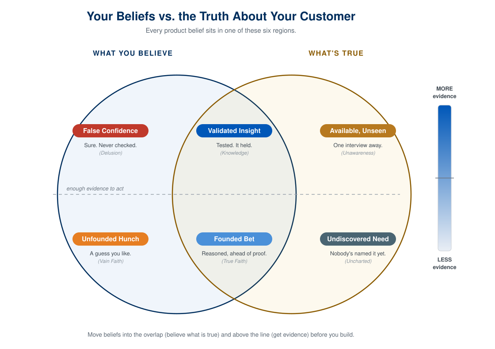
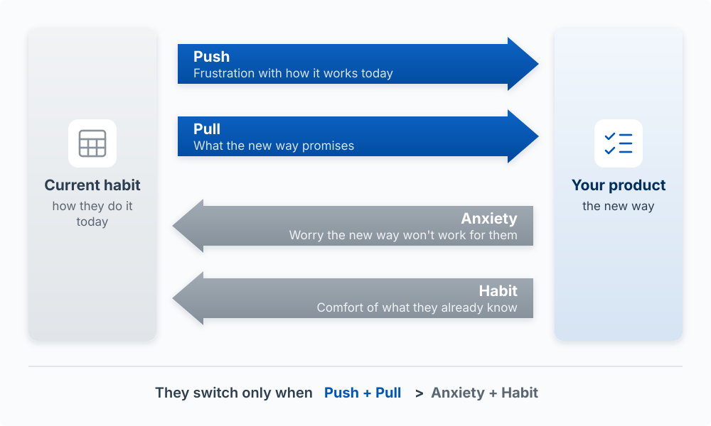
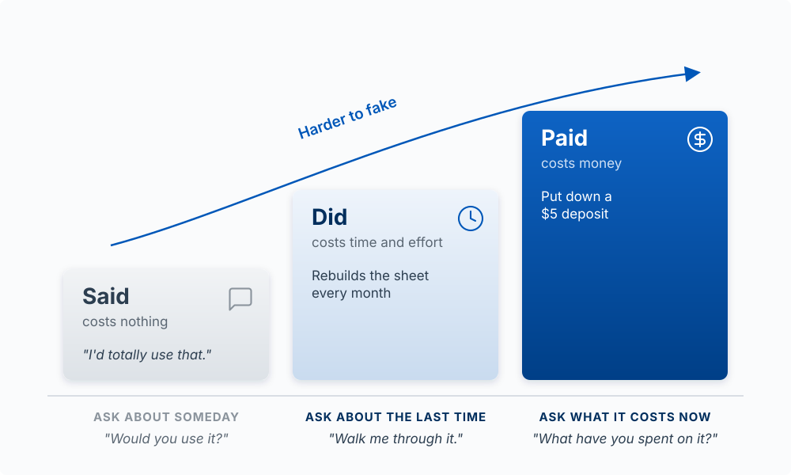
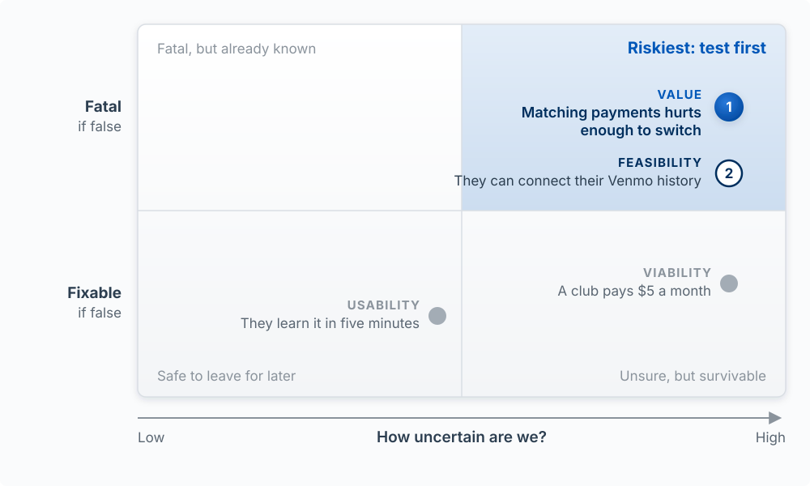
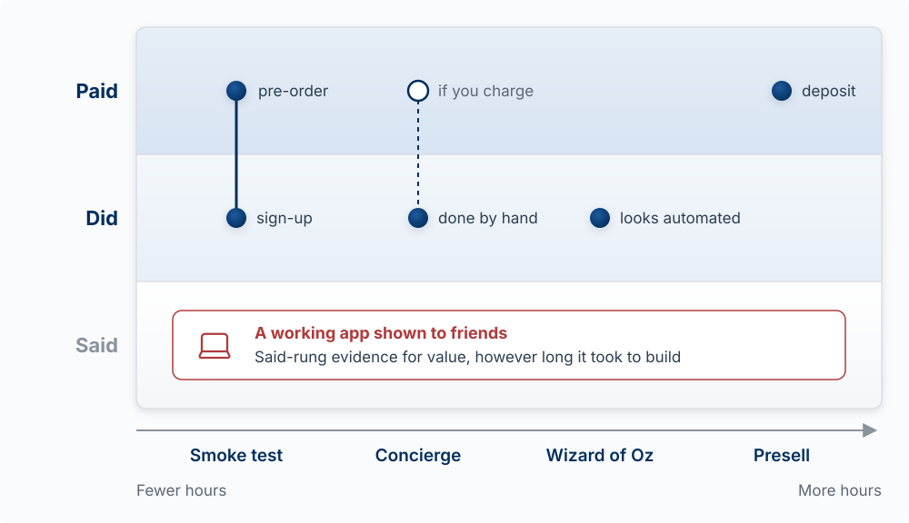

## Why This Matters

Building is cheap now, so the expensive mistake is building the wrong thing. **Discovery reduces
uncertainty before you spend weeks on an answer.** Every idea you have rests on beliefs about
other people: that they have this problem, that it hurts enough to change what they do, that they
would use and pay for your fix. Discovery is the work of finding out which of those beliefs are
true, cheaply, before you spend a sprint building on them.

Problem discovery is the process of moving from *I think this is a problem* to *I know this is a problem worth solving*. It requires talking to real people, asking the right questions, and turning what you hear into conclusions you can act on.

This is the longest chapter in the book because it covers the whole path from noticing a problem
to deciding what to build first. The sections follow the order you do the work:

1. **Get the mindset.** Treat your beliefs as guesses to check ([Discovery Is Truth-Seeking](#discovery-is-truth-seeking), [The Five Discovery Skills](#the-five-discovery-skills)).
2. **Notice many problems.** Start with your own frustrations and write them all down before you judge any ([You Are Your Best First Customer](#you-are-your-best-first-customer) through [Diverge Before You Converge](#diverge-before-you-converge)).
3. **Describe each problem precisely.** Say what the person is trying to get done, how it hurts, and what they do about it today ([Jobs-to-be-Done](#jobs-to-be-done-framework) through [The Real Competitor Is the Current Habit](#the-real-competitor-is-the-current-habit)).
4. **Talk to people.** Interview them about what they actually did, and sort what you hear by how much you can trust it ([Problem Interviews](#problem-interviews-the-mom-test) through [Interview Synthesis](#interview-synthesis)).
5. **Choose who it is for.** Pick a narrow group you can reach ([Who It Is For, and Not For](#who-it-is-for-and-not-for) through [Building Personas](#building-personas)).
6. **Score your problems and pick one** ([Evaluating Your Problems](#evaluating-your-problems)).
7. **Find what could make it fail, and test that first, cheaply** ([Issue Trees](#structure-a-messy-problem-issue-trees) through [The Smallest Test](#the-smallest-test)).
8. **Commit, and say what you offer** ([The Commitment Decision](#the-commitment-decision) through [Your Value Proposition](#your-value-proposition)).
9. **Decide the smallest first build** ([What is an MVP?](#what-is-an-mvp) through [Feature Prioritization](#feature-prioritization)).
10. **Write the brief, and keep discovering** ([From Discovery to the Brief](#from-discovery-to-the-brief), [Discovery Is Continuous](#discovery-is-continuous)).

Dan Olsen's Lean Product Process is a useful overview of the whole process. **Product-market fit**
means you have built something that meets a real need of a real group of customers better than what
they use now. The bottom two layers are the
market and are not yours to decide: who the customer is and which of their needs are underserved.
The top three are the product and are entirely your choices: the value proposition, the feature set,
and the UX. Product-market fit is the boundary between them, and step 6 loops back through customer
testing. This chapter is the bottom half. Chapters 5 and 6 are the top.

![The Lean Product Process. The market half, who the customer is and which needs are underserved, is what you discover; the product half, the value proposition, feature set, and UX, is what you choose. Product-market fit is where the two meet, and testing with customers loops back from the top to the base. Adapted from Dan Olsen, *The Lean Product Playbook* [@olsen2015lean].](images/diagrams/ch04-pmf-pyramid.svg){#fig-pmf-pyramid fig-alt="A pyramid split into two halves with a gap between them. The bottom half, bracketed as Market, you discover, has layer 1, target customer, at the base and layer 2, underserved needs, above it. The top half, bracketed as Product, you choose, has layer 3, value proposition, layer 4, feature set, and layer 5, UX, at the tip. In the gap between the halves, two double-headed arrows flank the label product-market fit. A dashed blue arrow, labeled 6, test with customers, runs from the tip of the pyramid around the right side and back down to the base." width="100%"}

::: {.callout-note title="The example in this chapter: a dues tracker"}
A student club collects membership dues. Members pay the treasurer on Venmo, and every Sunday
the treasurer matches those payments, one by one, against a sign-up sheet to see who still owes.
A student builder thinks one page that shows who has paid would save that Sunday. This chapter
follows the idea through discovery: what the treasurer does today, which assumptions would make
it fail, and the smallest test that shows whether it is worth building. The example is invented
for teaching.
:::

<!-- learn -->

## Discovery Is Truth-Seeking

A product manager has one core job: to know what is actually true about a customer and their problem before spending real time and money building. Discovery is how you do that job. Everything else in this chapter, Jobs-to-be-Done, the Mom Test, interview synthesis, is a method for replacing what you *believe* about your users with what is *true* about them, as cheaply and quickly as possible. Steve Blank gave this discipline its name, *customer development*, and its motto: get out of the building [@blank2005four]. The facts you need are outside, with real people, not inside your head.

It helps to see where a belief can sit.

{fig-alt="A two-circle Venn diagram. The left circle is What You Believe, the right is What's True. A horizontal evidence line crosses both. Six regions: False Confidence (believe, false, high evidence), Unfounded Hunch (believe, false, low evidence), Validated Insight (believe and true, high evidence), Founded Bet (believe and true, low evidence), Available but Unseen (true, not believed, high evidence), and Undiscovered Need (true, not believed, low evidence)."}

Those six regions each show up in real product work:

| Region | What it is in product terms |
|---|---|
| **Validated Insight** | True, and you have strong evidence. You believed it, you tested it, it held. This is what you want under your build plan before you commit. |
| **Founded Bet** | True, but the evidence is still thin. A reasoned conviction you act on ahead of full proof. You cannot validate everything. |
| **Unfounded Hunch** | You believe it, it is not true, little evidence. A guess you are fond of. Cheap to hold, cheap to drop, if you are honest. |
| **False Confidence** | You believe it, it is not true, and you feel sure. "I *know* users want this." The most dangerous place to build from, because the certainty hides the mistake. |
| **Available but Unseen** | True, evidence exists, you have not gone to get it. A competitor already solved it, or a user would tell you in five minutes. |
| **Undiscovered Need** | True, but no one has evidence yet. The biggest opportunities and the biggest risks are both here. |

The work has three parts. **Grow the overlap** by making more of your beliefs true, which means discarding the false ones. **Pull truths into it** by going and finding what you do not yet know. And **push your beliefs above the evidence line**, from founded bet toward validated insight, before you commit the semester to them.

Two failure modes account for most failed products. The first is building from **False Confidence**: shipping a thing you were sure about and never checked. The second is never leaving **Available but Unseen**: a truth was one interview away and you built on a guess instead.

#### Six ways of knowing, all flawed

If the map tells you where a belief sits, the next question is how you gather the evidence to move it. You have six tools, and every one of them can mislead you.

| Way of knowing | How a PM uses it | How it misleads you |
|---|---|---|
| **Logical reasoning** | Your own analysis, the internal logic of the idea | Armchair theorizing, confirmation bias. Seems airtight but has never been checked against a user. |
| **Trial and error** | Shipping a version, A/B tests (showing two versions to different users and comparing what they do), small experiments | Slow and costly, and you can optimize into a dead end. |
| **Word of others** | Competitors, analysts, "best practices," the loudest stakeholder | Copying what worked for someone else without knowing why it worked. Their context is not your context. |
| **Sensory experience** | Watching real users, usability tests | Tiny samples, and people act differently when they know you are watching. You see what you expect. |
| **Intuition** | Product sense, taste | Your preferences are not your user's preferences. |
| **Epiphany** | The insight in the shower | Feels convincing because it has not been tested. |

Because each tool fails in its own way, **you triangulate**: you treat a belief as validated only when independent sources converge, an interview, plus a behavior in the data, plus a test that survives. The most common mistake is trusting a single source, usually your own logic or one enthusiastic user, and promoting it straight to certainty. That leads to False Confidence.

How much evidence is enough depends on the stakes. A throwaway prototype needs almost none: go build it and learn. Committing the rest of the semester to one product needs a preponderance: real interviews, a customer who lives the problem, some signal they would pay. That is exactly what the conviction checks in the [Problem Discovery Framework](94-problem-discovery-framework.qmd), which you use in Sprint 2, ask you to weigh (see [Evaluating Your Problems](#evaluating-your-problems)). The posture throughout is to hold beliefs as probabilities: "I am maybe sixty percent sure" in place of "this is a great idea," and let each conversation move the number.

::: {.callout-note title="Thinking in probabilities"}
This is the Bayesian habit, and it comes with one practical rule: **good evidence is evidence that would look different if you were wrong.** "Tell me about the last time you dealt with this" is strong evidence, because someone who does not really have the problem cannot answer it convincingly. "Would you use an app that does this?" is weak evidence, because people say yes whether the problem is real or not. Seek the evidence that actually moves the number; discount the flattery that does not. That single test is why the Mom Test works, and it is the logic behind the [evidence ladder](#the-evidence-ladder-said-did-paid) later in this chapter.
:::

The rest of this chapter is the *how*. Jobs-to-be-Done gives you a sharper hypothesis about what is true. [The Mom Test](#problem-interviews-the-mom-test) gathers evidence that actually moves the number instead of flattery that does not.

<!-- learn -->

## The Five Discovery Skills

Where do good problems come from? Jeff Dyer and his colleagues studied disruptive innovators and found that what sets them apart is behavior: they act in five particular ways, and those behaviors are mostly learnable (their research puts creativity at roughly one-third genetic, versus about four-fifths for raw IQ). The five skills:

- **Questioning**: repeatedly asking why, why not, and what if, keeping a high ratio of questions to answers.
- **Observing**: watching customers and their workarounds like an anthropologist, noticing what people actually do rather than what they say.
- **Networking**: talking with people whose perspective differs from yours, to borrow ideas from other fields.
- **Experimenting**: trying things, taking them apart, running small tests.
- **Associating**: the skill the other four feed, connecting the inputs from the other four into a new idea.

This whole course is a program for practicing these. Your problem journal is Questioning and Observing; the interviews later in this chapter are Observing and Networking; your prototypes and smallest tests are Experimenting. That is the point of the practice model, and it is Dyer's finding too: these are skills you build with practice, and you are not born with them.

*The five discovery skills are from Jeff Dyer, Hal Gregersen, and Clayton Christensen, ["The Innovator's DNA,"](https://hbr.org/2009/12/the-innovators-dna) Harvard Business Review, December 2009. [@dyer2009dna]*

<!-- learn -->

## You Are Your Best First Customer

You don't necessarily need to conduct elaborate market research to find a problem worth solving. You're surrounded by problems every day, and you just need to find one you are passionate about fixing.

Many of the best products come from founders who were frustrated by something in their own lives:

- **Slack** came from a gaming company's internal communication frustrations
- **Dropbox** came from Drew Houston constantly forgetting his USB drive
- **Airbnb** came from founders who couldn't afford their San Francisco rent

When you're your own customer, you have three advantages:

1. **Faster feedback loops**: You can test ideas immediately on yourself
2. **Authentic insight**: You understand the problem's nuances
3. **Built-in motivation**: You actually want the solution to exist

The limit: you are one data point. Your own pain tells you the problem exists for at least one
person. It does not tell you how many others share it, or whether they would switch to fix it.
That is what the rest of the chapter is for.

<!-- learn -->

## Problem Journaling

Start keeping a **problem journal**. For the next week, write down every moment of friction, frustration, or inefficiency you experience. Don't filter, just capture.

Ask yourself:

- What did I just waste time on?
- What task felt harder than it should be?
- What made me say "there has to be a better way"?
- What workaround did I create because existing tools failed me?

Your journal entries might look like:

- "Spent 20 minutes trying to split a dinner bill with friends because everyone uses different payment apps"
- "Had to manually copy data from one spreadsheet to another AGAIN"
- "Missed a package delivery because I didn't know it was coming"

These small frustrations can become product ideas. Notice that each entry passes the stranger test
from [What Is Worth Building](03-what-is-worth-building.qmd#problem-vs.-solution-thinking): it
describes what happened, and none of them names an app.

<!-- learn -->

## Diverge Before You Converge

Good discovery follows an order: **generate many options before you narrow.** Generate many candidate problems before you judge any of them, then converge deliberately on the most promising. Most people do the opposite. They seize the first idea and spend months defending it, which is premature convergence.

So resist the urge to pick early. Your problem journal is the diverging half: capture dozens of frictions without filtering. Looking widely, across different people, contexts, and moments, surfaces problems you would never have reasoned your way to from your desk. Only once you have a long list do you start scoring and cutting ([Evaluating Your Problems](#evaluating-your-problems), below). The wider you diverge, the better the thing you eventually converge on.

*Diverge/converge discipline adapted from Nile Hatch, [Expeditionary Innovation](https://github.com/nilehatch/exp_innov/). [@hatch_expeditionary]*

<!-- learn -->

## Jobs-to-be-Done Framework

**The model:** people do not want your product; they want progress in a specific situation, and
they "hire" whatever gets them that progress. Describe the job without naming any product, and
you have described the problem.

The Jobs-to-be-Done (JTBD) framework, popularized by Clayton Christensen [@christensen2016luck], shifts focus from *what customers buy* to *why they buy it*. The core insight: customers "hire" products to do a job.

The classic example is the milkshake [@christensen2016luck]. A fast-food chain wanted to sell more milkshakes, so they improved the recipe. Sales didn't budge. Then they asked a different question: *What job are people hiring the milkshake to do?*

They discovered that most milkshakes were bought in the morning by commuters. The "job" wasn't *enjoy a delicious treat*. It was *make my boring commute more interesting while keeping me full until lunch*. The milkshake's competition wasn't other milkshakes; it was bananas, bagels, and donuts. The fix was to make it thicker (lasts longer), add fruit chunks (more interesting), and offer it at the drive-through (more convenient).

#### The JTBD Formula

Once you've identified a promising problem, frame it as a job:

> When I'm **[situation]**, I want to **[motivation]**, so I can **[desired outcome]**.

The building blocks: the **situation** is the trigger (when and where the job arises), the
**motivation** is the progress the person wants, and the **outcome** is why that progress matters
to them. The trap is the middle slot. "I want to" invites a feature ("I want to scan the receipt
with my phone"). Write it as progress the person would recognize even if your product never
existed. If the middle slot only makes sense to someone who has seen your app, rewrite it.

For example:

> When I'm **back from a work trip with a pocket full of receipts**, I want to **get reimbursed without losing an evening to it**, so I can **stop fronting the company money and put the trip behind me**.

- When I'm **planning a trip with friends**, I want to **settle on dates without a week of group-chat back-and-forth**, so I can **book before prices go up**.
- When I'm **starting a new exercise routine**, I want to **know what to do each day without researching it**, so I can **build strength without stalling out in week two**.
- When I'm **managing a team project**, I want to **know who is stuck before it costs us a deadline**, so I can **unblock them before deadlines slip**.

This framing keeps you focused on the customer's goal, not your solution. It reminds you that customers want progress in their lives. Your product is just a means to that end.


<!-- REVIEW: this image appeared twice in the old chapter (under "From Problems to Opportunities" and again under "Three Types of Jobs"); the two JTBD sections are merged and the image is kept once, here. Restore the second copy if you want it. -->

#### Three Types of Jobs

Every job has three dimensions:

| Job Type | Description | Example |
|----------|-------------|---------|
| **Functional** | What they want to accomplish | "Get from home to work" |
| **Emotional** | How they want to feel | "Feel in control of my day" |
| **Social** | How they want to be perceived | "Appear professional to colleagues" |

Most products focus only on functional jobs. But emotional and social jobs often drive purchasing decisions. Someone might buy a Tesla for the functional job (transportation) but the real motivation is social (appear environmentally conscious) or emotional (feel like an innovator).

#### Map the whole job

A job rarely happens in one moment. Mapping the whole experience, phase by phase, shows you where
the pain is greatest, which is usually not where you assumed. The dips are your opportunities.

{#fig-journey-map fig-alt="A customer journey map for a student club treasurer collecting dues. Four phases run left to right: collect dues, match payments, chase who owes, and report totals. Doing row: receives Venmo payments, some with no name; checks each payment against the sign-up sheet; texts members the sheet shows as unpaid; sends the paid total to the club president. Thinking row: dues are coming in; whose 20 dollars is this; what if she already paid; done until next Sunday. Feeling row: a line traces the treasurer's mood, calm above neutral while collecting, dropping below neutral to frustrated while matching and lowest, anxious, while chasing, then back above neutral, relieved, after reporting. Opportunity row: opportunities appear only under the two dips: match payments to members automatically, and show who has paid before anyone is texted." width="100%"}

::: {.callout-tip title="Try it"}
Find the mistake in each job statement, then rewrite it:

1. "When I'm studying, I want to use an AI flashcard generator, so I can learn faster."
2. "When I'm hungry, I want to eat, so I can not be hungry."
3. "When I'm running a club event, I want a Slack integration for RSVPs, so I can track attendance."

(Hint: one names a product, one has a situation too vague to observe, and one names a feature
where the progress should be.)
:::

<!-- learn -->

## The Five Kinds of Pain

Jobs come in three types; the *pain* behind a job comes in five kinds, and naming them gives you a checklist of what to probe for. A single problem often hurts in more than one way:

| Kind of pain | What it costs the person |
|---|---|
| **Physical** | effort, fatigue, discomfort |
| **Functional** | time, steps, things that don't work |
| **Financial** | money, waste, missed earnings |
| **Emotional** | stress, anxiety, embarrassment, frustration |
| **Social** | status, belonging, how others see them |

When you interview, listen across all five. The pains people mention first are usually functional; the ones that actually drive them to pay are often emotional or social. This complements the Self-Determination lens in [Sprint 2](00-assessments.qmd#sprint-2) (autonomy, competence, relatedness): that lens explains *why* a pain matters; these five categories catalog *how* it hurts.

*Five pain categories from Nile Hatch, [Expeditionary Innovation](https://github.com/nilehatch/exp_innov/) [@hatch_expeditionary].*

<!-- learn -->

## The Real Competitor Is the Current Habit

**The model:** your main competitor is whatever the person does today: a spreadsheet, a group
text, a paper list, or nothing at all. Switching away from it has a cost, so your product has to
beat the habit by more than that cost.

The milkshake's rival was a banana. Before anyone uses your app, they already get the job done
somehow, and that way is free or already paid for, already learned, and already shared with
everyone around them.

Bob Moesta, who worked with Christensen on the milkshake study, describes every switch as a
contest between four forces [@moesta2020demand]:

| Force | Direction | Example: a student club tracking dues |
|---|---|---|
| **Push** of the current situation | toward switching | The treasurer spends Sunday matching Venmo payments to a sign-up sheet |
| **Pull** of the new solution | toward switching | One page that shows who has paid, updated automatically |
| **Anxiety** about the new solution | against switching | "What if it gets a payment wrong and I chase a member who already paid?" |
| **Habit** of the present | against switching | Everyone already Venmos the treasurer; the spreadsheet works, mostly |

{#fig-forces-of-progress fig-alt="On the left, a panel labeled Current habit, how they do it today. On the right, a panel labeled Your product, the new way. Two blue arrows point right, toward switching: Push, frustration with how it works today, and Pull, what the new way promises. Two gray arrows point left, against switching: Anxiety, worry the new way will not work for them, and Habit, comfort of what they already know. A line at the bottom reads: they switch only when push plus pull is greater than anxiety plus habit." width="100%"}

A person switches only when push plus pull outweighs anxiety plus habit. Most first products are
all pull: the builder pictures the new thing and forgets how hard the old habit is to leave. The cost
of switching is real: learning a new tool, moving data, getting others to change too, and the
risk that the new tool fails at a bad moment.

This changes what you build and what you ask. In interviews, the question "What do you do today?"
is as important as "What is hard?" In your [value proposition](#your-value-proposition) (later in this chapter), the "Unlike" line should name the
habit ("Unlike a Venmo feed and a spreadsheet") before it names any startup. And when the honest
answer to "what do you do today" is "nothing, and it's fine," the problem may not hurt enough to
beat any habit.

::: {.callout-tip title="Try it"}
For your current idea, write down (1) exactly what your target person does today, step by step,
(2) what that habit costs them each week in time, money, or stress, and (3) every cost of
switching to your product, including getting other people to switch. Then predict: is push plus
pull larger than anxiety plus habit? Ask Claude to argue the side of the habit and see if your
answer holds.
:::

<!-- learn -->

## Problem Interviews (The Mom Test)

Once you have a hypothesis about the job customers are trying to do, you need to validate it with real conversations. This is where most people fail: they ask bad questions that produce misleading answers.

Rob Fitzpatrick's book *The Mom Test* [@fitzpatrick2013mom] identifies the core problem: if you tell your mom about your business idea, she'll say it's great. She loves you. She doesn't want to hurt your feelings. And her feedback is useless.

The solution is to ask questions that even your mom couldn't lie about, questions about their actual behavior, not hypothetical futures.

#### Rules of The Mom Test

1. **Talk about their life, not your idea**
2. **Ask about specifics in the past, not generics about the future**
3. **Talk less, listen more**

#### Bad Questions vs. Good Questions

| Bad Question | Why It's Bad | Good Question |
|--------------|--------------|---------------|
| "Would you use an app that does X?" | Hypothetical, everyone says yes | "Tell me about the last time you tried to do X" |
| "Do you think this is a good idea?" | Asking for opinions, not facts | "What solutions have you tried? What happened?" |
| "How much would you pay for this?" | They'll guess to be nice | "What are you currently paying to solve this?" |
| "Would you recommend this to friends?" | Future promise, not behavior | "Have you ever told anyone about this problem?" |

#### The Most Useful Question {#the-magic-question}

The most useful interview question is:

> "Walk me through the last time you experienced this problem."

This forces specificity. You'll learn:

- How often it really happens
- What they actually did (not what they say they'd do)
- What emotions came up
- What solutions they tried
- Why existing solutions fell short

#### Signs You're Onto Something

- They get animated or frustrated describing the problem
- They've already tried to solve it themselves
- They've spent money on partial solutions
- They take an action that costs them something: they sign up for your test, send you their real spreadsheet, or book a second conversation
- They introduce you to others with the same problem

Asking whether they can beta test (try an early version before it is public) is encouraging, but it is still something they said. It
becomes evidence when they show up for the beta.

#### Signs You Should Pivot

To **pivot** is to change direction: drop this problem, or keep the person and look for a different problem they have.


- They can't remember the last time this happened
- They shrug and say "it's not a big deal"
- They've never tried to solve it
- They wouldn't pay anything to make it go away

<!-- learn -->

## The Evidence Ladder: Said, Did, Paid

**The model:** what people *said* is weak evidence, what they *did* is stronger, and what they
*paid* is strongest. Ask about the last time, not about someday.

Each rung is stronger because it costs the person more to fake. Saying "I'd use that" costs
nothing, so people say it to be polite. Doing something costs time and effort. Paying costs money
or reputation, which people guard.

{#fig-evidence-ladder fig-alt="Three steps rising from left to right. The lowest, Said, gray with a speech bubble icon, costs nothing; example: I'd totally use that. The middle, Did, light blue with a clock icon, costs time and effort; example: rebuilds the sheet every month. The highest, Paid, deep blue with a dollar coin icon, costs money; example: put down a 5 dollar deposit. A curved arrow rising over the steps reads harder to fake. Under the steps, the question that gets evidence at each rung: ask about someday, would you use it, under Said; ask about the last time, walk me through it, under Did; ask what it costs now, what have you spent on it, under Paid." width="100%"}

| Rung | What counts | Example | How it can still mislead you |
|---|---|---|---|
| **Said** | Opinions, compliments, predictions, "I would," "I'd pay" | "That's a great idea, I'd totally use it." | Free to say, and people say it to be kind |
| **Did** | Past behavior and actions with a cost in time or effort: a workaround they built, hours they spend, a sign-up, an introduction, showing up | "Here's the spreadsheet I rebuild every month." / 40 people joined the waitlist | Doing something once does not mean they will do it again |
| **Paid** | Money changing hands, or a binding commitment: an existing purchase, a pre-order, a deposit, a budget line | "We pay $30 a month for a tool that half does this." / 6 people paid a $5 deposit | A few early payers may not be your market |

Three rules follow from the ladder:

1. **The past is on the did rung; the future is on the said rung.** "Walk me through the last
   time" asks for a report of what they did. "Would you use" asks for a prediction. That is why
   the Mom Test works. A story about the last time is still a story, so check it against an
   artifact when you can ("Can you show me the spreadsheet?").
2. **Fitzpatrick's currencies.** In *The Mom Test*, commitment comes in time, reputation, and
   money [@fitzpatrick2013mom]. A second meeting is time; an introduction to their boss risks
   their reputation; a pre-order is money. Each is a step up from a compliment.
3. **Tag every claim by its rung.** "Users want this" with only said-rung evidence is an
   Unfounded Hunch dressed as an insight.

::: {.callout-tip title="Try it"}
Tag each of these interview notes as said, did, or paid:

1. "I'd definitely pay for something like this."
2. She showed you a Google Sheet with 14 tabs she maintains by hand.
3. He asked if he could beta test it.
4. Three people put down a $10 deposit on a pre-order page.
5. "I hate doing this every week."
6. He forwarded your email to two friends who have the same problem.

Then go through your own interview synthesis and tag every key insight the same way. How many of
your insights rest only on the said rung?
:::

<!-- learn -->

## Conducting Effective Interviews

#### Before the Interview

1. **Define your hypotheses**: What do you believe about the problem?
2. **Prepare 5-7 open-ended questions**: Focus on behavior and specifics
3. **Target the right people**: Those who actually experience the problem
4. **Set expectations**: "I'm trying to understand how people handle X. Can I ask you some questions?"

#### During the Interview

1. **Shut up**: You should talk less than 20% of the time
2. **Dig deeper**: "Tell me more about that" / "Why was that frustrating?"
3. **Get specific**: "Can you give me an example?" / "What happened next?"
4. **Watch for emotion**: Strong feelings indicate strong needs
5. **Take notes**: Or record with permission

#### Sample Interview Script

> "I'm researching how people [handle X situation]. I'm not selling anything, I just want to understand your experience. Can I ask you some questions?"

1. "Can you tell me about your role and what a typical day looks like?"
2. "When was the last time you [experienced the problem]?"
3. "Walk me through what happened."
4. "What did you do about it?"
5. "What was frustrating about that?"
6. "Have you tried any solutions? What happened?"
7. "What have you spent on this so far, in money or time? What did you buy or try?"

Every question asks about the past. Question 7 replaces a hypothetical ("what would make this
worth paying for?") with the paid rung: what they have already spent is real willingness to pay.
Close by asking for something small that costs them a little, such as "Who else should I talk
to about this?" An introduction is a did.

<!-- learn -->

## Interview Synthesis

After 5+ interviews, patterns emerge. Synthesize what you learned into actionable insights.

::: {.callout-note title="How many interviews is enough?"}
There is no fixed number. The rule: **stop when new interviews stop surprising you.** Early on, every conversation adds something. As you approach saturation, you start hearing the same problems, quotes, and workarounds you have already heard, and the information each new interview adds drops toward zero. When two or three in a row tell you nothing new, you have enough to act. If every interview still surprises you, keep going; your sample is probably too narrow.

*The saturation ("information entropy") stop rule is from Nile Hatch, [Expeditionary Innovation](https://github.com/nilehatch/exp_innov/) [@hatch_expeditionary].*
:::

#### Synthesis Template

Use this format to document your findings:

**Problem Statement:**
One clear sentence describing the problem you've validated. It should pass the stranger test.

**Who You Talked To:**
Roles/titles of interviewees (not names, for privacy).

- 3 marketing managers at mid-size companies
- 2 freelance consultants

**Key Insights:**
3-5 bullet points summarizing the most important patterns, each tagged with its evidence rung.

- All 5 participants mentioned X as their biggest frustration *(said)*
- 4/5 have tried Y solution but found it lacking because Z *(did)*
- Time spent on this problem: average 3 hours/week *(did, from their own walk-throughs)*

**Notable Quotes:**
Direct quotes that capture the emotion and specificity.

- "I literally dread Mondays because I know I'll spend half the day on this."
- "I've tried everything. Nothing actually works."

**What We Learned:**
Your interpretation and next steps.

- The problem is real and frequent (validated)
- Current solutions fail because they don't address X
- Opportunity: build something that does Y

<!-- learn -->

## Who It Is For, and Not For

**The model:** a narrow first customer beats a broad market. And the person who uses the product
and the person who pays for it may be different people.

#### Start narrow: the beachhead

Geoffrey Moore's advice for new products is to win one narrow segment completely before
expanding: a **beachhead**, a small market you can dominate and use as a base to move outward
[@moore1991crossing]. A narrow segment works better early, for three reasons. Narrow people share the same habit, so
one product can beat it. They talk to each other, so word spreads. And you can reach all of them,
so you learn fast. For a student, a beachhead might be one dorm, one club, or one kind of small
business in Provo. Ten people who love it teach you more than a thousand who shrug.

Say who it is **not** for, too. "Not for clubs with more than 200 members, not for clubs that
collect dues by check" is a decision that keeps you from building for everyone and fitting no one.

#### The user and the payer

In many products, the person who uses it is not the person who pays.

| Product | User | Payer |
|---|---|---|
| A teen driving app | the teen | the parent |
| Analytics software at a company | the analyst | the manager who owns the budget |
| A classroom tool | the students | the instructor or the school |
| Club dues tracker | the treasurer (and members, who pay dues through it) | the club, from its budget, if anyone |

Each has a different job and a different habit. The user cares whether it is easy (usability);
the payer cares whether it is worth the money (value and viability). If they differ, you need
evidence from both, and your interview list should include both.

::: {.callout-tip title="Try it"}
Write your target customer as narrowly as you can in one sentence, then list three people who
are *not* your customer even though they might be interested. Then name the user and the payer.
If they are different people, have you interviewed the payer? If not, who is the first payer you
could talk to this week?
:::

<!-- learn -->

## Can You Reach Them? The Access Test

A real, painful, frequent problem is still not an opportunity if you cannot reach the people who have it. Before you commit, run a quick access test on three questions:

1. **Location.** Can you find where these people already gather, online or off? If you cannot name the channel, that is a warning sign.
2. **Engagement.** Will they actually respond to you, answer questions, and try a prototype?
3. **Reciprocity.** Do you have something to offer in return? Reaching people is not enough. People give you their time when the exchange feels fair.

If you cannot reach a segment cheaply now, as a student, you will not reach them cheaply as a founder. Either find a reachable beachhead within the market or reconsider the problem.

*The access test is adapted from Nile Hatch, [Expeditionary Innovation](https://github.com/nilehatch/exp_innov/).* [@hatch_expeditionary]

<!-- learn -->

## Building Personas

A persona is a fictional but realistic representation of your target customer. It synthesizes interview data into a memorable character that keeps your team aligned.

A worked example, from Dan Olsen:

![A one-page persona: segment and name, demographics, a quote in her own words, a short story, then goals, technology use, and interests. Adapted from Dan Olsen, *The Lean Product Playbook* [@olsen2015lean].](images/diagrams/ch04-persona.svg){#fig-persona fig-alt="A one-page persona. A person icon sits beside the segment name, The Busy Mom, and the name Lisa Bennett. Demographics: age 32, female, married, bachelor's degree, teacher, income 55,000 dollars. A pull quote: My children's health is my top priority, but raising two kids is a full-time job, so I need an easy way to stay on top of their prescriptions and medical appointments. A short story: she is an elementary school teacher who lives with her husband Dave and their children Addison, 12, and Caleb, 9; Dave often works late, so Lisa is the primary caregiver; Addison has asthma and must always have her inhaler, and Lisa worries she might forget to refill the prescription. Three columns. Goals: be reminded of children's medical appointments, keep track of children's health information, refill prescriptions easily. Technology use: average, owns an iPhone, uses a desktop PC, uses Facebook to keep up with family and friends. Interests: spending time with family, being involved in her children's extracurricular activities, tennis." width="100%"}

Note what makes this one useful: the quote and the asthma inhaler come from a real interview, not
from imagination. A persona is a summary of evidence you already collected. The failure mode, and
it is the easy one now, is asking an agent to generate a persona before you have talked to anyone.
That produces a plausible character with no information in it, and it will confirm whatever
you already believed.

#### Persona Template

**Name & Role:** Sarah, 34, Marketing Manager at a 200-person SaaS company (Software as a Service: a company that sells software by monthly subscription)

**Demographics:**

- 5 years in role, manages team of 3
- Based in Austin, works hybrid
- Comfortable with technology but not technical

**Goals/Motivations:**

- Ship campaigns on time
- Prove marketing's impact to leadership
- Get promoted to Director within 2 years

**Frustrations/Pain Points:**

- Spends 6+ hours/week manually compiling reports
- Can never get real-time data when executives ask
- Marketing tools don't talk to each other

**Job-to-be-Done:**

> When I'm preparing for our weekly leadership meeting, I want to answer any question about campaign performance on the spot, so I can confidently demonstrate marketing's value.

**Current Solutions & Workarounds (the habit to beat):**

- Manually exports data from 4 different tools into a spreadsheet
- Has built elaborate formulas that break constantly
- Sometimes just estimates because accurate data takes too long

**Willingness to Pay:**
Has budget authority up to $500/month for tools that save significant time. (Here the user is
also the payer. When she is not, write a second, shorter profile for the payer.)

<!-- learn -->

## Evaluating Your Problems

Not every problem is worth solving. Once you have a pile of candidates and some interviews, you
score them. The course uses one rubric, the one in the [Problem Discovery
Framework](94-problem-discovery-framework.qmd) you use in Sprint 2. Its parts:

| Factor | Question to ask | What strong looks like |
|----------|-----------------|---|
| **Frequency** | How often does this problem occur? | Daily or weekly; yearly is weak |
| **Intensity** | How painful is it when it happens? | "I hate this," and they have already tried to fix it |
| **Willingness to Pay** | Would someone pay to make this go away? | They already pay for partial solutions (the paid rung) |
| **Market Size** | How many people have this? | A segment you can name and reach, beyond you and your friends |
| **Your fit (conviction)** | Do you live it, love someone who does, or see something others miss? | Two or more of the four conviction checks |
| **Addressability (technical feasibility)** | Can software actually solve this, with data and tools you can get? | Data access, technology ready, no hardware or regulatory blockers |

The first four are scored 1 to 5 (the Opportunity Score); conviction and feasibility are
checklists. The full scales are in the framework appendix.

A problem that happens rarely but is extremely painful (like planning a wedding) can be worth solving. A problem that happens constantly but is mildly annoying (like seeing ads) can also be worth solving. The strongest case is **frequent AND painful AND people will pay**.

#### Frequency and intensity

Problems that occur frequently create more value when solved: a tool that saves someone 10 minutes daily is worth more than one that saves an hour yearly. **Red flag:** if interviewees can't remember the last time it happened, frequency is too low. Intensity measures how much the problem disrupts someone's life or work, and high intensity creates the urgency that beats a habit. The signs are the ones under [Signs You're Onto Something](#problem-interviews-the-mom-test): strong emotional language, workarounds they built, a problem they raise unprompted. Low intensity sounds like "it's annoying but not a big deal" from someone who has never tried to fix it.

#### Willingness to Pay

The strongest validation is whether someone will exchange money to make this problem go away. This is harder to assess than frequency or intensity, but it's the most important. Score it from the highest rung of the evidence ladder you actually have.

**Strong signals (did and paid):**

- They're already paying for partial solutions
- They can show you what the problem costs them ("This costs me $X per month," backed by a bill or a timesheet)
- They pay a deposit or pre-order when offered
- They spend real time on workarounds every week

**Weak signals (said):**

- "Yeah, I'd probably pay for that" (hypothetical)
- "That sounds like a good idea" (opinion, not commitment)
- They ask about pricing but take no step when offered one
- They have no budget authority for this type of purchase

::: {.callout-tip title="Strengthen your evidence"}
Three ways to keep your scores honest:

- **Quantify willingness to pay from what they already spend.** Do not ask for a number they will invent. Add up what the problem *actually* costs them today: the price of the workaround, the hours lost, the substitute they already buy. That is real willingness to pay.
- **Score intensity out of ten (the "Ouch Factor").** Force yourself to rate how much it hurts, 1 to 10, per person. Vague intensity hides weak opportunities.
- **Watch both failure modes.** A *false positive* is polite agreement ("sure, I'd use that") for a problem no one really has. A *false negative* is a real pain you missed because you framed the question badly. Seek disconfirming evidence for the first; re-ask in different words to catch the second.

*Ouch Factor, workaround-spend, and false-positive/negative framing from Nile Hatch, [Expeditionary Innovation](https://github.com/nilehatch/exp_innov/).* [@hatch_expeditionary]
:::

#### Another lens: importance and satisfaction

Dan Olsen's *Lean Product Playbook* [@olsen2015lean] adds a second view that the scorecard
misses: how well people's needs are already met. Plot potential problems on a 2x2 matrix:

- **Y-axis: Importance**: How much does this matter to the customer?
- **X-axis: Satisfaction**: How well do current solutions address it?

The opportunity zone is **high importance + low satisfaction**. These are problems that matter a lot to people but that they can't solve well today. High importance with high satisfaction means the current habit already does the job, and you would have to beat it.

![Importance versus satisfaction. A need that matters and is poorly met by current solutions is the opportunity; one that matters and is already met well means competing with what people use now; a need that matters little is not worth going after. Adapted from Dan Olsen, *The Lean Product Playbook* [@olsen2015lean].](images/diagrams/ch04-importance-satisfaction.svg){#fig-importance-satisfaction fig-alt="A two by two grid. The vertical axis is importance of user need, low at the bottom to high at the top. The horizontal axis is user satisfaction with current solutions, low on the left to high on the right. The top left quadrant, high importance and low satisfaction, is shaded blue and labeled Opportunity: matters, poorly met today. The top right quadrant, high importance and high satisfaction, is labeled Competitive: matters, already met well. The whole bottom half, low importance at any level of satisfaction, is one gray region labeled Not worth going after: matters little, however well it is met." width="100%"}

<!-- learn -->

## Structure a Messy Problem: Issue Trees

**The model:** break a big question into parts that do not overlap and leave nothing out, then
work the part that decides the answer.

Discovery questions arrive messy: "Is this worth building?" "Why aren't people using my app?"
Consultants handle messy questions with a short sequence of steps, and the steps apply directly
to product work. They also set up the next section: the impact and uncertainty test in building
block 3 is how you will pick your riskiest assumption. This section adapts them from the Management Consulting course (STRAT 325, chapter
5, *Structured Problem-Solving*, sections 1.5 to 1.8).

#### Building block 1: MECE

**MECE** (pronounced "mee-see") means **mutually exclusive, collectively exhaustive**. A list of
parts is MECE when no two parts overlap (each case falls in exactly one) and together they cover
every case (nothing falls outside). Barbara Minto developed and popularized the idea at McKinsey
as part of the Pyramid Principle [@minto1978pyramid].

Overlapping parts count the same cause twice; a gap can hide the real answer.

Structures that are MECE by construction are the safest, because the math guarantees it:

- Revenue = Price × Volume
- Profit = Revenue − Costs
- Users = Never activated + Activated and left + Still active
- Options = Do nothing, Do X, Do Y

#### Building block 2: the issue tree

An **issue tree** applies MECE at each level. The top is your question. Each branch splits it
into MECE parts, and each part splits again until every leaf is something you can check with
evidence.

A worked example. You launched a study-group finder; 120 students signed up and 15 used it last
week. Why is retention low?

```{mermaid}
%%| label: fig-issue-tree
%%| fig-cap: "An issue tree for low retention. The three first-level branches cover every sign-up exactly once, so the data can point to the branch that holds the problem."
%%| fig-alt: "A tree branching left to right from the question why do only 15 of 120 sign-ups use it weekly. Three branches: never activated, meaning never joined a group, which splits into did not understand what to do and no group existed for their class; activated, then left, which splits into group never met, group met but was not useful, and their need ended because the exam passed; and still active, which leads to what do these 15 have in common."
%%{init: {'theme':'base','flowchart':{'curve':'basis','wrappingWidth':320,'nodeSpacing':22,'rankSpacing':56},'themeVariables':{'fontFamily':'Inter, Helvetica Neue, Helvetica, Arial, sans-serif','fontSize':'17px','primaryColor':'#F4F6F8','primaryBorderColor':'#D9DEE4','primaryTextColor':'#2C3E50','lineColor':'#8A939C'}}}%%
flowchart LR
  Q["Why do only 15 of 120<br/>sign-ups use it weekly?"] --> A["Never activated<br/>(never joined a group)"]
  Q --> B["Activated, then left"]
  Q --> C["Still active"]
  A --> A1["Didn't understand what to do"]
  A --> A2["No group existed for their class"]
  B --> B1["Group never met"]
  B --> B2["Group met, wasn't useful"]
  B --> B3["Their need ended (exam passed)"]
  C --> C1["What do these 15 have in common?"]
  classDef question fill:#002E5D,stroke:#002E5D,color:#FFFFFF,font-weight:700
  classDef branch fill:#E6EEF7,stroke:#0057B8,stroke-width:2px,color:#002E5D,font-weight:600
  class Q question
  class A,B,C branch
```

The tree changes what you do next. The instinct is "add features." The tree sends you to the
data first: if 90 of the 105 missing users never joined a group, the problem sits in the first
branch (onboarding or empty classes), and no feature for active groups will help.

#### Building block 3: prioritize by decision impact

Not every branch deserves work. Rank them on three questions from the consulting version:

- **Impact:** if we are wrong about this branch, does it change what we build?
- **Uncertainty:** how confident are we already?
- **Testability:** can we actually check it this sprint?

Work first on the branch that is high impact, high uncertainty, and testable.

#### Building block 4: exclude what does not decide

The **"so what" test**: for any question you could investigate, ask "if I knew the answer, would
it change what I build?" If not, skip it and say so. Students often spend a week on market-size
research for a product whose real open question is whether ten people will use it twice.

::: {.callout-tip title="Try it"}
Two drills.

1. Find the MECE mistake: "Why are users leaving? (a) the app is slow, (b) they're on Android,
   (c) they found it confusing, (d) bugs." Which parts overlap, and what is missing? Redraw it
   using a structure that is MECE by construction.
2. Draw an issue tree for one open question about your own product, three levels deep. Mark the
   one leaf that, if answered, would most change your next sprint. Ask Claude to check your tree
   for overlaps and gaps, then decide yourself whether it is right.
:::

<!-- learn -->

## The Four Risks and the Riskiest Assumption

**The model:** every product idea can fail in four ways: they don't want it, they can't use it,
we can't build it, or it doesn't work as a business. Name the assumption most likely to make it fail
and test it first.

#### What would have to be true

Start with the consulting move from section 1.5 of *Structured Problem-Solving*: state your idea
as a hypothesis, then ask **"What would have to be true?"** for it to work. The question comes
from Roger Martin's strategy practice, and it appears in *Playing to Win* [@lafley2013playing].
It turns a vague belief ("this is a good idea") into a list of specific conditions, each of which
you can test.

#### The four risks: a MECE list of what could be false

Marty Cagan sorts everything that has to be true into four risks [@cagan2017inspired]:

| Risk | The question | A cheap test |
|---|---|---|
| **Value** | Will they want it, enough to switch from the current habit and pay? | Interviews about the last time; a smoke test; a presell (both defined in [The Smallest Test](#the-smallest-test)) |
| **Usability** | Can they figure out how to use it? | Put a clickable prototype in front of five users and watch ([Testing the Design](06-testing-the-design.qmd)) |
| **Feasibility** | Can we build it with the time, skills, data, and tools we have? | Ask Claude to build only the hardest piece in an hour (a spike) |
| **Viability** | Does it work as a business: someone pays, costs stay below price, it is legal and allowed? | Price it in a presell; estimate cost per user (including what the AI company charges each time your app sends it a request); check the rules |

These four are a MECE split of "will this product work?": a failure in any one is enough to make it fail. Cagan's
point is that teams over-test feasibility and under-test value, which is the risk most often
wrong. AI makes this worse: an agent can resolve feasibility risk for an ordinary app in an
afternoon, and a working app is easy to mistake for proof of value. It only proves you could
build it.

#### The riskiest assumption

Your **riskiest assumption** is the condition that is both **most uncertain** and **most fatal if
false** (the impact and uncertainty test from the issue-tree section). Test it before anything
else, because every hour spent on other parts is wasted if it fails.

A worked example. Idea: a dues tracker for student club treasurers.

| What would have to be true | Risk | Uncertainty | Fatal if false? |
|---|---|---|---|
| Treasurers find matching payments to members painful enough to switch | Value | High (we've talked to two) | Yes |
| Treasurers can connect their Venmo history to the app | Feasibility | High (Venmo closed its API, the connection other apps use to read its data, to new developers in 2016; members can download a monthly CSV statement) | Yes |
| Treasurers can learn it in under five minutes | Usability | Medium | No, fixable |
| A club will pay $5 a month | Viability | High | Not this semester; a free tool is fine for now |

{#fig-riskiest-assumption fig-alt="A two by two grid. Left to right is how uncertain are we, low to high. The top row is fatal if false; the bottom row is fixable if false. The top right quadrant is shaded and labeled riskiest: test first. It holds number 1, value, matching payments hurts enough to switch, drawn as a solid blue dot, and number 2, feasibility, they can connect their Venmo history, drawn as an outlined dot. The bottom right quadrant, unsure but survivable, holds viability, a club pays 5 dollars a month. The bottom left quadrant, safe to leave for later, holds usability, they learn it in five minutes, near the middle line. The top left quadrant, fatal but already known, is empty." width="100%"}

Two assumptions are high-uncertainty and fatal: value and the Venmo data. Value comes first,
because if treasurers don't care, the data question never matters. But the feasibility one is
cheap to check (an hour of reading and a spike) and could kill the idea in its current form, so
check it the same week.


::: {.callout-tip title="Try it"}
For your product, write the hypothesis in one sentence, then list five things that would have to
be true. Label each with its risk (value, usability, feasibility, viability), its uncertainty,
and whether it is fatal. Circle your riskiest assumption. Then write one line you could paste
into your sprint plan: "My riskiest assumption is ___, and this sprint I will test it by ___."
:::

<!-- learn -->

## The Smallest Test

**The model:** before you build, fake it, do it by hand, or sell it first. The goal is learning
per hour: the most trustworthy evidence about your riskiest assumption, for the fewest hours.

Once you know your riskiest assumption, you can usually test it faster and cheaper than writing
the product. These are the classic tests, ordered roughly from least to most effort:

| Test | What you do | Risk it tests | Evidence rung |
|---|---|---|---|
| **Smoke test** | Offer a product that does not exist yet and measure whether people take a real action toward it | Value | Did (a sign-up), or paid (a pre-order) |
| **Concierge** | Deliver the outcome yourself, by hand and in the open, to a few customers | Value, and whether they keep coming back | Did; paid if you charge |
| **Wizard of Oz** | Make the product *look* automated while a person does the work behind the scenes | Value and usability of the real experience | Did |
| **Presell** | Ask for money or a binding commitment before it exists: a pre-order, a deposit, a signed letter | Value and viability | Paid |

**One definition of a smoke test.** A smoke test is any offer of a product that does not exist
yet, measured by a real action. A landing page with a waitlist and a pre-order page are both
smoke tests; they differ in the rung of evidence. A sign-up is did; a pre-order is paid. A **fake
door** is a smoke test inside a product you already have: a button for a feature you have not
built, which counts the clicks. Be honest with whoever clicks: tell them it is coming, and thank
them.

Three classic cases from Eric Ries's *The Lean Startup* [@ries2011lean]: Dropbox's smoke test was
a short demo video, posted before the product was public, which Ries reports took the beta waiting
list from 5,000 to 75,000 people overnight. Food on the Table, a meal-planning service, began as a
concierge, its founder planning meals by hand for one customer. And Zappos began as a Wizard of
Oz: its founder photographed shoes in local stores and bought a pair at full price whenever
someone ordered.

The concierge test is Paul Graham's "do things that don't scale" applied to discovery
[@graham2013]: doing it by hand teaches you the job in a way no survey can.

**Learning per hour** is how you choose among them. Ask: which test answers my riskiest
assumption, on the highest rung, in the fewest hours? For the dues tracker, a concierge test
is the best choice: ask three treasurers to send you their Venmo export each Sunday and send back a "who has
paid" list you built by hand. In two weeks you learn whether they send it (did), whether they
read the list, and whether they would pay for it, with no code at all.

{#fig-smallest-test fig-alt="A chart with three rows for the evidence rungs, Paid at the top, Did in the middle, Said at the bottom, and four columns along an effort axis, in rough order from fewer hours to more hours: smoke test, concierge, Wizard of Oz, presell. The smoke test has a point on Did labeled sign-up joined to a point on Paid labeled pre-order. The concierge has a solid point on Did labeled done by hand and an open point on Paid labeled if you charge, joined by a dashed line. Wizard of Oz has one point on Did labeled looks automated. Presell has one point on Paid labeled deposit. Across the Said row is a red-outlined box with a laptop icon: a working app shown to friends, said-rung evidence for value, however long it took to build." width="100%"}

Building is cheap now, so sometimes the build *is* the cheapest test, especially for usability
and feasibility. But a working app tested on friends sits on the said rung for value. Whatever
you build, attach a real action (a sign-up, a return visit, a payment) to it.

*Smoke test and Wizard of Oz framing from Nile Hatch, [Expeditionary Innovation](https://github.com/nilehatch/exp_innov/); both are established lean-startup techniques he assembles into the method [@hatch_expeditionary].*

::: {.callout-tip title="Try it"}
For your riskiest assumption, design two of the four tests. For each, write what you will do,
what action you will count, which rung that action sits on, and how many hours it will take.
Predict the result before you run it, and write down what result would make you change your plan.
Pick the one with the best learning per hour and run it this sprint.
:::

<!-- learn -->

## The Commitment Decision

At some point, you need to stop exploring and start building. This is the commitment decision, choosing one problem to focus on.

**Signs you're ready to commit:**

- You've talked to 5+ people who experience the problem
- Multiple people show strong signals on frequency, intensity, and willingness to pay, with evidence above the said rung
- You can name the current habit you have to beat
- You have named your riskiest assumption, and a small test has not disproved it
- You're excited to work on this for months

**Signs you're not ready:**

- You're still finding contradictory information
- Nobody seems to care that much
- You can't articulate who this is for
- You're only excited because you like the solution idea

For the dues tracker, ready would look like this: you have talked to five treasurers; three showed
you the sign-up sheet they reconcile by hand every Sunday (did); you can name the habit (a Venmo
feed and a spreadsheet); and the concierge test from [The Smallest Test](#the-smallest-test) ran for
two Sundays with treasurers sending their exports each week. Not ready would look like this: two
treasurers said it sounded useful, and neither has sent you anything.

<!-- learn -->

## Avoiding Premature Commitment

The Commitment Decision asks whether you have enough evidence to commit. The more common trap is committing before you do. Watch for these warning signs:

**Solution love:** You're attached to a specific solution before validating the problem. ("I want to build an AI app" → wrong starting point)

**Confirmation bias:** You're only hearing what supports your hypothesis. Actively seek disconfirming evidence.

**Sunk cost:** You've invested time, so you don't want to pivot. Cut your losses early. It's cheaper than building the wrong thing.

**Founder fantasy:** You imagine the success, not the work. Fall in love with the problem, not the outcome.

<!-- learn -->

## Your Value Proposition

Once you commit to a problem, articulate your value proposition, a clear statement of what you offer and why it matters.

**Template:**

> For **[target customer]**
> Who **[has this problem]**
> Our product is **[category]**
> That **[key benefit]**
> Unlike **[alternatives]**
> We **[key differentiator]**

**Example:**

> For **marketing managers at mid-size SaaS companies**
> Who **spend 6+ hours weekly compiling reports from multiple tools**
> Our product is **an automated reporting dashboard**
> That **pulls data from all your tools into one real-time view**
> Unlike **manual spreadsheets or expensive enterprise solutions**
> We **take 10 minutes to set up and cost 1/10th the price**

The same template for the dues tracker:

> For **treasurers of student clubs with fewer than 200 members who collect dues on Venmo**
> Who **spend Sunday matching payments to a sign-up sheet**
> Our product is **a dues tracker**
> That **shows who has paid and who still owes**
> Unlike **a Venmo feed and a spreadsheet**
> We **match each payment to a member from the Venmo statement you already download**

The "For" line is your beachhead. The "Unlike" line names the [current
habit](#the-real-competitor-is-the-current-habit) first (manual spreadsheets in the first example; a Venmo feed and a spreadsheet in the
second), because that is what the customer will compare you to.

The canvas below is a second way to check the same statement. On the right, list the customer's
jobs, pains, and gains from your interviews. On the left, list what your product does about each
one. Your value proposition is strong when the left side answers the items on the right that
matter most to the customer.

![The Value Proposition Canvas. The customer profile (circle) holds the customer's jobs, pains, and gains; the value map (square) holds the products and services, pain relievers, and gain creators that answer them. Fit is when the value map addresses the jobs, pains, and gains that matter most to the customer. From Alexander Osterwalder, Yves Pigneur, Greg Bernarda, and Alan Smith, *Value Proposition Design* [@osterwalder2014value]. The Value Proposition Canvas is copyright Strategyzer AG ([strategyzer.com](https://www.strategyzer.com)); redrawn here with its terms and layout unchanged.](images/diagrams/ch04-value-prop-canvas.svg){#fig-value-prop-canvas fig-alt="The Value Proposition Canvas. On the left, a square called the value map is divided into three parts: products and services on the left, gain creators at upper right, and pain relievers at lower right, with a gift icon at the center. On the right, a circle called the customer profile is divided into three parts: gains at upper left, pains at lower left, and customer jobs on the right, with a person icon at the center. Two arrows, one from each shape, point toward each other in the gap between them, labeled fit." width="100%"}

<!-- learn -->

## What is an MVP?

Once you have committed to a problem and can state your value proposition, the next decision is
what to build first.

A **Minimum Viable Product** is the smallest thing you can put in front of real users that tests
your riskiest assumption and generates learning you can act on. Eric Ries, who gave the term its
modern use, defines it by how much it teaches you for the least effort [@ries2011lean]. By that
definition the smoke tests and concierge services above are MVPs: the Dropbox video was one. So
an MVP sits on a spectrum, from no code at all to a working product with one core feature.

The keyword *viable* is about honest signal: whatever you put in front of people has to deliver
the experience well enough that their response tells you something. A broken prototype gets
polite reactions that tell you nothing.

The MVP and the build-measure-learn loop behind it come from Eric Ries, *The Lean Startup* (2011) [@ries2011lean]. The loop still holds, but AI has changed its balance: building is cheap now, so *measure* and *learn*, deciding what to build and confirming it worked, now take most of the effort.

![Image source: The Lean Product Playbook by Dan Olsen [@olsen2015lean]](images/mvp.png)

<!-- learn -->

## Minimum Viable, or Minimum Awesome?

Jeff Dyer and Nathan Furr push the MVP one step further, and it is worth taking. A merely *viable* product often tests badly: people are polite about something that barely works, so you cannot tell real demand from good manners. They argue instead for a **minimum awesome product**, still minimal, still one core action, but good enough at that one thing that people are delighted by it. An awesome-at-one-thing product gives you honest signal: people either love it or they do not, which is exactly what you are trying to learn. So cut scope to the minimum, then make what remains excellent.

*The minimum awesome product is from Nathan Furr and Jeff Dyer, [The Innovator's Method](https://hbr.org/books/chapters/the-innovators-method) (Harvard Business Review Press, 2014) [@furr2014method].*

<!-- learn -->

## MVP Scoping: The Art of Cutting

Most founders include too much in their MVP. They think "just one more feature" will make it viable. It usually does not. Every feature adds:

- Development time
- Testing complexity
- User confusion
- Things that can break

**The MVP question:** What is the one thing users must be able to do? Everything else is optional.

#### The Single-Feature MVP

The best MVPs often do exactly one thing:

| Product | MVP | What They Didn't Build Yet |
|---------|-------------|---------------------------|
| Dropbox | A demo video of file sync (a smoke test, before the product was public) | The public product itself, then mobile apps, sharing, teams |
| Twitter | Post 140-character updates | Retweets, media, DMs |
| Airbnb | List your spare room | Payments, reviews, insurance |
| Stripe | Accept credit cards | Invoices, subscriptions, fraud detection |

<!-- REVIEW: the Airbnb row is from the original table; I could not confirm that the first AirBed & Breakfast site lacked payments and reviews. -->

What's the one thing your product must do?

#### Feature vs. Product Thinking

**Feature thinking:** "We need user profiles, notifications, settings, admin panel, analytics..."

**Product thinking:** "Users need to accomplish X. What's the minimum to enable that?"

Start with the outcome, not the feature list.

<!-- learn -->

## Feature Prioritization

<!-- MOVE: belongs in ch05 or with the spec material in ch02 because it is scoping a build, not validating a problem; kept here because chapters 01 to 06 are on the midterm. -->

You'll always have more ideas than time. Use frameworks to prioritize.

#### The ICE Framework

Score each feature 1-10 on:

| Factor | Question |
|--------|----------|
| **Impact** | How much will this improve the user experience? |
| **Confidence** | How sure are we this will work? |
| **Effort** | How much time will this take? |

**ICE Score = Impact × Confidence / Effort**

Higher scores = higher priority.

#### MoSCoW Method

Categorize features as [@clegg1994]:

| Category | Meaning |
|----------|---------|
| **Must have** | MVP fails without this |
| **Should have** | Important but MVP works without it |
| **Could have** | Nice to have if time permits |
| **Won't have** | Explicitly out of scope (for now) |

Be honest about what is "must have." Most features are "should have" at best.

#### The $100 Test

The $100 Test is a fast way to force prioritization. Imagine you have exactly **$100 to "spend" across your candidate features.** You must allocate all of it, and you cannot spread it evenly. Put the money where the value is. The features that attract real dollars are your MVP; the ones that get a few cents are not.

It works because it forces trade-offs that a flat must / should / could list lets you avoid: you feel the cost of every feature you fund. Run it on yourself, and better, run it with a few target users and watch where *they* put the money.

*The $100 Test is from Nile Hatch, [Expeditionary Innovation](https://github.com/nilehatch/exp_innov/) [@hatch_expeditionary].*

<!-- learn -->

## From Discovery to the Brief

**The model:** discovery ends in a one-page brief: who it is for, what problem, what done looks
like, and what is out. The same page is the shared contract with a client and the prompt for your
agent.

Each line comes straight from this chapter:

| Brief line | Where it comes from |
|---|---|
| **Who** | Your beachhead, the not-for list, and the user and payer |
| **Problem** | The job statement and your synthesis, with the evidence rung for each claim |
| **Done looks like** | The observable result that would show the riskiest assumption held (for example, "3 of 5 treasurers use the list two Sundays in a row") |
| **Out** | Everything the "so what" test and MVP scoping cut |

An agent given only "build a dues tracker" fills every blank with a guess, and its guesses come
from the average app it has seen. The brief replaces those guesses with your evidence. Chapter 2
covers how to turn it into [user stories](02-directing-the-agent.qmd#user-stories) and a
[PRD](02-directing-the-agent.qmd#product-requirements-documents-prds) the agent builds from.

<!-- learn -->

## Discovery Is Continuous

Discovery is not a phase you finish before building. The best product teams keep talking to customers every week, indefinitely. Teresa Torres calls this **continuous discovery**, and it fits this course exactly: you run the loop again every sprint, not once at the start.

She also gives a way to keep discovery organized, the **Opportunity Solution Tree**. Start from one desired **outcome** (the thing you want to move). Branch into the **opportunities**: the specific customer needs and pains you have discovered that could move it. Under each opportunity, branch into candidate **solutions**, and under each solution, the **experiments** that would test it. The tree enforces a rule: every solution has to sit under an opportunity you actually discovered, or it does not belong on the tree.

The pieces of this chapter fit on that tree. Each experiment tests one assumption behind a
solution, usually your riskiest, and each is tagged by one of the four risks. The smallest tests
above are your experiments (@fig-opportunity-solution-tree).

![An opportunity solution tree for the dues tracker. Each box sits under one box in the row above, so every experiment traces up to a solution, a discovered pain, and the outcome. A solution with no opportunity above it does not belong on the tree. Opportunity Solution Tree from Teresa Torres [@torres2021continuous].](images/diagrams/ch04-opportunity-solution-tree.svg){#fig-opportunity-solution-tree fig-alt="A tree with four rows, top to bottom: outcome, opportunities, solutions, experiments. The outcome at the top is: treasurers use the who-has-paid list every Sunday. Under it are two opportunities: matching Venmo payments to the sign-up sheet by hand, highlighted, and a gray dashed placeholder, another pain you heard. Under the highlighted opportunity are two solutions: a gray dashed placeholder, another solution, and the dues tracker app. Under the dues tracker app are two experiments: a concierge test, send the list by hand, tagged value risk, and a spike that reads a Venmo CSV export, tagged feasibility risk. To the right in the solutions row is a box with a red dashed outline, an AI app, connected to nothing above it, labeled no opportunity above it." width="100%"}

*Continuous discovery and the Opportunity Solution Tree are from Teresa Torres, Continuous Discovery Habits (2021) [@torres2021continuous].*

<!-- learn -->

## Key Concepts

- **Discovery**: reducing uncertainty before you spend weeks building; triangulate, and hold beliefs as probabilities
- **Jobs-to-be-Done (JTBD)**: Customers hire products to make progress in a situation; write the job with no product in it
- **Functional/Emotional/Social Jobs**: Three dimensions of every need
- **Five kinds of pain**: physical, functional, financial, emotional, social
- **The real competitor is the current habit**: push and pull must beat anxiety and habit (Moesta's forces of progress)
- **The Mom Test**: Ask about past behavior, not future intentions
- **The evidence ladder**: said < did < paid; ask about the last time
- **Problem Interviews**: Conversations that validate (or invalidate) hypotheses
- **Interview Synthesis**: Turning conversations into insights, each tagged by evidence rung
- **Beachhead and not-for**: a narrow first customer, and who you are not serving
- **User vs. payer**: the person who uses it and the person who pays may differ
- **The Access Test**: location, engagement, reciprocity
- **Personas**: Fictional but realistic customer representations, built from interviews
- **Evaluating problems**: frequency, intensity, willingness to pay, market size, your fit, feasibility; importance vs. satisfaction
- **MECE and issue trees**: break a question into parts that do not overlap and leave nothing out; work the branch that decides the answer; the "so what" test
- **What would have to be true**: turn an idea into testable conditions
- **The four risks** (Marty Cagan): value, usability, feasibility, viability
- **Riskiest assumption**: most uncertain and most fatal; test it first
- **The smallest test**: smoke test, concierge, Wizard of Oz, presell; choose by learning per hour
- **The Commitment Decision**: When to stop exploring and start building
- **Avoiding Premature Commitment**: Watch for solution love, confirmation bias
- **Value Proposition**: Clear statement of what you offer and why; the "Unlike" line names the habit
- **MVP / Minimum Awesome Product**: the smallest thing that tests your riskiest assumption with honest signal
- **Feature prioritization**: ICE, MoSCoW, the $100 Test
- **The brief**: who, problem, what done looks like, what is out; the contract with a client and the prompt for the agent
- **Opportunity Solution Tree**: outcome, opportunities, solutions, experiments

<!-- learn -->
