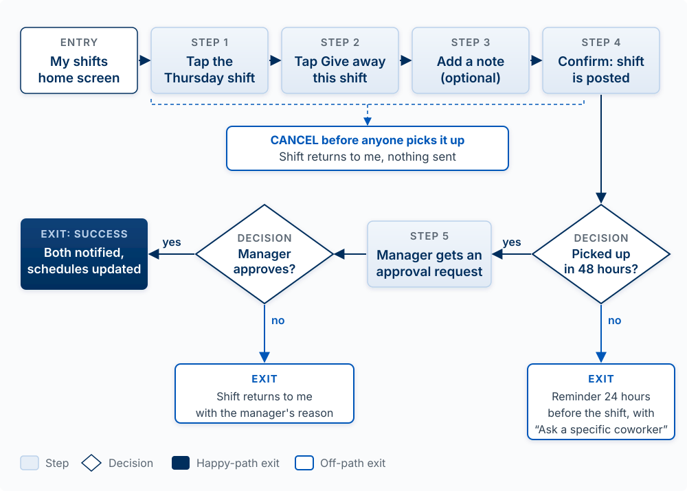
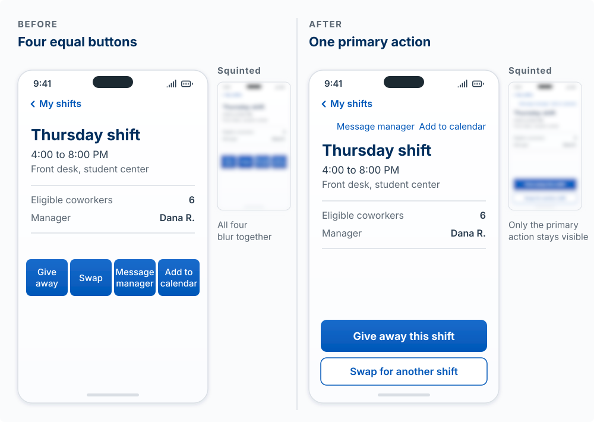
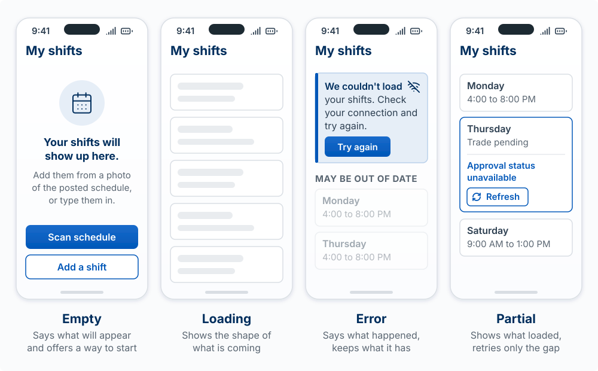
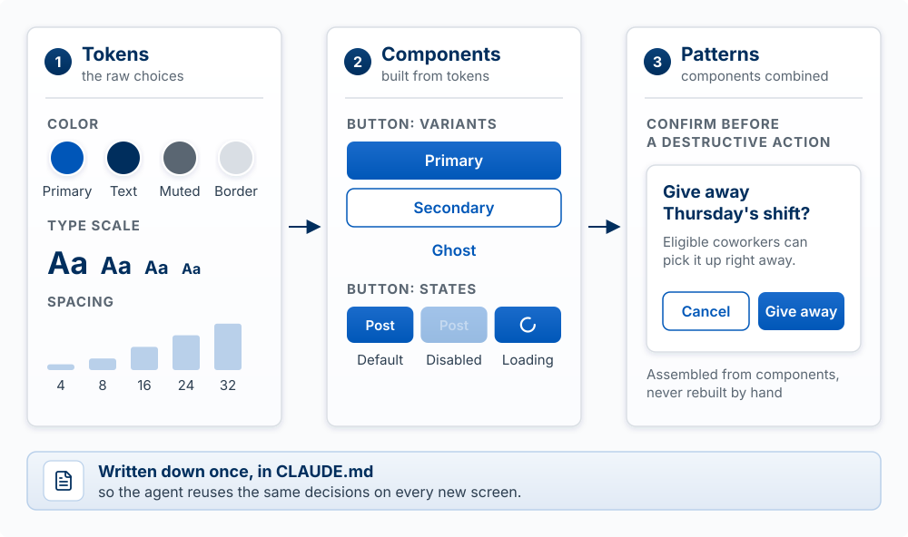
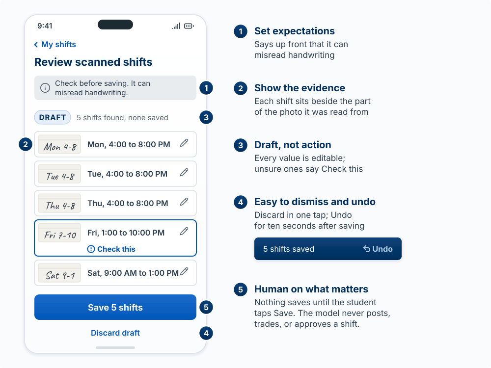

## Why This Matters

Your product is only as good as the interface people use. An agent will happily generate a
working application that nobody can figure out how to use, and it will not tell you that it
has. Judgment about the surface is yours.

The model for this whole chapter fits in two sentences. **Design is deciding where the user's
attention goes. Every screen should make the next step obvious, and most of what users experience
happens off the happy path.**

It helps to be precise about what "the surface" means. Dan Olsen's UX iceberg splits it into four
layers [@olsen2015lean]. Visual design is the only one above the waterline, and it is the one an
agent is best at. The three underneath, interaction design, information architecture, and
conceptual design, are where usable and unusable products actually diverge, and they are decided
before a single style is chosen.

{fig-alt="An iceberg divided into four horizontal layers. Only the top layer, visual design, sits above the waterline. Below the surface, from top to bottom: interaction design, information architecture, and conceptual design as the largest layer at the base."}

A polished screen sitting on a confused conceptual model is the most common way an AI-built
application fails. This chapter works from the bottom of the iceberg up:

| Section | The idea you should leave with |
|---|---|
| Flows before screens | Map the steps of the user's task first |
| Attention and hierarchy | One primary action per screen; size, spacing, and contrast rank everything else |
| Off the happy path | Empty, loading, error, and partial states are designed on purpose |
| Words are interface | Labels, buttons, and errors tell people what to do; specific beats clever |
| Decide once | A design system makes each decision one time; familiar patterns beat novel ones |
| Accessible by default | Contrast, keyboard, and screen readers are the baseline |
| Designing for an uncertain AI | When output can be wrong, show sources, allow edits and undo, keep a human on what matters |
| Directing an agent on design | Say exactly what to change, why, and with a reference |

The ninth design idea, **watch, do not ask**, is the subject of [Testing the
Design](06-testing-the-design.qmd). The chapter closes with a short section on web versus mobile
and a reference section on how the surface is built in code.

::: {.callout-note title="The example in this chapter: ShiftSwap"}
ShiftSwap is an app for student employees at a campus job. A student who cannot work a shift
posts it, a coworker picks it up, and the manager approves the trade. One AI feature: you
photograph the paper schedule on the break-room wall and the app reads your shifts from it. The
example is invented for teaching.
:::

<!-- learn -->

## Flows Before Screens

**The model:** a flow is the sequence of steps a user takes to finish one task. Map the flow
first, then design the screens it needs. A beautiful screen in the wrong flow is still wrong.

This is the interaction design and information architecture layer of the iceberg made concrete.
Agents are eager to produce screens, so if you ask for "a dashboard," you will get one, with
whatever steps the agent guessed. The flow is where you decide what the product actually asks of
a person.

#### The building blocks

| Block | What it is | Question it answers |
|---|---|---|
| **Goal** | The one job the user came to do | What does "done" look like for them? |
| **Entry point** | Where the flow starts: a link, a notification, the home screen | How do they arrive, and what do they already know? |
| **Steps** | Each screen or action in order | What is the one thing they do here? |
| **Decisions** | Points where the path branches | What choice do they make, and what does each choice lead to? |
| **Exits** | Every way the flow ends: success, cancel, error, giving up | Where do they land, and can they get back? |

These combine in a simple way: a flow is a goal, reached from an entry point, through steps,
split by decisions, and ending in exits. Count the steps and decisions; each one is a chance for
someone to stop. Good flows remove steps the user does not care about and make every exit land
somewhere useful.

#### Worked example: posting a shift on ShiftSwap

```
GOAL: Get my Thursday 4-8 shift covered, approved by my manager.

ENTRY  Home screen ("My shifts")
 1.  Tap the Thursday shift
 2.  Tap "Give away this shift"
 3.  Optional note to coworkers ("Midterm that night")
 4.  Confirm  -> shift is posted, visible to eligible coworkers
       DECISION: someone picks it up within 48 hours?
         yes -> 5. Manager gets an approval request
                  DECISION: approve?
                    yes -> EXIT (success): both students notified, schedules updated
                    no  -> EXIT: shift returns to me, with the manager's reason
         no  -> EXIT: reminder to me 24 hours before the shift, with "Ask a specific coworker"
 CANCEL at any step before pickup -> shift returns to me, nothing sent
```

{#fig-shiftswap-flow fig-alt="Flow diagram of posting a shift on ShiftSwap. Entry at the My shifts home screen, then step 1 tap the Thursday shift, step 2 tap Give away this shift, step 3 add an optional note, step 4 confirm so the shift is posted. A dashed bracket under steps 1 to 4 leads to an exit: cancel before anyone picks it up, the shift returns and nothing is sent. From step 4 a decision asks whether someone picks it up within 48 hours. If yes, step 5 sends the manager an approval request, then a decision asks whether the manager approves; yes leads to the success exit, both notified and schedules updated. If the manager says no, the shift returns with the manager's reason. If nobody picks it up, the student gets a reminder 24 hours before the shift with an Ask a specific coworker option. The happy path is drawn in navy; the three off-path exits are outlined in blue." width="100%"}

Mapping it this way surfaces questions a screen mockup hides. Who counts as an "eligible"
coworker? What does the original student see while waiting for approval? What happens if two
people tap "Pick up" at the same moment? Each of those is a design decision, and each one an
agent would otherwise make for you silently.

::: {.callout-tip title="Try it"}
Write the flow for the single most important task in your own product in the format above:
goal, entry, numbered steps, decisions, and every exit. Then count. If the core task has more than
six steps or any exit that leaves the user stranded, mark the step you would remove or fix first.
Do this before you ask Claude Code for any new screen in Sprint 3, and paste the flow into the
prompt.
:::

<!-- learn -->

## Attention and Hierarchy

**The model:** each screen gets one primary action. Size, weight, spacing, and contrast tell
people what matters before they read a word, so use them to rank everything on the screen.

People do not read a screen top to bottom. They scan it, and their eyes go to whatever stands out.
If everything stands out equally, nothing does, and the user has to read every label to find the
next step. Adam Wathan and Steve Schoger's [Refactoring UI](https://www.refactoringui.com/), the
start-here resource for this axis, is built around that point: hierarchy is the main thing that
makes an interface look designed, and you create it as much by **de-emphasizing** the secondary
items as by emphasizing the primary one.

#### The building blocks

| Property | Draws attention when | Common mistake |
|---|---|---|
| **Size** | Larger than its neighbors | Making every heading big |
| **Weight** | Bolder text or a filled button | Bold everywhere, so bold means nothing |
| **Contrast and color** | Darker, more saturated, or the one colored element | Five colors competing; color as the only signal |
| **Spacing** | Surrounded by more white space | Cramming, so groups blur together |
| **Position** | Top, left, or where the eye lands after the last action | Burying the primary action below the fold |

Three principles from Jon Yablonski's [Laws of UX](https://lawsofux.com/) explain why the ranking
matters:

- **Hick's Law**: the more options shown at once, the longer the decision takes. One primary
  action shortens it.
- **Fitts's Law**: the time to hit a target depends on its size and distance. The primary action
  should be big and close to where the user's attention (or thumb) already is.
- **Von Restorff effect**: the item that differs from its neighbors is the one noticed and
  remembered. Make the primary action the one that differs.

#### Worked example: the ShiftSwap shift detail screen

The first version an agent produced showed four buttons in a row, all the same blue: **Give away**,
**Swap**, **Message manager**, **Add to calendar**. Every user test began the same way: a pause
while the person read all four.

The revision used these properties. "Give away this shift" became the one full-width filled button at the
bottom, within thumb reach. "Swap for another shift" became an outlined button beneath it. "Message
manager" and "Add to calendar" moved into a small text-link row at the top. Nothing was removed; the
ranking changed, and the pause went away.

{#fig-hierarchy-before-after fig-alt="Two phone mockups of the ShiftSwap shift detail screen, each with a blurred copy labeled Squinted. Before: the shift details sit above a row of four same-size, same-blue buttons labeled Give away, Swap, Message manager, and Add to calendar; blurred, the four buttons merge into one blue band. After: Message manager and Add to calendar are small text links near the top, Give away this shift is a full-width filled button at the bottom, and Swap for another shift is an outlined button below it; blurred, only the Give away button stands out." width="100%"}

A quick check from the course's deck rubric works on screens too: the **squint test**. Squint (or
blur a screenshot) until you cannot read the words. Whatever is still visible is what users will see
first. If that is not the primary action, the hierarchy is wrong.

::: {.callout-tip title="Try it"}
Take a screenshot of your main screen. Before squinting, write down the one action you want a new
user to take. Now squint. **Predict** what a first-time user clicks first, and explain which property
(size, weight, contrast, spacing, position) draws them there. If the prediction and your
intended action differ, list the two changes that would fix it. Refactoring UI's advice to try the
screen in grayscale first is a good second check: if the hierarchy only works because of color, it
is fragile.
:::

<!-- learn -->

## Off the Happy Path

**The model:** a screen is a picture of the app's current state, and the app has more states than
the one you demoed. Empty, loading, error, and partial states are where users get stuck. Design
them on purpose.

The **happy path** is the flow when everything goes right: the data exists, the network is fast,
the input is valid. An agent builds the happy path first because that is what the prompt
described. Users spend a surprising amount of time elsewhere: the first visit before they have any
data, the three seconds while something loads, the moment the save fails. Jakob Nielsen's first
usability heuristic, **visibility of system status**, says the interface should always tell people
what is going on. These states are where it most often fails.

#### The building blocks

Think of each screen as a function of its state. In plain pseudocode:

```
screen(state):
  if loading         -> show what is coming (skeleton or progress), keep the layout steady
  if error           -> say what happened, keep the user's input, offer the fix
  if no data yet     -> explain what goes here and offer the first action
  if some data failed -> show what loaded, mark what did not, offer retry for that part
  otherwise          -> the happy path
```

| State | When it happens | What a good one does |
|---|---|---|
| **Empty** | First use, no search results, everything cleared | Explains what will appear here and gives one action to start |
| **Loading** | Waiting on the network, a database, or a model | Under a second: nothing needed. Several seconds: show progress. Long waits: say what is happening and let people keep working |
| **Error** | Validation fails, network drops, server breaks | Says what happened in plain words, keeps what the user typed, offers a next step |
| **Partial** | Some data loaded and some did not; a profile half filled in | Shows what exists, marks what is missing, lets the user fix just that part |

The loading row follows Nielsen's long-standing response-time limits: about 0.1 second feels
instant, about 1 second keeps the user's train of thought, and past about 10 seconds people need
progress feedback or they leave the task.

#### Worked example: "My shifts" in four states

- **Empty** (new employee, schedule not loaded yet): "Your shifts will show up here. Add them from
  a photo of the posted schedule, or type them in." Two buttons: **Scan schedule**, **Add a
  shift**.
- **Loading**: gray placeholder rows the shape of shift cards, so the screen does not jump when
  the real data arrives.
- **Error** (could not reach the server): "We couldn't load your shifts. Check your connection and
  try again." A **Try again** button. Shifts already on the phone stay visible, marked as possibly
  out of date.
- **Partial** (shifts loaded, but the manager's approval status did not): the shifts show, and the
  pending trade shows "Approval status unavailable" with its own **Refresh**.

{#fig-four-states fig-alt="Four phone mockups of ShiftSwap's My shifts screen. Empty: a calendar icon, the heading Your shifts will show up here, a line saying to add them from a photo of the posted schedule or type them in, and two buttons, Scan schedule and Add a shift. Loading: gray placeholder cards shaped like shift cards. Error: a message, We couldn't load your shifts. Check your connection and try again, with a Try again button, and two faded shift cards under the label May be out of date. Partial: normal shift cards plus one pending trade outlined in blue, reading Approval status unavailable, with its own Refresh button." width="100%"}

Each state answers the same two questions: what is true right now, and what can I do next?

::: {.callout-tip title="Try it"}
List the four states for the main screen of your product and write one sentence of what the user
sees in each. Then ask Claude Code to render each state with fake data so you can look at all
four. **Find the mistake:** most agent-built apps show a blank white area for the empty state and
the raw text of an exception for the error state. Find the worst of the four in your app and fix
it this sprint.
:::

<!-- learn -->

## Words Are Interface

**The model:** labels, buttons, and messages are the instructions for using your product. They
tell people what will happen and what to do next. Specific beats clever.

Steve Krug's *Don't Make Me Think* [@krug2014think] puts the cost plainly: every word a user has to
puzzle over slows them down. His third law of usability is to get rid of half the words
on each page, then half of what is left. Nielsen's heuristic of **match between the system and the
real world** adds a second rule: use the user's words for things, never the database's.

#### The building blocks

| Text | Its job | Rule of thumb |
|---|---|---|
| **Button and link labels** | Say what happens when you press it | Verb plus object: "Post shift," "Save draft" |
| **Headings and labels** | Name the thing in the user's terms | "Shifts I'm covering," never "Accepted transfers" |
| **Error messages** | Explain what went wrong and how to fix it | Plain words, specific cause, a way forward, no blame |
| **Empty states and hints** | Teach the next step at the moment it is needed | One sentence, one action |
| **Confirmations** | Prove that the action happened | Say what changed and what happens next |

NN/g's error-message guidelines (Neusesser and Sunwall, 2023) make the error row concrete: put the
message next to the problem, say specifically what is wrong instead of "An error occurred," offer a
remedy, keep the user's input so they do not start over, and do not blame the user.

#### Worked example: three rewrites

| Before | After | Why it is better |
|---|---|---|
| Button: **Submit** | **Post shift to coworkers** | Says what happens and who sees it |
| "Something went wrong." | "Your manager's approval didn't go through because the shift starts in less than 2 hours. Call the front desk to cover it." | Says what happened, why, and what to do |
| Empty list with no text | "No open shifts right now. We'll notify you when a coworker posts one." | Explains the emptiness and sets an expectation |

The same discipline shows up in slide writing, where an action title ("Late-night shifts are the
hardest to cover") beats a topic title ("Shift data"). The analogy holds for specificity. It breaks
on length: a button label has two to four words to work with, so it names the action and nothing
else.

::: {.callout-tip title="Try it"}
Open your app and copy out every button label, every heading, and the text of one error message.
**Find the mistakes:** circle each label that does not say what happens ("Submit," "OK,"
"Continue") and each word that comes from your code instead of your user ("record," "entity,"
"null"). Rewrite the three worst. Then trigger an error on purpose and check whether the message
says what happened and what to do.
:::

<!-- learn -->

## Decide Once: Design Systems and Familiar Patterns

**The model:** a design system makes each design decision one time, so a button looks and behaves
the same everywhere. Familiar patterns beat novel ones, because users bring their expectations
from every other app they use.

**Jakob's Law** (from Laws of UX) states the second half: users spend most of their time in other
products, so they expect yours to work the same way. A trash-can icon deletes, a gear opens
settings, swiping left on a list row reveals actions on a phone. Every place you invent a new
convention, the user has to spend time learning it. The [Apple Human Interface
Guidelines](https://developer.apple.com/design/human-interface-guidelines/) are the canonical
reference for what those conventions are on Apple platforms.

#### The building blocks

| Layer | What it holds | ShiftSwap example |
|---|---|---|
| **Tokens** | The raw choices: color palette, type scale, spacing scale, corner radius | Primary color, 4 text sizes, spacing in steps of 4px |
| **Components** | Reusable pieces built from tokens, each with defined variants and states | Button (primary, secondary, ghost; default, hover, disabled, loading) |
| **Patterns** | Components combined to solve a recurring problem | "Confirm before a destructive action," "form with inline errors" |

{#fig-design-system fig-alt="Three cards connected by arrows. Tokens, the raw choices: four color swatches labeled Primary, Text, Muted, and Border; a type scale of four sizes; and a spacing scale of 4, 8, 16, 24, and 32. Components, built from tokens: a button in Primary, Secondary, and Ghost variants, and in Default, Disabled, and Loading states. Patterns, components combined: a confirm dialog titled Give away Thursday's shift, with Cancel and Give away buttons, assembled from components rather than rebuilt by hand. A band underneath reads: Written down once, in CLAUDE.md, so the agent reuses the same decisions on every new screen." width="100%"}

Refactoring UI's advice to **limit your choices** is the same idea at small scale: pick a short
spacing scale and type scale up front and use only those, so you never decide "14px or 15px?" again.

#### Why this matters more with an agent

An agent has no memory between sessions. Left alone, it will style each new screen from scratch,
and after ten sessions you have five button styles. Two things fix that:

1. **Use a component system the agent already knows.** [shadcn/ui](https://ui.shadcn.com/docs) is
   the one this course recommends. It copies each component's source into your project, styled with
   Tailwind and built on accessible primitives, so you and the agent can read and change it. Agents
   have seen a great deal of code written against it.
2. **Write the decisions down where the agent will read them.** A short design section in your
   `CLAUDE.md` (see [Directing the Agent](02-directing-the-agent.qmd)) turns one-time decisions
   into standing instructions:

```markdown
## Design rules
- Components come from shadcn/ui in components/ui. Do not hand-roll buttons, inputs, or dialogs.
- One primary (filled) button per screen. Everything else is secondary or ghost.
- Spacing uses the Tailwind scale only (p-2, p-4, p-6, p-8). No arbitrary pixel values.
- Every list screen has an empty state with one sentence and one action.
- Destructive actions use the confirm dialog pattern.
```

An analogy: a design system is the house style guide a newspaper gives every reporter, so a
hundred writers produce one paper. Where it breaks: a style guide is advice a reporter can ignore,
while a component library makes the right choice the easiest one to type.

::: {.callout-tip title="Try it"}
Open three screens of your app side by side. **Find the inconsistencies:** count how many
different button styles, text sizes, and gray colors you see. Then write five design rules for your
`CLAUDE.md` like the ones above, and ask Claude Code to bring one screen into line with them.
:::

<!-- learn -->

## Accessible by Default

**The model:** sufficient contrast, full keyboard use, and screen-reader support are the
baseline, the same as the app not crashing. Building them in from the start makes the product
better for everyone.

Most accessibility comes free if you use the right building blocks from the start, and costs a
lot to retrofit. A button made from a real `<button>` element is reachable by
keyboard and announced as a button by a screen reader. A button faked from a clickable `<div>` is
neither, and an agent will sometimes produce the fake.

#### The building blocks

The Web Content Accessibility Guidelines (WCAG) organize the requirements under four principles.
The few that matter most for a student product:

| Principle | Baseline check | Why it helps everyone |
|---|---|---|
| **Perceivable** | Text contrast at least 4.5:1 against its background (3:1 for large text and for icons and input borders); never use color alone to carry meaning | Readable in sunlight, on cheap screens, by tired eyes |
| **Operable** | Every action works with the keyboard alone; focus is always visible; touch targets are large enough (Apple recommends at least 44 by 44 points) | Faster for power users; fewer mis-taps on phones |
| **Understandable** | Every input has a visible label; errors say what to fix (see Words Are Interface) | Fewer failed forms for every user |
| **Robust** | Real HTML elements for real things (buttons, links, headings, form labels) so assistive technology can read them | The same structure helps search engines and agents read your page |

An accurate analogy is the **curb cut**: the ramp cut into a sidewalk for wheelchair users is also
used by people with strollers, suitcases, and bikes. Where it breaks: some accessibility needs pull
in different directions (a user with low vision may want larger text that a dense dashboard cannot
fit), so the baseline is a floor, and some users still need settings of their own.

::: {.callout-tip title="Try it: the one-minute check"}
1. Put your mouse away. Starting from the home screen, complete your core flow with only **Tab**,
   **Shift+Tab**, **Enter**, and **Space**. Note every place you get stuck or lose track of where
   focus is.
2. Run your primary button and your body text through a contrast checker (WebAIM's is free).
3. Zoom the browser to 200 percent and check whether anything overlaps or disappears.

Paste what you found into Claude Code with the instruction "fix these accessibility issues using
semantic HTML and our existing components." The full checklist is in the
[Engineering Checklist](95-eng-checklist.qmd).
:::

<!-- learn -->

## Designing for an Uncertain AI

**The model:** when your product's output can be wrong, design for that. Set expectations, show
where an answer came from, let people edit and undo, and keep a human on the decisions that
matter.

Ordinary software does the same thing every time; a model may not. [Models in Your
Product](11-models-in-your-product.qmd) explains why a model can be confidently wrong and what that
means for the engineering. This section is about what the user sees. Saleema Amershi and colleagues
at Microsoft proposed eighteen guidelines for human-AI interaction and tested them against twenty
AI products [@amershi2019guidelines]; the building blocks below follow several of them.

#### The building blocks

| Block | What it means on screen | Guideline it follows |
|---|---|---|
| **Set expectations** | Say what the feature does and how often it gets things wrong, in plain words, before people rely on it | Make clear what the system can do, and how well |
| **Show the evidence** | Show the source behind the answer: the quoted passage, the region of the image it read | Make clear why the system did what it did |
| **Draft, not action** | AI output arrives as an editable draft the user approves; it does not act on its own | Support efficient correction |
| **Easy to dismiss and undo** | One tap to reject a suggestion or undo what it did | Support efficient dismissal |
| **Human on what matters** | The higher the cost of a mistake, the more explicit the human confirmation | Chapter 11: if a wrong answer is expensive, put a human in the path |

Streaming the answer as it is generated, covered in Chapter 11, is the loading state for AI: it
shows progress during a wait that can run many seconds.

#### Worked example: reading the schedule photo

ShiftSwap's schedule scan uses a vision model to read a photo of the paper schedule. It will
sometimes misread a handwritten 7 as a 1. The design:

1. Before the scan: "Works best with a flat, well-lit photo. Check the shifts before saving; it can
   misread handwriting."
2. After the scan: the shifts appear as a **draft list**, each one next to a cropped image of the
   part of the photo it came from, so the student can compare at a glance.
3. Each shift is editable in place. Shifts the model was unsure of are marked "Check this."
4. Nothing is added to the schedule until the student taps **Save 5 shifts**. After saving, an
   **Undo** appears for ten seconds.
5. The model never posts, trades, or approves a shift. Those stay human actions.

{#fig-uncertain-ai fig-alt="A phone mockup titled Review scanned shifts with five numbered callouts. 1, set expectations: a note reads Check before saving. It can misread handwriting. 2, show the evidence: each of five shift rows shows a crop of the handwritten paper schedule beside the value read from it. 3, draft, not action: a Draft label reads 5 shifts found, none saved, each row has an edit pencil, and the Friday row, whose crop says Fri 7-10 but whose value reads 1:00 to 10:00 PM, is outlined and marked Check this. 4, easy to dismiss and undo: a Discard draft link, and after saving a 5 shifts saved message with an Undo button for ten seconds. 5, human on what matters: nothing saves until the student taps Save 5 shifts, and the model never posts, trades, or approves a shift." width="100%"}

::: {.callout-tip title="Try it"}
Pick the AI feature in your product (or one you plan). **Predict** the most likely wrong output
and what happens to the user if they do not catch it. Then check your current screen against the
five blocks above. Which one is missing? Sketch, in words, the one change that would let a user
catch the mistake before it costs them anything.
:::

<!-- learn -->

## Directing an Agent on Design

**The model:** say exactly what to change and why, with a reference. Taste is knowing what is
wrong and being able to say it precisely.

"Make it look better" or "improve the UX" gives the agent no specific problem to fix, so it changes things
at random: new colors, a gradient, more shadows. The agent is good at the visual layer and will do
exactly what you describe. What you describe determines the result.

#### The building blocks of a design instruction

| Block | What it supplies | Example |
|---|---|---|
| **Where** | The screen and element | "On the shift detail screen, the button row at the bottom" |
| **What is wrong** | The observed problem | "Four equal buttons, so users read all of them before acting" |
| **Why** (the principle) | The reason a designer would accept | "One primary action per screen" |
| **What to change** | The specific fix | "Make Give away the only filled button, full width; Swap outlined; move the other two to text links at the top" |
| **Reference** | Something concrete to match | A screenshot, a named shadcn/ui component, or "like the checkout button in the Uber Eats app" |

Claude Code accepts images, so a screenshot of your current screen, or of an app that does it well,
is often the best reference you can give.

| Vague | Precise |
|---|---|
| "Improve the UX of the shifts page." | "The shifts page has no empty state; a new user sees a blank white area. Add an empty state: one sentence, 'Your shifts will show up here,' and two buttons, Scan schedule (primary) and Add a shift (secondary), using our Button component." |
| "Make the errors better." | "When the save fails, we show the raw error text. Show 'Couldn't save your shift. Check your connection and try again,' next to the Save button, keep the form values, and add a Try again button." |

#### Taste is a skill

As building becomes cheap, several design leaders argue that taste becomes the scarce part.
Figma's CEO and Tony Fadell, who led the iPod and founded Nest, make that case in the podcasts on
the [Builder Resources](97-builder-resources.qmd) page. Jenny Wen, who leads design for Claude at
Anthropic, argues that the classic discover, mock, iterate design process is obsolete, and asks
what taste means when prototyping is nearly free. Julie Zhuo, former VP of product design at
Facebook, writes in [The Looking Glass](https://lg.substack.com/) about critique as a practiced
skill. The practical version for you: you build taste by naming specific problems, over and over,
against principles you can state.

::: {.callout-tip title="Try it: the three-sentence critique"}
Ask Claude Code to build a new screen for your product with no design guidance at all. Before you
prompt again, write three sentences of critique, each with the form: **"[Element] is [problem],
which breaks [principle from this chapter]."** For example: "The four buttons are the same weight,
which breaks one primary action per screen." Then turn the three sentences into one precise prompt
using the table above, and compare the result to what "make it better" produces.
:::

<!-- learn -->

## Web, Mobile, or Both

<!-- MOVE: the platform decision belongs in ch07 (Anatomy of an Application) or ch12 (Going to Market) because it is an architecture and distribution choice, not a design one. Kept here in short form because students may have studied it for the Oct 20 midterm. -->

**The model:** most student products should start as a responsive web app. Go to the app stores
only when the product needs something the web cannot do well, such as reliable device hardware,
frequent brief use, or store discovery in a category people actively search.

Ask these questions before choosing:

| Question | If Yes | If No |
|----------|--------|-------|
| Do users need this when away from computers? | Consider mobile | Web is fine |
| Does it need device hardware (camera, GPS, sensors)? | Consider mobile | Web is fine |
| Is your core user flow < 30 seconds? | Mobile-friendly matters | Desktop-first okay |
| Do competitors have apps? | Understand why | May not need one |
| Will users install another app? | Maybe mobile | Probably web |

The tradeoff in one line each:

- **Distribution.** The web gives instant access by URL, search traffic, and instant updates. App
  stores give home-screen presence, more reliable push notifications, and better retention for the
  people who install. Store discovery is hard outside categories people search for, so you usually
  need the web to bring people in anyway.
- **Cost.** Every native platform is another codebase to build and maintain, and every feature
  and bug exists once per platform.
- **Behavior.** Mobile fits frequent, brief use, location, the camera, offline use, and push
  notifications. The web fits focused work, heavy typing, desk use, file handling, and SEO.

There is also a spectrum between "web only" and "native":

```
Web → Responsive Web → PWA → Capacitor/Ionic → React Native → Native
<---------------- Easier ----------------->
<---------------- More "native" ---------->
```

- A **progressive web app (PWA)** is a web app that can be installed to the home screen. It needs
  HTTPS, a **web app manifest** (name, icons, colors), and, for offline use, a **service worker**
  (a script that sits between the app and the network and can serve cached files). On iPhone, web
  push notifications work only after the user adds the app to the Home Screen (iOS 16.4 and
  later).
- **Capacitor** wraps your existing web app in a native shell so it can ship to the App Store and
  Google Play and call native APIs like the camera, from one codebase. It does not automatically
  look like a native app.
- **React Native** and fully **native** (Swift, Kotlin) give the most native feel and performance,
  at the most cost. If you are asking "should I go native?", the answer is probably no.

<!-- REVIEW: the old chapter's setup code used next-pwa, which is unmaintained and does not fit the App Router; it was cut. Current Next.js supports app/manifest.ts natively (nextjs.org/docs/app/guides/progressive-web-apps, checked 2026-10-10) and points to Serwist for service-worker offline caching. The old Capacitor config said webDir could be '.next'; that does not work. Capacitor needs a static export (output: 'export' in next.config), which builds to 'out', and a static export cannot use Server Actions. -->

::: {.callout-note collapse="true" title="Platform reference: the full comparison tables"}

| Factor | Web Only | Web + Mobile |
|--------|----------|--------------|
| **Initial build time** | 1x | 2-3x |
| **Ongoing maintenance** | 1 codebase | 2-3 codebases |
| **Feature parity** | N/A | Constant challenge |
| **Team size needed** | Smaller | Larger |
| **Bug surface area** | Smaller | Much larger |

<!-- REVIEW: the 1x vs 2-3x build-time figures have no source; they read as a rule of thumb. Keep, source, or soften. -->

| Approach | Effort | Native Feel | Store Distribution |
|----------|--------|-------------|-------------------|
| **Responsive Web** | Low | Low | No |
| **PWA** | Medium | Medium | Limited |
| **Capacitor** | Medium | Medium-High | Yes |
| **React Native** | High | High | Yes |
| **Native (Swift/Kotlin)** | Highest | Highest | Yes |

| Your Situation | Recommendation |
|----------------|----------------|
| Pre-product-market fit | Stay web only |
| B2B / productivity | Responsive web + PWA |
| Consumer, frequent use | PWA → Capacitor |
| Hardware-dependent | Capacitor or native |
| Gaming / media-heavy | Native or React Native |

**A common path:** build responsive web while you validate; add PWA install and better mobile
behavior as usage grows; wrap with Capacitor for the app stores only if users need it, or stay on
the web if it is working.

**When to consider fully native:** performance is critical (games, video, AR), complex gestures and
animation are core, deep OS integration is required, or competitors have set native expectations,
and you have the team to support it. **React Native** fits when you need native performance and
your team already knows JavaScript and React.
:::

<!-- learn -->

## Making Your App Mobile-Responsive

**The model:** design for the small screen first, then let the layout expand at set widths
(breakpoints). A phone layout forces the hierarchy decision, because there is room for only one
primary action.

**Mobile-first** means the default layout is the phone layout, and wider screens add columns and
space. In Tailwind, the prefixes `sm:` (640px), `md:` (768px), `lg:` (1024px), and `xl:` (1280px)
mean "from this width up." Reading one line is enough to see the model:

```jsx
<div className="flex flex-col md:flex-row">  {/* stacked on phones, side by side from 768px */}
```

#### Mobile UX essentials

- **Touch targets**: at least 44 by 44 points for anything tappable (Apple's guideline).
- **Form inputs**: use a font size of at least 16px in inputs. Smaller, and iOS Safari zooms the
  page when the field gets focus. (This applies to inputs, not all text.)
- **Input types**: use the right type (`type="email"`, `type="tel"`) so phones show the right
  keyboard.
- **Viewport**: the page needs `<meta name="viewport" content="width=device-width,
  initial-scale=1">` or phones render it as a shrunken desktop page. Next.js adds this for you.
- **Thumb reach**: put the primary action near the bottom of the screen, where a thumb can reach
  it (Fitts's Law again).

::: {.callout-tip title="Try it"}
Open your app in the browser's device toolbar at 375px wide (an iPhone-sized screen). **Find the
mistakes:** anything cut off, any tap target smaller than a fingertip, any input that zooms the page
when tapped. Fix the worst one with a precise prompt.
:::

<!-- learn -->

## How the Surface Is Built (Reference)

<!-- MOVE: belongs in ch07 (Anatomy of an Application) because how the frontend is built is architecture. Kept here as a short reference because ch05 previously taught it and it is on the midterm. -->

You will not write much of this by hand, but you should know the parts so you can read what the
agent wrote and catch it when something is off.

| Building block | What it does | Analogy (and where it breaks) |
|---|---|---|
| **HTML** | Structure: headings, paragraphs, links, buttons, inputs, containers (`<h1>`, `<p>`, `<a>`, `<button>`, `<input>`, `<div>`) | The frame of a house. Breaks: HTML also carries meaning, a `<button>` is announced as a button, so the right element matters for accessibility |
| **CSS** | Styling: color, size, spacing, layout, and responsive rules (`@media` queries) | Paint and furniture placement |
| **Tailwind CSS** | CSS as short utility classes in the markup (`bg-green-500 px-4 py-2 rounded`) | |
| **JavaScript** | Behavior: responds to clicks and typing, talks to the server | The wiring |
| **React** | Builds the UI from reusable **components**, functions that return UI. Components take **props** (inputs) and hold **state** (data that changes) | |
| **Next.js** | The React framework this course uses: routing, server rendering, deployment | |

The one piece worth reading in code is how state drives the screen. When state changes, React
redraws the component, which is exactly why "loading," "error," and "empty" are states you design:

```jsx
function Counter() {
  const [count, setCount] = useState(0);   // state, starts at 0
  return (
    <div>
      <p>Count: {count}</p>                 {/* the screen shows the current state */}
      <button onClick={() => setCount(count + 1)}>Increment</button>
    </div>
  );
}
```

A form works the same way: each input's value lives in state, and the form's submit handler reads
that state and sends it to be saved. Why React is the default: reusable components, a declarative
style (you describe what the screen should look like for a given state, and React updates it), and
the largest ecosystem, including shadcn/ui.

<!-- learn -->

## Key Concepts

- **UX iceberg**: visual design on top; interaction design, information architecture, and
  conceptual design underneath, where usability is decided
- **Flow**: goal, entry point, steps, decisions, exits; map it before designing screens
- **Happy path**: the flow when everything goes right
- **Visual hierarchy**: size, weight, contrast, spacing, and position rank what matters; one
  primary action per screen
- **Squint test**: blur the screen; what still stands out is what users see first
- **Hick's Law, Fitts's Law, Von Restorff effect**: fewer choices decide faster; big, close targets
  are faster to hit; the different item gets noticed
- **Empty, loading, error, partial states**: the states off the happy path, each designed to say
  what is true and what to do next
- **Visibility of system status**: the interface always tells people what is going on
- **Interface copy**: verb-plus-object buttons; errors that say what happened and how to fix it;
  the user's words, not the database's
- **Design system**: tokens, components, and patterns that make each decision once; record the
  rules in `CLAUDE.md`
- **shadcn/ui**: component source copied into your project, built on Tailwind and accessible
  primitives
- **Jakob's Law**: users expect your product to work like the ones they already use
- **Accessibility baseline (WCAG)**: 4.5:1 text contrast, full keyboard use, visible focus, labeled
  inputs, semantic HTML
- **Designing for uncertain AI**: set expectations, show evidence, output as editable draft, easy
  dismiss and undo, human on consequential decisions
- **Precise design direction**: where, what is wrong, why, what to change, and a reference
- **Platform spectrum**: Web → Responsive Web → PWA → Capacitor → React Native → Native
- **Distribution tradeoffs**: web (URL, SEO, instant updates) vs. app store (discovery, install,
  home screen)
- **PWA, web app manifest, service worker**: installable web app; its install metadata; the script
  that enables offline use and caching
- **Capacitor**: wraps a web app for app store distribution and native APIs
- **Responsive design and mobile-first**: one layout that adapts at breakpoints, starting from the
  phone
- **Components, props, and state**: how React builds the screen, and why each state is a screen
  to design

<!-- learn -->
