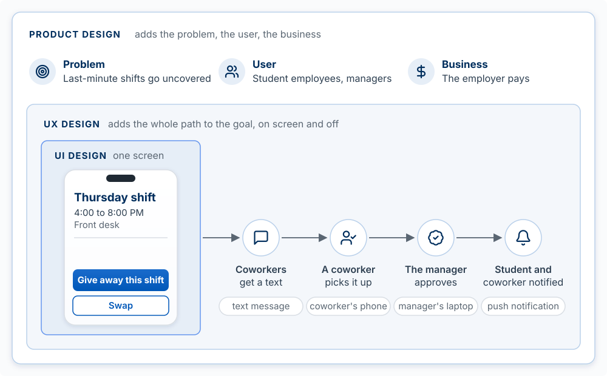

## Why This Matters

[Interface and Flow](05-interface-and-flow.qmd) gave you working rules: map the flow, rank what
is on the screen, design the states off the happy path, write labels that say what happens.
[Testing the Design](06-testing-the-design.qmd) showed you how to watch people use the result.
This chapter supplies the theory underneath those rules: the models a trained designer uses to
explain *why* a screen works or fails, so you can diagnose a screen you have never seen before
instead of applying a checklist.

**The model for this chapter: a design works when the person's picture of the product matches
how the product behaves, and every screen is built from a small number of principles about how
people perceive, decide, and act.** Each section names one set of those principles, shows it on
ShiftSwap, and ends with what to tell the agent.

What does a design degree actually teach? Carnegie Mellon's Master of Human-Computer Interaction
is a fair example. Its required core is user-centered research and evaluation, interaction design
fundamentals, advanced interaction design, a course in programming interactive software, and a
seven-month industry project, plus electives
([CMU HCII](https://hcii.cmu.edu/academics/mhci/curriculum)). This book already covers the research
([chapter 4](04-finding-and-validating-the-problem.qmd)), the evaluation ([chapter 6](06-testing-the-design.qmd)),
the building, and the practical rules of interaction design ([chapter 5](05-interface-and-flow.qmd)).
What it has not yet covered is the shared vocabulary of the field, which this chapter adds:

| Section | The idea you should leave with |
|---|---|
| UI, UX, and product design | Three nested scopes: the screen, the whole path to a goal, and the choice of problem and business |
| The design process | Diverge, then converge, twice: once on the problem and once on the solution |
| Fidelity | Name the question, find the fidelity it needs, then make the cheapest artifact at that fidelity, which today is often code |
| Design tools | Paper for flows, Figma for exact specs and shared files, code for real behavior |
| Norman's principles of interaction | Signifiers, mapping, feedback, constraints, and a conceptual model close the gap between intent and result |
| Information architecture | Organize and name content the way users already think about it, and test that they can find things |
| How people perceive a screen | Gestalt grouping, Fitts's law, Hick's law, and cognitive load predict where people look and how fast they act |
| Visual design fundamentals | A type scale, a spacing scale, and a small palette with checked contrast, written down as tokens |
| Nielsen's ten heuristics | A checklist that reviews a whole screen against everything above |

The order runs from the widest question (what kind of design is this?) down to the pixels, then
back up to a review of the whole screen. Information architecture comes before perception and
visual design for the same reason [Interface and Flow](05-interface-and-flow.qmd) works from the
bottom of the UX iceberg up: structure is decided before style. The terms are defined in
[Words used in this chapter](#words-used-in-this-chapter) at the end.

::: {.callout-note title="The example in this chapter: ShiftSwap"}
The same example as [Interface and Flow](05-interface-and-flow.qmd). ShiftSwap is an app for
student employees at a campus job. A student who cannot work a shift posts it, a coworker picks it
up, and the manager approves the trade. One AI feature reads shifts from a photo of the paper
schedule. The example is invented for teaching.
:::

<!-- learn -->

## UI, UX, and Product Design

**The model: user interface (UI) design is the screen; user experience (UX) design is everything a
person goes through to reach a goal, across screens and outside them; product design covers both,
plus the choice of problem and how the product makes money.** Each scope contains the one before
it.

The three terms are used loosely in job postings, so it helps to fix them by what each one
decides:

| Scope | What it decides | ShiftSwap example | Who usually does it |
|---|---|---|---|
| **UI design** | What one screen looks like and how its controls behave: layout, type, color, buttons, inputs | The shift detail screen, with one filled **Give away this shift** button | UI designer or visual designer |
| **UX design** | The whole path to the user's goal: the flow across screens, the notifications and emails, the wait, the errors, what happens off the screen | From "I can't work Thursday" to "my manager approved the trade," including the text message the coworker receives | UX designer, interaction designer, UX researcher, content designer (who writes the interface words) |
| **Product design** | Which problem to solve, for whom, which features exist at all, and how the product fits the business | Solving uncovered last-minute shifts for student employees, with the employer as the customer who pays | Product designer, working closely with the product manager |

{#fig-design-scopes fig-alt="Three nested rounded rectangles. The innermost, UI design, one screen, holds a small phone showing the ShiftSwap shift detail page: Thursday shift, 4:00 to 8:00 PM, Front desk, a filled Give away this shift button, and an outlined Swap button. The middle rectangle, UX design, adds the whole path to the goal, on screen and off: arrows lead from the screen to four steps, coworkers get a text, a coworker picks it up, the manager approves, and the student and coworker are notified. Under each step, where it happens: a text message, the coworker's phone, the manager's laptop, a push notification. The outer rectangle, product design, adds the problem, the user, and the business: last-minute shifts go uncovered; student employees and managers; the employer pays." width="100%"}

A useful test of which scope a problem lives in: ask what would have to change to fix it. If a
button is hard to find, the fix is on one screen (UI). If students post a shift and then never learn
whether anyone took it, no single screen is wrong; the path is missing a step (UX). If managers
will not adopt the app because their payroll system already handles trades, no flow fixes that
(product). Dan Olsen's UX iceberg in [Interface and Flow](05-interface-and-flow.qmd) divides the
UI and UX scopes into four layers: visual design, interaction design, information architecture,
and conceptual design.

In this course you hold all three scopes at once, and so does the agent. That is the risk: an
agent asked for a screen will make UX and product decisions inside it without saying so. Tell it
which scope you are working in.

> "We are working on UX, not UI: the path from posting a shift to the manager's approval. Do not
> change any styling. List every message the student and the coworker receive, on screen and off,
> in order, and mark any step where one of them does not know what happens next."

<!-- learn -->

## The Design Process: Diverge, Then Converge, Twice

**The model: good design alternates between widening the options (diverging) and narrowing to one
(converging), and it does this twice: first on the problem, then on the solution.** The UK Design
Council drew this as the **Double Diamond**. Its team developed the model starting in 2003 and
began presenting it publicly in 2004 ([Design Council, history of the Double
Diamond](https://www.designcouncil.org.uk/our-resources/the-double-diamond/history-of-the-double-diamond/)).
Its four phases:

| Phase | Shape | What you do | Where this book covers it |
|---|---|---|---|
| **Discover** | Diverge | Learn what the problem actually is by spending time with the people who have it, instead of assuming | [Finding and Validating the Problem](04-finding-and-validating-the-problem.qmd): problem journal, interviews |
| **Define** | Converge | State one problem precisely, using what you learned | Chapter 4: scoring problems, the brief |
| **Develop** | Diverge | Generate several different answers to the defined problem | [Interface and Flow](05-interface-and-flow.qmd), this chapter: flows, sketches, options |
| **Deliver** | Converge | Test answers at small scale, drop the ones that fail, improve and ship the one that works | [Testing the Design](06-testing-the-design.qmd): usability tests, fix and retest |

{#fig-double-diamond fig-alt="Two diamonds side by side on one horizontal line, joined at a point. The first diamond's left half is Discover, diverge, and its right half is Define, converge, narrowing to a point labeled problem statement. The second diamond's left half is Develop, diverge, and its right half is Deliver, converge, narrowing to a point labeled tested solution. A dashed arrow arcs from Deliver back to Discover, labeled a failed test can send you back. Brackets under the diamonds read Problem, chapter 4, and Solution, chapters 5 and 6. A ShiftSwap example sits under each phase: Discover, interview eight student employees; Define, nobody knows who can cover a shift; Develop, sketch three ways to hand off a shift; Deliver, test with five students, then ship." width="100%"}

[Diverge Before You Converge](04-finding-and-validating-the-problem.qmd#diverge-before-you-converge)
in chapter 4 applied the first diamond. The second diamond is the one builders skip. With an agent,
the first solution arrives in minutes and works, so it is tempting to converge on it immediately.
Diverging on the solution means producing at least two or three genuinely different answers before
you choose: for ShiftSwap, a public board of open shifts, a direct "ask a coworker" message, and an
automatic offer to the next eligible person in a list. Each answers the same defined problem in a
different way, and each implies a different flow.

The diamonds are not one-way. A usability test in the Deliver phase can show that the problem
was defined wrong, and you go back to the first diamond. The Design Council's current version of
the diagram, its Framework for Innovation, draws arrows back to earlier phases and states that the
process is not linear
([Design Council](https://www.designcouncil.org.uk/our-resources/framework-for-innovation/)).

> "Before you build anything, give me three different designs for how a student gets a shift
> covered. Make them differ in the flow, not the styling. For each, write the steps as a numbered
> list and say what it assumes about the student and the manager. Do not write code yet."

<!-- REVIEW: dates checked 2026-10-10 on the Design Council's history page and Framework for Innovation page ("Launched in 2004"). The brief for this chapter said 2005, a date common in secondary sources; the Design Council's own pages say developed from 2003 and shared publicly from 2004, so the text follows them. -->

<!-- learn -->

## Fidelity: Sketch, Wireframe, Mockup, Prototype

**The model: fidelity is how closely a design artifact matches the shipped product. First name
the question you need answered and the fidelity that answers it. Then make the cheapest artifact
that reaches that fidelity. With a coding agent, the cheapest artifact is often code.**

The four classic levels:

| Level | What it is | The question it answers | What it cannot answer |
|---|---|---|---|
| **Sketch** | Rough drawing, by hand or in a whiteboard tool | Which screens exist, what is on each, in what order? Is this the right flow? | How it looks, whether people can use it |
| **Wireframe** | A grayscale layout of placeholder boxes and real labels; no styling, images, or final copy | What is on each screen, where, and what is it called? | Look, feel, and real behavior |
| **Mockup** | A static, fully styled picture of a screen | What will it look like? Is it readable, on brand, clear in its hierarchy? | Whether people can complete a task |
| **Prototype** | Screens that respond to clicks or taps, from linked pictures up to working code | Can a person complete the task without help? | What happens with real data, at real scale, unless it runs on the real code and data |

"Wireframe" is the vaguest of the four words, so here is the definition this book uses. A
**wireframe** is a grayscale layout of placeholder boxes and real labels that shows structure and
order: what is on the screen and where. It has no visual styling, no images, and no final copy;
the button and field names are real, and the body text is not. Gray boxes in Figma or Balsamiq
are a wireframe, gray boxes in an HTML file an agent writes are a wireframe, and an ASCII mockup or
a careful sketch with the real labels in the real places can serve as one. The word names a level
of detail; any of these tools can produce it.

Fidelity also has more than one dimension. Michael McCurdy and colleagues at NASA Ames Research
Center proposed five for describing a prototype: the level of visual refinement, the breadth of
functionality (how many features it covers), the depth of functionality (how completely each one
works, including errors), the richness of interactivity, and the richness of the data model (a few
made-up examples or the complexity of real data) [@mccurdy2006breaking]. A prototype can be high
on some and low on others; they called that a mixed-fidelity prototype. A wireframe with real
labels is one: low in visual refinement and real in its words. That combination is often the most
useful one, because words are interface
([Interface and Flow](05-interface-and-flow.qmd#words-are-interface)).

Bill Buxton, a researcher at Xerox PARC, Alias, and Microsoft, argues in *Sketching User
Experiences* that a sketch is meant to suggest and explore, while a finished-looking rendering
confirms [@buxton2007sketching]. People respond to what an artifact appears to ask. Show someone a
pencil sketch and they comment on whether the steps make sense. Show them a polished screen and
they comment on the colors and fonts.

#### Fidelity and effort are separate

The older advice was "use the lowest fidelity that answers the question," and it rested on an
assumption: each step up in fidelity took more work to make and to change. When every artifact was
drawn or coded by hand, that was close to true. A coding agent broke the link. An agent writes an
HTML mockup in a minute, and a frozen copy of real screens with one change takes minutes, while a
polished Figma mockup is still hours of handwork. The figure plots both dimensions.

{#fig-fidelity-spectrum fig-alt="A scatter chart. The horizontal axis is fidelity, how closely an artifact matches the shipped product, from low on the left to high on the right, divided into three shaded regions: sketch, mock, and prototype. The vertical axis is the time to make or change the artifact, on a scale marked seconds, minutes, hours, and days from bottom to top. Ten methods are plotted. Made by hand: a paper sketch, lowest fidelity, a few minutes; a whiteboard or Excalidraw sketch, slightly higher fidelity, a few minutes; a high-fidelity Figma mockup, in the mock region, hours; a clickable Figma prototype, at the start of the prototype region, between hours and days. Made by a coding agent: an ASCII mockup in the terminal, in the sketch region, seconds; gray boxes in HTML, low in the mock region, under a minute; an HTML mockup an agent writes, in the middle of the mock region, a minute or two; frozen real screens with one change, in the prototype region, a few minutes; a branch on a preview deployment, high fidelity, between minutes and hours. A production release sits at the top right, highest fidelity, days. For the four agent-made methods other than ASCII, a hollow circle marks the same artifact made by hand, with a dashed arrow down to its position today: gray boxes drawn in Figma or Balsamiq took about half an hour; an HTML mockup coded by hand took hours; frozen screens edited by hand took an hour or more; a preview branch coded by hand took days. The agent-made points sit low on the chart at every level of fidelity, so higher fidelity no longer means more time." width="100%"}

The placements, left to right. A paper sketch and a whiteboard or Excalidraw sketch take a few
minutes and fix only the screens and their order. An ASCII mockup sits a little higher in fidelity,
because the agent draws it on a fixed character grid with the real labels in the real order, and
it takes seconds. Gray boxes in HTML are a wireframe in under a minute; the same layout drawn by
hand in Figma or Balsamiq takes closer to half an hour. An HTML mockup an agent writes is fully
styled and takes a minute or two, where coding it by hand took hours; it uses whatever styling the
agent chose unless you give it your design system. A high-fidelity Figma mockup is drawn to an
exact spec, usually from the team's own components, and is still hours of handwork, and linking
those frames into a clickable Figma prototype adds more. **Frozen real screens** are a saved copy
of the real rendered page, with its real styles and content, edited in one region, so the only
thing that differs from the live product is the change you want to test. That puts them at high
fidelity for a few minutes of agent time, but only when the product already exists and you have a
tool that saves its pages (the kit's mockup skill, below). A branch on a preview deployment is the
real code, built and hosted at its own address, and takes the agent minutes to hours. A production
release stays at days, because a change to the live product goes through review, testing, and a
release to real users.

#### What AI changed, and what it did not

The cost of fidelity fell; the questions did not go away, and neither did Buxton's point. A
polished screen made in a minute still invites comments on color when you wanted comments on the
flow. **The risk is skipping the low-fidelity questions** (is this the right flow? what does the
user think happens when they tap Give away?) because a polished answer to a later question is
already on the screen. The agent will have made the conceptual model and the flow for you,
silently, and the polish makes those decisions harder to see and to argue with.

The decision rule: name the question, read off the fidelity it needs, and make the cheapest artifact
at that fidelity.

| The question you need answered | The fidelity it needs | The cheapest artifact today |
|---|---|---|
| Flow and concept: which screens, in what order, and what does the user think happens? | Screens and steps only | A paper sketch, a whiteboard, or an ASCII mockup of each screen, with no code written |
| Layout and words: what is on each screen, where, and what is it called? | A wireframe | An ASCII mockup, or gray boxes in HTML from the agent |
| Look: is it readable, on brand, clear in its hierarchy? | A mockup | An HTML mockup the agent writes with your design system, or frozen real screens with one change if the product exists |
| Can people finish the task without help? | A prototype that responds to clicks and taps | A clickable HTML prototype the agent writes, or a branch on a preview deployment |
| Does it work with real data, at real scale? | The real code and data | A branch on a preview deployment, then a production release |

When the question is about flow or concept, ask the agent for low fidelity on purpose, even though
it could give you more. When the question is about look or the task, there is rarely a reason to
draw the screen by hand. The exception is a team that works in Figma (see the next section).

The [Agent Team Kit](https://github.com/ai-foundry-byu/agent-team-kit) turns this into standing
practice. Before building anything people will see, have the agent show you the tradeoffs and a
quick mockup or two, and confirm the direction before it writes the feature
([design first, then
verify](https://github.com/ai-foundry-byu/agent-team-kit/blob/main/memory-pack/design-first-then-verify.md)).
Keep agent-made HTML mockups as single self-contained files in a `.mockups/` folder listed in
`.gitignore`, have the agent finish by printing a clickable `file://` path, and never commit them;
once the design is built, the mockup's job is done ([throwaway
mockups](https://github.com/ai-foundry-byu/agent-team-kit/blob/main/memory-pack/throwaway-mockups-gitignored.md);
a [CLAUDE.md snippet](https://github.com/ai-foundry-byu/agent-team-kit/blob/main/snippets/CLAUDE-md-mockups.md)
that sets this up). For frozen real screens, the kit's
[`mockup` skill](https://github.com/ai-foundry-byu/agent-team-kit/blob/main/skills/mockup/SKILL.md)
works from a **mockup shell**: a real rendered page of your app frozen into one self-contained,
editable HTML file, so a mockup is a copy of the shell with one region changed instead of a
hand-drawn imitation of the screen
([spec](https://github.com/ai-foundry-byu/agent-team-kit/blob/main/docs/MOCKUP-SHELLS-SPEC.md)).

::: {.callout-tip title="Try it: one question, the cheapest artifact"}
Write down the single design question you most need answered this sprint, as a question ("Will a
manager understand what they are approving?"). Find its row in the decision rule, and make the
cheapest artifact at that fidelity first. If it is a flow or concept question, ask Claude Code for
an ASCII mockup of each screen in the flow, in the terminal, with no code written, and mark it up
before anything is built.
:::

<!-- learn -->

## Design Tools: Paper, Figma, Claude, and Code

**The model: pick the tool by the question and by who has to work in the file with you.** Every method
in the fidelity chart above can produce a screen; they differ in how long they take, what they make
easy to change, and who can open and edit the result.

**Figma** is the standard professional tool for interface design: a shared file where designers
draw screens, build reusable components and design systems, link screens into clickable
prototypes, and hand specifications to developers. Its **Dev Mode** is a workspace for developers
to inspect a design's properties and generated code ([Figma Help:
Dev Mode](https://help.figma.com/hc/en-us/articles/15023124644247-Guide-to-Dev-Mode)). The **Figma MCP
server** connects an AI coding tool, Claude Code among them, to a Figma file, so the agent can read
a selected frame's layout, components, and variables and build from them instead of from a
screenshot ([Figma Help: Guide to the Figma MCP
server](https://help.figma.com/hc/en-us/articles/32132100833559-Guide-to-the-Figma-MCP-server)). Figma
also offers **Figma Make**, which turns a prompt or an existing design into an interactive app
([Figma Help: Explore Figma Make](https://help.figma.com/hc/en-us/articles/31304412302231-Explore-Figma-Make)).
In this course a Figma file is one of the Design artifacts that count as sprint output, alongside
flows, wireframes, mockups, and a live interface; it is not required
([Assessments](00-assessments.qmd#what-output-means-for-different-work)). If it sits behind a link,
make sure the course can open it.

**Claude Design** is Anthropic's tool for producing mockups, prototypes, and other visuals from a
description, and it can be given your design system from a GitHub repository or design files
([claude.com/product/design](https://www.claude.com/product/design)). In Claude Code, the `/design`
command drafts UI mockups and screen flows as artboards on one canvas that you can edit in a
browser, and `/design-sync` uploads your repository's React components so the designs use them
([Claude Code commands](https://code.claude.com/docs/en/commands)). Claude Code also reads
screenshots, and it can build the screen directly in your app.

**Designing directly in code** is the default for a builder in this course: a clickable prototype in the
real app, or frozen copies of real screens with one change, can replace a Figma file, and it shows
real behavior that a picture cannot. As the fidelity chart shows, it is also usually the faster
route to a styled or clickable screen. The cost is the one from the fidelity section: polished
screens are cheap, so the flow and the conceptual model get skipped.

A decision rule:

| If the question is | Use | Because |
|---|---|---|
| Which steps, which screens, what the user thinks happens | Paper, a whiteboard, or an ASCII mockup | Minutes to make, and nobody comments on the color |
| Exact layout and look, for a designer, a client, or a team that works in Figma | Figma (or Claude Design) | A shared file others can comment on and edit, and the agent can read it through the MCP server |
| Can a person complete the task, with real data and real behavior | A prototype in code: a branch, a preview deployment, or frozen screens | It is the product, so what you learn transfers directly |

If you are embedded on a company team, use the tool the team's designers use. Your design file is
for them as much as for you.

<!-- learn -->

## Norman's Principles of Interaction

**The model: a person using a product must work out what they can do and then work out what
happened. Don Norman's principles (signifiers, mapping, constraints, feedback, and a conceptual
model) are the tools a designer uses to make both of those obvious.** Norman calls the first gap
the **gulf of execution** (I know what I want; how do I do it here?) and the second the **gulf of
evaluation** (I did something; did it work?) [@norman2013design].

[Testing the Design](06-testing-the-design.qmd#the-design-canon-behind-this) introduced
affordances and signifiers. In brief: an **affordance** is an action a thing makes possible, and a
**signifier** is the visible cue that tells you the action is there. The other four principles
complete the set:

| Principle | What it means | ShiftSwap example | Closes which gulf |
|---|---|---|---|
| **Signifiers** | Visible cues that show what actions are possible and where | Each shift is a card with a right-pointing chevron, the cue that tapping it opens the detail | Execution |
| **Mapping** | The layout of controls corresponds to the layout of the things they control | The week view runs Monday to Sunday left to right and morning to night top to bottom, the same as the paper schedule on the wall | Execution |
| **Constraints** | Limits that make wrong actions impossible or unlikely | A shift that starts in less than two hours cannot be given away; the button is disabled and the reason is shown under it | Execution |
| **Feedback** | Immediate, informative response to every action | Tapping **Give away** changes the button at once, then shows "Posted to 6 coworkers" | Evaluation |
| **Conceptual model** | The user's understanding of how the product works, built from what the product shows them | "Posting a shift does not get me out of it; it is still mine until my manager approves" | Both |

The conceptual model underlies the other four. Norman separates three versions of it: the
**design model** (how the designer thinks it works), the **user's model** (how the user thinks it
works), and the **system image** (everything the product actually shows: screens, labels,
messages, behavior). The user never talks to the designer. Their model is built only from the
system image, so if the system image is unclear, the two models drift apart.

ShiftSwap's riskiest gap is exactly this. The design model says a posted shift remains the
student's responsibility until a manager approves the trade. A student who taps **Give away** and
sees "Posted!" can reasonably conclude they no longer have to work Thursday. If nobody picks it up,
they miss the shift. The fix is in the system image: after posting, the card reads **Still yours
until approved**, and the reminder 24 hours before the shift says so again.

A constraint can make a wrong action impossible, as the disabled button does, or only unlikely.
Norman calls the second kind, which relies on learned convention, a **cultural** constraint: red
marks a destructive action, a trash can deletes. Conventions work only if users already know them,
which is why Jakob's law matters.

> "Write the conceptual model of this feature in three sentences, as a user would say it. Then
> list every screen, label, and message that teaches it, and every place where what the screen
> shows could lead a user to a different model. Do not change code yet."

<!-- learn -->

## Information Architecture

**The model: information architecture (IA) is how content is organized, named, and connected so
people can find what they came for. Organize by how users think about the content, name things
in their words, and test that they can find things before you build the navigation.** Louis
Rosenfeld, Peter Morville, and Jorge Arango divide it into four systems: organization, labeling,
navigation, and search [@rosenfeld2015information].

| System | The question it answers | ShiftSwap decision |
|---|---|---|
| **Organization** | How is content grouped? By time, by category, by person, by task? | Shifts are grouped by date, because students think "what am I working this week?" |
| **Labeling** | What is each group and link called? | "Open shifts," not "Available transfers" |
| **Navigation** | How does a person move between the groups? | A bottom tab bar with four destinations |
| **Search** | How does a person find one item directly? | None yet: a student has at most a few dozen shifts, so a list by date is enough |

Common navigation patterns, and when each fits:

| Pattern | What it is | Fits when |
|---|---|---|
| **Tab bar** | A row of top-level destinations always visible, at the bottom of a phone screen | A mobile app with a few top-level destinations people switch between often |
| **Sidebar** | A vertical list of sections on the left | A desktop app with many sections, such as a dashboard |
| **Top navigation** | Links across the top of the page | A website with a handful of sections |
| **Hub and spoke** | A home screen that links to tasks, each returning to home | Separate tasks that are rarely combined |
| **Breadcrumbs** | The path from the top level to the current page | Deep hierarchies, so people know where they are |

ShiftSwap's IA has four tabs: **My shifts**, **Open shifts**, **Requests** (trades waiting on someone),
and **Profile**. A manager sees a fifth, **Approvals**. Each tab name is a phrase a student would
say aloud.

#### Two methods: card sorting and tree testing

You do not have to guess how users group things. **Card sorting** asks people to sort labeled cards
(one per piece of content or feature) into groups that make sense to them. In an **open** sort they
create and name the groups; in a **closed** sort they place cards into groups you provide. NN/g
recommends at least 15 participants for a qualitative card sort ([Tankala and Sherwin,
2024](https://www.nngroup.com/articles/card-sorting-definition/)). **Tree testing** works in the
other direction: you give people the proposed structure as a plain text menu, with no visual
design, and ask them to find specific items ("Where would you go to see whether your manager
approved your trade?"). It shows which labels and groupings send people to the wrong place
([Laubheimer, 2023](https://www.nngroup.com/articles/tree-testing/)). Card sorting generates a
structure; tree testing checks one.

A quick tree test takes ten minutes. Ask Claude Code to print your product's navigation as an
indented text outline, every tab and every page under it, with no other text. Write three find-it
tasks in your users' words, such as "Where would you change the email you get notifications at?"
Give the outline and the tasks to three people who match your target user, and ask each to point to
where they would go first. Record every wrong first choice. A label that sends two of three people
to the wrong place is the first thing to rename.

> "Here are the results of a tree test: [paste]. The label 'Requests' sent two of three testers to
> the wrong place when looking for trades waiting on their manager. Propose three alternative names
> in the user's words, and list every place in the app the label appears so we change it
> everywhere."

<!-- learn -->

## How People Perceive a Screen

**The model: people see groups before they read words, move to targets at a speed set by size and
distance, take longer to choose as the number of options grows, and can hold only a few things in
mind at once. These are measured regularities of human perception and movement, so a screen that
ignores them is slower for everyone.** [Interface and Flow](05-interface-and-flow.qmd#attention-and-hierarchy)
introduced Hick's and Fitts's laws in one line each; this section states them precisely.

#### Gestalt grouping

The Gestalt psychologists, beginning with Max Wertheimer's 1923 paper on perceptual grouping,
described how the visual system groups elements before a person reads them; a century of later
research has confirmed and extended the principles [@wagemans2012century]. Five principles do
most of the work on a screen:

| Principle | Statement | On a screen |
|---|---|---|
| **Proximity** | Elements close together are seen as a group | A label sits closer to its own input than to the input above it |
| **Similarity** | Elements that share color, shape, or size are seen as the same kind of thing | Every link is the same blue; nothing else is that blue |
| **Enclosure** (common region) | Elements inside one boundary are seen as a group | Each shift is a card; everything inside the card belongs to that shift |
| **Continuity** | Elements arranged along a line or curve are seen as related, and the eye follows the line | The steps of the give-away flow sit on one line with numbered dots |
| **Figure-ground** | The visual system separates a foreground figure from its background | A confirm dialog sits on a dimmed page, so the page reads as background |

![Five Gestalt principles, each shown on an interface element. Proximity is shown both ways: with equal gaps, each label could belong to the field above or below it; with the label close to its own field, the pairing is clear before anyone reads a word. Principles from Gestalt psychology [@wagemans2012century].](images/diagrams/ch05b-gestalt.svg){#fig-gestalt fig-alt="Six panels, each a Gestalt principle shown on an interface element. Proximity, equal gaps, marked wrong: the labels Date and Note sit midway between fields, so each could belong to the field above or below. Proximity, label close to its field, marked right: each label sits just above its own field, with a larger gap before the next pair. Similarity, same color, same kind: three shift rows, each with a blue underlined Swap link, read as the same kind of action. Enclosure, one card, one shift: two bordered cards, each holding the day, time, and location of one shift. Continuity, one line, one sequence: four numbered circles on one line, labeled Pick, Note, Confirm, Approve. Figure-ground, dialog in front, page behind: a dialog asking Give away Thursday's shift, with Cancel and Give away buttons, on top of a dimmed page." width="100%"}

Gestalt grouping is why spacing is the first tool of layout. If the space between a label and its
own field equals the space between that label and the field above, the screen is ambiguous before
anyone reads it. The rule of thumb: space inside a group is smaller than space between groups.

#### Fitts's law

Paul Fitts measured how long people take to move to a target and touch it [@fitts1954information].
**The time to reach a target grows with the distance to it and shrinks as the target gets wider,
in proportion to the logarithm of distance divided by width.** In his form, movement time = *a* +
*b* log~2~(2*D*/*W*), where *D* is the distance, *W* is the target's width along the direction of
movement, and *a* and *b* are constants measured for a person and device. Doubling the distance
adds a fixed amount of time; so does halving the width.

For a builder: make frequent and primary actions large and place them near where the pointer or
thumb already is. Keep small targets for rare actions. On a phone the lower part of the screen is
nearer the thumb, which is why ShiftSwap's **Give away this shift** button is full width at the
bottom.

#### Hick's law

William Hick and Ray Hyman measured how long people take to choose among options
[@hick1952rate; @hyman1953stimulus]. **The time to choose grows with the logarithm of the number of
equally likely options**, so doubling the options adds a fixed amount of time. Hyman showed the
underlying quantity is uncertainty: when one option is much more likely than the others, the choice
is faster than the count alone predicts.

The law has two limits. It describes choosing among options the person already
understands; if they must read unfamiliar labels one by one, time grows roughly with how many they
read. And it is about time to decide, so cutting options that people need only moves the cost
elsewhere. For a builder: one primary action per screen, a clear default, and rarely used options
moved behind a "More" menu.

![Fitts's law and Hick's law on interface elements. Left: the same action as a small, distant link and as a wide button next to the thumb; time grows with distance and shrinks with width [@fitts1954information]. Right: each doubling of equally likely options adds about the same decision time [@hick1952rate; @hyman1953stimulus]. The bar heights are illustrative; the equal steps are the law.](images/diagrams/ch05b-fitts-hick.svg){#fig-fitts-hick fig-alt="Two panels. Left, Fitts's law, time to reach a target: a phone screen with the thumb resting near the bottom, marked thumb. A small Give away text link at the top right is far from the thumb, with distance D and its narrow width W marked; it is labeled far and narrow, slower. A full-width Give away this shift button just above the thumb has a wide W; it is labeled near and wide, faster. The formula reads Time = a + b log2(2D / W), with D distance and W width. Right, Hick's law, time to choose among options: an illustrative bar chart of time to choose for 1, 2, 4, 8, and 16 equally likely options, each count also drawn as small squares. Each bar is taller than the last by the same amount, marked each doubling adds the same step." width="100%"}

#### Cognitive load and Jakob's law

**Cognitive load** is the mental effort a task demands of working memory, which holds only a few
items at once; Nelson Cowan's review puts the limit at about four chunks [@cowan2001magical].
Cognitive load theory, which began with John Sweller's studies of problem solving
[@sweller1988cognitive], separates the load that comes from the task itself from the load added by
how the task is presented. Design can only remove the second kind. On a screen that
means showing information instead of making people remember it from a previous screen (show the
shift's date and time on the confirm dialog), using defaults, and splitting a long form into short
steps.

**Jakob's law**, Jakob Nielsen's observation that "users spend most of their time on other sites"
([Nielsen, 2000](https://www.nngroup.com/articles/end-of-web-design/)), adds the user's history to
the load: a convention people already know costs them nothing to use. [Interface and
Flow](05-interface-and-flow.qmd#decide-once-design-systems-and-familiar-patterns) covers it.

> "On the shift detail screen: the label 'Date' is 24px from its own field and 24px from the field
> above, so the pairing is ambiguous (Gestalt proximity). Put labels 4px above their own field and
> 24px below the previous field. Make Give away this shift full width and at least 48px tall at the
> bottom (Fitts's law). Move Message manager and Add to calendar into a More menu (Hick's law)."

<!-- learn -->

## Visual Design Fundamentals

**The model: visual design is a small set of decisions made once and reused: one or two typefaces
in a fixed type scale, a fixed spacing scale on a grid, and a small palette with one accent color
and checked contrast.** Every pixel value on the screen should come from one of those lists. This is
the top of the UX iceberg, the layer an agent is best at, and it goes wrong mainly through too many
choices.

#### Typography

- **One typeface is usually enough; two at most.** A system font or a well-made sans serif such as
  Inter covers headings and body. A second face for headings is a choice, not a requirement.
- **A type scale** is a short list of sizes and nothing in between. A common one for an app, in
  pixels: 12, 14, 16, 20, 24, 30. These match Tailwind's `text-xs` through `text-3xl` steps
  (Tailwind's `text-lg`, 18, is also available).
- **Hierarchy comes from size and weight together.** Two weights (regular and semibold or bold)
  are enough. Refactoring UI, cited in chapter 5, adds color: secondary text in a lighter gray
  instead of a smaller size.
- **Set body text at 16px or larger on the web** (16px is the browser default), and keep lines
  about 45 to 75 characters long. Robert
  Bringhurst gives that range as the widely accepted one for a single column of text
  [@bringhurst2015elements]; WCAG's enhanced level sets 80 characters as the maximum.
- **Line spacing** for body text is about 1.5 times the font size, which is WCAG's enhanced-level
  minimum for paragraphs.

#### Layout and grid

- **Align to a few edges.** Every element on a screen should line up with something else. A screen
  with three left edges looks careless even when nobody can say why.
- **Use a spacing scale.** Pick spacing values from a short list built on a base unit, usually 4 or
  8 pixels: 4, 8, 12, 16, 24, 32, 48. Tailwind's spacing classes are built on 4px (`p-1` is 4px,
  `p-4` is 16px).
- **Whitespace groups.** By Gestalt proximity, space inside a group is smaller than space between
  groups. Whitespace is how a screen shows its structure without lines and boxes.
- **A grid** is a set of columns that content aligns to. A phone screen is usually one column with
  16px side margins; a desktop layout is often 12 columns, so content can split into halves,
  thirds, and quarters.

#### Color

- **A small palette.** Neutrals (a range of grays for text, borders, and backgrounds), one accent
  color for the primary action and links, and semantic colors for meaning: red for errors and
  destructive actions, green for success, sometimes amber for warnings.
- **One accent.** If the accent appears on everything, it marks nothing. In ShiftSwap the accent
  blue is used for the primary button, links, and the selected tab, and nowhere else.
- **Contrast is measured, not judged by eye.** WCAG 2.2 requires a contrast ratio of at least 4.5:1
  for normal text and 3:1 for large text, and 3:1 for interface components such as input borders and
  icons ([W3C, WCAG 2.2](https://www.w3.org/TR/WCAG22/), success criteria 1.4.3 and 1.4.11). **Large
  text** means at least 18 point, or 14 point bold, which on the web is about 24px, or about 19px
  bold.
- **Never color alone.** WCAG 1.4.1 says color must not be the only way information is shown. An
  error field gets a red border *and* a message; a pending shift gets a label *and* a color.

{#fig-visual-fundamentals fig-alt="Three columns. Type scale, six sizes in pixels, drawn at 1.25 times so the smallest stays legible: 30 page title, 24 section, 20 card title, 16 body text, highlighted, 14 secondary, 12 caption. Spacing scale, steps on a 4px base: bars of 4, 8, 12, 16, 24, 32, and 48. Below them, two shift cards, Monday and Thursday, marked with 16 pixels of padding, 8 pixels between the lines inside a card, and 24 pixels between the cards, so space inside a group is smaller than space between groups. Color contrast, each color on white: body text 11.0 to 1, passes; secondary text 5.9 to 1, passes; accent blue 6.9 to 1, passes; light gray 3.1 to 1, large text only; lightest gray 2.3 to 1, fails. The WCAG 2.2 minimum is 4.5 to 1 for normal text and 3 to 1 for large text." width="100%"}

#### From decisions to tokens

Each list above becomes a set of **design tokens**, the named values every component draws from
([Interface and Flow](05-interface-and-flow.qmd#decide-once-design-systems-and-familiar-patterns)
covers the full design system). In a Tailwind and shadcn/ui project they live as CSS variables and
the Tailwind theme, so the agent can use only those values:

```css
:root {
  --background: #ffffff;
  --foreground: #2c3e50;         /* body text, 11.0:1 on white */
  --muted-foreground: #5a6672;   /* secondary text, 5.9:1 */
  --primary: #0057b8;            /* the one accent, 6.9:1 */
  --destructive: #b03a3a;        /* errors and destructive actions */
  --border: #d9dee4;
  --radius: 0.5rem;
}
```

> "Audit every screen against our tokens. List each place that uses a color, font size, or spacing
> value that is not in the theme, with the file and line. Then replace each with the nearest token.
> Check every text color against its background and report any pair below 4.5:1 for normal text or
> 3:1 for large text."

<!-- learn -->

## Nielsen's Ten Usability Heuristics

**The model: ten broad rules of thumb, published by Jakob Nielsen in 1994, summarize what makes an
interface usable. Reviewing a screen against all ten finds many problems before you put it in
front of users.** They grew out of Nielsen and Rolf Molich's work on heuristic evaluation
[@nielsen1990heuristic] and were refined by Nielsen's analysis of 249 usability problems
[@nielsen1994enhancing]. The wording below is the current version on
[nngroup.com](https://www.nngroup.com/articles/ten-usability-heuristics/) (reviewed January 2024).
Most of them restate a principle from earlier in this chapter or in chapter 5 as a check.

| # | Heuristic | What it asks | ShiftSwap example |
|---|---|---|---|
| 1 | **Visibility of system status** | Does the design always tell people what is going on, with timely feedback? | A posted shift shows "Waiting for a coworker" or "Waiting for Dana's approval," never just "Posted" |
| 2 | **Match between the system and the real world** | Does it use the users' words and follow real-world order? | "Give away this shift," not "Create transfer request"; days in calendar order |
| 3 | **User control and freedom** | Can people leave or undo an action taken by mistake? | **Cancel** on a posted shift until someone picks it up; **Undo** for ten seconds after saving scanned shifts |
| 4 | **Consistency and standards** | Do the same words and actions mean the same thing everywhere, and follow platform conventions? | "Shift" means one block of work on every screen; the back arrow is always top left |
| 5 | **Error prevention** | Does the design stop errors before they happen? | Giving away a shift that starts within two hours is disabled, with the reason shown |
| 6 | **Recognition rather than recall** | Are options and information visible, so people do not have to remember them? | The confirm dialog repeats the day, time, and station of the shift being given away |
| 7 | **Flexibility and efficiency of use** | Are there shortcuts for frequent users that do not get in the way of new ones? | A manager can approve all pending trades from one list instead of opening each |
| 8 | **Aesthetic and minimalist design** | Is anything shown that is irrelevant or rarely needed? | The shift detail drops the internal shift ID and the payroll code |
| 9 | **Help users recognize, diagnose, and recover from errors** | Do error messages say in plain words what went wrong and how to fix it? | "Your manager's approval didn't go through because the shift starts in less than 2 hours. Call the front desk to cover it." |
| 10 | **Help and documentation** | When help is needed, is it short, findable, and tied to the task? | A "How trades work" link on the empty Requests tab, three sentences long |

#### Running a quick heuristic review with an agent

A **heuristic evaluation** is an expert review of an interface against the heuristics, without
users. NN/g recommends three to five evaluators working independently, because each one misses
some problems ([Moran and Gordon, 2023](https://www.nngroup.com/articles/how-to-conduct-a-heuristic-evaluation/)).
You can make Claude Code one of them. Give it screenshots of each step in your core flow, in
order, and a precise instruction:

> "These are the five screens of the give-away flow, in order. Review them against Nielsen's ten
> usability heuristics. For each problem, give: the screen, the element, the heuristic it breaks,
> a severity from chapter 6's scale (critical, major, minor, cosmetic), and one specific fix. Do not
> list a heuristic unless you can point to an element. Then list the three problems you would fix
> first and why."

Then do your own review before you read the agent's, and compare. Two limits apply. A heuristic
violation is not automatically a problem; NN/g notes it depends on context. And the agent, like
you, already knows what the app is for, which is the curse of knowledge from [Testing the
Design](06-testing-the-design.qmd#the-curse-of-knowledge). A heuristic review finds problems
cheaply before a usability test; it does not replace watching five users.

::: {.callout-tip title="Try it: find the violations"}
Take a screenshot of the screen in your product where users most often hesitate. Without help,
name the three heuristics it breaks most, with the element for each. Then run the agent review
above on the same screen. **Compare:** which problems did only you find, and which did only the
agent find? Fix the one that both of you ranked highest, and check it in your next usability test.
:::

<!-- learn -->

## Words Used in This Chapter

| Word | What it means |
|---|---|
| **UI (user interface) design** | Designing what one screen looks like and how its controls behave |
| **UX (user experience) design** | Designing the whole path a person takes to reach a goal, across screens and outside them |
| **Product design** | UI and UX design plus the choice of problem, user, features, and business fit |
| **Double Diamond** | The Design Council's model of the design process: discover and define the problem, then develop and deliver the solution |
| **Diverge, converge** | Widen the set of options; narrow to one |
| **Fidelity** | How closely a design artifact matches the shipped product, in visual refinement, functionality, interactivity, and data |
| **Sketch, wireframe, mockup, prototype** | A rough drawing; a grayscale layout of placeholder boxes and real labels, with no styling, images, or final copy; a static styled screen; screens that respond to input |
| **ASCII mockup** | A screen drawn with text characters, which an agent can produce in the terminal |
| **Frozen screen** | A saved copy of a real rendered page, edited in one region to test a change |
| **Preview deployment** | A copy of the app built from a branch, at its own address, before the change is released |
| **MCP server** | A connector that lets an AI tool read from or act in another application, such as a Figma file |
| **Gulf of execution, gulf of evaluation** | The gap between wanting to do something and knowing how; the gap between doing it and knowing whether it worked |
| **Affordance, signifier** | An action a thing makes possible; the visible cue that shows it |
| **Mapping** | Controls laid out to correspond to what they control |
| **Constraint** | A limit that makes a wrong action impossible or unlikely |
| **Feedback** | The product's immediate response to an action |
| **Conceptual model** | A person's understanding of how the product works; built from the system image |
| **Information architecture** | How content is organized, labeled, and navigated |
| **Card sort, tree test** | Users group content into categories; users find items in a proposed structure |
| **Gestalt principles** | Rules of visual grouping: proximity, similarity, enclosure, continuity, figure-ground |
| **Fitts's law** | Time to reach a target grows with distance and shrinks with width, logarithmically |
| **Hick's law** | Time to choose grows with the logarithm of the number of equally likely options |
| **Cognitive load** | The demand a task places on working memory |
| **Type scale, spacing scale** | A fixed list of font sizes; a fixed list of spacing values on a base unit |
| **Contrast ratio** | The measured difference in luminance between text and its background, from 1:1 to 21:1 |
| **Design token** | A named value, such as a color or spacing step, that every component uses |
| **Heuristic evaluation** | An expert review of an interface against a set of usability rules, without users |

<!-- learn -->

## Key Concepts

- **The chapter's model**: a design works when the person's picture of the product matches how the
  product behaves, and every screen is built from a few principles about how people perceive,
  decide, and act.
- **UI, UX, product design**: the screen; the whole path to the goal, on screen and off; both plus
  the choice of problem and how the product fits the business. Each contains the one before it,
  so tell the agent which scope you are working in.
- **Double Diamond** (Design Council): discover, define, develop, deliver. Diverge then converge on
  the problem, then again on the solution, and go back when a test shows the problem was defined
  wrong. With an agent, the second diamond is the one builders skip.
- **Fidelity**: how closely a design artifact matches the shipped product (sketch, wireframe,
  mockup, prototype), a separate dimension from the time it takes to make. Find the fidelity the
  question needs, then make the cheapest artifact at that fidelity. With an agent, high fidelity is
  cheap, so the risk is skipping the flow and concept questions.
- **Design tools**: paper, a whiteboard, or an ASCII mockup for flows; Figma or Claude Design for
  exact layout in a shared file; a prototype in code for real behavior.
- **Gulfs of execution and evaluation** (Norman): the gap between wanting to do something and
  knowing how to do it here, and the gap between doing it and knowing whether it worked.
- **Norman's principles**: signifiers, mapping, constraints, and feedback close the two gulfs. The
  user's conceptual model is built only from the system image (everything the product shows), so
  an unclear system image lets it drift from the design model.
- **Information architecture**: how content is organized, labeled, navigated, and searched.
  Organize and name it the way users think; card sorting builds a structure, and tree testing
  checks one.
- **Gestalt grouping**: proximity, similarity, enclosure, continuity, figure-ground. Space inside a
  group is smaller than space between groups.
- **Fitts's law**: the time to reach a target grows with its distance and shrinks as it gets
  wider, logarithmically, so primary actions should be big and near.
- **Hick's law**: the time to choose grows with the logarithm of the number of equally likely
  options, so each doubling adds a fixed amount of time.
- **Cognitive load**: the demand a task places on working memory, which holds about four chunks.
  Design can remove only the load added by presentation: show information instead of making people
  remember it, use defaults, and split long forms into steps.
- **Visual fundamentals**: one or two typefaces in a type scale, a spacing scale on a 4 or 8px
  base, a small palette with one accent, text contrast of at least 4.5:1 (3:1 for large text), and
  never color alone.
- **Design tokens**: the named values from those scales, so every screen uses the same choices.
- **Nielsen's ten heuristics**: ten rules of thumb for reviewing a whole screen. A heuristic review
  with an agent finds problems cheaply before a usability test and does not replace one.

<!-- learn -->
