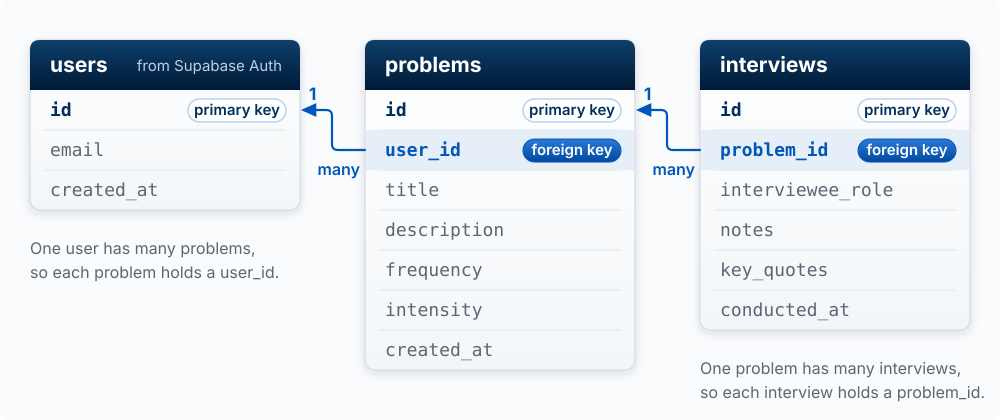
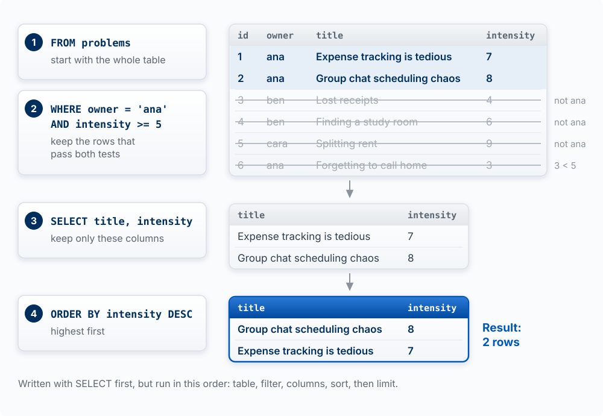
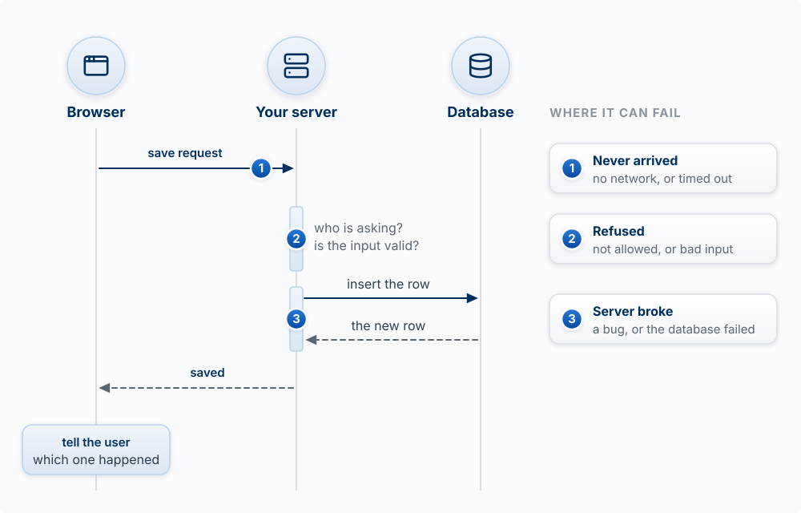

## Why This Matters

Everything your product remembers lives in a database, and everything it borrows from the
outside world arrives through an API. These two mechanics are most of what separates a
prototype from a product. A prototype forgets when you refresh. A product does not.

This chapter gives you four models: the data model is the skeleton of your product; a query
is a few blocks that pick rows; the database decides who sees which rows; and
every request can fail. It ends with the rules for secrets and for other people's data.

<!-- learn -->

## The Data Model Is the Skeleton

**The model:** tables are the nouns of your product and keys are how they relate. The data
model is the hardest thing to change later, so it deserves the most thought early.

The building blocks come from E. F. Codd's relational model, which Postgres and nearly every
business database still follow [@codd1970relational]:

| Block | What it is | Problem-tracker example |
|---|---|---|
| **Table** | One kind of thing your product keeps track of (a noun) | `problems` |
| **Row** | One instance of that thing | the problem "Expense tracking is tedious" |
| **Column** | One fact recorded about every row, with a type (text, number, date, true/false) | `title`, `intensity` |
| **Primary key** | A column whose value is unique to each row, so the row can be pointed at | `id` |
| **Foreign key** | A column that holds another table's primary key, which is how two tables relate | `problems.user_id` points to a user |

A spreadsheet is a fair picture of one table. It breaks in two places: a database enforces
types and rules on every write (a spreadsheet lets you type "seven" into a number column), and
the power is in the links between tables, which a spreadsheet does not have.

**From description to schema.** Take the product description and underline the nouns. "Users
log problems they have noticed, and record interviews with people who have each problem." The
nouns are users, problems, and interviews. Then ask of each pair: how many of one go with one
of the other?

- One user has many problems, so `problems` gets a `user_id`.
- One problem has many interviews, so `interviews` gets a `problem_id`.
- If it were many-to-many (one interview could cover several problems), you would add a third
  table, `interview_problems`, with one row per pairing.

The whole design is called the **schema**:

```
users (from Supabase Auth)
├── id
├── email
└── created_at

problems
├── id
├── user_id → users.id
├── title
├── description
├── frequency
├── intensity
└── created_at

interviews
├── id
├── problem_id → problems.id
├── interviewee_role
├── notes
├── key_quotes
└── conducted_at
```

{#fig-schema fig-alt="Three table cards side by side. users (from Supabase Auth): id, email, created_at. problems: id, user_id, title, description, frequency, intensity, created_at. interviews: id, problem_id, interviewee_role, notes, key_quotes, conducted_at. Every id is marked primary key. problems.user_id and interviews.problem_id are marked foreign key and highlighted, with blue arrows pointing to users.id and problems.id. Each arrow is labeled many at the foreign key end and 1 at the primary key end. Notes: one user has many problems, so each problem holds a user_id; one problem has many interviews, so each interview holds a problem_id." width="100%"}

The same design written as SQL is worth being able to read. Each line is a column, its type,
and its rule:

```sql
CREATE TABLE problems (
  id UUID PRIMARY KEY DEFAULT gen_random_uuid(),
  user_id UUID REFERENCES auth.users(id),
  title TEXT NOT NULL,
  description TEXT,
  frequency TEXT CHECK (frequency IN ('daily', 'weekly', 'monthly', 'rarely')),
  intensity INTEGER CHECK (intensity BETWEEN 1 AND 10),
  created_at TIMESTAMP DEFAULT NOW()
);

CREATE TABLE interviews (
  id UUID PRIMARY KEY DEFAULT gen_random_uuid(),
  problem_id UUID REFERENCES problems(id) ON DELETE CASCADE,
  -- ...other fields
);
```

`REFERENCES` makes a foreign key: the database refuses an interview whose `problem_id` does not
exist. `ON DELETE CASCADE` means that if a problem is deleted, its interviews are deleted too.
`CHECK` rejects a bad value no matter which screen or script sent it.

**Why it is hard to change.** Once real rows sit in a table, every screen, query, and report
depends on its shape. Splitting `name` into first and last name later means rewriting every
existing row and every piece of code that reads it, and guessing for rows like "Madonna". Code
can be rewritten in an afternoon; data has to be carried across. So sketch the schema before
you build, and include it in your sprint plan when a sprint adds tables.

**Change it with migrations.** A **migration** is a file of SQL that makes one change to the
schema ("add a `status` column to `problems`"), saved in your repo and applied in order. Ask
the agent to write a migration rather than clicking columns into existence in the Supabase Table
Editor. A migration is reviewable, repeatable on a fresh database, and in your git history; a
click is none of those.

::: {.callout-tip title="Try it"}
Write one sentence describing your product. Underline the nouns, decide which are tables, and
for each pair decide one-to-many, many-to-many, or unrelated. Sketch the schema as a tree like
the one above. Then ask Claude Code to compare your sketch with the tables your app actually
has, and explain every difference.
:::

<!-- learn -->

## Asking the Database a Question

**The model:** every read is built from the same few blocks. Choose the columns, choose the
table, filter the rows, sort them, and (when the answer spans two tables) join. You do not need
to write SQL. You need to predict which rows a described query returns, because that is how you
catch an agent's query that returns the wrong ones.

| Block | SQL keyword | What it does |
|---|---|---|
| Choose columns | `SELECT` | Which facts to return. `*` means all of them |
| Choose the table | `FROM` | Where to look |
| Filter rows | `WHERE` | Keep only rows that pass a test; combine tests with `AND` and `OR` |
| Sort | `ORDER BY` | Put rows in order; ascending unless you say `DESC` |
| Limit | `LIMIT` | Keep only the first N rows after sorting |
| Join | `JOIN ... ON` | Pair each row with matching rows in another table |

The database applies them in a fixed logical order: find the table (and join), filter the
rows, pick the columns, sort, then limit. A query that matches nothing returns an empty list,
which is not an error.

**Worked example.** Here is a small `problems` table (with names in place of user ids so it is
easier to read):

| id | owner | title | frequency | intensity |
|---|---|---|---|---|
| 1 | ana | Expense tracking is tedious | weekly | 7 |
| 2 | ana | Group chat scheduling chaos | daily | 8 |
| 3 | ben | Lost receipts | monthly | 4 |
| 4 | ben | Finding a study room | daily | 6 |
| 5 | cara | Splitting rent | monthly | 9 |
| 6 | ana | Forgetting to call home | weekly | 3 |

"Show the title and intensity of Ana's problems that score 5 or higher, most intense first":

```sql
SELECT title, intensity
FROM problems
WHERE owner = 'ana' AND intensity >= 5
ORDER BY intensity DESC;
```

The filter keeps rows 1 and 2 (row 6 fails the intensity test), the sort puts 8 before 7, and
the result is two rows: *Group chat scheduling chaos, 8* and *Expense tracking is tedious, 7*.

{#fig-query-blocks fig-alt="Four numbered query blocks on the left, each beside the table it produces. 1, FROM problems: start with the whole six-row table. 2, WHERE owner = 'ana' AND intensity >= 5: rows 1 and 2 are highlighted; rows 3, 4 and 5 are struck through with the note not ana, and row 6 is struck through with the note 3 < 5. 3, SELECT title, intensity: the two rows keep only those columns, Expense tracking is tedious 7, then Group chat scheduling chaos 8. 4, ORDER BY intensity DESC: the result table, outlined in blue, lists Group chat scheduling chaos 8 first and Expense tracking is tedious 7 second, labeled Result: 2 rows. A note says the query is written with SELECT first but run in this order: table, filter, columns, sort, then limit." width="100%"}

Your app's code says the same thing in the Supabase client's words, block for block:

```javascript
supabase.from('problems')                      // FROM
  .select('title, intensity')                  // SELECT
  .eq('owner', 'ana').gte('intensity', 5)      // WHERE
  .order('intensity', { ascending: false });   // ORDER BY
```

**Joins.** Add an `interviews` table:

| id | problem_id | interviewee_role |
|---|---|---|
| 10 | 1 | student |
| 11 | 1 | parent |
| 12 | 4 | student |

```sql
SELECT problems.title, interviews.interviewee_role
FROM problems
JOIN interviews ON interviews.problem_id = problems.id;
```

The join makes one result row for each matching pair: *Expense tracking / student*, *Expense
tracking / parent*, *Finding a study room / student*. Problem 1 appears twice because it has two
interviews. Problems with no interviews disappear entirely; a `LEFT JOIN` would keep them, with
empty interview columns. In the Supabase client the same join is written as a nested select,
`.select('*, interviews (*)')`, which returns each problem with a list of its interviews inside.

**The other verbs.** Reading is one of four operations, together called **CRUD**: Create
(`INSERT`), Read (`SELECT`), Update (`UPDATE`), Delete (`DELETE`). Update and delete use the
same `WHERE` block to pick their rows, which is why an update or delete with a missing or wrong
filter is the most destructive one-line mistake in software: `DELETE FROM problems` with no
`WHERE` removes every row.

**Indexes, in one paragraph.** To answer `WHERE owner = 'ana'`, the database either reads every
row or uses an **index**: a sorted lookup list it keeps on a column, like the index at the back
of a book, so it can jump to the matching rows. Indexes make reads on large tables fast and make
each write slightly slower. At student scale you rarely need to think about them; when a page
gets slow as data grows, a missing index is the first suspect. Markus Winand's free *Use The
Index, Luke!* is the reference (see [Builder Resources](97-builder-resources.qmd)).

::: {.callout-tip title="Try it"}
Using the two tables above, predict the result of each before opening the answers.

1. `SELECT title FROM problems WHERE frequency = 'daily' ORDER BY intensity;`
2. `SELECT title FROM problems WHERE intensity > 9;`
3. You ask the agent for "each user's most painful problem." It writes
   `SELECT owner, title FROM problems ORDER BY intensity DESC LIMIT 1;` What comes back, and
   what is wrong?
4. How many rows does the join above return if you add an interview for problem 5?
:::

::: {.callout-note collapse="true" title="Answers"}
1. *Finding a study room*, then *Group chat scheduling chaos*. Sorting is ascending by default,
   so 6 comes before 8.
2. No rows. Nothing scores above 9 (Splitting rent is exactly 9). An empty result, not an error.
3. One row, *cara / Splitting rent*: the highest-intensity problem overall. "Each user's" needs
   one row per user (grouping by owner), which `LIMIT 1` cannot give.
4. Four. Problem 5 now has a matching interview, so it gains one row.
:::

<!-- learn -->

## Row Level Security: Enforce Access Where the Data Lives

**The model:** in a Supabase app the browser queries the database directly with a key everyone
can see (Chapter 7). So the database is the only place access can be enforced. Row level
security (RLS) is the lock. Hiding a button is not.

A **policy** is a rule attached to a table that says which rows a request may touch, based on
who is asking. The clearest way to picture it: the database silently adds the policy as an
extra `WHERE` filter to every query. With the policy below, Ana's
`SELECT * FROM problems` behaves as if it said `WHERE user_id = <Ana's id>`, so she gets only
her own rows no matter what the browser asked for.

```sql
ALTER TABLE problems ENABLE ROW LEVEL SECURITY;

-- Read: users see only their own problems
CREATE POLICY "Users can view own problems"
ON problems FOR SELECT
USING (auth.uid() = user_id);

-- Write: users can only create problems that belong to themselves
CREATE POLICY "Users can insert own problems"
ON problems FOR INSERT
WITH CHECK (auth.uid() = user_id);
```

`auth.uid()` is the id of the signed-in user making the request, read from the session token
the database can verify. `USING` filters which existing rows are visible; `WITH CHECK` tests the
new row being written. Updates and deletes get policies of the same shape.

**Without RLS,** anyone holding the publishable key, which means anyone who has loaded your
site, can read and change every row in the table, signed in or not. **With RLS on and no
policies,** nobody can read anything through the public key, which is the usual cause of "my
query returns an empty list." Both are worth recognizing on sight. The secret key bypasses RLS
completely, which is exactly why it must never reach the browser.

The same idea protects files. Supabase Storage keeps uploads in **buckets**, either public
(anyone with the link can read, fine for profile pictures) or private, and a private bucket's
access is set with policies of the same shape, for example "a user may read files in the folder
named with their own id."

**Worked example.** A peer-feedback app shows each student only their own feedback, because the
page asks for `.eq('student_id', user.id)`. RLS is off. A student opens developer tools, edits
the request to remove the filter, and downloads every student's feedback. The page's filter was
a convenience; a `USING (auth.uid() = student_id)` policy would have been the lock.

::: {.callout-tip title="Try it: the two-account drill"}
Create two accounts in your app, A and B. As A, create a record. Sign in as B and try to see,
edit, or delete A's record: through the screens, by changing ids in the address bar, and by
asking Claude Code to write a short script that queries the table with your publishable key while
signed in as B. If any attempt succeeds, you have found an authorization hole. Fix it with a
policy, then run the drill again. This is also a standard check in the Peer Code Review.
:::

<!-- learn -->

## Requests Are Contracts That Fail

**The model:** an API call is a request with a defined input and output, and it can fail for
many reasons: network, permission, limits, bad input, a bug on the other side. Good apps expect
failure and tell the user what happened.

Most products also borrow from other companies' APIs: Stripe for payments, Resend or SendGrid
for email, Twilio for text messages, Anthropic for models. They all work the same way, over
HTTP, the protocol your browser uses for every page.

**A request** has a method (what kind of action), an address (which endpoint), headers
(metadata, including who is calling), and sometimes a body (the data). **A response** has a
status code (how it went) and usually a body.

| Method | Purpose | Example |
|--------|---------|---------|
| `GET` | Retrieve data | Get user profile |
| `POST` | Create new data | Create new order |
| `PUT` / `PATCH` | Update existing data | Update user settings |
| `DELETE` | Remove data | Delete a post |

Status codes come in families: 2xx means it worked, 4xx means the request was the problem, 5xx
means the server was the problem.

| Code | Meaning | What usually happened | What the user should see |
|---|---|---|---|
| `200` | OK | It worked | The result |
| `201` | Created | A new record was saved | The new record |
| `400` | Bad request | Missing or invalid input | What to fix in the form |
| `401` | Unauthorized | Not signed in, or the session expired | "Please sign in again" |
| `403` | Forbidden | Signed in, but not allowed to do this | "You don't have access to this" |
| `404` | Not found | Wrong address, or the record is gone | "This no longer exists" |
| `429` | Too many requests | You hit a rate limit (a cap on calls per minute) | "Busy, try again in a moment," and a delayed retry |
| `500` | Server error | A bug or outage on the server | "Something went wrong on our end" |

Two failures have no status code at all: the network drops (the request never arrives) and the
request hangs until it times out. A spinner that never stops is usually one of these.

{#fig-request-round-trip fig-alt="A sequence diagram with three columns headed by icons: Browser, Your server, Database. The browser sends POST /api/problems to the server. The server checks who is asking and whether the input is valid, sends insert the row to the database, and gets the new row back. The server answers the browser with 201 Created, and the browser checks response.ok and says what happened. Three blue numbered markers show where it can fail, listed under Can come back instead: 1, on the request, no network or a timeout, no answer at all; 2, at the server's checks, 400, 401, 403, 404 or 429, the request was the problem; 3, on the response, 500, the server was the problem." width="100%"}

::: {.callout-note title="Analogy: a waiter"}
Your app is the customer, the API is the waiter, the server is the kitchen. You order from a
fixed menu (the endpoints), and the waiter brings back the dish or tells you why not. **Where it
breaks:** a real waiter comes back to tell you the kitchen is out of fish. A request may never
come back at all, and nothing tells you unless your code set a time limit.
:::

**Worked example.** Here is a save that handles failure. The key fact: `fetch` throws an error
only when no answer came back at all. A 403 or a 500 is still an answer, so the code has to
check `response.ok` (true for any 2xx) itself.

```javascript
try {
  const response = await fetch('/api/problems', {
    method: 'POST',
    headers: { 'Content-Type': 'application/json' },
    body: JSON.stringify({ title })
  });
  if (!response.ok) {
    if (response.status === 401) showError('Please sign in again.');
    else if (response.status === 429) showError('Busy. Try again in a minute.');
    else showError('Could not save your problem. Your text is still here.');
    return;
  }
  const problem = await response.json();
  addToList(problem);
} catch {
  showError('No connection. Check your internet and try again.');
}
```

The version agents often write by default stops after `await response.json()` and assumes the
happy path. In that version a failed save looks exactly like a successful one, or leaves a
blank screen.

**Calling another company's API.** The same rules apply, plus one: the call that carries a
secret key goes from your server, never from the browser. Your browser calls your own endpoint,
and your endpoint calls the outside API. Calling a model is the most important case of this in
the course, with its own costs and failure modes; Chapter 11 ([Models in Your
Product](11-models-in-your-product.qmd)) covers it and has the current code.

::: {.callout-tip title="Try it"}
Pick one button in your app that saves something. For each failure in the status table, plus
"no network," predict what the user sees right now. Then test two: turn off Wi-Fi and click it,
and sign out in another tab and click it. Ask Claude Code to make every case show a clear
message without losing what the user typed.
:::

<!-- learn -->

## Secrets and Sensitive Data

**The model:** an API key is a password. Personal and client data has rules about where it may
go, including into prompts and logs.

**Secrets.** Anyone holding a secret key can act as your product: spend your money on a model
API, issue refunds through Stripe, read every row in your database. A leaked key can be used
until you notice the bill. Keys come in two kinds, and the difference is the point:

| Key | Example | Where it may live | Why |
|---|---|---|---|
| **Public by design** | Supabase publishable key (formerly anon key), Stripe publishable key (`pk_...`) | Browser code, `NEXT_PUBLIC_` variables | It can do only what your rules allow (RLS), or what the provider permits from a browser (Stripe: collecting card details) |
| **Secret** | Supabase secret key (formerly service role key), Anthropic API key, Stripe secret key (`sk_...`), Resend key | Server code only, in environment variables | It bypasses your rules or spends your money |

Secrets live in **environment variables**: values set outside the code, in `.env.local` on your
machine (which git ignores) and in the Vercel project settings for the live site. In Next.js,
any variable whose name starts with `NEXT_PUBLIC_` is copied into the browser code, so a secret
must never have that prefix.

```bash
# .env.local (never commit this file)
NEXT_PUBLIC_SUPABASE_URL=https://your-project.supabase.co    # public
NEXT_PUBLIC_SUPABASE_PUBLISHABLE_KEY=sb_publishable_...      # public by design
ANTHROPIC_API_KEY=sk-ant-...                                 # secret: server only
STRIPE_SECRET_KEY=sk_live_...                                # secret: server only
```

```javascript
// DANGER: this runs in the browser, so this key is now public
const client = new SomeAPI({ apiKey: 'sk-abc123' });

// Instead: the browser calls your own endpoint, which holds the key
const response = await fetch('/api/summarize', { method: 'POST', body: JSON.stringify({ text }) });
```

If a secret leaks (pushed to GitHub, pasted in Slack, shipped to the browser), deleting it from
the code is not enough: it is in the history and may already be copied. **Rotate it**: create a
new key in the provider's dashboard and revoke the old one.

**Sensitive data.** Some data has rules about where it may go, whatever your code can do with
it:

- **Personal data**: names, emails, phone numbers, locations, anything that identifies a person.
- **Student records**: grades, enrollment, feedback. In the United States these are covered by
  FERPA, the federal law on education records.
- **Client data**: anything a company gives you for a project, usually under an NDA or contract
  that limits who may see it, including which outside services.
- **Credentials**: passwords and keys, which should never be stored in plain text or shown back.

The rule that catches builders: **sending data somewhere is copying it to that company's
servers.** A model prompt, an analytics event, an error report, a `console.log` on the server
(which lands in Vercel's logs), and the files you let Claude Code read all leave your database.
Before data goes somewhere, ask: does the user or client know it goes there, does the contract
allow it, and does it need to go at all?

Practical rules for a student product:

1. Collect only what the feature needs.
2. Keep personal data in your database, behind RLS, and nowhere else.
3. Log ids and what happened ("user 42: save failed, 403"), never the person's content, email,
   or the full request.
4. Strip or replace names before sending text to a model when the task does not need them.
5. Do not put real client or student data into any AI tool, including Claude Code, until you
   have checked the contract and the tool's data terms. Use made-up sample data while building.

::: {.callout-tip title="Try it: find the leak"}
Each of these leaks something. Say what, and where it ends up: (a) `console.log('signup', req.body)`
in a sign-up route; (b) a "summarize my interview notes" feature that sends full transcripts,
names included, to a model; (c) `NEXT_PUBLIC_STRIPE_SECRET_KEY` in `.env.local`; (d) an analytics
event `profile_updated` that includes the user's new phone number. Then search your own repo for
`console.log` and check what each one prints.
:::

<!-- learn -->

## Key Concepts

- **Table, row, column**: a noun of your product, one instance of it, one fact about each.
- **Primary key / foreign key**: a row's unique id, and a column pointing at another table's id.
- **Schema**: the whole design of tables and relationships; the hardest thing to change later.
- **Migration**: a saved SQL file that makes one schema change, applied in order.
- **Query blocks**: `SELECT` columns, `FROM` a table, `WHERE` filter, `ORDER BY` sort, `LIMIT`,
  `JOIN`.
- **CRUD**: Create, Read, Update, Delete.
- **Index**: a sorted lookup list on a column that makes finding rows fast.
- **RLS (Row Level Security)**: policies in the database that decide which rows each user may
  touch; the lock in a Supabase app.
- **HTTP methods and status codes**: what a request asks for, and how it went (2xx, 4xx, 5xx).
- **Rate limit (429)**: a cap on how many requests you may send in a period.
- **Public vs. secret keys**: publishable keys ship to the browser; secret keys stay on the server.
- **Environment variables**: settings kept outside the code; `NEXT_PUBLIC_` ones reach the browser.
- **Sensitive data**: personal, student, and client data, which may go only where its rules allow,
  including prompts and logs.

<!-- learn -->
