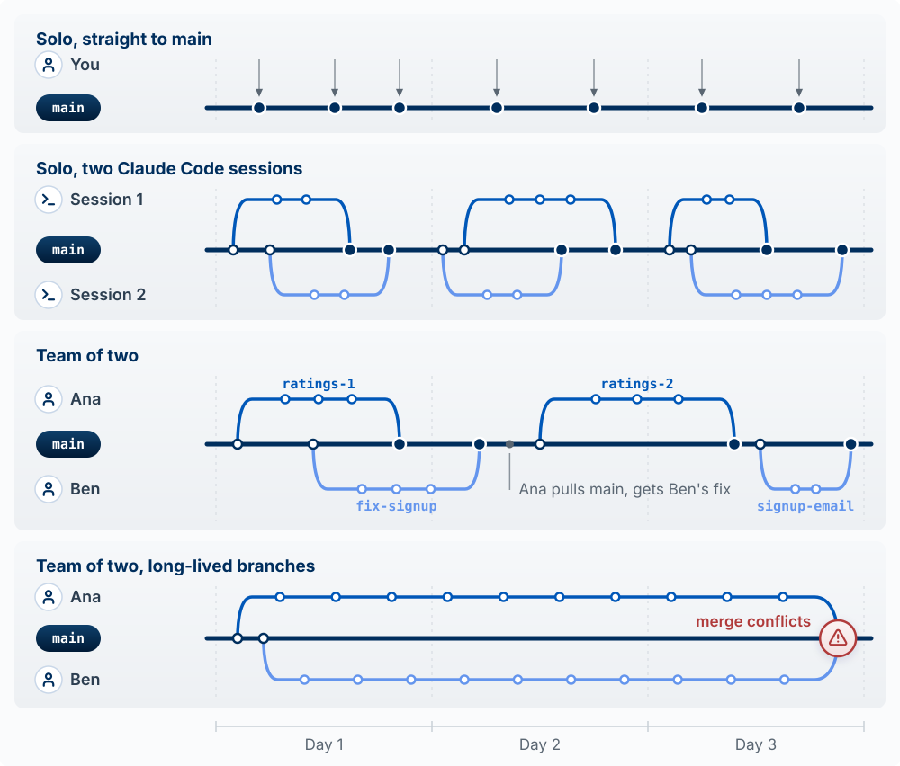
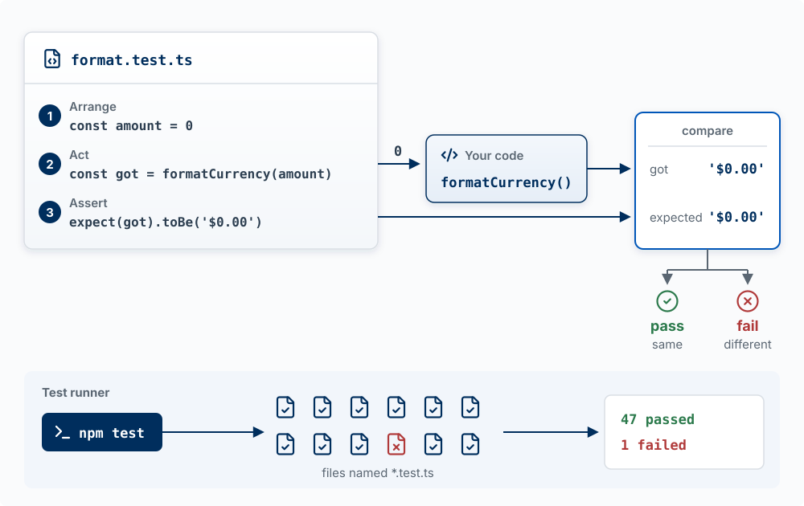

## Why This Matters

If you cannot safely change your code, you no longer control your product. This chapter is about the practices that keep
a product changeable while an agent edits it many times a day: version control so you can undo
anything, review and automated checks so you find out when something broke before users do, a
way back when a bad change ships anyway, logs so you can see what users hit, and a working
theory of technical debt so you know which mess to clean and which to leave alone.

<!-- learn -->

## Git: A Time Machine Plus Parallel Copies

**The model:** version control is a time machine plus parallel copies. Every commit is a saved
snapshot of the whole project you can return to; every branch is a separate line of snapshots
you can work on without touching the others.

Git tracks every change and GitHub stores a copy of the history online, for backup, sharing,
and review. Changes move through four places:


| Stage | What It Is |
|-------|------------|
| **Working Directory** | The folder on your computer where you (and the agent) edit files |
| **Staging Area** | A list of changes you want to include in your next save |
| **Local Repository** | Your project's history, stored in a hidden `.git` folder |
| **Remote Repository** | A copy of your project on GitHub (or similar) |

A **commit** is one snapshot plus a message saying what changed and why. Small commits with
clear messages are what make the time machine useful: "Add rating to problems" is a point you
can return to; "updates" is not.

**How you start.** Your course repo was created from the builder template, so it already has
git, a GitHub remote, and the course's Claude Code skills. You will rarely type git commands
yourself, because Claude Code commits and pushes when you ask, but you should know what each
one does when you read its output:

| Command | What It Does |
|---------|--------------|
| `gh repo create <name> --template <template> --private --clone` | Make your own repo from a template and download it (done once, at the start) |
| `git status` | See what's changed since last commit |
| `git add .` | Stage all changes for commit |
| `git commit -m "message"` | Save staged changes with a description |
| `git log --oneline` | View commit history |
| `git push` | Upload commits to GitHub |
| `git pull` | Download changes from GitHub |

For a project outside the course, start the same way on GitHub: create a repository, then
clone it.

{fig-alt="The top of a GitHub dashboard. In the left sidebar under Top repositories, a green New button is outlined in red."}

**Commit only the files you touched.** When two sessions share one folder, `git add -A` or
`git add .` stages the other session's half-finished files along with yours. Stage files by name
(`git add app/page.tsx`). VS Code has the same problem: clicking Commit with nothing staged
commits every changed file. Click the `+` on your file's row first, or turn off
`git.enableSmartCommit` in Settings. The Agent Team Kit's
[hands-on edits guide](https://github.com/ai-foundry-byu/agent-team-kit/blob/main/docs/HANDS-ON-EDITS.md) covers both.

::: {.callout-tip title="Try it"}
Ask Claude Code: *"Show my last ten commits and, for each, one line on what it changed."* Pick
one that is three or more commits back and ask what the app would lose if you returned to it.
Then look at the messages: could a teammate tell from them what happened this week?
:::

<!-- learn -->

## Pull Requests: The Review Gate

**The model:** a branch is a separate line of commits where a change can be built and tested
without touching `main`. A **pull request** (PR) is a request, made on GitHub, to merge that
branch into `main`. While the pull request is open, automated checks test the change, Vercel
builds a preview of it, and a reviewer reads it. Nothing reaches `main`, or your live site,
until someone merges the pull request.

{#fig-pull-request-gate fig-alt="A timeline in seven numbered steps, left to right, with one horizontal lane per participant: you and Claude Code, GitHub Actions (automated checks), Vercel, the reviewer (a teammate, or you), and the repository (on your laptop and on GitHub). Steps 1 to 3, in the you and Claude Code lane: branch, commits, then push and open PR. Step 4: in the GitHub Actions lane a green check labeled pass or fail, and in the Vercel lane an eye icon labeled preview URL. Step 5, in the reviewer lane: reads diff, approves. Steps 4 and 5 sit inside a lightly shaded column, the time the pull request is open. Step 6, in the you and Claude Code lane: merge, after approval. Step 7, in the Vercel lane: live site, reached by an arrow labeled deploys that rises from the end of main. In the repository lane, a dark main line runs the full width. A lighter branch labeled feature-rating leaves main at step 1, collects two commits, passes through a blue box labeled pull request, and merges back into main at step 6. A bracket under main from step 1 to step 6 reads: main and the live site unchanged." width="100%"}

Five participants take part. **You and Claude Code** work on your laptop: the agent writes the
code and runs the git commands, and you decide what to build and when to merge. **GitHub**
stores the repository online and shows the pull request as a web page. **GitHub Actions** is
GitHub's service for running commands on GitHub's computers; here it runs your automated checks.
**Vercel** builds and hosts your app. The **reviewer** is a teammate, or you when you work
alone. One change, start to finish, with the numbers from @fig-pull-request-gate:

1. **Branch.** Claude Code creates a branch named `feature-rating` on your laptop.
2. **Commits.** The agent adds a `rating` column and a star widget and saves the work as
   commits on the branch. `main` and the live site are untouched.
3. **Push and open the pull request.** `git push` copies the branch from your laptop to GitHub,
   and `gh pr create` opens the pull request. Its page shows the **diff**: every line added,
   removed, or changed, compared with `main`.
4. **Checks and preview.** Both start on their own when the branch reaches GitHub. GitHub
   Actions runs the checks the repo defines (tests, lint, a type check, a build; see
   [Automated Checks](#automated-checks-tests-types-and-lint) below) and marks the pull request
   with a green check or a red X. Vercel builds the branch and posts a **preview URL** on the
   pull request: a working copy of the app with this change, at its own address, separate from
   the live site.
5. **Review.** The reviewer reads the diff and clicks through the preview, then approves or
   leaves comments. GitHub does not let you approve your own pull request, so when you work
   alone, the review is you reading the diff and the preview before you merge. Ask a second
   Claude Code session to review the diff too; it catches more than the session that wrote it.
   A comment or a red check sends the work back to step 2: the agent fixes the problem, commits,
   and pushes to the same branch, and the checks, the preview, and the diff on the pull request
   update.
6. **Merge.** You click **Merge pull request** on GitHub, or have Claude Code run
   `gh pr merge`. The branch's commits join `main`. A red check does not block this button
   unless the repo is set to require passing checks, so look before you click.
   Who clicks it is a team convention. GitHub lets anyone with write access to the repo merge,
   once any approvals the repo requires are in. Often the author merges after the reviewer
   approves, since the author knows when the change is ready to go live; some teams have the
   reviewer merge instead. In a solo project or a pair, the author usually merges.
7. **Deploy.** Vercel sees the new commit on `main` and deploys it to the live site.

```bash
git switch -c feature-rating     # 1. create and switch to a new branch
git add . && git commit -m "Add rating system for problems"   # 2. commit
git push -u origin feature-rating                              # 3. copy the branch to GitHub
gh pr create --fill              # 3. open the pull request
gh pr merge                      # 6. merge, after the checks and the review
```

**Worked example.** In step 5 of this change, the preview shows the stars work. The diff also
shows that the agent changed the row-level security policy on `problems` to `USING (true)` to
fix an error it hit along the way, which would let every user read every problem. That line is
invisible in the running app and plain in the diff. The reviewer leaves a comment, the agent
restores the policy in a new commit, and only then is the pull request merged. Without the pull
request, the `USING (true)` line would have gone straight to `main` and the live site.

Words used in this section:

| Term | What it means |
|---|---|
| `main` | The branch your live site is built from; Vercel deploys every new commit on it |
| Branch | A separate line of commits that starts from `main` and does not change it |
| Commit | A saved snapshot of the project, with a message saying what changed |
| Push | Copying commits from your laptop to the repository on GitHub |
| Pull request (PR) | A page on GitHub that asks to merge one branch into another and holds the diff, checks, preview, and review |
| Diff | The list of every line added, removed, or changed, compared with `main` |
| Checks | Commands, such as tests and a build, that GitHub Actions runs on a pull request and marks pass or fail |
| Preview URL | The address of a separate copy of the app, built by Vercel from the branch |
| Review | A person reading the diff and the preview, then approving or leaving comments |
| Merge | Adding the branch's commits to `main`, which starts a deploy to the live site |

::: {.callout-tip title="Try it"}
For your next feature, ask Claude Code to do the work on a branch and open a pull request
instead of committing to `main`. Before merging, open the preview URL and the diff. Write one
sentence on what the change does and one on anything in the diff you did not expect.
:::

<!-- learn -->

## Trunk-Based Development: Small Branches, Merged Often

**The model:** keep one shared line of work that could be released at any moment, and make
every branch small enough to merge back into it within a day or two. This practice is called
**trunk-based development**, and the shared line is called the **trunk**. In your repo, the
trunk is `main`. Paul Hammant's site *Trunk Based Development* [@hammant_tbd] describes the
practice in detail; this section follows it.

The alternative is a **long-lived branch**: a feature built on its own branch for weeks and
merged only when it is finished. While that branch is open, `main` keeps changing, so the two
drift apart. When the branch finally comes back, the merge has to reconcile weeks of changes on
both sides at once. Wherever both sides changed the same lines, git stops with a **merge
conflict**, and someone has to decide by hand which version is right. With two long-lived
branches open, each also has to be reconciled with the other, and problems that appear only
when the two are combined show up together, at the end.

{#fig-trunk-based fig-alt="Two panels on one shared time axis of three weeks. Top panel, trunk-based, each branch lasting hours to two days: a dark main line runs across all three weeks. Fifteen small light-blue branches leave main and rejoin it, each spanning at most two days; they alternate above and below the line, so two or three are open at the same time, and each rejoins main at a dark merge dot. Bottom panel, long-lived branches, each branch lasting weeks: a dark main line with four commits of its own spread across the weeks. A branch labeled feature-rating leaves main early in week 1 and slopes steadily upward, away from main, collecting commits; a branch labeled feature-search leaves soon after and slopes steadily downward. Both return to main at the same point near the end of week 3, marked with a red warning circle labeled one big merge with conflicts." width="100%"}

The practice has four rules:

1. **The trunk is always releasable.** `main` should be in a state you could deploy at any
   moment. In this course that is literal: Vercel deploys whatever is on `main`.
2. **Branches are short-lived.** One branch per task, worked on by one person (or one agent
   session), merged within a day or two, then deleted. The site warns that a branch kept
   longer than two days risks becoming a long-lived branch, and it asks everyone to get work
   into the trunk at least once every 24 hours.
3. **Every merge still passes the gate.** A short branch goes through the pull request and its
   checks like any other. The site notes that very small teams sometimes commit straight to the
   trunk with no branch; in this course keep the pull request, because that is where the checks
   and the preview run.
4. **Unfinished work merges behind a feature flag.** A feature too large for one or two days is
   merged in small pieces, switched off. A **feature flag** is a setting the code checks before
   showing a feature (for example, `if (flags.ratings)`). With the flag off, the new code is on
   `main` and deployed, but users do not see it; turn the flag on when the last piece has
   merged. The site cautions that flags tend to be forgotten after a feature ships, so remove
   each flag, and the code path it switched off, once the feature is on for everyone.

Chapter 12 shows how the same flag lets you release to one group of users at a time
(@fig-deploy-vs-release). One warning when you put an existing feature behind a new flag: a flag
nobody has turned on is off, so the deploy that adds it hides the feature from everyone who was
using it. Turn the flag on for current users before that deploy goes out
([check before flagging a shipped feature](https://github.com/ai-foundry-byu/agent-team-kit/blob/main/memory-pack/check-before-flagging-a-shipped-feature.md)).

**Why it fits building with agents.** An agent can write a thousand changed lines in a few
minutes, and a thousand-line diff is too long to review line by line. The `USING (true)` line
in the pull request example above is easy to see in a diff of thirty lines and easy to miss in a diff
of a thousand. One task per branch keeps each diff small enough to read. The same holds for
parallel work: in Chapter 2 you ran a second session in a worktree, on its own branch. Have each
worktree session finish one small task and merge it the same day. Two sessions that each run for
a week are two long-lived branches, and they end in the merge shown in the bottom panel of
@fig-trunk-based. Small merges also keep rollback (later in this chapter) simple: when a deploy
breaks, it changed one thing, so you know which commit to `git revert`. Revert is for a change
that broke something. The site is specific that code which is not ready should not be merged
and then backed out; it belongs behind a flag.

::: {.callout-tip title="Try it"}
Ask Claude Code: *"List every branch in this repo, on my laptop and on GitHub, with the date of
its last commit and whether it has been merged into main."* For each unmerged branch older than
two days, decide whether to finish and merge it now or split it into smaller pieces. Then, before your next feature, ask: *"Split this feature into pull requests that
can each be finished and merged within a day. For any piece that would show users something
unfinished, explain how a feature flag would keep it hidden."* Build the first piece on its own
branch, merge it, and delete the branch.
:::

<!-- learn -->

## Tests: Code That Checks Your Code

**The model:** a test is a short program that runs a piece of your code with an input you chose
and compares the result with the answer you expect. If they match, the test passes; if they do
not, it fails. A **test runner** finds every test file in the repo, runs them all, and prints how
many passed and how many failed. The kinds of tests differ in how much of the real app each one
runs.

### One test, taken apart

Here is a complete test file for a function that formats prices, `formatCurrency`. It uses
Vitest, a test runner common in Next.js projects:

```typescript
// lib/format.test.ts
import { expect, test } from 'vitest';
import { formatCurrency } from './format';

test('formats zero with two decimal places', () => {
  const amount = 0;                     // 1. Arrange: set up the input
  const got = formatCurrency(amount);   // 2. Act: run your code
  expect(got).toBe('$0.00');            // 3. Assert: compare with the expected answer
});
```

Every test has the same three steps, usually called **arrange, act, assert**. Arrange sets up a
known starting point (here, the number 0). Act runs the code being tested. Assert states what the
result must be. The line `expect(got).toBe('$0.00')` is an **assertion**: if `got` is `'$0.00'`,
the test passes; if a later change makes `formatCurrency(0)` return `'$0'`, the test fails and the
runner prints both values so you can see the difference. The text in quotes after `test(` is the
test's **name**, a sentence saying what the code must do. A test file usually holds several tests,
one per behavior: zero, a large number with a comma, a negative amount.

{#fig-test-anatomy fig-alt="Top: a test file named format.test.ts with three numbered lines. 1, Arrange: const amount = 0. 2, Act: const got = formatCurrency(amount); an arrow carries the input 0 to a box labeled your code, formatCurrency(). 3, Assert: expect(got).toBe('$0.00'); an arrow carries the expected value to a compare box outlined in blue. Your code's output also goes to the compare box. The box shows got '$0.00' and expected '$0.00'. Below it the result branches: same, pass, in green; different, fail, in red. Bottom, in a band labeled test runner: a dark command box reading npm test, an arrow to a grid of twelve test file icons labeled files named *.test.ts, eleven with check marks and one red with an x, and an arrow to a printed summary: 47 passed, 1 failed." width="100%"}

### The runner, and the files in your repo

A test runner is the program that finds test files and runs them. The ones you will see in a
Next.js and Supabase project:

| Runner | Used for | How it finds tests | Command |
|---|---|---|---|
| **Vitest** or **Jest** | Unit and integration tests | Any file whose name ends in `.test.ts` or `.spec.ts` (and the `.js` and `.tsx` versions); Jest also runs files in a `__tests__` folder | `npm test`, or `npx vitest` |
| **Playwright** | End-to-end tests in a real browser | Files ending in `.spec.ts` or `.test.ts` inside the test folder named in `playwright.config.ts`, often `tests/` or `e2e/` | `npx playwright test` |
| **Node's built-in runner** | Unit tests, with nothing to install | The files the command names | `node --test` |

`npm test` runs whatever command the `"test"` line in `package.json` names, so open that file to
see what it does in your repo.

**Why there seem to be a thousand test files.** Search a project for "test" and most of what you
find belongs to other people. The folder `node_modules` holds the code of every package your app
depends on, and many packages ship their own test files inside it. In one Next.js and Supabase
app checked while writing this chapter, 17 test files were the app's own and 394 sat inside
`node_modules`. Those are not your code, and your runner does not run them: Vitest and Jest skip
`node_modules` by default. To list only your own test files, ask for the files git tracks
(`node_modules` is in `.gitignore`):

```bash
git ls-files | grep -E '\.(test|spec)\.'
```

**Why Claude Code keeps running them.** Running tests is the check step of the agent loop
(Chapter 1). After an edit, the agent runs the suite to find out whether the change broke
something that used to work, reads any failure, fixes the code, and runs it again. Red output
partway through a session is normal. What matters is the last run before it says it is done, and
whether it got to green by fixing the code or by changing a test. You can require green: a
`Stop` hook (Chapter 2) can keep the agent working until the tests pass.

### Kinds of tests

The kinds differ in how much of the real app a test runs. The examples use the problem tracker
from Chapter 8: users log problems with a title and an intensity from 1 to 10, and row-level
security lets each user see only their own.

{#fig-test-scope fig-alt="Three columns for the parts of the app, with icons: Browser, the user's machine; Your server, Next.js on Vercel; Supabase, sign-in and database. A fourth column on the right is headed catches. Three rows of tests, each a blue-outlined bar covering only the columns that test runs. Unit, fastest: an arrow labeled calls leads to a bar under the server column holding validateProblem(); it catches wrong logic. Integration, slower: an arrow labeled request leads to a bar covering the server and Supabase, holding /api/problems and test database; it catches a wrong query or policy. End-to-end, slowest: an arrow labeled clicks leads to a bar covering all three columns, holding real browser, running app, and test database; it catches a broken flow." width="100%"}

**Unit test: one function, alone.** A unit test calls a single function directly, with no
browser, no server, and no database. It runs in milliseconds, so a project can have hundreds.

```typescript
test('rejects an intensity above 10', () => {
  const result = validateProblem({ title: 'Lost receipts', intensity: 12 });
  expect(result.ok).toBe(false);
});
```

**Integration test: several real pieces together.** An integration test checks that pieces work
together: here, that the real `/api/problems` route saves a row to a real database. It runs against
a **test database**: a separate Supabase project, or a local copy started with `supabase start`
(which needs Docker). Never point tests at your live database; they create and delete rows.

```typescript
test('POST /api/problems saves the problem for the signed-in user', async () => {
  const res = await postAs(ana, '/api/problems', { title: 'Lost receipts', intensity: 4 });
  expect(res.status).toBe(201);
  const { data } = await testDb.from('problems').select('user_id').eq('title', 'Lost receipts');
  expect(data).toEqual([{ user_id: ana.id }]);
});
```

`postAs` and `testDb` are helpers the agent writes once in the test setup: one sends a request
signed in as a test user, the other reads the test database.

**End-to-end test: the whole app, through a real browser.** An **end-to-end** (E2E) test does
what a user does. Playwright opens a real browser, goes to your running app, types, clicks, and
checks what appears on screen. This is the same browser automation as the Playwright server from
Chapter 2, with one difference: there, Claude clicks around once; a Playwright test file is saved
in the repo and repeats the same steps every time it runs.

```typescript
test('a new user can sign up and log a problem', async ({ page }) => {
  await page.goto('/signup');
  await page.getByLabel('Email').fill('new-user@example.com');
  await page.getByLabel('Password').fill('a-long-test-password');
  await page.getByRole('button', { name: 'Sign up' }).click();
  await page.getByLabel('Title').fill('Lost receipts');
  await page.getByRole('button', { name: 'Add problem' }).click();
  await expect(page.getByText('Lost receipts')).toBeVisible();
});
```

Each run takes seconds, and it needs the app running and a test Supabase project (with email
confirmation turned off, or the test cannot finish signing up). The Next.js documentation
recommends end-to-end tests over unit tests for async Server Components, which some unit-testing
tools do not yet fully support.

Four more kinds you will see, each a use of the three above:

| Kind | What it checks | Problem-tracker example |
|---|---|---|
| **Permission test** | That a user cannot reach data they should not | Ana creates a problem; signed in as Ben, a query for it returns an empty list, and an update changes nothing |
| **Regression test** | That a bug you fixed stays fixed | Intensity 10 was rejected because the code checked `< 10`. The test saves a problem with intensity 10 |
| **Snapshot or visual test** | That output has not changed since it was last approved | Vitest's `toMatchSnapshot()` saves the rendered problem list and compares later runs with it; Playwright's `toHaveScreenshot()` does the same with a picture of the page |
| **Smoke test** | That the deployed app is up at all, in under a minute | After a deploy: the home page loads, and a test user can sign in |

**Permission tests** are the two-account drill from Chapter 8, written down so it runs on every
change. They matter more in a Supabase app than in most, because the browser queries the database
directly and row-level security is the only thing stopping Ben from reading Ana's rows. A
permission test must sign in as an ordinary user with the publishable key. The secret key bypasses
row-level security, so a test that uses it checks nothing about your policies. Supabase can also
run permission tests written in SQL, with `supabase test db`.

```typescript
test("Ben cannot read Ana's problems", async () => {
  const { data } = await asBen.from('problems').select('*').eq('user_id', ana.id);
  expect(data).toEqual([]);
});
```

**Regression tests** come from bugs. When you find one, ask the agent to write a test that
reproduces it first and to show you that test failing. Then it fixes the code, and the same test
passes. The failing run proves the test detects the bug; the passing run proves the fix works.

**Snapshot and visual tests** catch any change, including changes you meant to make. When you
change the design on purpose, the stored snapshot is updated (`npx vitest -u`,
`npx playwright test --update-snapshots`), and the updated `.snap` or `.png` file appears in the
diff. Check that someone meant to change it.

**Smoke test** has a different meaning here than in Chapter 4, where it was an offer for a product
that does not exist yet. In software, it is a short check run right after a deploy.

Two more words you will meet in test output. A **mock** is a stand-in for a real dependency that
returns a fixed answer: a test of your AI feature can replace the call to Anthropic with a mock
that always returns the same summary, so the test is fast, free, and gives the same result every
time. The cost: a test with a mock checks your code against your assumption about the other
service. If the service changes how it answers, the test still passes. A **flaky test** passes on one run and fails on the
next with no change to the code, usually because an end-to-end test did not wait for the page to
finish loading. Have flaky tests fixed or deleted. A suite that fails at random teaches everyone,
including the agent, to ignore red.

**How many of each.** Mike Cohn's testing pyramid recommends many unit tests, fewer integration
tests, and fewest end-to-end tests, because the larger ones are slow and fail for reasons unrelated
to your change [@cohn2009agile]. Ham Vocke's *The Practical Test Pyramid* works through the same
idea in code [@vocke2018practical]. For a student product, a reasonable starting set is unit tests
on the logic with rules (prices, scores, validation), permission tests on every table that holds
user data, and one end-to-end test of the path your demo depends on.

### What tests do not tell you

- **A passing suite means that none of the checks someone wrote failed.** A behavior with no test
  is unchecked, however green the output. **Coverage**, a percentage some runners report, counts
  the lines of code a test ran, whether or not any assertion looked at the result.
- **Tests check the code against what the test's author expected.** If the agent misunderstood
  the feature, it writes code and tests that share the misunderstanding, and both agree.
- **Tests do not tell you whether the feature is the right one or whether users can use it.**
  That is what interviews (Chapter 4) and usability tests (Chapter 6) are for.
- **A test can be changed to pass.** An agent told to "make the tests pass" sometimes changes
  the expected value, deletes the test, or marks it `.skip` instead of fixing the code. A diff
  review catches it.

### What you do

You will rarely write a test by hand; the agent writes them. Your part:

1. **Ask for tests on what matters**: anything with money, grades, or permissions, and the main
   path through your product. "Add tests" with no target gets tests of whatever was easiest to
   test.
2. **Read the test names as a spec.** A list like *rejects an intensity above 10*, *Ben cannot
   read Ana's problems*, *a new user can sign up and log a problem* tells you what is protected.
   A missing behavior in the list is a missing check.
3. **Run the suite yourself** before you merge (`npm test`, and `npx playwright test` if the repo
   has end-to-end tests), or confirm the pull request's checks ran it.
4. **Watch for edited tests in diffs.** When a change touches both the code and its tests, read
   the test changes first. A changed expected value, a deleted test, or a new `.skip` needs a
   reason.
5. **For every bug, ask for a regression test that fails first.**

**Test what the change could break, including features you did not touch.** The most damaging
regressions come from changing a function several features share, then testing only the feature
you were working on. Before finishing a change to shared code, ask the agent to list every place
that calls what it changed and the features behind them, and to add a test of each affected
feature's visible result ("Start over empties the form, and it stays empty after a reload").
Then mark the few user paths that must always work (sign up, the core task, payment) and run
only those before every push, so the check is fast enough that nobody skips it. The Agent Team
Kit's [`regression-check`](https://github.com/ai-foundry-byu/agent-team-kit/blob/main/skills/regression-check/SKILL.md) skill and its lesson
[keep a small green critical suite](https://github.com/ai-foundry-byu/agent-team-kit/blob/main/memory-pack/keep-a-small-green-critical-suite.md)
describe the method.

Words used in this section:

| Term | What it means |
|---|---|
| Test | A short program that runs some of your code with a chosen input and checks the result |
| Assertion | The line that states the expected result, such as `expect(got).toBe('$0.00')` |
| Arrange, act, assert | The three steps of a test: set up the input, run the code, check the result |
| Test suite | All the tests in a project, run together |
| Test runner | The program that finds test files by name, runs them, and reports passes and failures (Vitest, Jest, Playwright) |
| Unit test | A test of one function on its own |
| Integration test | A test of several real pieces together, such as a route and a test database |
| End-to-end (E2E) test | A test that drives a real browser through the running app, as a user would |
| Test database | A separate database that tests may fill and empty, never the live one |
| Regression test | A test written for a fixed bug, so the bug cannot return unnoticed |
| Mock | A stand-in for a real dependency that returns a fixed answer |
| Flaky test | A test that passes or fails at random with no change to the code |

::: {.callout-tip title="Try it"}
Ask Claude Code: *"List the test files in this repo that are mine, not the ones in
node_modules. Run them, and for three of them explain in one sentence each what they check."* If
there are none, ask for one unit test on a function with a rule in it, and read the test names it
chose. Then break something on purpose: ask it to change one line of that function so the rule is
wrong (on a branch, or undo it afterward), run the tests, and read the failure. Which test failed,
and what did it print? Restore the line and run them again.
:::

<!-- learn -->

## Automated Checks: Tests, Types, and Lint

**The model:** automated checks catch the obvious, every time, without anyone remembering to
look. They do not catch whether the feature is the right one or whether it works for a real
user; that is still your job.

| Check | What it is, in plain words | What it catches |
|---|---|---|
| **Test** | A small program that runs a piece of your code with a known input and compares the output to the expected answer (see [Tests: Code That Checks Your Code](#tests-code-that-checks-your-code)) | A change that broke something that used to work |
| **Type check** | TypeScript reading the code to confirm each value is the kind of data the code expects (a number where a number belongs) | Mismatched data, misspelled field names |
| **Lint** | A program that reads code without running it and flags likely mistakes and inconsistent style | Unused variables, forgotten `await`, risky patterns |
| **Build** | The same production build Vercel runs | Anything that would stop the site from deploying at all |

Tests run your code. The type check and lint read it without running it, so they are fast and
catch a different class of mistake. The build is the last check: if it fails on a pull request,
it would fail on Vercel. Run on every pull request, the four together mean a red mark appears on
the PR before a user sees the problem.

You will not write lint configuration by hand either; the agent does. One caution: current ESLint
(version 9 and later) uses a file named `eslint.config.js`; tutorials that set up `.eslintrc.json`
or run `npx eslint --init` describe the older format. Next.js projects come with linting already
configured.

::: {.callout-tip title="Try it"}
Ask Claude Code: *"Which checks run on this repo, where are they defined, and do they run on
pull requests?"* If none do, ask it to add a GitHub Actions workflow that runs the tests, the
build, and lint on every PR, then open a PR and watch the check appear.
:::

<!-- learn -->

## Rolling Back a Bad Deploy

**The model:** every deploy needs a way back. Fixing forward under pressure, with users hitting
the bug, is slow and error-prone; returning to the last good version first, then fixing calmly,
is fast.

You have two ways back:

| Way back | What it does | When to use it |
|---|---|---|
| **Vercel Instant Rollback** | Points your live domain back at an earlier production deployment, in seconds. The code in git does not change | First move when the live site is broken. On the free Hobby plan you can roll back to the immediately previous deployment |
| **`git revert <commit>`** | Makes a new commit that undoes an earlier one, keeping the history. Pushing it to `main` deploys the undo | To make the undo permanent in your code |

One Vercel detail matters: after an Instant Rollback, Vercel stops sending new pushes to
production until you promote a deployment again, so the next merge will not go live on its own.
Undo the rollback (promote a good deployment) once the fix is in.

**What rollback cannot undo: data.** Rolling back code does not roll back the database. If the
bad deploy ran a migration that dropped a column, or wrote wrong values into a thousand rows,
the old code now runs against changed data. This is one more reason the schema deserves care
(Chapter 8): make migrations that add things before ones that remove them, and back up before
a migration that deletes.

This is also why a migration should run on your development copy of the database before the live
one (Chapter 8, The Data Model Is the Skeleton).

{#fig-rollback fig-alt="A globe icon labeled your live domain, what users reach, sits above three deployment cards: Deploy 1; Deploy 2, last good, outlined in blue; Deploy 3, broken, tinted red. A faded dashed arrow labeled before runs from the domain to Deploy 3. A solid blue arrow labeled Instant Rollback, seconds, runs from the domain to Deploy 2. All three deploys connect by dotted lines to one wide card below: One database, shared by every deploy. Rollback does not undo what deploy 3 changed in the data." width="100%"}

::: {.callout-tip title="Try it"}
On a preview or a throwaway change: merge something harmless, then roll it back in the Vercel
dashboard and confirm the live site changed back. Then ask Claude Code to `git revert` the same
commit, and explain the difference between what the two did.
:::

<!-- learn -->

## See What Is Happening: Logs and Error Reports

**The model:** logs and error reports are how you find out what users hit. You cannot fix what
you cannot see, and most users who hit an error leave without telling you.

A **log** is a line of text your code writes when something happens ("save failed for user
42: 403"). An **error report** is a record of a crash with its context (which page, which
browser, the chain of calls that led to it), collected automatically. Each of the three places
from Chapter 7 keeps its own:

| Where it ran | Where to look | What you find | Catch |
|---|---|---|---|
| Browser | The **console** in the browser's developer tools | Errors in frontend code, failed requests | Only on the machine in front of you; you see a user's console errors only if you reproduce the problem or use an error reporter |
| Your server | **Vercel runtime logs** (project, then Logs) | Errors and `console.log` output from route handlers and server code | Kept for one hour on the Hobby plan, so look soon |
| Database | **Supabase logs** (dashboard, Logs) | Rejected queries, auth failures, RLS denials | Separate from Vercel; check both |
| All of the above, from real users | An **error reporter** such as Sentry | Every crash, grouped and counted, with an email alert | Takes a few minutes to set up; free tier is enough for a student product |

Google's site reliability engineers suggest watching what users feel (requests that fail,
requests that are slow) before anything internal [@beyer2016sre]. At student scale that means:
know when a request fails, and know which one.

**What a useful log line holds:** what happened, where, and an id to trace it ("POST
/api/problems, user 42, 403 from database"). **What it must not hold:** personal or client data,
passwords, tokens, or full request bodies. Server logs are stored by your hosting provider and
readable by anyone on the project (Chapter 8, Secrets and Sensitive Data).

::: {.callout-tip title="Try it: the broken-route drill"}
On a branch, ask Claude Code to make one API route throw an error on purpose. Open the preview,
trigger it, and find the error in the Vercel logs within the hour. Copy the log line into Claude
Code and ask it to explain the cause from the log alone. Then remove the deliberate error. Do it
once now, so the first time you need the logs is not during a real outage.
:::

<!-- learn -->

## What is Technical Debt?

**The model:** choose boring, well-known tools. Every shortcut is a loan with interest; take it
on purpose.

Technical debt is the implicit cost of additional rework caused by choosing an expedient
solution now instead of using a better approach that would take longer.

The metaphor comes from finance: just like financial debt, technical debt [@cunningham1992]:

- **Accumulates interest**: The longer you wait to pay it down, the more expensive it becomes
- **Can be strategic**: Sometimes borrowing makes sense
- **Can be crippling**: Too much debt slows everything down

**Examples of technical debt:**

- Duplicated code across multiple files
- Hard-coded values that should be configurable
- Missing tests for critical functionality
- Components that do too many things
- Outdated dependencies with security vulnerabilities
- No error handling for edge cases

**Debt at agent speed.** An agent writes code faster than any person, so it also borrows faster.
Ask it to fix a bug and it may add a second copy of a function instead of finding the first, or
patch one screen while three others keep the bug. Each choice is small; together they make the
codebase harder for the agent itself to change, because it now has to read and keep consistent
more code than the product needs.

<!-- learn -->

## Strategic vs. Accidental Debt

Not all tech debt is bad. Some is intentional and strategic.

**Strategic (deliberate) debt** makes sense when you are racing to validate that anyone wants
the product, meeting a hard deadline such as a demo, or testing a hypothesis quickly. Example:

> "We know this data model won't scale past 10,000 users, but we need to launch next week to test demand. If it works, we'll rebuild the database layer."

What makes it strategic: you know you are taking on debt, and you have a plan to address it.

**Accidental (inadvertent) debt** happens when nobody knew a better approach, requirements
changed after the code was written, quick fixes became permanent, or the design was never
written down (for an agent, never put in CLAUDE.md). Example:

> "I didn't realize there was already a date formatting utility, so I wrote another one. Now we have three different date formatters and they don't all produce the same output."

<!-- learn -->

## The Tech Debt Quadrant [@fowler2009]

| | Reckless | Prudent |
|---|----------|---------|
| **Deliberate** | "We don't have time for tests" | "Ship now, refactor later" |
| **Inadvertent** | "What's a design pattern?" | "Now we know how we should have built it" |

**Prudent deliberate debt** is often justified. It's a conscious business decision.

**Reckless inadvertent debt** is the most dangerous: you don't even know you're accumulating it.

<!-- learn -->

## When to Pay Down Tech Debt

The answer isn't "always" or "never". It depends on context.

**Pay it down when:** the debt is blocking new features; you are about to change code in that
area anyway; it is causing bugs or slowness; or security is involved.

**Defer payment when:** you are still finding out whether anyone wants the product; the code
might be deleted soon (pivoting); the cost of cleaning up exceeds the benefit; or a hard
deadline has real consequences.

**The Boy Scout Rule:** Leave the code better than you found it [@martinrc2008clean]. When you're
working in an area, clean up a little. Incremental improvements compound over time.

Agent-written code adds one kind of debt that nobody decides to take on: a file that grows past a
thousand lines one reasonable edit at a time. A file-size check (Chapter 2, Common Claude Code
hook patterns) stops new files from passing a size limit and stops large existing files from
growing. To pay this debt down, delete dead code, and split a file only when it is causing real
trouble, one piece at a time with a check in the browser after each. Moving lines between files
just to get under the limit does not make the code easier to change
([architecture guards as alarms](https://github.com/ai-foundry-byu/agent-team-kit/blob/main/memory-pack/arch-guards-as-alarms.md)).

**Two principles worth asking the agent to follow.** **DRY (Don't Repeat Yourself)**: each piece
of knowledge should exist in exactly one place [@hunt1999pragmatic]. If "is this a student?" is
checked in three places, the three will drift apart; one `isStudent(user)` function that the
others call cannot. **Single responsibility**: each function or component should do one job
[@martinrc2008clean], so a sign-up handler calls separate steps (validate, save, send the welcome
email) rather than doing all of them inline. Both make the next change touch one place.
**Refactoring** is changing code's structure without changing what it does, and it is safe only
when tests or a careful preview confirm the behavior stayed the same.

::: {.callout-tip title="Try it"}
In your next sprint review, name one deliberate shortcut you took (what you borrowed, and when
you plan to repay it) and one accidental mess you found. Ask Claude Code: *"Find duplicated logic
in this repo: the same rule or calculation written in more than one place."* Pick one result and
decide, using the lists above, whether to pay it down now or later.
:::

<!-- learn -->

## Key Concepts

- **Commit**: a saved snapshot of the project, with a message.
- **Branch**: a parallel line of commits, where changes are built without touching `main`.
- **Pull request**: the review gate where a branch's diff is checked, previewed, and approved
  before it merges.
- **Diff**: the lines a change adds, removes, or edits.
- **Trunk-based development**: one shared `main` (the trunk) that is always releasable, with
  short-lived branches merged back within a day or two.
- **Merge conflict**: two branches changed the same lines, and git needs a person to choose.
- **Feature flag**: a setting that keeps merged but unfinished code hidden from users.
- **Preview deployment**: a working copy of the app for one branch, separate from production.
- **Test**: a short program that runs some of your code with a chosen input and compares the
  result with the expected answer (arrange, act, assert); the **assertion** is the comparison.
- **Test runner and test suite**: the program that finds test files by name and runs them
  (Vitest, Jest, Playwright), and all the tests in a project. Test files in `node_modules`
  belong to your dependencies and are not run.
- **Unit, integration, end-to-end tests**: one function alone; several real pieces with a test
  database; a real browser through the whole running app. The **testing pyramid**: many of the
  first, fewest of the last.
- **Permission, regression, snapshot, and smoke tests**: a user cannot reach others' rows; a fixed
  bug stays fixed; output unchanged since approved; the deployed app is up.
- **Mock and flaky test**: a stand-in for a real dependency; a test that fails at random.
- **Automated checks**: tests, type check, lint, and build, run on every pull request.
- **Instant Rollback and `git revert`**: two ways back from a bad deploy; neither undoes data.
- **Logs and error reports**: browser console, Vercel runtime logs, Supabase logs, an error
  reporter such as Sentry.
- **Technical debt**: the cost of rework from choosing a quick solution over a better one.
- **Strategic vs. accidental debt**: a deliberate loan with a plan, or a mess nobody chose.
- **Boy Scout Rule**: leave code better than you found it.
- **DRY and single responsibility**: one place for each piece of knowledge, one job per piece
  of code.
- **Refactoring**: improving structure without changing behavior.

<!-- learn -->
