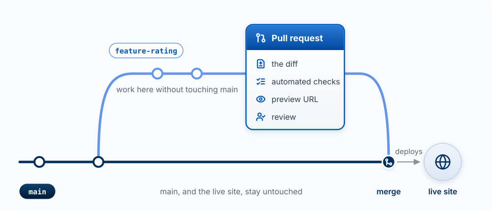
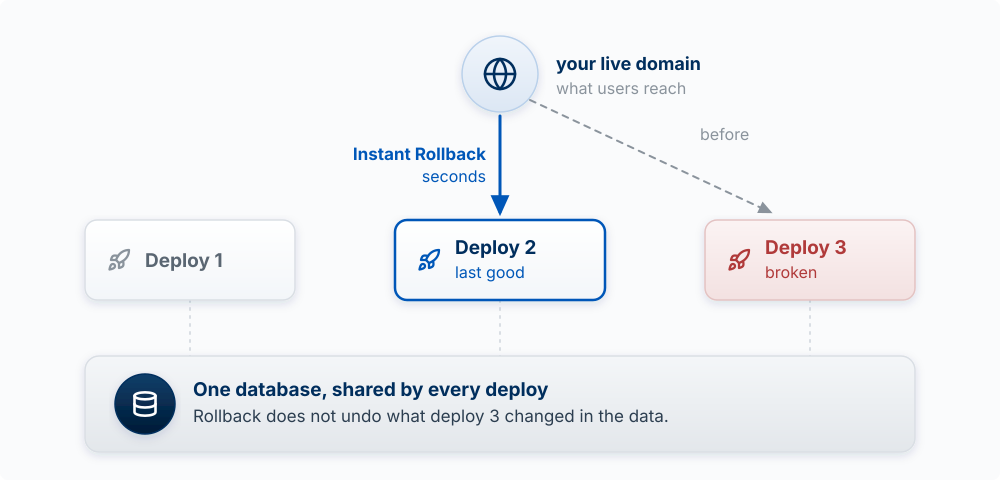

## Why This Matters

Code you cannot change is code you do not own. This chapter is about the practices that keep
a product changeable while an agent edits it many times a day: version control so you can undo
anything, review and automated checks so you find out when something broke before users do, a
way back when a bad change ships anyway, logs so you can see what users hit, and a working
theory of technical debt so you know which mess to clean and which to leave alone.

<!-- learn -->

## Git: A Time Machine Plus Parallel Copies

**The model:** version control is a time machine plus parallel copies. Every commit is a saved
snapshot of the whole project you can return to; every branch is a separate line of snapshots
you can work on without touching the others.

Git tracks every change and GitHub stores a copy of the history online, for backup, sharing,
and review. Changes move through four places:


| Stage | What It Is |
|-------|------------|
| **Working Directory** | The folder on your computer where you (and the agent) edit files |
| **Staging Area** | A list of changes you want to include in your next save |
| **Local Repository** | Your project's history, stored in a hidden `.git` folder |
| **Remote Repository** | A copy of your project on GitHub (or similar) |

A **commit** is one snapshot plus a message saying what changed and why. Small commits with
clear messages are what make the time machine useful: "Add rating to problems" is a point you
can return to; "updates" is not.

**How you start.** Your course repo was created from the builder template, so it already has
git, a GitHub remote, and the course's Claude Code skills. You will rarely type git commands
yourself, because Claude Code commits and pushes when you ask, but you should know what each
one does when you read its output:

| Command | What It Does |
|---------|--------------|
| `gh repo create <name> --template <template> --private --clone` | Make your own repo from a template and download it (done once, at the start) |
| `git status` | See what's changed since last commit |
| `git add .` | Stage all changes for commit |
| `git commit -m "message"` | Save staged changes with a description |
| `git log --oneline` | View commit history |
| `git push` | Upload commits to GitHub |
| `git pull` | Download changes from GitHub |

For a project outside the course, start the same way on GitHub: create a repository, then
clone it.

{fig-alt="The top of a GitHub dashboard. In the left sidebar under Top repositories, a green New button is outlined in red."}

::: {.callout-tip title="Try it"}
Ask Claude Code: *"Show my last ten commits and, for each, one line on what it changed."* Pick
one that is three or more commits back and ask what the app would lose if you returned to it.
Then look at the messages: could a teammate tell from them what happened this week?
:::

<!-- learn -->

## Pull Requests: The Review Gate

**The model:** a branch is a parallel copy where a change can be built and broken safely. A
**pull request** (PR) is a request to merge that branch into `main`, and it is the gate where
the change is shown, checked, and approved before it reaches users.

{#fig-pull-request-gate fig-alt="A git graph. A dark main line runs along the bottom, labeled main, and stays untouched. A lighter branch labeled feature-rating leaves main, collects two commits with the note build and break safely, then passes through a card outlined in blue titled Pull request, listing the diff, automated checks, preview URL, and review. After the card the branch merges back into main, and an arrow labeled deploys leads to the live site." width="100%"}

Because Vercel deploys whatever is on `main` to your live site, `main` should only ever
receive changes that have passed the gate. One change, start to finish:

1. **Branch.** The agent creates a branch, for example `feature-rating`, and commits there.
   `main` and the live site are untouched.
2. **Push and open a PR.** The branch goes to GitHub, and the PR shows the **diff**: every
   line added, removed, or changed.
3. **Automated checks run.** GitHub runs whatever checks the repo defines (tests, lint, a type
   check, a build; see the next section) and marks the PR green or red.
4. **Preview.** Vercel builds the branch and posts a **preview URL** on the PR: a full working
   copy of the app with this change, separate from production.
5. **Review.** You read the diff and click through the preview. You can also ask a second
   Claude Code session to review the diff, which catches more than asking the session that
   wrote it.
6. **Merge.** The branch joins `main`, and Vercel deploys it to production.

```bash
git switch -c feature-rating     # create and switch to a new branch
git add . && git commit -m "Add rating system for problems"
git push -u origin feature-rating
gh pr create --fill              # open the pull request
```

**Worked example.** An agent adds a "rating" column and a star widget. The preview shows the
stars work, but the diff also shows it changed the RLS policy on `problems` to `USING (true)`
to fix an error it hit along the way, which would let every user read every problem. That line
is invisible in the running app and obvious in the diff. This is what the gate is for.

::: {.callout-tip title="Try it"}
For your next feature, ask Claude Code to do the work on a branch and open a pull request
instead of committing to `main`. Before merging, open the preview URL and the diff. Write one
sentence on what the change does and one on anything in the diff you did not expect.
:::

<!-- learn -->

## Automated Checks: Tests, Types, and Lint

**The model:** automated checks catch the obvious, every time, without anyone remembering to
look. They do not catch whether the feature is the right one or whether it works for a real
user; that is still your job.

| Check | What it is, in plain words | What it catches |
|---|---|---|
| **Test** | A small program that runs a piece of your code with a known input and compares the output to the expected answer | A change that broke something that used to work |
| **Type check** | TypeScript reading the code to confirm each value is the kind of data the code expects (a number where a number belongs) | Mismatched data, misspelled field names |
| **Lint** | A program that reads code without running it and flags likely mistakes and inconsistent style | Unused variables, forgotten `await`, risky patterns |
| **Build** | The same production build Vercel runs | Anything that would stop the site from deploying at all |

A test is easier to understand than it sounds. This one says what `formatCurrency` must do:

```javascript
expect(formatCurrency(1234.56)).toBe('$1,234.56');
expect(formatCurrency(0)).toBe('$0.00');
expect(formatCurrency(-50)).toBe('-$50.00');
```

If a later change makes `formatCurrency(0)` return `$0`, the test fails, the PR turns red, and
you find out before a user does.

Tests come in three sizes:

| Type | What It Tests | Speed | Coverage |
|------|---------------|-------|----------|
| **Unit** | Individual functions | Fast | Narrow |
| **Integration** | Components working together | Medium | Medium |
| **End-to-End** | Full user flows, clicking through a real browser | Slow | Broad |

**The testing pyramid:** lots of unit tests, fewer integration tests, even fewer end-to-end
tests, because the big ones are slow and break for reasons unrelated to your change
[@cohn2009agile].

You will not write test files or lint configuration by hand; the agent does. Your job is to ask
for them on the logic that matters (prices, permissions, anything with money or grades) and to
read the test names, which should read like a spec. Two cautions. An agent told to "make the
tests pass" sometimes edits the test instead of the code, which a diff review catches. And
current ESLint (version 9 and later) uses a file named `eslint.config.js`; tutorials that set up
`.eslintrc.json` or run `npx eslint --init` describe the older format. Next.js projects come
with linting already configured.

::: {.callout-tip title="Try it"}
Ask Claude Code: *"Which checks run on this repo, where are they defined, and do they run on
pull requests?"* If none do, ask it to add a GitHub Actions workflow that runs the build and
lint on every PR, then open a PR and watch the check appear.
:::

<!-- learn -->

## Rolling Back a Bad Deploy

**The model:** every deploy needs a way back. Fixing forward under pressure, with users hitting
the bug, is slow and error-prone; returning to the last good version first, then fixing calmly,
is fast.

You have two ways back:

| Way back | What it does | When to use it |
|---|---|---|
| **Vercel Instant Rollback** | Points your live domain back at an earlier production deployment, in seconds. The code in git does not change | First move when the live site is broken. On the free Hobby plan you can roll back to the immediately previous deployment |
| **`git revert <commit>`** | Makes a new commit that undoes an earlier one, keeping the history. Pushing it to `main` deploys the undo | To make the undo permanent in your code |

One Vercel detail matters: after an Instant Rollback, Vercel stops sending new pushes to
production until you promote a deployment again, so the next merge will not go live on its own.
Undo the rollback (promote a good deployment) once the fix is in.

**What rollback cannot undo: data.** Rolling back code does not roll back the database. If the
bad deploy ran a migration that dropped a column, or wrote wrong values into a thousand rows,
the old code now runs against changed data. This is one more reason the schema deserves care
(Chapter 8): make migrations that add things before ones that remove them, and back up before
a migration that deletes.

{#fig-rollback fig-alt="A globe icon labeled your live domain, what users reach, sits above three deployment cards: Deploy 1; Deploy 2, last good, outlined in blue; Deploy 3, broken, tinted red. A faded dashed arrow labeled before runs from the domain to Deploy 3. A solid blue arrow labeled Instant Rollback, seconds, runs from the domain to Deploy 2. All three deploys connect by dotted lines to one wide card below: One database, shared by every deploy. Rollback does not undo what deploy 3 changed in the data." width="100%"}

::: {.callout-tip title="Try it"}
On a preview or a throwaway change: merge something harmless, then roll it back in the Vercel
dashboard and confirm the live site changed back. Then ask Claude Code to `git revert` the same
commit, and explain the difference between what the two did.
:::

<!-- learn -->

## See What Is Happening: Logs and Error Reports

**The model:** logs and error reports are how you find out what users hit. You cannot fix what
you cannot see, and most users who hit an error leave without telling you.

A **log** is a line of text your code writes when something happens ("save failed for user
42: 403"). An **error report** is a record of a crash with its context (which page, which
browser, the chain of calls that led to it), collected automatically. Each of the three places
from Chapter 7 keeps its own:

| Where it ran | Where to look | What you find | Catch |
|---|---|---|---|
| Browser | The **console** in the browser's developer tools | Errors in frontend code, failed requests | Only on the machine in front of you; you see a user's console errors only if you reproduce the problem or use an error reporter |
| Your server | **Vercel runtime logs** (project, then Logs) | Errors and `console.log` output from route handlers and server code | Kept for one hour on the Hobby plan, so look soon |
| Database | **Supabase logs** (dashboard, Logs) | Rejected queries, auth failures, RLS denials | Separate from Vercel; check both |
| All of the above, from real users | An **error reporter** such as Sentry | Every crash, grouped and counted, with an email alert | Takes a few minutes to set up; free tier is enough for a student product |

Google's site reliability engineers suggest watching what users feel (requests that fail,
requests that are slow) before anything internal [@beyer2016sre]. At student scale that means:
know when a request fails, and know which one.

**What a useful log line holds:** what happened, where, and an id to trace it ("POST
/api/problems, user 42, 403 from database"). **What it must not hold:** personal or client data,
passwords, tokens, or full request bodies. Server logs are stored by your hosting provider and
readable by anyone on the project (Chapter 8, Secrets and Sensitive Data).

::: {.callout-tip title="Try it: the broken-route drill"}
On a branch, ask Claude Code to make one API route throw an error on purpose. Open the preview,
trigger it, and find the error in the Vercel logs within the hour. Copy the log line into Claude
Code and ask it to explain the cause from the log alone. Then remove the deliberate error. Do it
once now, so the first time you need the logs is not during a real outage.
:::

<!-- learn -->

## What is Technical Debt?

**The model:** choose boring, well-known tools. Every shortcut is a loan with interest; take it
on purpose.

Technical debt is the implicit cost of additional rework caused by choosing an expedient
solution now instead of using a better approach that would take longer.

The metaphor comes from finance: just like financial debt, technical debt [@cunningham1992]:

- **Accumulates interest**: The longer you wait to pay it down, the more expensive it becomes
- **Can be strategic**: Sometimes borrowing makes sense
- **Can be crippling**: Too much debt slows everything down

**Examples of technical debt:**

- Duplicated code across multiple files
- Hard-coded values that should be configurable
- Missing tests for critical functionality
- Components that do too many things
- Outdated dependencies with security vulnerabilities
- No error handling for edge cases

**Debt at agent speed.** An agent writes code faster than any person, so it also borrows faster.
Ask it to fix a bug and it may add a second copy of a function instead of finding the first, or
patch one screen while three others keep the bug. Each choice is small; together they make the
codebase harder for the agent itself to change, because it now has to read and keep consistent
more code than the product needs.

<!-- learn -->

## Strategic vs. Accidental Debt

Not all tech debt is bad. Some is intentional and strategic.

**Strategic (deliberate) debt** makes sense when you are racing to validate that anyone wants
the product, meeting a hard deadline such as a demo, or testing a hypothesis quickly. Example:

> "We know this data model won't scale past 10,000 users, but we need to launch next week to test demand. If it works, we'll rebuild the database layer."

The key: you know you are taking on debt, and you have a plan to address it.

**Accidental (inadvertent) debt** happens when nobody knew a better approach, requirements
changed after the code was written, quick fixes became permanent, or the design was never
written down (for an agent, never put in CLAUDE.md). Example:

> "I didn't realize there was already a date formatting utility, so I wrote another one. Now we have three different date formatters and they don't all produce the same output."

<!-- learn -->

## The Tech Debt Quadrant [@fowler2009]

| | Reckless | Prudent |
|---|----------|---------|
| **Deliberate** | "We don't have time for tests" | "Ship now, refactor later" |
| **Inadvertent** | "What's a design pattern?" | "Now we know how we should have built it" |

**Prudent deliberate debt** is often justified. It's a conscious business decision.

**Reckless inadvertent debt** is the most dangerous: you don't even know you're accumulating it.

<!-- learn -->

## When to Pay Down Tech Debt

The answer isn't "always" or "never". It depends on context.

**Pay it down when:** the debt is blocking new features; you are about to change code in that
area anyway; it is causing bugs or slowness; or security is involved.

**Defer payment when:** you are still finding out whether anyone wants the product; the code
might be deleted soon (pivoting); the cost of cleaning up exceeds the benefit; or a hard
deadline has real consequences.

**The Boy Scout Rule:** Leave the code better than you found it [@martinrc2008clean]. When you're
working in an area, clean up a little. Incremental improvements compound over time.

**Two principles worth asking the agent to follow.** **DRY (Don't Repeat Yourself)**: each piece
of knowledge should exist in exactly one place [@hunt1999pragmatic]. If "is this a student?" is
checked in three places, the three will drift apart; one `isStudent(user)` function that the
others call cannot. **Single responsibility**: each function or component should do one job
[@martinrc2008clean], so a sign-up handler calls separate steps (validate, save, send the welcome
email) rather than doing all of them inline. Both make the next change touch one place.
**Refactoring** is changing code's structure without changing what it does, and it is safe only
when tests or a careful preview confirm the behavior stayed the same.

::: {.callout-tip title="Try it"}
In your next sprint review, name one deliberate shortcut you took (what you borrowed, and when
you plan to repay it) and one accidental mess you found. Ask Claude Code: *"Find duplicated logic
in this repo: the same rule or calculation written in more than one place."* Pick one result and
decide, using the lists above, whether to pay it down now or later.
:::

<!-- learn -->

## Key Concepts

- **Commit**: a saved snapshot of the project, with a message.
- **Branch**: a parallel line of commits, where changes are built without touching `main`.
- **Pull request**: the review gate where a branch's diff is checked, previewed, and approved
  before it merges.
- **Diff**: the lines a change adds, removes, or edits.
- **Preview deployment**: a working copy of the app for one branch, separate from production.
- **Automated checks**: tests, type check, lint, and build, run on every pull request.
- **Unit, integration, end-to-end tests** and the **testing pyramid**.
- **Instant Rollback and `git revert`**: two ways back from a bad deploy; neither undoes data.
- **Logs and error reports**: browser console, Vercel runtime logs, Supabase logs, an error
  reporter such as Sentry.
- **Technical debt**: the cost of rework from choosing a quick solution over a better one.
- **Strategic vs. accidental debt**: a deliberate loan with a plan, or a mess nobody chose.
- **Boy Scout Rule**: leave code better than you found it.
- **DRY and single responsibility**: one place for each piece of knowledge, one job per piece
  of code.
- **Refactoring**: improving structure without changing behavior.

<!-- learn -->
