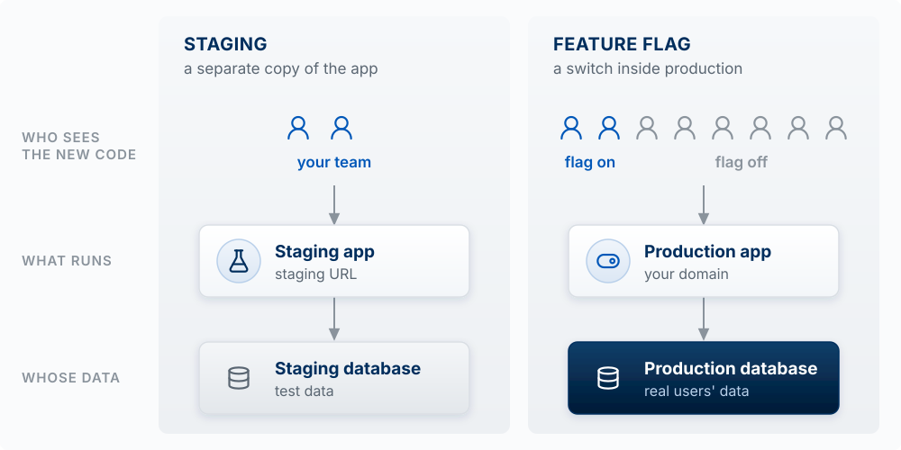

## Why This Matters

If you cannot safely change your code, you no longer control your product. This chapter is about
the practices that keep a product changeable while an agent edits it many times a day: version
control so you can undo anything, pull requests and automated checks so you find out when
something broke before users do, separate environments so you can try a change before users see
it, a way back when a bad change ships anyway, and logs so you can see what users hit.
[Chapter 9b](09b-tests-and-tech-debt.qmd) covers the tests those checks run and how to decide
which messy code to clean up and which to leave alone.

<!-- learn -->

## Git: A Time Machine Plus Parallel Copies

**The model:** version control is a time machine plus parallel copies. Every commit is a saved
snapshot of the whole project you can return to; every branch is a separate line of snapshots
you can work on without touching the others.

Git tracks every change and GitHub stores a copy of the history online, for backup, sharing,
and review. Changes move through four places:


| Stage | What It Is |
|-------|------------|
| **Working Directory** | The folder on your computer where you (and the agent) edit files |
| **Staging Area** | A list of changes you want to include in your next save |
| **Local Repository** | Your project's history, stored in a hidden `.git` folder |
| **Remote Repository** | A copy of your project on GitHub (or similar) |

A **commit** is one snapshot plus a message saying what changed and why. Small commits with
clear messages are what make the time machine useful: "Add rating to problems" is a point you
can return to; "updates" is not.

**How you start.** Your course repo was created from the builder template, so it already has
git, a GitHub remote, and the course's Claude Code skills. You will rarely type git commands
yourself, because Claude Code commits and pushes when you ask, but you should know what each
one does when you read its output:

| Command | What It Does |
|---------|--------------|
| `gh repo create <name> --template <template> --private --clone` | Make your own repo from a template and download it (done once, at the start) |
| `git status` | See what's changed since last commit |
| `git add .` | Stage all changes for commit (when another session shares the folder, stage files by name instead; see below) |
| `git commit -m "message"` | Save staged changes with a description |
| `git log --oneline` | View commit history |
| `git push` | Upload commits to GitHub |
| `git pull` | Download changes from GitHub |

For a project outside the course, start the same way on GitHub: create a repository, then
clone it.

{fig-alt="The top of a GitHub dashboard. In the left sidebar under Top repositories, a green New button is outlined in red."}

**Commit only the files you touched.** When two Claude Code sessions share one folder, `git add -A` or
`git add .` stages the other session's half-finished files along with yours. Stage files by name
(`git add app/page.tsx`). VS Code has the same problem: clicking Commit with nothing staged
commits every changed file. Click the `+` on your file's row first, or turn off
`git.enableSmartCommit` in Settings. The Agent Team Kit's
[hands-on edits guide](https://github.com/ai-foundry-byu/agent-team-kit/blob/main/docs/HANDS-ON-EDITS.md) covers both.

::: {.callout-tip title="Try it"}
Ask Claude Code: *"Show my last ten commits and, for each, one line on what it changed."* Pick
one that is three or more commits back and ask what the app would lose if you returned to it.
Then look at the messages: could a teammate tell from them what happened this week?
:::

<!-- learn -->

## Pull Requests: The Review Gate

**The model:** a branch is a separate line of commits where a change can be built and tested
without touching `main`. A **pull request** (PR) is a request, made on GitHub, to merge that
branch into `main`. While the pull request is open, automated checks test the change, Vercel
builds a preview of it, and a reviewer reads it. Nothing reaches `main`, or your live site,
until someone merges the pull request.

{#fig-pull-request-gate fig-alt="A timeline in seven numbered steps, left to right, with one horizontal lane per participant: you and Claude Code, GitHub Actions (automated checks), Vercel, the reviewer (a teammate, or you), and the repository (on your laptop and on GitHub). Steps 1 to 3, in the you and Claude Code lane: branch, commits, then push and open PR. Step 4: in the GitHub Actions lane a green check labeled pass or fail, and in the Vercel lane an eye icon labeled preview URL. Step 5, in the reviewer lane: reads diff, approves. Steps 4 and 5 sit inside a lightly shaded column, the time the pull request is open. Step 6, in the you and Claude Code lane: merge, after approval. Step 7, in the Vercel lane: live site, reached by an arrow labeled deploys that rises from the end of main. In the repository lane, a dark main line runs the full width. A lighter branch labeled feature-rating leaves main at step 1, collects two commits, passes through a blue box labeled pull request, and merges back into main at step 6. A bracket under main from step 1 to step 6 reads: main and the live site unchanged." width="100%"}

Five participants take part. **You and Claude Code** work on your laptop: the agent writes the
code and runs the git commands, and you decide what to build and when to merge. **GitHub**
stores the repository online and shows the pull request as a web page. **GitHub Actions** is
GitHub's service for running commands on GitHub's computers; here it runs your automated checks.
**Vercel** builds and hosts your app. The **reviewer** is a teammate, or you when you work
alone. One change, start to finish, with the numbers from @fig-pull-request-gate:

1. **Branch.** Claude Code creates a branch named `feature-rating` on your laptop.
2. **Commits.** The agent adds a `rating` column and a star widget and saves the work as
   commits on the branch. `main` and the live site are untouched.
3. **Push and open the pull request.** `git push` copies the branch from your laptop to GitHub,
   and `gh pr create` opens the pull request. Its page shows the **diff**: every line added,
   removed, or changed, compared with `main`.
4. **Checks and preview.** Both start on their own when the branch reaches GitHub. GitHub
   Actions runs the checks the repo defines (tests, lint, a type check, a build; see
   [Automated Checks](#automated-checks-tests-types-and-lint) below) and marks the pull request
   with a green check or a red X. Vercel builds the branch and posts a **preview URL** on the
   pull request: a working copy of the app with this change, at its own address, separate from
   the live site.
5. **Review.** The reviewer reads the diff and clicks through the preview, then approves or
   leaves comments. GitHub does not let you approve your own pull request, so when you work
   alone, the review is you reading the diff and the preview before you merge. Ask a second
   Claude Code session to review the diff too; it catches more than the session that wrote it.
   A comment or a red check sends the work back to step 2: the agent fixes the problem, commits,
   and pushes to the same branch, and the checks, the preview, and the diff on the pull request
   update.
6. **Merge.** You click **Merge pull request** on GitHub, or have Claude Code run
   `gh pr merge`. The branch's commits join `main`. A red check does not block this button
   unless the repo is set to require passing checks, so look before you click.
   Who clicks it is a team convention. GitHub lets anyone with write access to the repo merge,
   once any approvals the repo requires are in. Often the author merges after the reviewer
   approves, since the author knows when the change is ready to go live; some teams have the
   reviewer merge instead. In a solo project or a pair, the author usually merges.
7. **Deploy.** Vercel sees the new commit on `main` and deploys it to the live site.

```bash
git switch -c feature-rating     # 1. create and switch to a new branch
git add . && git commit -m "Add rating system for problems"   # 2. commit
git push -u origin feature-rating                              # 3. copy the branch to GitHub
gh pr create --fill              # 3. open the pull request
gh pr merge                      # 6. merge, after the checks and the review
```

**Worked example.** In step 5 of this change, the preview shows the stars work. The diff also
shows that the agent changed the row-level security policy on `problems` to `USING (true)` to
fix an error it hit along the way, which would let every user read every problem. That line is
invisible in the running app and plain in the diff. The reviewer leaves a comment, the agent
restores the policy in a new commit, and only then is the pull request merged. Without the pull
request, the `USING (true)` line would have gone straight to `main` and the live site.

Words used in this section:

| Term | What it means |
|---|---|
| `main` | The branch your live site is built from; Vercel deploys every new commit on it |
| Branch | A separate line of commits that starts from `main` and does not change it |
| Commit | A saved snapshot of the project, with a message saying what changed |
| Push | Copying commits from your laptop to the repository on GitHub |
| Pull request (PR) | A page on GitHub that asks to merge one branch into another and holds the diff, checks, preview, and review |
| Diff | The list of every line added, removed, or changed, compared with `main` |
| Checks | Commands, such as tests and a build, that GitHub Actions runs on a pull request and marks pass or fail |
| Preview URL | The address of a separate copy of the app, built by Vercel from the branch |
| Review | A person reading the diff and the preview, then approving or leaving comments |
| Merge | Adding the branch's commits to `main`, which starts a deploy to the live site |

::: {.callout-tip title="Try it"}
For your next feature, ask Claude Code to do the work on a branch and open a pull request
instead of committing to `main`. Before merging, open the preview URL and the diff. Write one
sentence on what the change does and one on anything in the diff you did not expect.
:::

<!-- learn -->

## Automated Checks: Tests, Types, and Lint

**The model:** automated checks catch the obvious, every time, without anyone remembering to
look. They do not catch whether the feature is the right one or whether it works for a real
user; that is still your job.

| Check | What it is, in plain words | What it catches |
|---|---|---|
| **Test** | A small program that runs a piece of your code with a known input and compares the output to the expected answer (see [Tests: Code That Checks Your Code](09b-tests-and-tech-debt.qmd#tests-code-that-checks-your-code) in Chapter 9b) | A change that broke something that used to work |
| **Type check** | TypeScript reading the code to confirm each value is the kind of data the code expects (a number where a number belongs) | Mismatched data, misspelled field names |
| **Lint** | A program that reads code without running it and flags likely mistakes and inconsistent style | Unused variables (named values the code never reads), a forgotten `await` (the word that makes code wait for an answer), risky patterns |
| **Build** | The same production build Vercel runs | Anything that would stop the site from deploying at all |

Tests run your code. The type check and lint read it without running it, so they are fast and
catch a different class of mistake. The build is the last check: if it fails on a pull request,
it would fail on Vercel. Run on every pull request, the four together mean a red mark appears on
the PR before a user sees the problem.

You will not write lint configuration by hand either; the agent does. One caution: current ESLint
(version 9 and later) uses a file named `eslint.config.js` (or `.mjs`); tutorials that set up
`.eslintrc.json` or run `npx eslint --init` describe the older format. A project started with
`create-next-app` comes with ESLint set up by default: an `eslint.config.mjs` file and a `lint`
script in `package.json`. Since Next.js 16 you run it with `npm run lint`, because the old
`next lint` command was removed and `next build` no longer runs the linter
[@nextjs2026installation].

::: {.callout-tip title="Try it"}
Ask Claude Code: *"Which checks run on this repo, where are they defined, and do they run on
pull requests?"* If none do, ask it to add a GitHub Actions workflow that runs the tests, the
build, and lint on every PR, then open a PR and watch the check appear.
:::

<!-- learn -->

## Trunk-Based Development: Small Branches, Merged Often

**The model:** keep one shared line of work that could be released at any moment, and get every
change into it within a day or two. This practice is called **trunk-based development**, and the
shared line is called the **trunk**. In your repo, the trunk is `main`. Paul Hammant's site
*Trunk Based Development* [@hammant_tbd] describes the practice in detail; this section follows
it.

The site describes two ways to get work into the trunk. In the first, each developer **commits
straight to the trunk**, with no branch: they pull the latest trunk, run the full build on their
own computer, and push only if it passes. The site describes this as the style of very small
teams whose members know what the others are working on. In the second, each change goes on a
**short-lived feature branch**, worked on by one developer (or two when pair programming), that
lasts no more than a couple of days and comes back to the trunk as a pull request, where a build
server (a computer that runs the checks, such as GitHub Actions) runs them before the change lands. The site says a team of 16 or more people is
more productive with short-lived branches. Both styles are trunk-based: the trunk is the
one place everyone's work meets, and nothing stays away from it for long.

This course uses short-lived branches even when you work alone, because the pull request is
where GitHub Actions runs the checks and Vercel builds the preview (@fig-pull-request-gate), and
it gives you a diff to read before anything reaches the live site.

The alternative to both styles is a **long-lived branch**: a feature built on its own branch for
more than a couple of days, often for weeks, and merged only when it is finished. While that
branch is open, `main` keeps changing, so the two drift apart. When the branch finally comes
back, the merge has to reconcile all the changes on both sides at once. Wherever both sides
changed the same lines, git stops with a **merge conflict**, and someone has to decide by hand
which version is right. With two long-lived branches open, each also has to be reconciled with
the other, and problems that appear only when the two are combined show up together, at the end.

{#fig-trunk-based fig-alt="Four panels stacked on one shared time axis of three days, labeled Day 1, Day 2, and Day 3. In every panel a dark line labeled main runs left to right, and each row above or below it is labeled with the person or session that made the branches in that row. Filled dark dots on main are commits on main; hollow dots on a branch are commits on that branch. Panel 1, solo, straight to main: a row labeled You sits above main, and seven short arrows point from it down to seven commits on main, spread over the three days, with no branches. Panel 2, solo, two Claude Code sessions: a row labeled Session 1 above main and a row labeled Session 2 below it. Each session makes three short branches, one per day; each leaves main and merges back the same day, and on each day the two sessions' branches overlap in time. Panel 3, team of two: Ana's row above main, Ben's row below. Ana's branch ratings-1 runs through most of Day 1 and merges at the end of it. Ben's branch fix-signup starts midway through Day 1 and merges early on Day 2. A marker on main just after that merge reads: Ana pulls main, gets Ben's fix. Ana's branch ratings-2 then starts there and merges late on Day 2. Ben's branch signup-email starts on Day 3, after that merge, and merges the same day. Panel 4, team of two, long-lived branches: Ana's branch and Ben's branch both leave main at the start of Day 1, collect ten commits each over all three days while main gets no commits, and both merge into main at one point at the end of Day 3, marked with a red warning circle labeled merge conflicts." width="100%"}

### What it looks like solo

The top panel of @fig-trunk-based is the simplest form: you, alone, committing to `main`. Each
commit is pushed to GitHub, and Vercel deploys it to the live site.

The second panel is how you will usually work alone in this course: one person with two Claude
Code sessions, each in its own worktree (Chapter 2), and each working on its own branch. On Day 1,
session 1 builds a search box on one branch while session 2 fixes the empty state of the home page
on another. When a session finishes its task, it pushes the branch and opens a pull request; you
read the diff and the preview and merge it, the same day. Before a session starts its next task,
ask it to pull `main` from GitHub and create the new branch from it, so the new branch starts
from a `main` that already holds both sessions' merged work. A session that keeps one branch
open for the whole week is a long-lived branch, even though nobody else is in the repo.

### What it looks like on a team

The third panel is a team of two, Ana and Ben, sharing one repository on GitHub, each with a copy
on their own laptop. Ana is adding ratings; Ben is fixing a bug in sign-up.

- **Day 1.** Ana creates `ratings-1` and adds the `rating` column and the code that saves a
  rating. She opens a pull request at the end of the day, Ben reads the diff, and Ana merges it.
  Midway through the day Ben creates `fix-signup` for the sign-up bug.
- **Day 2.** Ben opens his pull request in the morning, Ana reads it, and Ben merges it. Before
  starting her next task, Ana pulls `main`: git copies the newest commits from GitHub to her
  laptop, so her copy now includes Ben's fix. She creates `ratings-2` from it, for the screen
  that shows each problem's average rating, and merges it late in the day.
- **Day 3.** Ben pulls `main`, which now includes both of Ana's branches, and creates
  `signup-email` from it.

Every branch changed a few files and lasted a day or less, so the other person's work was never
more than a day old in anyone's copy. When two branches do touch the same lines, the merge
conflict is a few lines long, and the person merging can tell which version is right. The bottom
panel is the same two people with one branch each, kept open for three days: neither sees the
other's work until both merge at the end of Day 3, and every place the two branches changed the
same lines is a conflict to settle at once.

### Straight to main, or a short branch?

Committing straight to `main` is reasonable when all three of these hold: you work alone, with no
second session running in the repo; the change is small, such as fixing a typo in a page; and you
run the checks on your laptop first (`npm test` and `npm run build`). Vercel deploys a commit on
`main` as soon as it reaches GitHub, so there is no preview and nobody reads the diff before users
see it.

The default in this course is a short branch with a pull request, for every change and even when
you work alone. The pull request runs the checks on GitHub's computers instead of relying on you to
remember them, builds a preview you can click through, and shows the full diff, which is where a
line like `USING (true)` gets caught. When a second person or a second Claude Code session works
in the repo, use a short branch every time.

### The four rules

The practice has four rules:

1. **The trunk is always releasable.** `main` should be in a state you could deploy at any
   moment. In this course that is literal: Vercel deploys whatever is on `main`.
2. **Branches are short-lived.** One branch per task, worked on by one person (or one agent
   session), merged within a day or two, then deleted. The site warns that a branch kept
   longer than two days risks becoming a long-lived branch, and it asks everyone to get work
   into the trunk at least once every 24 hours.
3. **Every merge still passes the gate.** A short branch goes through the pull request and its
   checks like any other. Committing straight to `main` skips that gate, so keep it for the
   narrow case described above: alone, a small change, checks run on your laptop first.
4. **Unfinished work merges behind a feature flag.** A feature too large for one or two days is
   merged in small pieces, switched off. A **feature flag** is a setting the code checks before
   showing a feature (for example, `if (flags.ratings)`). With the flag off, the new code is on
   `main` and deployed, but users do not see it; turn the flag on when the last piece has
   merged. The site cautions that flags tend to be forgotten after a feature ships, so remove
   each flag, and the code path it switched off, once the feature is on for everyone.

**Why it fits building with agents.** An agent can write a thousand changed lines in a few
minutes, and a thousand-line diff is too long to review line by line. The `USING (true)` line
in the pull request example above is easy to see in a diff of thirty lines and easy to miss in a diff
of a thousand. One task per branch keeps each diff small enough to read. The same holds for
parallel sessions: two worktree sessions that each keep one branch for a week are two long-lived
branches, and they end in the kind of merge shown in the bottom panel of @fig-trunk-based. Small
merges also keep rollback (later in this chapter) simple: when a deploy
breaks, it changed one thing, so you know which commit to `git revert`. Revert is for a change
that broke something. The site is specific that code which is not ready should not be merged
and then backed out; it belongs behind a flag.

Words used in this section:

| Term | What it means |
|---|---|
| Trunk | The one shared branch everyone's work goes into; in your repo, `main` |
| Trunk-based development | Getting every change into the trunk within a day or two, by committing to it or by a short-lived branch |
| Commit straight to the trunk | Committing on `main` with no branch and no pull request |
| Short-lived feature branch | A branch for one task, made by one person or one session, merged through a pull request within a day or two |
| Long-lived branch | A branch kept open for more than a couple of days, often weeks, and merged only when the feature is finished |
| Pull `main` | Copying the newest commits on `main` from GitHub to your laptop (`git pull`), so a new branch starts from everyone's latest work |
| Merge conflict | Two branches changed the same lines, and git stops until a person chooses which version to keep |

::: {.callout-tip title="Try it"}
Ask Claude Code: *"List every branch in this repo, on my laptop and on GitHub, with the date of
its last commit and whether it has been merged into main."* For each unmerged branch older than
two days, decide whether to finish and merge it now or split it into smaller pieces. Then, before your next feature, ask: *"Split this feature into pull requests that
can each be finished and merged within a day. For any piece that would show users something
unfinished, explain how a feature flag would keep it hidden."* Build the first piece on its own
branch, merge it, and delete the branch.
:::

<!-- learn -->

## Environments: Where Your Code Runs and Which Data It Touches

**The model:** an **environment** is one running copy of your app. Three things define it: which
code runs (which branch or commit), where it runs (your laptop or Vercel), and which settings it
reads (its environment variables). The settings include the database address and keys, so the
database an environment reads and writes is a separate choice from the code it runs. You make
that choice in the settings, one environment at a time.

### The three environments you already have

Vercel names three environments by default: Local Development, Preview, and Production
([Vercel: Environments](https://vercel.com/docs/deployments/environments)). You have been using all three since Chapter 7.

| Environment | Which code | Where and how it runs | Which settings it reads |
|---|---|---|---|
| **Your laptop** (local) | Whatever branch you have checked out, including edits you have not committed | `npm run dev` starts a **development server** on your machine at `localhost:3000`. Your pages and your server code both run on the laptop | `.env.local`, a file in the project folder that git ignores |
| **Preview** | The latest commit on one branch or pull request | Vercel builds that commit and serves it at a preview URL. Every push to a branch other than `main`, and every pull request, gets one | Vercel's **Preview** environment variables |
| **Production** | `main` | Vercel builds `main` and serves it at your domain | Vercel's **Production** environment variables |

Two details about Vercel matter here. Each preview has a URL for that branch, which always shows
the branch's latest commit, and a URL for each commit. And a change to an environment variable in
the Vercel dashboard applies only to deployments made after the change, so after you change one,
redeploy ([Vercel: Environment variables](https://vercel.com/docs/environment-variables)).

**A development server and a production build behave differently.** `npm run dev` runs
`next dev`, which compiles each page the first time you open it, updates the page in the browser
when you save a file, and shows detailed error messages. Vercel runs `next build` instead, which
compiles the whole app at once into an optimized production build; `npm start` (`next start`)
runs that build on your laptop ([Next.js CLI](https://nextjs.org/docs/app/api-reference/cli/next); [local development](https://nextjs.org/docs/app/guides/local-development)). Some mistakes appear only in the
build. `next build` stops on a TypeScript type error, for example, even when every page worked in
the development server ([Next.js: TypeScript](https://nextjs.org/docs/app/api-reference/config/typescript)). Values in variables that start with `NEXT_PUBLIC_`
are written into the browser code when the app is built, so a build keeps the values it was built
with ([Next.js: environment variables](https://nextjs.org/docs/app/guides/environment-variables)). Before you push, run `npm run build` on your laptop; that is the Build row in
[Automated Checks](#automated-checks-tests-types-and-lint).

### Which database? The settings decide

Your code reads the Supabase address and keys from environment
variables (`NEXT_PUBLIC_SUPABASE_URL`, the publishable key, and on the server the secret key, from
Chapter 7) and talks to whichever project those values name. That has one consequence that is
easy to miss: **if you copied your one Supabase project's keys into `.env.local` and into
Vercel's Preview variables, your laptop and every preview read and write the production
database.** A test row you add on your laptop appears in front of real users. A seed script run on
your laptop writes into the live tables. A preview of an unfinished branch, opened by a reviewer,
changes real users' rows. Your laptop often also holds the secret key, which skips row-level
security, so a mistake there reaches every user's data.

{#fig-environments fig-alt="A diagram with four columns: where it runs, code, settings, database. Three rows. Your laptop, at localhost:3000: the code is any branch, run with npm run dev; the settings come from a local file, .env.local. Preview, at a preview URL: the code is one branch, built by Vercel; the settings are Vercel's Preview variables. Production, at your domain: the code is main, built by Vercel; the settings are Vercel's Production variables. On the right is one tall box: Production database, real users' data. Production's settings connect to it with a solid dark arrow. The laptop row and the preview row each have two arrows: a short gray arrow to a small database labeled own database, and a red dashed arrow, labeled with production keys, to the production database." width="100%"}

Chapter 8 gave the rule: once real people use your app, stop developing against its database.
There are several ways to give the laptop and the previews a database of their own:

| Option | What it is | What to know | Good for |
|---|---|---|---|
| **One project for everything** | Laptop, previews, and production all use the production database | Nothing to set up | Only until the first real user signs up |
| **A second Supabase project** | A separate hosted project. You apply the same migrations to it, so it has the same tables, and fill it with made-up **seed data** | Supabase's free plan allows two active projects; a free project is paused after a week without activity ([Supabase pricing](https://supabase.com/pricing)) | Your laptop and your previews; it can also serve as staging (below) |
| **Local Supabase** | `supabase start` runs Postgres, sign-in, and storage on your laptop. `supabase db reset` rebuilds the database from your migrations and loads the seed file `supabase/seed.sql` | Needs Docker or a compatible container app. Previews on Vercel cannot reach a database on your laptop ([Supabase local development](https://supabase.com/docs/guides/local-development)) | Your laptop and your tests |
| **Supabase branching** | Supabase creates a separate database for each pull request from your migrations. It starts with no production data | Paid plans only, billed per branch per hour ([Supabase branching](https://supabase.com/docs/guides/deployment/branching)) | A team on a paid plan that wants one database per preview |

Whichever you choose, put that project's address and keys in `.env.local` and in Vercel's Preview
variables, and keep the production keys only in Vercel's Production variables. Then ask the agent
to confirm which project each environment points at (the Try it below).

One more reason the database choice matters: rolling back code does not roll back data. All
production deployments share one database, so after an [Instant
Rollback](#rolling-back-a-bad-deploy) the old code runs against whatever the bad deploy wrote.

### Staging: a copy of production for trying a change

**Staging** is an environment kept as close to production as you can make it, with its own data,
where you try a change before any user sees it. (It has nothing to do with git's staging area from
the Git section, which is a list of changes waiting to be committed.) What makes it useful is how closely it matches
production. It should run the same kind of build (built by Vercel, the way production is), with
every setting production has (set to staging values), the same tables (the same migrations), and
its own database. Each difference from production is a place where "it worked on staging" may not
hold on your live site, so keep the differences few and written down: usually the database and
its keys, plus anything that reaches people outside your team, such as email (sent only to your
team's addresses) and payments (in the payment provider's test mode). A staging site with old
tables, missing settings, or demo accounts unlike any real account tells you little about
production. The Agent Team Kit's [staging twin
spec](https://github.com/ai-foundry-byu/agent-team-kit/blob/main/docs/STAGING-TWIN-SPEC.md)
describes a full version, with a tool that compares the two environments' settings before every
staging deploy; the short form is in [staging is a twin of
production](https://github.com/ai-foundry-byu/agent-team-kit/blob/main/memory-pack/staging-is-a-twin-not-a-demo.md).

There are several ways to set it up on Vercel, and none is the one right answer:

- **Previews pointed at a staging database.** Set Vercel's Preview variables to your second
  Supabase project. Every pull request's preview is then a staging site for that one change. This
  costs nothing extra and works on every plan.
- **A long-lived `staging` branch with its own address.** Create a branch named `staging`, assign
  a domain such as `staging.yourapp.com` to that branch, and add Preview variables scoped to that
  branch; a branch-specific value replaces the general Preview value of the same name. Merge into
  `staging` to try a change, then merge into `main` to release it. Vercel's docs list this for all
  plans, including the free Hobby plan ([Vercel: Environments](https://vercel.com/docs/deployments/environments#setting-up-a-staging-environment)).
- **A custom environment named `staging`.** Vercel's Pro and Enterprise plans let you create an
  environment beside Preview and Production, with its own branch, domain, and variables. The Pro
  plan allows one per project.
- **A staged production deployment.** Vercel can build a production deployment without pointing
  your domain at it, so you can check it at its own URL and then promote it. It uses the
  Production variables, so it reads and writes the production database. It checks the build, and
  it gives no protection to the data.

What goes in the staging database: made-up seed data, or your own team's accounts and what they
own. Do not copy other users' personal data into staging (Chapter 8, Secrets and Sensitive Data).
When a change passes staging, release the same commit you tried. On a busy `main`, later commits
may have arrived since you tested, and they would go to production untried
([promote the staged commit](https://github.com/ai-foundry-byu/agent-team-kit/blob/main/memory-pack/promote-the-staged-commit.md)).

### Feature flags: one deploy, and a setting for who sees it

A **feature flag** (the trunk-based rule 4 above, and the release flag of Chapter 12) is a value
the code checks before it shows new behavior. The new code is deployed to production for everyone,
and the flag decides, for each request, whether this user gets the new behavior. Turning the flag
on for someone is a **release**; it needs no new deploy. Turning it off stops the new behavior at
the next request.

Three ways to build one, from simplest to most capable:

| Where the flag's value is kept | How it works | Changing it |
|---|---|---|
| **An environment variable**, such as `FEATURE_RATINGS=on` | On or off for everyone in one environment. You can have it on in Preview and off in Production | Change the variable in Vercel and redeploy |
| **A table in your database**, such as `feature_flags` with a flag name and the users or groups it is on for | Your server reads the table on each request, so the flag can be on for you, then for twenty beta users, then for everyone | Edit a row; the next request sees it |
| **A hosted flags service** | The same idea with a dashboard, percentage rollouts, and a history of changes | Click in the dashboard |

A database table is enough for a student product; no service is required. Check the flag on the
server as well as in the interface, because a hidden button over a working route can still be
called (Chapter 12). Keep environment variables for switches meant to stay, such as one that turns
off an expensive AI feature during an outage
([environment flags are for what stays](https://github.com/ai-foundry-byu/agent-team-kit/blob/main/memory-pack/env-flags-are-for-what-stays.md)).
Do not use a release flag for something permanent, such as what a paid plan includes or what an
admin may see; those are permissions, and they belong in your data and row-level security
([pick the lever by lifetime and owner](https://github.com/ai-foundry-byu/agent-team-kit/blob/main/memory-pack/pick-the-lever-by-lifetime-and-owner.md)).
When the feature is on for everyone, remove the flag and the old code path, and check first that
no other part of the code still runs with the flag off
([removing a flag](https://github.com/ai-foundry-byu/agent-team-kit/blob/main/memory-pack/removing-a-flag-check-silent-callers.md)).
The kit's [release flags spec](https://github.com/ai-foundry-byu/agent-team-kit/blob/main/docs/RELEASE-FLAGS-SPEC.md)
covers the full design.

Chapter 12 shows how the same flag lets you release to one group of users at a time
(@fig-deploy-vs-release). One warning when you put an existing feature behind a new flag: a flag
nobody has turned on is off, so the deploy that adds it hides the feature from everyone who was
using it. Turn the flag on for current users before that deploy goes out
([check before flagging a shipped feature](https://github.com/ai-foundry-byu/agent-team-kit/blob/main/memory-pack/check-before-flagging-a-shipped-feature.md)).

### Staging or a flag?

They answer different questions, about different people's data.

{#fig-staging-vs-flags fig-alt="Two panels side by side with the same three rows, labeled on the left: who sees the new code, what runs, and whose data. Left panel, Staging, a separate copy of the app: two blue user icons labeled your team; an arrow down to a card, Staging app, staging URL; an arrow down to a card, Staging database, test data. Right panel, Feature flag, a switch inside production: eight user icons, the first two blue and labeled flag on, the other six gray and labeled flag off; an arrow down to a card, Production app, your domain, with a switch icon; an arrow down to a dark card, Production database, real users' data." width="100%"}

| | Staging | Feature flag |
|---|---|---|
| Where the new code runs | A separate copy of the app | Production |
| Whose data it reads and writes | Test data, or your team's own accounts | Real users' data |
| Who sees it | Your team | The users the flag is on for |
| What it can tell you | Whether the change works in a production-like setup before anyone uses it, including changes a flag cannot hide | Whether real users can use it and want it, with real data and real traffic |
| How you undo it | Nothing reached production; fix it and try again | Turn the flag off. New use stops at the next request; rows already written and emails already sent stay |

To choose, ask two questions about the change
([flag or staging is whose data](https://github.com/ai-foundry-byu/agent-team-kit/blob/main/memory-pack/flag-or-staging-is-whose-data.md)):

1. **Does it take effect for everyone the moment it deploys?** A migration, a dependency upgrade, a
   changed environment variable, or an edit to code every page uses runs before any flag is
   checked, so a flag cannot hide it. Try it on staging first.
2. **If the first people who get it hit the worst case, whose data is harmed, and can it be
   undone?** If the harm lands on your own team's data or can be reversed, a flag is enough: turn
   it on for yourself in production. If it could do something that cannot be undone to someone
   outside your team, such as email real users or charge a card, try it on staging first, then
   release it behind a flag.

A change that only renames or moves code needs tests; there is nothing to release. Many teams use
both: staging for the deploy, a flag for the release.

### Worked example: a ratings feature, from laptop to everyone

The problem tracker from Chapter 8 gets a 1 to 5 rating on each problem. The repo uses a second
Supabase project as its staging database, and Vercel's Preview variables point at it.

1. **Laptop.** The agent creates the branch `feature-rating`. `.env.local` points at a local
   Supabase started with `supabase start`. The agent writes a migration that adds a `rating`
   column, and `supabase db reset` applies it and loads the seed data. The new star widget is
   wrapped in a check of a `ratings` flag, and the seed data turns that flag on for the test
   account. You click through with `npm run dev`, then run `npm run build`.
2. **Preview, on the staging database.** The agent applies the migration to the staging project
   (`supabase db push` with that project linked), pushes the branch, and opens a pull request.
   Vercel builds the preview, which reads the Preview variables and so uses the staging database.
   The checks run; you click through the preview URL. Because the change includes a migration,
   this is the step where the migration first runs on a database with the same tables as
   production.
3. **Production, flag off.** The migration only adds a column, so the code already in production
   keeps working after it runs. Apply it to production, then merge. Vercel deploys `main`. The
   flag is off for everyone except you, so users see no change. Sign in on your domain and check
   the feature with your own account.
4. **Release.** Add your twenty beta users to the `ratings` flag. Watch the Vercel and Supabase
   logs for a few days, then turn it on for everyone.
5. **Clean up.** In a small pull request, delete the flag check and the old path, and remove the
   flag's row.

If step 3 breaks the live site, Instant Rollback returns the old code, and the new column stays
in the database. The old code ignores a column it does not use, which is why migrations add before
they remove.

Words used in this section:

| Term | What it means |
|---|---|
| Environment | One running copy of the app: which code, where it runs, which settings it reads |
| Local | Running on your own laptop |
| Development server | What `npm run dev` starts: compiles pages as you open them, updates on save, detailed errors |
| Build | What `npm run build` (`next build`) makes: the whole app compiled once for production; Vercel runs it on every deploy |
| Preview deployment | A copy of the app built by Vercel for one branch or pull request, at its own URL |
| Production | The copy at your domain that real users use, built from `main` |
| Environment variable | A setting the code reads at run time or build time, such as a database address or key, set per environment (`.env.local` on your laptop, Preview and Production in Vercel) |
| Staging | An environment kept as close to production as possible, with its own data, for trying a change before users see it |
| Feature flag | A value the code checks to decide which users get new behavior |
| Release | Turning a deployed feature on for some or all users |
| Rollback | Pointing your domain back at an earlier deployment; it changes code and leaves data as it is |
| Seed data | Made-up rows loaded into a development or staging database so the app has something to show |

::: {.callout-tip title="Try it"}
Ask Claude Code: *"Which Supabase project does my `.env.local` point at? Compare its project
reference with the one in Vercel's Production variables and tell me whether my laptop uses the
production database. Do not print any key."* Then: *"List my Vercel environment variables for
Development, Preview, and Production (names only, no values) and tell me which database each
environment uses."* If the laptop or the previews use production, pick one option from the
database table above and ask the agent to set it up. For your next feature, decide before you
build it whether it needs staging, a flag, or both, using the two questions above.
:::

<!-- learn -->

## Rolling Back a Bad Deploy

**The model:** every deploy needs a way back. Fixing forward under pressure, with users hitting
the bug, is slow and error-prone; returning to the last good version first, then fixing calmly,
is fast.

You have two ways back:

| Way back | What it does | When to use it |
|---|---|---|
| **Vercel Instant Rollback** | Points your live domain back at an earlier production deployment, in seconds. The code in git does not change | First move when the live site is broken. On the free Hobby plan you can roll back to the immediately previous deployment |
| **`git revert <commit>`** | Makes a new commit that undoes an earlier one, keeping the history. Pushing it to `main` deploys the undo | To make the undo permanent in your code |

One Vercel detail matters: after an Instant Rollback, Vercel stops sending new pushes to
production until you promote a deployment again, so the next merge will not go live on its own.
Undo the rollback (promote a good deployment) once the fix is in.

**What rollback cannot undo: data.** Rolling back code does not roll back the database. If the
bad deploy ran a migration that dropped a column, or wrote wrong values into a thousand rows,
the old code now runs against changed data. This is one more reason the schema deserves care
(Chapter 8): make migrations that add things before ones that remove them, and back up before
a migration that deletes.

This is also why a migration should run on your development copy of the database before the live
one (Chapter 8, The Data Model Is the Skeleton).

{#fig-rollback fig-alt="A globe icon labeled your live domain, what users reach, sits above three deployment cards: Deploy 1; Deploy 2, last good, outlined in blue; Deploy 3, broken, tinted red. A faded dashed arrow labeled before runs from the domain to Deploy 3. A solid blue arrow labeled Instant Rollback, seconds, runs from the domain to Deploy 2. All three deploys connect by dotted lines to one wide card below: One database, shared by every deploy. Rollback does not undo what deploy 3 changed in the data." width="100%"}

::: {.callout-tip title="Try it"}
On a preview or a throwaway change: merge something harmless, then roll it back in the Vercel
dashboard and confirm the live site changed back. Then ask Claude Code to `git revert` the same
commit, and explain the difference between what the two did.
:::

<!-- learn -->

## See What Is Happening: Logs and Error Reports

**The model:** logs and error reports are how you find out what users hit. You cannot fix what
you cannot see, and most users who hit an error leave without telling you.

A **log** is a line of text your code writes when something happens ("save failed for user
42: 403"). An **error report** is a record of a crash with its context (which page, which
browser, the chain of calls that led to it), collected automatically. Each of the three places
from Chapter 7 keeps its own:

| Where it ran | Where to look | What you find | Catch |
|---|---|---|---|
| Browser | The **console** in the browser's developer tools | Errors in frontend code, failed requests | Only on the machine in front of you; you see a user's console errors only if you reproduce the problem or use an error reporter |
| Your server | **Vercel runtime logs** (project, then Logs) | Errors and `console.log` output from route handlers and server code | Kept for one hour on the Hobby plan, so look soon |
| Database | **Supabase logs** (dashboard, Logs) | Rejected queries, auth failures, RLS denials | Separate from Vercel; check both |
| All of the above, from real users | An **error reporter** such as Sentry | Every crash, grouped and counted, with an email alert | Takes a few minutes to set up; free tier is enough for a student product |

Google's site reliability engineers suggest watching what users feel (requests that fail,
requests that are slow) before anything internal [@beyer2016sre]. At student scale that means:
know when a request fails, and know which one.

**What a useful log line holds:** what happened, where, and an id to trace it ("POST
/api/problems, user 42, 403 from database"). **What it must not hold:** personal or client data,
passwords, tokens, or full request bodies. Server logs are stored by your hosting provider and
readable by anyone on the project (Chapter 8, Secrets and Sensitive Data).

::: {.callout-tip title="Try it: the broken-route drill"}
On a branch, ask Claude Code to make one API route throw an error on purpose. Open the preview,
trigger it, and find the error in the Vercel logs within the hour. Copy the log line into Claude
Code and ask it to explain the cause from the log alone. Then remove the deliberate error. Do it
once now, so the first time you need the logs is not during a real outage.
:::

<!-- learn -->

## Key Concepts

- **Commit**: a saved snapshot of the project, with a message.
- **Branch**: a parallel line of commits, where changes are built without touching `main`.
- **Pull request**: the review gate where a branch's diff is checked, previewed, and approved
  before it merges.
- **Diff**: the lines a change adds, removes, or edits.
- **Automated checks**: tests, type check, lint, and build, run on every pull request.
- **Trunk-based development**: one shared `main` (the trunk) that is always releasable, with
  every change merged into it within a day or two, by committing straight to it (solo, small
  changes) or, the course default, through a short-lived branch and a pull request.
- **Trunk**: the one shared branch everyone's work goes into; in your repo, `main`.
- **Pull `main`**: copy the newest commits on `main` from GitHub to your laptop before creating a
  branch, so the branch starts from everyone's latest work.
- **Merge conflict**: two branches changed the same lines, and git needs a person to choose.
- **Feature flag**: a setting that keeps merged but unfinished code hidden from users, or decides
  which users see a deployed feature.
- **Preview deployment**: a working copy of the app for one branch, separate from production.
- **Environment**: one running copy of the app, defined by which code runs, where it runs, and
  which settings (environment variables) it reads; the settings decide which database it uses.
- **Development server vs. production build**: `npm run dev` compiles pages as you open them and
  shows detailed errors; `npm run build` compiles the whole app the way Vercel does, and can fail
  where the development server worked.
- **Staging**: an environment kept as close to production as possible, with its own data, for
  trying a change before users see it.
- **Release**: turning a deployed feature on for some or all users, with a feature flag.
- **Seed data**: made-up rows loaded into a development or staging database.
- **Instant Rollback and `git revert`**: two ways back from a bad deploy; neither undoes data.
- **Logs and error reports**: browser console, Vercel runtime logs, Supabase logs, an error
  reporter such as Sentry.

<!-- learn -->
