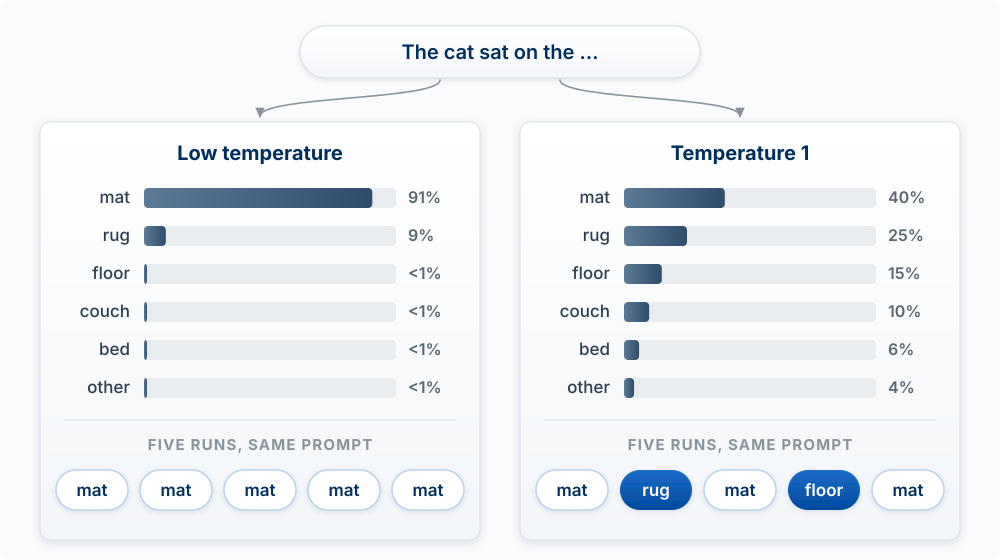
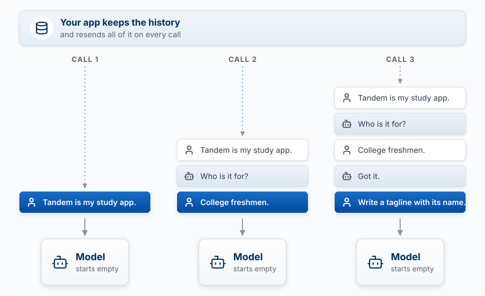

## Why This Matters

You are building products on top of a technology most people treat as magic. Magic is a bad
foundation for product decisions. If you do not know roughly how a model turns your prompt
into text, you cannot reason about why it fails, what it costs, where it will be confidently
wrong, or which problems it is the wrong tool for.

The whole chapter rests on one fact: **a language model is a compressed statistical picture of
text that predicts the next token.** Its fluency, its knowledge, its randomness, and its
confident mistakes all follow from that. The first half of the chapter builds a model from
scratch, one building block at a time, the way Sebastian Raschka does in *Build a Large
Language Model (From Scratch)* [@raschka2024build], the source of most of the figures here. The
second half draws out what each block means for the product you are building. The math sits at
the end, folded away, for anyone who wants it.

<!-- learn -->

## AI and Machine Learning

Artificial intelligence (AI) is the broad idea of computer systems that do tasks we associate
with human intelligence: understanding language, recognizing patterns, making decisions,
generating content. **Machine learning** (ML) is the part of AI where the computer learns from
examples instead of following rules a programmer wrote. You give it many inputs paired with the
outputs that actually went with them, and a training algorithm adjusts the model's numbers
until its predictions match. **Deep learning** is machine learning with large neural networks:
many layers of simple units whose numbers are all learned. Large language models (LLMs) such as
Claude and ChatGPT are deep learning models trained on text.

You will probably never train one of these. You will build on them every week, and a correct
picture of how they are made lets you ask the right questions, spot where AI fits a product
and where it does not, and catch an agent's mistake.

<!-- learn -->

## Building a Language Model from Scratch

Every LLM, from the small GPT you could build on a laptop to the frontier models behind Claude
Code, is assembled from the same six blocks:

| Step | Building block | What it does |
|---|---|---|
| 1 | Tokens | Cuts text into pieces and gives each piece a number |
| 2 | Embeddings | Turns each number into a list of numbers that places it on a map of meaning |
| 3 | Attention | Lets every token take in information from the tokens before it |
| 4 | Next-token prediction | Turns the result into a probability for every possible next token, then picks one |
| 5 | Pretraining | Adjusts billions of numbers until the predictions match huge amounts of real text |
| 6 | Fine-tuning and human feedback | Reshapes a text completer into an assistant that follows instructions |

Steps 1 to 4 are the machine. Steps 5 and 6 are how its numbers get set.

### Step 1: Text becomes tokens

**The model never sees letters or words. It sees tokens: pieces of text, each with an ID
number from a fixed vocabulary.** A token can be a whole common word ("the"), part of a word
("straw" + "berry"), a space plus a word, or a single character. The tokenizer that GPT-2 uses,
which Raschka builds in chapter 2 of his book, has a vocabulary of 50,257 tokens. It is built by
starting from single characters and repeatedly merging the pairs that appear together most often
(byte pair encoding), so common words become one token and rare words break into several.

![Image source: Build a Large Language Model (From Scratch) by Sebastian Raschka [@raschka2024build]](images/tokenization.png)

Tokens are the unit of everything you will pay for and run into:

- **Cost.** APIs bill per token in and per token out.
- **Speed.** The model writes one token at a time, so a long answer takes longer than a short one.
- **Limits.** The context window (how much the model can take in at once) and the maximum
  output are both counted in tokens.

In English a token averages about three quarters of a word, so 1,000 tokens is roughly 750
words. Code, other languages, and unusual strings use more tokens per word.

Tokenization also explains a strange failure. A model asked how many r's are in "strawberry"
is reasoning about two or three token IDs, not ten letters, so letter-level questions were a
classic stumble for years. Newer models often get it right; the point is that the model's view
of text is not yours.

::: {.callout-tip title="Try it"}
Paste the same 100-word paragraph into a tokenizer viewer (search "Claude tokenizer" or
"OpenAI tokenizer"), then paste a 100-word block of code and 100 words in another language.
Before you look, predict which uses the most tokens. Then explain what that means for the cost
of a feature that summarizes code.
:::

### Step 2: Tokens become embeddings

**An embedding turns each token ID into a long list of numbers (a vector) that works like
coordinates. Tokens with similar meanings land near each other.** "Dog" sits near "puppy" and
far from "invoice". GPT-2's smallest version uses 768 numbers per token. The model learns these
coordinates during training; nobody hand-writes them. A second embedding adds each token's
position, since "dog bites man" and "man bites dog" use the same tokens.

The plot below squeezes embeddings into two dimensions so you can see them. Real ones have
hundreds or thousands of dimensions, which is what lets them capture many kinds of similarity at
once.

**Analogy:** embeddings are coordinates on a map of meaning, and similar ideas are neighbors.
Where it breaks: a paper map has two dimensions and one kind of nearness. An embedding has
hundreds, so two words can be close in one sense (both are animals) and far in another (one is
formal, one is slang).

The same idea powers search in your product. An embedding model can place whole sentences or
documents on the map, so "how do I get my money back" lands near your refund policy even though
they share no words. Retrieving the nearest pieces and handing them to the model is called
retrieval-augmented generation (RAG), and Chapter 11 builds it. The catch to remember: if
retrieval fetches the wrong pieces, the model answers from them anyway, fluently.

### Step 3: Attention mixes in context

**Attention lets each token look back at every earlier token and pull in what is relevant, so
each token's numbers come to reflect its context.** In "I deposited cash at the bank", attention
lets "bank" draw on "deposited" and "cash" and move toward the financial meaning. In "we sat on
the river bank" it moves the other way. This mechanism, introduced in the transformer
architecture [@vaswani2017attention], is the T in GPT and the reason models handle distant
context far better than older designs.

A GPT stacks this into a **transformer block** (attention followed by a small neural network
that processes each token) and repeats the block many times: 12 layers in the smallest GPT-2, 48
in the largest. Each pass refines every token's numbers. The attention is *masked*: a token can
look back but never ahead, because ahead is what the model is learning to predict.

You do not need the details of layer normalization or dropout (the parts that keep training
stable) to build products. You do need two facts. Attention is computed over everything in the
context window, which is why a longer prompt costs more and takes longer. And everything the
model "knows" about your request at that moment is in those tokens.

### Step 4: The model predicts the next token

**After the last layer, the model turns the final token's numbers into a score for every token
in its vocabulary, converts those scores into probabilities, and picks one. Then it appends that
token to the input and runs again.** A whole answer is this loop, one token at a time, until the
model produces a stop token or hits the output limit.

{width="70%" fig-align="center"}

The pick is usually **sampled**, not the single most likely token. If "mat" has a 40 percent
chance and "rug" 25 percent, a sampled model writes "rug" about a quarter of the time. A setting
called **temperature** controls how adventurous the draw is: near 0 it almost always takes the
top token; at 1 it draws in proportion to the probabilities. That is why the same prompt gives a
different answer on a second run, and why a different early token can send the whole answer down
a different path. Anthropic's API documentation notes that even at temperature 0 the results are
not fully deterministic, and its newest models no longer let you set temperature below the
default at all. Treat variation as a design fact.

{#fig-sampling-temperature fig-alt="The text so far is The cat sat on the. Two bar charts give the probability of each possible next token. At low temperature, 0.2, mat gets about 91 percent, rug 9 percent, and floor, couch, bed, and other each under 1 percent. At temperature 1, mat gets 40 percent, rug 25, floor 15, couch 10, bed 6, and other 4. Below each chart are five runs of the same prompt: at low temperature all five say mat; at temperature 1 they say mat, rug, mat, floor, mat, with rug and floor highlighted." width="100%"}

::: {.callout-tip title="Try it"}
Send the identical prompt five times in fresh chats: "Suggest a name for a campus app that
matches students with study partners, and explain why in one sentence." Predict first: how many
of the five names will match? Then run it. Write one sentence on what this means for any feature
in your product that must give the same answer every time.
:::

### Step 5: Pretraining on huge text

**Pretraining shows the model enormous amounts of text and, at every position, asks it to
predict the next token. Each wrong guess nudges billions of numbers so that guess becomes a
little more likely next time.** Repeated trillions of times, this compresses the patterns of the
text (grammar, facts, styles, reasoning moves) into the model's numbers, called its
**parameters** or **weights**. Meta reported pretraining Llama 3 on more than 15 trillion tokens.

This is **self-supervised** learning. The sentence "The cat sat on the mat" supplies its own
answer key: the input is "The cat sat on the" and the label is "mat". No person labels anything,
which is what makes training on that much text possible, and it has a consequence: no person
checked whether any of it was true. The model learns what text *looks like*, true or not.

Training needs four ingredients, the same as any machine learning model:

1. **A model**: the network of steps 1 to 4, with its parameters set to random numbers.
2. **Training data**: the text corpus, here books, articles, code, and web pages.
3. **A loss function**: a number that measures how wrong the predictions are.
4. **A training algorithm**: gradient descent, which adjusts every parameter a small step in the
   direction that lowers the loss.

The result is a **base model** (also called a foundation model). It completes text: give it
"The capital of France is" and it continues. It can also pick up a task from a few examples in
the prompt (**few-shot learning**). It is not yet an assistant. Ask a base model a question and
it may continue with three more questions, because that is what a list of questions on the web
looks like.

**Knowledge stops at a cutoff date.** Pretraining uses text collected up to some date. Anything
after it is not in the weights. A model does not know today's date unless something tells it,
does not know about a library version released last month, and may describe last year's pricing
as current. Anthropic publishes a training cutoff for each model on its models overview page.

### Step 6: Fine-tuning and human feedback shape behavior

**Further training on smaller, chosen data turns the text completer into an assistant. These
later stages change how the model behaves far more than what it knows.** Two stages matter:

- **Instruction tuning** (supervised fine-tuning). The model trains on many example
  conversations, written or approved by people, in which a request is followed by a helpful
  answer. It learns the shape "request, then answer". Raschka's book ends with this step and with
  fine-tuning for a narrower task such as classifying spam.
- **Learning from human feedback.** People compare pairs of answers and pick the better one. A
  second model learns to predict their preferences, and the assistant is trained to produce
  answers that score well. This is **reinforcement learning from human feedback** (RLHF).
  OpenAI's InstructGPT paper found that people preferred answers from a 1.3-billion-parameter
  model trained this way over answers from the 175-billion-parameter GPT-3 it started from
  [@ouyang2022training]. Behavior, not size, was the difference.

Training on human approval has a side effect. People tend to rate agreement and flattery a
little higher than correction, so the model learns to agree. Researchers at Anthropic found this
tendency, called **sycophancy**, across several assistants trained this way and traced it partly
to the human preference data itself [@sharma2023sycophancy]. In practice: if you push back on a
correct answer, a model may cave; if you ask "isn't my idea great?", it leans toward yes. A
student in this course once asked Claude, mid-review, what level of sycophantic it was at and
whether it could turn that down to healthy criticism. That is the right instinct. Ask for the
case against, and judge disagreement on the evidence.

::: {.callout-tip title="Try it"}
Ask a model a question with a clear right answer (a math word problem it solves correctly).
Then reply, "I'm pretty sure that's wrong." Predict whether it will hold its answer or change it,
and which training stage explains what you see.
:::

### Build one yourself

The fastest way to make this chapter concrete is to watch a small GPT get built, block by block,
in code. This is optional, and it is the most valuable optional thing on the AI Systems axis.

- **Book:** Sebastian Raschka, *Build a Large Language Model (From Scratch)* (Manning, 2024)
  [@raschka2024build]. Tokenizer, embeddings, attention, a GPT, pretraining, then fine-tuning,
  in that order.
- **Video series:** Raschka's free [Build a Large Language Model (From
  Scratch)](https://www.youtube.com/playlist?list=PLTKMiZHVd_2IIEsoJrWACkIxLRdfMlw11), the
  author coding each chapter with you.
- **Code:** [rasbt/LLMs-from-scratch](https://github.com/rasbt/LLMs-from-scratch), the book's
  notebooks, free on GitHub.
- **One sitting:** Andrej Karpathy, [Let's build GPT: from scratch, in code, spelled
  out](https://www.youtube.com/watch?v=kCc8FmEb1nY). About two hours, from an empty file to a
  model that generates text.

<!-- learn -->

## What Follows from How It Is Built

The six blocks explain the behavior you will design around. Four consequences matter most.

### Plausible is not true

**The model produces the most plausible continuation of the text in front of it. Plausible and
true usually match, and nothing inside the model checks which.** When the training text held
the answer many times, the plausible continuation is the true one. When it did not (a niche
fact, a recent event, a specific citation, a number), the model still produces something that
*looks like* an answer, because looking like an answer is what it was trained to do.

This is a **hallucination**: fluent, confident output that is false. It is not a malfunction.
It comes from the same mechanism as the fluent, correct output. A model has no built-in sense
of when it does not know; its confidence is a property of the words, not of the facts. Human
feedback training helps (models are now often trained to say "I'm not sure"), but it does not
remove the cause.

Worked example: you ask for three academic sources on student loneliness. The model returns
three entries with real-sounding authors, plausible journal names, and years. Two exist. The
third combines a real author with a title she never wrote. Every part of it was a likely
continuation; the combination was never checked against anything.

The rule that follows: **anything that matters gets checked against a source**. In your product,
that means grounding answers in documents you supply (Chapter 11's RAG), asking for quotes you
can verify, and putting a person or a check in the path where a wrong answer is expensive.

::: {.callout-tip title="Try it"}
Ask a model for two published sources, with authors, titles, and years, on a narrow topic from
your own product's domain. Look each one up. Record what was real, what was partly real, and
what was invented. Keep the result: it is the start of a hallucination analysis for your AI
Systems evidence.
:::

### The context window is working memory

**The model knows two things: what training put in its weights, and the tokens in front of it
right now. Nothing carries between calls unless you send it again.** The **context window** is
the maximum number of tokens the model can take in at once, counting your instructions, any
documents, the conversation so far, and the answer it writes.

The model itself is stateless. When a chat app seems to remember your earlier message, the app
is resending the whole conversation with every new message. When Claude Code seems to remember
your project's conventions, it is because it loads `CLAUDE.md` into the context at the start of
every session. This is why `/clear` wipes the slate and `/compact` replaces a long history with a
summary (Chapter 2): they are edits to working memory, the only memory there is.

{#fig-stateless-calls fig-alt="A band across the top reads: your app keeps the history and resends all of it on every call. Below it, three API calls side by side. Call 1 sends one message: My product is Tandem. Call 2 sends three: that first message, the model reply Nice, what does it do, and the new question What is it called. Call 3 sends all five, ending with the new message Write a tagline. The newest message in each call is highlighted in blue; the others are resent. Each stack flows into a Model box labeled starts empty." width="100%"}

Three predictions follow. A long conversation gets slower and more expensive with each turn,
because every turn resends everything. When the window fills, something has to be dropped or
summarized, and what was dropped is gone. And an agent that "forgot" your instruction usually
no longer had it in its window.

**Analogy:** the context window is a whiteboard in a room with a brilliant expert who has no
long-term memory of you. They can use anything on the board. When you leave, the board is
erased. Where it breaks: an expert would remember general things about you; the model remembers
nothing, and a human reads the whole board equally, while the model's attention is uneven.

::: {.callout-tip title="Try it"}
In a fresh chat, tell the model a made-up fact ("My product is called Tandem and it costs $4 a
month"). Ask about it two turns later: it answers correctly. Now open a new chat and ask again.
Explain, in terms of what was in the context window, why the second answer fails.
:::

### The model writes; the harness acts

**A model only produces text. Everything it appears to do (search the web, edit a file, send an
email) is software around it that reads that text and runs something.** That software is the
**harness**. When Claude Code edits your file, the model wrote a structured request such as
"use the Edit tool on `page.tsx` with this change"; Claude Code checked its permissions, ran the
edit, and sent the result back to the model as more text. The same model with a different
harness has different powers, which is the point of the agent pyramid in Chapter 1.

This one fact explains a lot. An agent's power and risk come from the tools the harness exposes,
not from the model. Permissions and hooks work because they live in the harness, where the
model cannot argue with them. And when the model's text can trigger an action, anyone who can
put text in front of the model can try to steer that action. Chapter 11 builds this loop into
a product and covers the defenses.

### The jagged frontier

**Models are superhuman at some tasks and fail at nearby tasks that look no harder. You find
out which is which by testing your task, not by trusting the model's reputation.** Ethan
Mollick and colleagues named this the **jagged technological frontier** in a field experiment
with 758 Boston Consulting Group consultants [@dellacqua2023jagged]. On tasks inside the
frontier, consultants using GPT-4 finished more tasks, faster, at higher quality. On one task
designed to sit just outside it, consultants who solved it without AI were right about 84
percent of the time; those using AI were right roughly 60 to 70 percent of the time. Many took
the model's plausible but wrong analysis at face value. Mollick's [Centaurs and Cyborgs on the Jagged
Frontier](https://www.oneusefulthing.org/p/centaurs-and-cyborgs-on-the-jagged) is the short
readable version.

![The jagged frontier: tasks that look equally hard fall on either side of an uneven edge, and the edge moves with each release. The right panel shows the one BCG task designed to sit just outside it [@dellacqua2023jagged].](images/diagrams/ch10-jagged-frontier.svg){#fig-jagged-frontier fig-alt="On the left, a map of tasks divided by a jagged line. Inside the shaded region, where the model does well: write a React component, summarize a meeting. Just outside, where it fails: a fact past the cutoff, long arithmetic, exact counting. A dashed line next to the edge marks where the next release may put it. On the right, the BCG experiment with 758 consultants: on one task just outside the frontier, 84 percent got it right without AI and 60 to 70 percent using GPT-4. Many trusted a plausible, wrong answer." width="100%"}

Jaggedness follows from the build. A model is strong where its training text was rich and the
task matches patterns it saw (writing a React component, summarizing a meeting). It is weak
where the task needs something the mechanism lacks: exact counting over tokens, long arithmetic
across a table, a fact past its cutoff, or knowing which of two plausible answers is true. The
edge also moves with every model release, so a failure you saw last term may be gone, and a new
one may appear.

::: {.callout-tip title="Try it"}
Pick the one AI task at the heart of your product. Write five realistic inputs, including one
awkward edge case. Predict which ones the model will get right, then run them. Where your
prediction was wrong, you found the frontier for your product. This is the seed of the eval set
in Chapter 11.
:::

<!-- learn -->

## Prompting

Prompting follows directly from next-token prediction: **a prompt is the start of a text, and
you are shaping it so that the most plausible continuation is the output you want.** Background
narrows what is plausible. A role sets which kind of text it resembles. Examples show the
pattern to continue. A template lets your code fill in live data. Prompts come in a few common
shapes:

<!-- MOVE: the prompt-type table is general prompting practice and may belong in ch02 (Agentic Workflow); kept here because it illustrates "shape the likely continuation". Prompts inside a product are covered in ch11, "Prompts Are Product Code". -->

| Prompt Type | What it is | Example | Best for |
|-------------|------------|---------|----------|
| **Single-Turn Prompt** | A one-off instruction or question sent to the model. | Summarize this article in three bullet points. | Quick tasks where context isn’t needed beyond the immediate request. |
| **Role-Based Prompt** | Sets a clear role or persona for the AI to adopt. | You are an experienced product manager. Draft a launch plan for a new mobile app. | When tone, perspective, or expertise level matters. |
| **Context + Instruction Prompt** | Combines background information with a direct request. | Background: Our company sells eco-friendly cleaning products online. Task: Write a short ad targeting parents concerned about chemical safety. | When the model needs background to produce relevant results. |
| **Few-Shot Prompt** | Includes examples of desired input-output pairs to guide the model’s style or format. | Q: What is the capital of France? A: Paris Q: What is the capital of Germany? A: Berlin Q: What is the capital of Italy? A: | Showing the model your preferred style or pattern without fine-tuning. |
| **Multi-Turn Conversation** | A back-and-forth exchange where previous messages build context. | User: Give me a list of U.S. national parks in the West. AI: [List] User: Now sort them by size. | Complex tasks where you refine or expand the request over time. The whole history is resent each turn. |
| **Dynamic, Variable-Injected Prompt** | A template where parts of the prompt are filled in with live or changing data. | Write a {tone} introduction to {topic} for someone named {name}. | Automation, personalization, and programmatic API workflows. |

The last row is how prompts work inside a product: your code builds the prompt from a template
and data, sends it to the API, and handles what comes back. Chapter 11 shows how.

<!-- learn -->

## Under the Hood: The Math

Everything above works without equations. If you want to see the arithmetic that "adjusts the
numbers" actually means, the callouts below walk from the simplest model, a straight line, to a
small neural network. A language model is the same idea at enormous scale.

::: {.callout-note collapse="true" title="Reference: supervised learning and linear regression"}

In **supervised learning**, a model learns a mapping from inputs to outputs using examples
where the right output (the *label*) is known. Pretraining an LLM is the self-supervised
version: each next word is its own label.

The simplest case is **simple linear regression**, which predicts one output from one input
with a straight line. To predict a home's value from its square footage $x$:

$$
\hat{y} = w_0 + w_1 x
$$

Here $\hat{y}$ (*y-hat*) is the predicted value. $w_0$ and $w_1$ are the model's
**parameters** or **weights**, the numbers training learns from many examples of real homes.

In the image below, the red line is the fitted model and the dotted lines show how far each
prediction is from the real value. Training tries different values of the parameters to make
those errors small. The formula for the error is the **loss function** (here it could be
$|predicted - actual|$), and the procedure that searches for the best weights is **gradient
descent**.

{width="70%" fig-align="center"}

**Gradient descent, by analogy.** Picture a hillside whose height at each spot is the total
prediction error, and your position is the current set of weights. You want the valley floor.
The **gradient** (the multivariable version of a derivative) tells you which direction is
steepest downhill. You take a small step that way, recompute, and repeat until the ground is
flat. Training an LLM is this same walk, over billions of weights instead of two. Where the
analogy breaks: a real loss surface has billions of dimensions and no single valley, and
training stops at a good-enough low point rather than the lowest one.

:::

::: {.callout-note collapse="true" title="Reference: neural networks"}

A straight line cannot capture language. A **neural network** is a more flexible function
built from many small regression-like units.

{width="70%" fig-align="center"}

The **input layer** holds the features, such as square footage and number of bedrooms, plus a
bias input fixed at 1. Each circle is a **neuron** and each line (an **edge**) carries a weight
the model learns. Each neuron in the **hidden layer** computes a weighted sum of its inputs,
adds its bias, and applies an **activation function** $g$ that bends straight lines into curves
(so the first 500 square feet can add more value than the next 500). Without $g$, the network
would collapse back into plain linear regression. The **output layer** combines the hidden
values with new weights and applies a final function $f$ that puts the prediction in the right
form: a dollar amount, or a probability between 0 and 1.

Simple linear regression has 2 parameters; this small network has 13. GPT-3 had 175 billion,
and current frontier models are larger. The principle is identical: each parameter is a weight
or bias, and training adjusts all of them by gradient descent. The difference is scale.

In compact form, the network in the picture is a function nested inside a function:

$$
\hat{y} = f\!\big(W^{(2)}\, g(W^{(1)} x + b^{(1)}) + b^{(2)}\big)
$$

where $x$ is the vector of inputs, the $W$s are matrices holding the edge weights, the $b$s are
the biases, and $g$ and $f$ are activation functions. Common choices are
$g(z) = \max(0, z)$ (ReLU) and $f(z) = 1/(1 + e^{-z})$ (the sigmoid, for a probability).
A transformer is many such layers, with attention between them.

:::

<!-- learn -->

## Key Concepts

- **Token**: the piece of text a model reads and writes, about three quarters of an English word. The unit of cost, speed, and every limit.
- **Embedding**: a vector that places a token (or a document) on a map of meaning; similar meanings sit close together.
- **Attention and the transformer**: the mechanism that lets each token draw on earlier context, stacked in repeated blocks.
- **Next-token prediction**: the model scores every possible next token and picks one, over and over.
- **Sampling and temperature**: the pick is a weighted draw, so the same input can give different output.
- **Pretraining**: self-supervised training on huge text; gives knowledge and patterns up to a **training cutoff**.
- **Instruction tuning and RLHF**: later training that turns a text completer into an assistant, and teaches it to please, including **sycophancy**.
- **Hallucination**: fluent, confident output that is false; the model has no built-in sense of not knowing.
- **Context window**: the model's working memory; the model is stateless, and nothing carries between calls unless it is sent again.
- **Harness**: the software around a model that reads its text and takes actions.
- **Jagged frontier**: strong at some tasks, weak at nearby ones; test your own task.
- **Prompting**: shaping the input so the likely continuation is the output you want.
- **Parameters, loss, gradient descent**: the numbers a model learns, the measure of its error, and the procedure that lowers it.

<!-- learn -->
