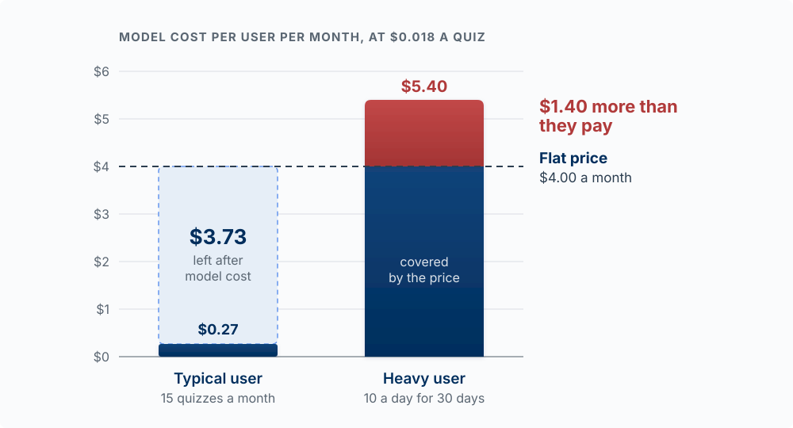

## Why This Matters

Shipping is not launching. A deployed product with no users is a private hobby, and most
student products die there, often because nobody was ever told about them. This chapter is
how the first people find out, why they would pick you over what they do today, and what you
charge them without losing money on every heavy user.

Go-to-market (GTM) answers four questions, in order:

1. **Who** is it for, narrowly enough that you can find them? (Customer and beachhead)
2. **Why** would they pick you over what they already do? (Positioning)
3. **How** will the first ones hear about it? (First users by hand, then channels)
4. **What** will you charge, and does the arithmetic hold? (Pricing and AI margins)

What makes them stay, and how you know, is the measurement chapter,
[Measuring What Matters](14-measuring-what-matters.qmd).

Two beliefs to drop before you start. "If we build it, they will come": they will not, because
nobody is waiting for your product, so you go find them. "We just need to go viral": virality is
an outcome of a product people want plus a way for it to spread, never a plan. And GTM is not an
afterthought: knowing who you are for should shape what you build.

<!-- learn -->

## Who It Is For: The Beachhead

**The model:** pick the narrowest group you can reach by hand and win completely, then widen.
A specific group is one you can find, speak to, and build for. A vague one ("college
students") is none of those.

Your **Ideal Customer Profile (ICP)** is a description of the customer who gets the most value
and is easiest to reach. You already did the hard part in
[Finding and Validating the Problem](04-finding-and-validating-the-problem.qmd): the job they
are hiring a product to do, and the interviews that showed you the pain. The ICP compresses that
into something you can act on:

| Block | B2C example | B2B example |
|---|---|---|
| Who | BYU students in a large intro course with a weekly quiz | Office managers at 5-to-20-person dental practices |
| Situation | The night before a quiz, with a stack of lecture notes | Monday morning, rebooking cancelled appointments |
| Current habit | Rereading notes; a group chat swapping old quizzes | A paper list and phone calls |
| Where they gather | The course's Slack or GroupMe, a study room, a club | A regional association, a Facebook group |
| What they pay for today | A tutor before the final; printed study guides | A receptionist's overtime |

Geoffrey Moore's *Crossing the Chasm* argues you should win a single narrow segment completely
before you expand, a **beachhead**: a small market you can dominate, become the obvious choice
for, and use as a base to move outward. For you, the beachhead might be one dorm, one club, one
section of one course, one type of small business in Provo. Own that first. A product that ten
people love beats one that a thousand people shrug at.

*The beachhead and the technology adoption lifecycle are from Geoffrey Moore, Crossing the Chasm (1991) [@moore1991crossing].*

::: {.callout-note collapse="true" title="Who is NOT your customer?"}
A useful exercise is defining who your product is *not* for. This helps you avoid wasting time and money on the wrong audience. For example, if you're building a no-code tool for small businesses, enterprise CTOs are probably not your customer, even if they express interest.
:::

::: {.callout-tip title="Try it"}
Write your beachhead as one sentence with a place in it: "students in ___ who ___, reachable
through ___." If you cannot name the place where twenty of them gather, your segment is still
too vague. Narrow it until you can.
:::

<!-- learn -->

## Positioning & Messaging

**The model:** positioning is why a specific person picks you over their current habit, said in
their own words. The real alternative is rarely a competitor's app. It is usually a
spreadsheet, a group text, a sticky note, or doing nothing.

April Dunford's *Obviously Awesome* breaks positioning into building blocks, and the order
matters because each one depends on the one before:

| Block | Question | Comes from |
|---|---|---|
| Competitive alternatives | What would they do if you did not exist? | Interviews: what they did last time |
| Unique attributes | What can you do that the alternative cannot? | Your product |
| Value | What does that attribute get them? | Their words about the pain |
| Who cares most | Which people value that the most? | The interviews where they lit up |
| Market category | What frame makes your value obvious? | The alternative they compare you to |

You start from the alternative, because "better" only means something relative to what they
do now. If you start from your features, you end up describing your product to yourself.

**Worked example.** Suppose you built QuizMe, which turns a student's own lecture notes into a
practice quiz. A weak position, written by the founder: "AI-powered adaptive learning platform."
A stronger one starts from three interview quotes:

> "I just reread my notes and hope it sticks."
> "Someone posts last year's quiz in the group chat, but it's never the same questions."
> "I don't know what I don't know until the quiz."

The alternative is rereading plus the group chat. The unique attribute is questions built from
*your* notes for *this* week. The value, in their words: find out what you don't know before the
quiz does. Who cares most: students in courses with frequent quizzes. That gives you a headline
nobody had to invent: *"Find out what you don't know before the quiz does."*

### The positioning statement

Once the blocks are filled in, a one-line statement keeps everyone, including your coding agent,
pointed the same way. This template is Geoffrey Moore's, and chapter 04 uses it for your value
proposition [@moore1991crossing]; see
[Your Value Proposition](04-finding-and-validating-the-problem.qmd):

**For [target customer] who [pain point], [product name] is a [category] that [key benefit]. Unlike [alternatives], we [unique differentiator].**

> For students in quiz-heavy courses who reread their notes and hope, QuizMe is a practice-quiz
> tool that shows you what you don't know yet. Unlike rereading or last year's quiz from the
> group chat, it writes questions from this week's notes.

The statement is an internal compass that informs *all* of your messaging; your tagline and
homepage copy come from it.

### Messages that convert

Messaging is the words you use to deliver the position. Speak to the pain, in the customer's
words, and run the **"So what?" test**: for every sentence, ask "So what?" If you cannot answer
with a customer benefit, rewrite it.

- "We use AI to generate questions from your notes." So what?
- "So you get questions about exactly what was covered this week." So what?
- "So you find the gaps tonight, while you can still fix them."

The last line is the message. The first is a feature description.

### What AI can and cannot do for your messaging

A model is a fast drafting partner. It can write twenty headline variations from your positioning
statement in seconds, and it can rewrite a jargon-heavy sentence in plain words:

> "Write five different homepage headlines for a practice-quiz tool for students in quiz-heavy
> courses. Use the phrases from these three interview quotes: [paste]."

> "Explain how QuizMe builds questions in one sentence that a first-year student would understand."

What it cannot do is tell you which headline your customers will respond to. You can ask a model
"which of these two resonates more with a stressed student?", and that is a **gut check with a
model**: a guess based on the text it was trained on. It is not an A/B test. An A/B test shows
two versions to real people, assigned at random, and counts what they *do*
(see [Cause Versus Coincidence](14-measuring-what-matters.qmd)). The model has never met your
customers. The interview quotes are the ground truth; the model only helps you phrase them.

::: {.callout-tip title="Try it"}
Pull three quotes from your own interview notes. Fill in Dunford's five blocks, starting with the
competitive alternative. Then write one headline that uses the customer's words, not yours. If
the alternative you wrote is a competitor's app, check your notes: is that really what the last
person you interviewed did?
:::

<!-- learn -->

## Pricing and AI Margins

**The model:** price on the value delivered, and check the floor: every AI call costs you money,
so a heavy user on a flat price can cost more than they pay.

A price sits between two walls:

| Wall | What sets it | Where you learn it |
|---|---|---|
| **Ceiling: value** | What the problem costs the customer today, in money and hours | Chapter 04's workaround spend |
| **Reference: alternatives** | What they pay now for the workaround or a substitute | Interviews, the substitute's price page |
| **Floor: your cost to serve** | Model calls, hosting, payment fees, per user per month | Chapter 11's arithmetic, your logs |

Three classic approaches each look at one wall. **Cost-plus** adds a margin to your cost (simple,
but ignores what the customer would pay). **Competitive** prices relative to alternatives
(useful when customers already have a clear reference price). **Value-based** prices from what
the problem is worth to the customer: if you save a business $10,000 a year, $2,000 a year is
easy to say yes to. Start from value when you can, and check it against the floor.

**How not to find the ceiling.** Do not ask customers "what would you pay?" and price in the
middle of their answers. Chapter 04 warns against exactly this: people invent a number for a
hypothetical. Instead, add up what the problem already costs them, the workaround they pay for,
the hours lost, the substitute they buy (see "Harden your evidence" in
[Willingness to Pay](04-finding-and-validating-the-problem.qmd)). The strongest evidence of all
is someone paying: a preorder, a paid pilot, a deposit.

### Every AI call is a cost

Chapter 11 showed you how to price one model call ([What It Costs](11-models-in-your-product.qmd)).
Pricing is where that arithmetic becomes a business decision. The building blocks:

- **Cost per core action** = input tokens x input price + output tokens x output price.
- **Actions per user per month**, which varies enormously between a light and a heavy user.
- **Cost per user per month** = cost per action x actions per month.
- **Gross margin per user** = price minus cost to serve, divided by price.

**Worked example.** QuizMe sends about 4,000 tokens of notes and instructions and gets back about
1,000 tokens of questions. At chapter 11's Sonnet 5 prices ($2 input, $10 output per million
tokens):

| | Calculation | Result |
|---|---|---|
| Cost per quiz | 4,000 x $2/1M + 1,000 x $10/1M | $0.018 |
| Typical user, 15 quizzes a month | 15 x $0.018 | $0.27 |
| Heavy user in finals week, 10 a day for 30 days | 300 x $0.018 | $5.40 |
| Flat price | | $4.00 a month |

The typical user is very profitable. The heavy user costs $1.40 more than they pay, before
hosting and payment fees. With traditional software, a heavy user costs you almost nothing extra;
with an AI product, your best users can be your most expensive. The fixes are product decisions:
a monthly quiz allowance with paid top-ups, usage-based pricing, caching the repeated
instructions (chapter 11), or a cheaper model for the parts where measurement shows it is good
enough.

{#fig-heavy-user-cost fig-alt="A bar chart of QuizMe's monthly model cost per user at 0.018 dollars per quiz, against a dashed line for the flat price of 4 dollars a month. The typical user, 15 quizzes a month, costs 27 cents, leaving 3.73 dollars under the price. The heavy user, 10 quizzes a day for 30 days, costs 5.40 dollars; the red part of that bar above the price line is 1.40 dollars more than the user pays." width="100%"}

**Flat subscription versus usage pricing.** A flat subscription is simple to buy and predictable
for the customer, and it carries the heavy-user risk. Usage pricing (credits, per-action, tiers
with allowances) tracks your cost but makes the customer think about every click. Many AI
products combine them: a flat price that includes an allowance.

### Should you offer a free tier?

A free tier makes sense when a free user costs you little and either some of them convert or
they bring other users. For an AI product, every free user runs up model cost, so a free tier
needs a usage cap. At student scale, a free tier is often a distraction from the question that
matters: will *anyone* pay? A few people paying a small amount teaches you more than many people
using it free.

::: {.callout-tip title="Try it"}
For your own product: estimate the tokens in and out of your core AI call, use chapter 11's
price table, and compute cost per action. Then estimate actions per month for your lightest and
your heaviest realistic user. At your intended price, which users lose you money? Predict first,
then check one real call's `usage` numbers in your logs. What is one product change that would
keep the heavy user profitable?
:::

<!-- learn -->

## Your First Users, by Hand

**The model:** your first users come from places you can reach yourself. Do things that do not
scale, because recruiting people one at a time is how you learn what will scale.

Paul Graham's essay *Do Things That Don't Scale* makes the case: founders hesitate to recruit
users manually because it seems small and slow, and that is exactly what works at the start.
His examples include the Airbnb founders going door to door in New York to recruit hosts and
improve their listings, and the Stripe founders setting up new users on the spot instead of
sending a link [@graham2013]. Each conversation teaches you what makes someone say yes, which
words work, and where people get stuck. Those lessons are what you later build into a channel.

A concrete target for a two-week sprint: **20 named people contacted, 5 actually using it.**
Write the names down. Track who replied, who tried it, who came back.

### Where the first twenty come from

**1. Personal network.** Friends, classmates, roommates, professors, LinkedIn connections.
Message them with a question instead of a pitch:

> "Hey [Name], I'm working on [product] for [customer type]. Do you know anyone who struggles with [pain point]? I'd love 15 minutes to show them what I'm building."

**2. Where your beachhead gathers.** The course Slack, the club GroupMe, the dorm floor, the
subreddit. Be helpful first: answer questions, share what you have learned. Mention the product
when it is relevant.

**3. Direct messages.** A short, specific note to someone who fits the ICP:

> "Hi [Name], saw your post about [topic]. I'm building something for [customer type] and would love your feedback if you have 10 minutes."

**4. Cold email**, for B2B, where the buyer is reachable by name:

> Subject: Quick question about [pain point]
> Hi [Name],
> I noticed you [relevant observation]. I'm building [product] to help [customer type] with [pain point].
> Would you be open to a 15-minute demo?
> [Your name]

Then sit with them while they use it. Watching five people try it teaches more than a launch post
to five hundred.

### The pitch conversation

You have someone on a call. A sales demo is a conversation built around *their* problem. (It is a
different thing from the final demo in [chapter 15](15-storytelling-and-the-final-demo.qmd),
which is a recorded story for an audience.) A 15-minute structure:

1. **Set the stage (1 min):** "Thanks for joining. I want to show you [product], but first, tell me about how you currently handle [pain point]?"
2. **Listen and adapt (3 min):** Let them talk. Take notes. Adjust your demo to their specific pain.
3. **Show the moment it works (7 min):** Walk through the product on *their* use case, straight to the point where they see the value.
4. **Handle objections (2 min):** Address questions and concerns directly.
5. **Ask for a commitment (2 min):** "Does this solve [pain]? Want to try it for a week?"

**Common objections and how to handle them:**

- **"It's too expensive."** → "What's it worth to you to solve [pain]? How much time/money are you losing now?"
- **"I need to think about it."** → "Totally fair. What specifically do you need to think through? Maybe I can help."
- **"We're already using [competitor]."** → "Got it. What's working? What's not? Here's how we're different…"

### The levers of persuasion

People rarely decide on logic alone. Robert Cialdini's research names six levers that move real
decisions, worth using honestly, and worth recognizing when they are used on you:

- **Social proof:** people do what similar people do. Show that others like them already use and trust you.
- **Authority:** credible expertise persuades. Signal what makes you credible on this problem.
- **Scarcity:** limited access or time raises perceived value: early access, a waitlist, a cohort.
- **Reciprocity:** give first (a useful tool, real help), and people are inclined to give back.
- **Commitment and consistency:** a small yes leads to a bigger one. Start with a low-friction ask.
- **Liking:** people say yes to those they like and who are like them. Be human, specific, and warm.

These amplify a true offer; they cannot substitute for one. Used to push a product that does not
deliver, they become manipulation, the line drawn in [Product Morality](03-what-is-worth-building.qmd).

*The six principles of persuasion are from Robert Cialdini, Influence (1984) [@cialdini1984influence].*

::: {.callout-tip title="Try it"}
Write the list: twenty names, each with where you will reach them and the one-line message you
will send. Before you send anything, predict how many will reply and how many will try it. After
a week, compare. The gap between your prediction and the result is information about your
message or your segment.
:::

<!-- learn -->

## Choosing Your Channel Strategy

**The model:** a channel is a repeatable path by which strangers become users. Hand recruiting
does not repeat; a channel does. Pick one or two that match where your customer already is,
and give each a fair test before you add another.

Gabriel Weinberg and Justin Mares's *Traction* lists nineteen channels and makes the point that
most products grow through one or two of them [@weinberg2015traction]. Three questions narrow
the choice:

1. **Where does your customer already spend time?** Students: course and club group chats,
   campus events, Instagram, Reddit. Small businesses: associations, local groups, LinkedIn.
   Developers: GitHub, Hacker News, dev communities.
2. **What does it cost, in money and in time to results?** You have little money and a
   two-week sprint.
3. **Does the product sell itself?** If people can sign up and reach value on their own in
   minutes, a product-led channel fits. If it needs setup or training, a person has to sell it.

**Product-led growth (PLG)**: users sign up, try, and get value without talking to anyone. Think
Notion, Figma, or Slack. It works when time-to-value is short and the "aha moment" happens on
its own. **Sales-led growth (SLG)**: you reach out, run demos, and close through conversation,
as with Salesforce. It works when the product is complex, the deal is large, or the buyer needs
to learn a new category. Many companies start product-led and add sales as they move to larger
customers; Notion started self-serve and now has enterprise sales.

| Channel | Fits a student sprint? | Note |
|---|---|---|
| Community and word of mouth | Yes | Be useful where your beachhead gathers |
| Direct outreach (DMs, email) | Yes | The hand-recruiting above, made routine |
| Building in public (LinkedIn, X) | Partly | Results take months; useful for credibility |
| Content and SEO | Rarely | Results usually take months |
| Partnerships | Sometimes | A club, a TA, a professor who shares it with a class |
| Paid ads | Rarely | Costs money to test, and needs validated messaging first |

::: {.callout-tip collapse="true" title="Common Mistake: Spreading Too Thin"}
The biggest mistake is trying every channel at once. Pick 1-2, commit for a fixed period, and measure results. If it's not working, kill it and try something else. Depth > breadth.
:::

### A second audience: the models

Inbound now has a second audience. A growing share of buyers ask a model rather than a search
engine, which means you also care about which sources those models cite. A Semrush study of 150,000
citations in June 2025 found the answer skewed heavily toward a handful of community and reference
sites.

{fig-alt="A ranked bar chart titled Where AI Gets Its Facts, showing the top domains cited by LLMs such as ChatGPT and Perplexity. Reddit leads at 40.1 percent, followed by Wikipedia at 26.3, YouTube at 23.5, Google at 23.3, Yelp at 21.0, Facebook at 20.0, and Amazon at 18.7, trailing down through TripAdvisor, Mapbox, OpenStreetMap, Instagram, MapQuest, Walmart, eBay, LinkedIn, Quora, Home Depot, Yahoo, Target, and Pinterest at 4.2 percent."}

Read that as a channel list. A genuinely helpful answer in the subreddit where your customers
already are does double duty: it reaches them, and it is the kind of source a model repeats
later. The underlying advice is unchanged: be useful in public where your buyers gather. What
has changed is where "public" is.

::: {.callout-tip title="Try it"}
Pick one channel for your next sprint. Write down what you will do, how many people it should
bring to your product, and the date you will judge it. If it brings fewer than half that number,
what will you try instead?
:::

<!-- learn -->

## Launch & Iterate

**The model:** a launch is the start of an experiment, so it needs a definition of success and
working measurement before anyone sees the link.

### Instrument it before you launch

Do not ship a landing page without analytics on it. You will get one first wave of traffic
and exactly one chance to learn from it, and an uninstrumented launch throws that away. Before
you send anyone the link, write down what "working" means (one value metric, a threshold, a few
guardrails, a date) and put event tracking on your core task. The how is in
[Measuring What Matters](14-measuring-what-matters.qmd); the discipline is to do it now
rather than after.

### Launch in rings

- **Private beta:** the twenty people you invited by hand. Watch them use it. Fix what breaks and
  the step where they get stuck.
- **Public beta:** open it to your beachhead (the course, the club), labeled as a beta.
- **Wider launch:** a post in the communities you have been helpful in, Product Hunt, LinkedIn.

You can launch more than once. A new feature or a major update is a new reason to tell people.

### When to change your GTM

Change the plan when the evidence says the plan is wrong:

- People sign up but do not reach first value (an onboarding or product problem, not a channel problem).
- A channel you gave a fair test brings almost no one.
- Interviewees keep describing your product in words different from your messaging.
- Acquiring a customer costs more than they will ever bring in (see
  [Money Metrics](14-measuring-what-matters.qmd)).

How: go back to customers and do more interviews, rewrite messaging in their actual words, narrow
or shift the ICP, or try the next channel.

**Example.** You launched a planner for "busy students." Nobody sticks. You dig in and find that
your few retained users are student-athletes who use one feature, the travel-week schedule, that
you almost cut. Reposition as "the planner for student-athletes on the road" and double down on
that audience.

### Using AI on launch data

AI is useful here, within limits:

- **It can** summarize open-ended feedback into themes, if you ask it to quote the responses
  behind each theme so you can check. It can draft experiment ideas, write the SQL for a funnel
  or cohort query, and check your arithmetic.
- **It cannot** tell you why signups rose from a list of weekly totals. Paste eight weeks of
  signup counts into a model and ask for "patterns" and it will find some, because it always
  produces an answer, and with a few dozen users most week-to-week movement is noise. Whether a
  change *caused* a result is a question of how the data was collected, which the model cannot see.
  See [Cause Versus Coincidence](14-measuring-what-matters.qmd).

> "Here are 20 user feedback responses: [paste]. Group them into the top 3 themes. For each
> theme, quote the responses that belong to it, and list any responses that fit no theme."

::: {.callout-tip title="Try it"}
Write your launch note before you launch: the date, who will get the link, the one number that
means it is working, and the threshold. Commit it. Two weeks later, read it back before you look
at the data.
:::

<!-- learn -->

## Going Deeper

<!-- MOVE: the vendor tool lists (GTM Toolkit) were cut here; if Scott wants them, they belong in 98-tools.qmd, and the reading list belongs in 97-builder-resources.qmd -->

- *Traction* by Gabriel Weinberg & Justin Mares [@weinberg2015traction]: the 19 channels framework
- *Obviously Awesome* by April Dunford [@dunford2019obviously]: positioning from the customer's alternative
- *The Mom Test* by Rob Fitzpatrick [@fitzpatrick2013mom]: customer interviews done right
- Paul Graham, "Do Things That Don't Scale" [@graham2013]

<!-- learn -->

## Key Concepts

- **Ideal Customer Profile**: the specific, reachable group you are actually for.
- **Beachhead**: the narrow first market you can win before widening.
- **Positioning**: why a specific person picks you over their current habit, in their words.
- **Competitive alternative**: what the customer would do if you did not exist, usually not a competitor.
- **Gut check with a model**: a model's opinion of your copy; not an A/B test.
- **Value-based pricing**: price from what the problem costs the customer today.
- **Cost per user**: cost per AI action times actions per month; heavy users can cost more than they pay.
- **Gross margin per user**: price minus cost to serve, as a share of price.
- **Do things that don't scale**: recruit the first users by hand to learn what will scale.
- **Channel**: the repeatable path by which strangers become users.
- **Product-led vs sales-led**: does the product sell itself, or does a person sell it?
