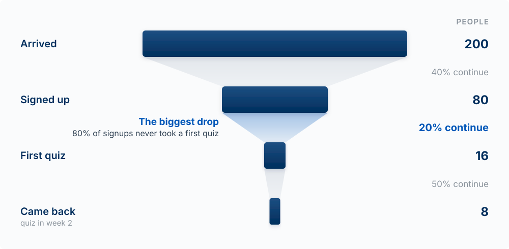
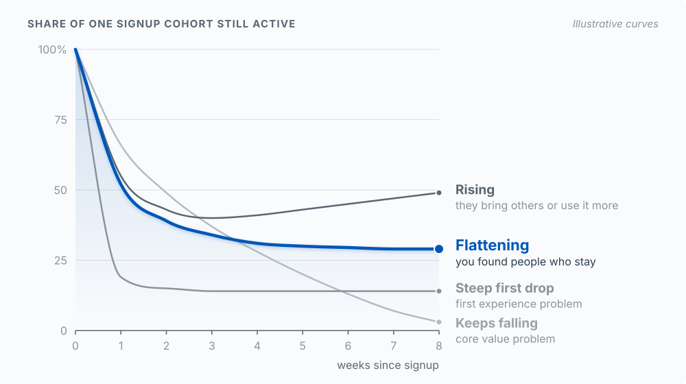
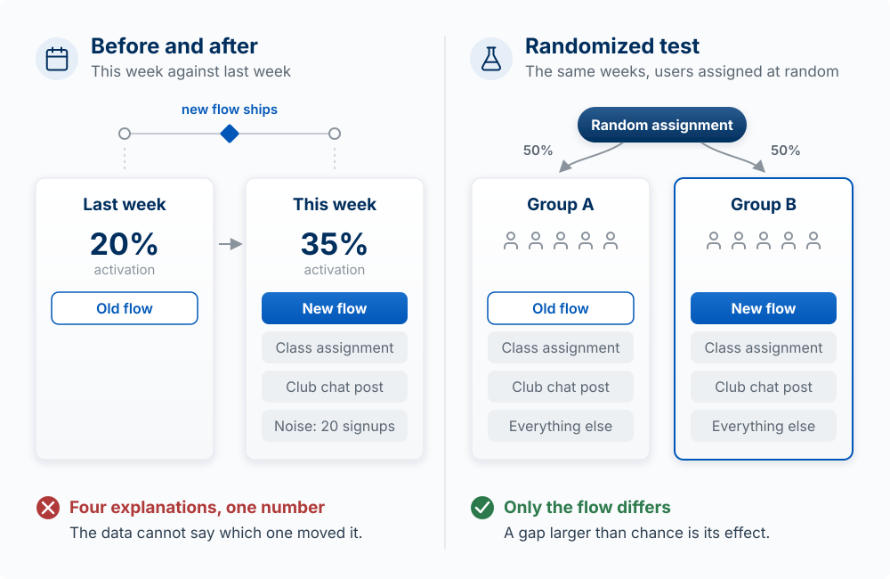
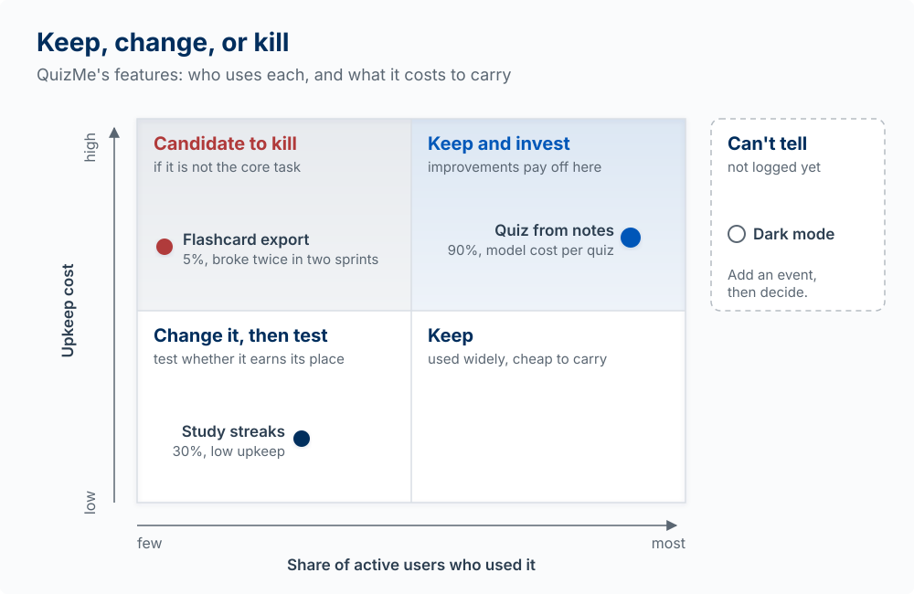

## Why This Matters

You can't improve what you don't measure. But measuring the wrong things is worse than measuring nothing. It leads you to optimize for metrics that don't matter while ignoring what does.

Launch is the start of an experiment. This chapter is how you run it: decide what working means
before you ship, record what people actually do, follow them from arrival to coming back, tell a
real effect from a coincidence, and decide which features to keep, change, or kill.

Read a metric as [evidence](04-finding-and-validating-the-problem.qmd), not a verdict. A number moves a belief up or down; it does not certify that you are right, or that you are worthy. And remember that outcomes carry luck: a good number can follow a poor decision and a bad number a sound one [@duke2018bets]. Track what updates your beliefs about the product, not what flatters them.

<!-- learn -->

## Decide What Working Means First

**The model:** pick one number that moves only if the product delivers value, plus a few
guardrails that catch you winning the number the wrong way. Write it down before launch, so the
data cannot talk you into a new definition afterward.

### The North Star and the metrics under it

Think of metrics in layers:

```
                    North Star Metric
                          ↑
              Input Metrics (drivers)
                          ↑
        Operational Metrics (activities)
                          ↑
              Diagnostic Metrics (health checks)
```

**North Star Metric**: the one number that best captures the value customers get. It counts
value delivered, not activity. Airbnb's is usually given as nights booked: a booked night means a
guest found a place and a host earned money. Amplitude's *North Star Playbook* is the standard
reference for choosing one.

Below it sit **input metrics** (levers you can pull that move the North Star), **operational
metrics** (day-to-day activity), and **diagnostic metrics** (health checks that tell you something
is broken).

**The test for a North Star:** would this number go up if the product got *worse*? Weekly active
users fails the test. Send more reminder emails and it rises, even if nobody gets more out of the
product. A value metric counts the moment the job gets done.

| Product | Activity metric (weak) | Value metric (stronger) |
|---|---|---|
| QuizMe (notes to practice quiz) | Weekly logins | Quizzes completed per week |
| A rent-splitting app | Accounts created | Bills settled with every roommate paid |
| A club event planner | Pages viewed | Events that happened with RSVPs filled |

**Guardrails** are the numbers that must not get worse while you push the North Star: AI cost per
active user, error rate, unsubscribes, time to complete the core task. They stop you from
"winning" by spamming users or by running a model call that costs more than the user pays.

### Write a success definition

Before you launch (Sprint 5 at the latest), commit one short note to your repo:

| Line | Example |
|---|---|
| Value metric | Students who complete at least one quiz in their second week |
| Threshold | 5 of the first 20 invited users |
| Guardrail 1 | AI cost per active user under $1 a month |
| Guardrail 2 | Quiz generation fails less than 1 time in 20 |
| Judgment date | Two weeks after the invite goes out |

Without the threshold and date, any result can be read as a success.

### Outcomes, not output

There is a deeper vanity trap than any bad metric: measuring how much you *built* instead of whether it *worked*. Features shipped, tickets closed, lines of code: these are **output**. Whether users are better off, whether they came back, whether the problem actually got solved, is **outcome**. Marty Cagan and Melissa Perri call the habit of mistaking the first for the second the *build trap*: a team busily shipping, feeling productive, and delivering nothing that matters.

In the AI era this trap is more dangerous, because output has never been cheaper. You can ship a feature a day now. So hold yourself to outcomes: did the North Star move, did activation improve, did a real user get real value? The goal is changing an outcome; shipping is only the means.

*Outcomes over output, and the build trap, from Marty Cagan, Inspired / Empowered [@cagan2017inspired], and Melissa Perri, Escaping the Build Trap (2018) [@perri2018buildtrap].*

### Vanity, leading, and lagging

**Vanity metrics** make you feel good but don't help you make decisions: total registered users
(includes everyone who left), page views without context, followers, downloads. **Actionable
metrics** inform a decision: active users doing the core task, conversion between steps,
retention by cohort, time to value. The test: can this metric change what you do next week?

**Lagging** indicators measure outcomes after the fact (revenue, churn). **Leading** indicators
move earlier and predict them (completing the core task in the first week, days since last
visit, a feature adopted or ignored). Lagging indicators tell you the score; leading indicators
tell you where to act. If churn is your problem, look for what churned users stopped doing first.

::: {.callout-tip title="Try it"}
Write your product's North Star and apply the test: name one way the number could go up while the
product got worse. If you can, it is an activity metric; find the moment the job gets done and
count that instead. Then add two guardrails and fill in the success-definition table.
:::

<!-- learn -->

## Instrument the Core Action

**The model:** log the events that trace your main task from start to finish. You cannot analyze
what you did not record, and you cannot go back and record last week.

### The building blocks of an event

An event is one row that says something happened:

| Part | Example | Why it matters |
|---|---|---|
| **Who** | `user_id` (or an anonymous id before signup) | Lets you count people, not clicks, and follow one person over time |
| **What** | `quiz_completed` | One name per step, verb in the past tense |
| **When** | `created_at`, with time zone | Lets you build funnels and cohorts |
| **Details** | `{ "questions": 10, "score": 7 }` | Lets you split results later |

The data path is short:

```
User does the core task
    ↓
Your code records an event (who, what, when, details)
    ↓
Events table (Supabase) or an analytics service (PostHog, Mixpanel)
    ↓
A query or dashboard (funnel, cohort)
    ↓
Decision
```

### Start from the task, not from a generic list

A generic schema (`page_viewed`, `feature_used`) records a lot and answers little. Instead, write
the four to six events that trace your one core task, start to finish. For QuizMe:

| Step | Event | Details |
|---|---|---|
| Arrived | `landing_viewed` | referrer (where they came from) |
| Signed up | `user_signed_up` | method |
| Gave input | `notes_uploaded` | word count |
| Got value | `quiz_completed` | questions, score |
| Came back | `quiz_completed` in a later week | |
| Something failed | `quiz_generation_failed` | error type, model |

Each row answers a question: how many arrived, signed up, got a finished quiz, came back, and how
often the AI step broke. In code it is one line per step, after the step succeeds:

```
after notes are saved:      track("notes_uploaded", { words })
after the quiz is scored:   track("quiz_completed", { questions, score })
if the model call fails:    track("quiz_generation_failed", { error })
```

Ask Claude Code to add it, and give it this table. Then check that real rows arrive: use the app
yourself and look in the table. "Tracking returns real data" is the done condition.

### Where the events live, and who can touch them

If you store events in your own Supabase table, remember how the browser talks to your database
(see the architecture chapters): the browser holds a public key, so anyone can send requests to
your tables directly. A table with **no row-level security (RLS)** is open to anyone with that
key: they could write fake events, and possibly read every user's activity. The rule you need:

- A signed-in user may **insert** events about **themselves** only.
- **Nobody reads** events from the browser. You read them in the Supabase SQL editor or from
  server code.
- Events from signed-out visitors (the landing page) cannot pass the first rule. Log those through
  an analytics service like PostHog, or through a server route.

::: {.callout-note collapse="true" title="See it in code: an events table with row-level security"}
Use this if you keep events in Supabase. It replaces an earlier version of this chapter that left
RLS off.

```sql
CREATE TABLE analytics_events (
  id UUID PRIMARY KEY DEFAULT gen_random_uuid(),
  user_id UUID REFERENCES auth.users(id),
  event_name TEXT NOT NULL,
  event_data JSONB DEFAULT '{}',
  page_url TEXT,
  session_id TEXT,
  created_at TIMESTAMPTZ DEFAULT NOW()
);

ALTER TABLE analytics_events ENABLE ROW LEVEL SECURITY;

-- Signed-in users may add events about themselves, and nothing else.
CREATE POLICY "insert own events" ON analytics_events
  FOR INSERT TO authenticated
  WITH CHECK (user_id = auth.uid());

-- No SELECT policy: the browser cannot read anyone's events.
```
:::

### Or use an analytics service

A service gives you funnels and cohorts without building them, and handles signed-out visitors.
Free tiers as of October 2026:

| Service | Best For | Free Tier |
|---------|----------|-----------|
| **PostHog** | Product analytics, open source | 1M events/mo |
| **Mixpanel** | Event-based analytics | 1M events/mo |
| **Amplitude** | Product analytics at scale | 2M events/mo |
| **Plausible** | Simple, privacy-focused | Paid, after a 30-day free trial |
| **Google Analytics** | Basic web analytics | Free |

With PostHog, setup is one `init`, one `capture` per event, and `identify` for signed-in users:

```javascript
posthog.init('your-project-key', { api_host: 'https://us.i.posthog.com' });
posthog.capture('quiz_completed', { questions: 10, score: 7 });
posthog.identify(userId);
```

::: {.callout-tip title="Try it"}
Write your own event table: the four to six steps of your core task, one event name each, and the
details you would want to split by. Then find the mistake in this plan: "We log `button_clicked`
on every button, so we can reconstruct anything later." What question about your core task can
that log not answer?
:::

<!-- learn -->

## Signups Are Not Adoption

**The model:** follow people from arrival to first value to coming back. Each step loses people,
and the step that loses the largest share is the first one to fix.

### The funnel

Dave McClure's Pirate Metrics [@mcclure2007] name the stages:

| Stage | Question | Key Metrics |
|-------|----------|-------------|
| **Acquisition** | How do users find you? | Traffic sources, CAC, sign-ups |
| **Activation** | Do they reach first value? | Activation rate, time to value |
| **Retention** | Do they come back? | Week 1, 2, 4 retention by cohort |
| **Revenue** | Do they pay? | Conversion, ARPU, LTV |
| **Referral** | Do they tell others? | Referral rate, invites sent |

**Activation** is the moment a new user first gets the value the product promises: for QuizMe, the
first completed quiz, not the signup. **Activation rate** = users who reached that moment / users
who signed up.

**Worked example.** QuizMe's first two weeks, from its events:

| Step | People | Share of previous step |
|---|---|---|
| Arrived at the landing page | 200 | |
| Signed up | 80 | 40% |
| Completed a first quiz | 16 | 20% |
| Completed a quiz in week 2 | 8 | 50% |

The largest loss is between signup and first quiz: 80 percent of the people who signed up never
got value. Compare two fixes. Doubling traffic to 400 visitors yields 16 week-2 users, at the cost
of finding 200 more people. Doubling activation from 20 to 40 percent yields the same 16, with no
new traffic, and it helps every future visitor too. High acquisition with low activation is a
**leaky bucket**: fix activation before spending more on acquisition. Pre-product-market fit,
Activation and Retention are where to focus.

{#fig-activation-funnel fig-alt="A centered funnel of four bars sized by people: 200 arrived at the landing page, 80 signed up, 16 completed a first quiz, and 8 completed a quiz in week 2. Between the bars, the share that continued: 40 percent, 20 percent, and 50 percent. The step from signing up to a first quiz is highlighted as the biggest leak: 80 percent of signups never got value." width="100%"}

### Onboarding is the activation step

Good onboarding gets users to the first value moment fast, teaches by doing, and removes every
step that moment does not need. Common mistakes: too many steps before value, asking for
information you do not need yet, and no guidance after signup. Measure it with the funnel: time
to first value and where people drop.

::: {.callout-tip title="Try it"}
Fill in the funnel table for your own product from your events: arrived, signed up, reached first
value, came back. If you cannot fill a row, that is an event you are not logging yet. Predict
which step loses the largest share before you look.
:::

<!-- learn -->

## Retention Is the Truth

**The model:** group users by the week they started and watch who returns. Averages and running
totals hide decay, because new arrivals keep refilling the bucket.

### Cohorts

A **cohort** is everyone who started in the same period. Track each cohort separately: of the
people who signed up in week 1, what share were active in week 2, week 3, week 4?

```
Cohort: January signups (illustrative)
Day 0:  100% (by definition: the day they signed up)
Day 7:   60%
Day 30:  35%
Day 90:  20%
```

**Retention for a cohort** = members of the cohort active in period N / members of the cohort.
Do not compute it as "users at the end of the period / users at the start": that counts new
arrivals as if they were retained, which is exactly the error cohorts exist to avoid.
**Churn** = users active last period who are not active this period / users active last period.

### Why totals lie

Suppose a class assignment sends a new wave of signups every week:

| Week | Weekly active users (total) | That week's new cohort, active one week later |
|---|---|---|
| 1 | 40 | 50% |
| 2 | 60 | 35% |
| 3 | 85 | 20% |

The total more than doubles. Meanwhile each new cohort keeps a smaller share than the one before:
the product is getting *worse* at keeping people, and only the stream of new signups hides it.
Once the signups stop, the total falls.

**Retention curves tell a story** (plot share of cohort active against weeks since signup):

- Steep initial drop → first experience problem (go back to the funnel)
- Continued decline → core value problem
- Flattening curve → you have found people who keep using it
- Rising curve → returning users bring others or use it more

{#fig-retention-curves fig-alt="A line chart of the share of a cohort still active against weeks since signup, weeks 0 to 8, with four illustrative curves that all start at 100 percent. The highlighted curve flattens near 30 percent, labeled you found people who stay. In gray: a rising curve dips to about 40 percent and climbs, labeled they bring others or use it more; a steep first drop falls below 20 percent in week 1 and stays there, labeled first experience problem; and a curve that keeps falling to nearly zero, labeled core value problem." width="100%"}

For benchmarks, see Lenny Rachitsky and Casey Winters, "What is good retention?" in
[Builder Resources](97-builder-resources.qmd); at student scale the curve's shape tells you more.

### Engagement measures count people

**DAU / WAU / MAU** are distinct users who did the core action in a day, week, or month.
**Stickiness** = DAU / MAU, how many of the month's users show up on a typical day. **Feature
adoption** = users who used a feature / active users. Each one counts *people*: an "active user"
is a distinct `user_id`, not an event. The query that gets this right:

```sql
SELECT DATE(created_at) as date, COUNT(DISTINCT user_id) as dau
FROM analytics_events
WHERE created_at > NOW() - INTERVAL '30 days'
GROUP BY DATE(created_at)
ORDER BY date;
```

**Find the mistake.** An earlier version of this chapter built a dashboard card labeled "Daily
Active Users" that counted every event row in the last 24 hours. One student who completes ten
quizzes is then ten "active users." The building block it was missing is `DISTINCT user_id`. (Note
also that a dashboard that reads events from the browser needs read access the RLS rule above
forbids; build it server-side or read the numbers in the SQL editor.)

```
WRONG:  dau = count(events where created_at in last 24h)
RIGHT:  dau = count(distinct user_id among events where created_at in last 24h)
```

### Retention levers

| Lever | Description | Technical Implementation |
|-------|-------------|-------------------------|
| **Habit formation** | Make the app part of a routine the user already has | Reminders tied to a real moment (the night before the quiz) |
| **Increased value** | More usage = more value | Data accumulation, personalization |
| **Social connection** | Users connect with others | Sharing, collaboration features |

Keeping users by making it hard to leave (for example, making their data hard to export) is not a
lever this course teaches; see [Product Morality](03-what-is-worth-building.qmd).

::: {.callout-note collapse="true" title="See it in code: retention by cohort (for your own product)"}
Run this in the Supabase SQL editor on your events table. It counts, for each signup week, how many
of that cohort were active in each later week. Divide each count by the cohort's size (its first
row) to get the retention curve.

```sql
WITH user_cohorts AS (
  SELECT
    user_id,
    DATE_TRUNC('week', MIN(created_at)) as cohort_week
  FROM analytics_events
  WHERE event_name = 'user_signed_up'
  GROUP BY user_id
),
user_activity AS (
  SELECT
    user_id,
    DATE_TRUNC('week', created_at) as activity_week
  FROM analytics_events
  GROUP BY user_id, DATE_TRUNC('week', created_at)
)
SELECT
  uc.cohort_week,
  ua.activity_week,
  COUNT(DISTINCT ua.user_id) as active_users
FROM user_cohorts uc
JOIN user_activity ua ON uc.user_id = ua.user_id
WHERE ua.activity_week >= uc.cohort_week
GROUP BY uc.cohort_week, ua.activity_week
ORDER BY uc.cohort_week, ua.activity_week;
```
:::

::: {.callout-tip title="Try it"}
Run the cohort query (or your analytics service's retention view) on your own product and draw the
curve for your largest cohort. Predict its shape first. Then compare your total weekly active
users with the cohort curve: does the total tell the same story?
:::

<!-- learn -->

## Cause Versus Coincidence

**The model:** a randomized test shows cause. A before-and-after comparison usually shows the
season, the campaign, or noise.

When a number moves right after you change something, two explanations compete: your change
caused it, or something else happened at the same time. The data alone cannot tell them apart.

### Three ways a before-and-after fools you

Suppose you ship a new onboarding flow on Monday, and that week's activation rate jumps from 20 to
35 percent. Before you credit the new flow, consider:

1. **The calendar.** A professor assigned the class to try each other's apps that week, so the
   new signups were classmates who were told to finish the flow. The users changed, not only the
   product.
2. **The campaign.** You posted in a club's group chat the same day. People who come from a
   friend's recommendation behave differently from people who find you cold.
3. **Noise.** With 20 signups a week, one person is 5 percentage points. Three more people
   finishing the flow by chance moves the rate 15 points. Week-to-week swings that large happen
   with no change at all.

### Why random assignment works

In a **randomized controlled experiment** (an **A/B test**), each new user is assigned at random
to the old flow (A) or the new flow (B), during the same weeks. Because a coin decides who gets
which, the class assignment, the club post, and everything else you did not think of land on both
groups about equally. The only systematic difference between the groups is the flow. So a
difference in outcomes, if it is larger than chance would produce, was caused by the flow.

{#fig-before-after-vs-ab fig-alt="Two panels. Left, before and after: last week, with the old flow, activation was 20 percent; this week it is 35 percent, but this week also had a class assignment, a club chat post, and the noise of 20 signups, so four explanations compete for one number. Right, a randomized test: a coin assigns each new user to group A with the old flow or group B with the new flow, in the same weeks; the class assignment, the club post, and everything else land in both groups, so only the flow differs, and a gap larger than chance is its effect." width="100%"}

Ron Kohavi, Diane Tang, and Ya Xu's *Trustworthy Online Controlled Experiments* is the standard
reference [@kohavi2020trustworthy]. One of its lessons matters most at your scale: detecting the
small improvements large companies test for takes thousands of users per group, which is why
chapter 06 lists A/B testing for products with 1,000+ users
([Testing at Scale](06-testing-the-design.qmd)).

### What to do with 20 users

You can still learn honestly at student scale:

- **Look only for big effects.** If 2 of 10 people finished the old flow and 8 of 10 finished the
  new one, that is hard to explain as chance. A move from 3 of 10 to 4 of 10 tells you nothing.
- **Hold out a group.** Send the reminder email to a randomly chosen half of your users and not the
  other half, in the same week. Compare the halves, not this week with last week.
- **Watch people.** Five usability sessions show you *why* people stall, which no number does
  (see [chapter 06](06-testing-the-design.qmd)).
- **Say "can't tell yet."** It is a legitimate finding, and it is better than a confident story
  built on noise.

**Data-informed versus data-driven.** "The data says X, so we do X" works only when the data came
from a clean test with enough people. Otherwise: "the data says X, combined with what we saw in
interviews and sessions, so we will try Z and check again."

### What AI can and cannot do here

A model can write the query that splits users into A and B, compute the rates, and list what else
changed that week for you to rule out. It cannot turn a before-and-after into a causal answer.
Ask it for "patterns" in eight weeks of signup totals and it will report some, because it always
produces an answer; with a few dozen users most of them are noise. Asking a model which version
your users would prefer is a guess about people it has never met.

::: {.callout-tip title="Try it"}
Your signups doubled the week you added a "share with a classmate" button. List three explanations
other than the button. Then design the smallest test that would separate the button's effect from
the others, with the users you actually have. What result would make you say "can't tell yet"?
:::

<!-- learn -->

## Keep, Change, or Kill

**The model:** every feature carries an upkeep cost. Usage data tells you which features to double
down on and which to retire.

With a coding agent, a feature costs minutes to add. It then has to keep working: every later
change can break it, every prompt and test has to account for it, every new user has to
understand it, and an AI feature keeps costing money per call. That is the build trap from the
other side: output is cheap to add and expensive to carry.

A feature review takes ten minutes with your events:

| Feature | % of active users who used it (last 2 weeks) | Upkeep cost | Tied to the North Star? | Decision |
|---|---|---|---|---|
| Quiz from notes | 90% | Model cost per quiz, prompt maintenance | Yes, it is the core task | Keep, invest |
| Flashcard export | 5% | Broke twice in two sprints | No | Kill |
| Study streaks | 30% | Low | Weakly | Change: test whether it brings people back |
| Dark mode | Not logged | Low | No | Can't tell: log it first |

{#fig-keep-change-kill fig-alt="A two-by-two grid with share of active users who used a feature on the horizontal axis, from few to most, and upkeep cost on the vertical axis, from low to high. Top left, candidate to kill if it is not the core task: flashcard export, 5 percent, broke twice in two sprints. Top right, keep and invest, improvements pay off here: quiz from notes, 90 percent, model cost per quiz. Bottom left, change it, then test: study streaks, 30 percent, low upkeep. Bottom right, keep: used widely, cheap to carry. Off the grid, in a dashed box labeled can't tell: dark mode, not logged yet; add an event, then decide." width="100%"}

A feature few people use, that breaks often, and that does not serve the core task is a candidate
to remove. A feature most active users touch is where improvements pay off. A feature you cannot
measure you cannot judge: add an event before you decide. When you remove one, tell the people who
used it.

::: {.callout-tip title="Try it"}
Fill in the feature review table for your own product (it makes a good Sprint 6 reflection). Name
one feature you would kill, and say what number would have to be true for you to keep it instead.
:::

<!-- learn -->

## Money Metrics

**The model:** revenue metrics only mean something per customer and net of what that customer
costs you. For an AI product, the cost side is real for every user.

| Metric | What It Measures | Formula |
|--------|-----------------|---------|
| **Conversion rate** | Free to paid | Paying users / Total users |
| **ARPU** | Revenue per user | Revenue / Active users |
| **CAC** | Cost to acquire a customer | Total acquisition spend (money and time) / New customers |
| **LTV** | Lifetime customer value | Contribution margin per month (ARPU minus cost to serve, including model calls) × average months retained |
| **LTV:CAC ratio** | Unit economics health | LTV / CAC |

Revenue-based LTV assumes serving a customer is free, which for an AI product it is not
([Business Models](13-business-models.qmd) works an example). If LTV is below CAC, each new
customer loses money; a common rule of thumb is LTV at least three times CAC. Pricing is in
[Going to Market](12-going-to-market.qmd).

<!-- learn -->

## Asking How People Feel

Behavior is the stronger evidence, but asking helps you interpret it.

| Metric | What It Measures | Scale |
|--------|-----------------|-------|
| **NPS** | Likelihood to recommend | -100 to +100 |
| **CSAT** | Satisfaction with experience | 1-5 or 1-10 |
| **CES** | Effort to accomplish goal | 1-7 |

**Net Promoter Score (NPS)** [@reichheld2003onenumber]: "How likely are you to recommend us?"
(0-10). Promoters (9-10), Passives (7-8), Detractors (0-6). NPS = % Promoters - % Detractors.
Benchmarks vary by industry, and with twenty respondents one person changing their answer moves NPS by five points or more, so at
student scale read the comments rather than the score. For product-market fit, Sean Ellis's survey
question ("How would you feel if you could no longer use this product?") is listed in
[Builder Resources](97-builder-resources.qmd).

<!-- learn -->

## Key Concepts

- **North Star Metric**: the one number that rises only when customers get value.
- **Guardrail metrics**: numbers that must not get worse while you push the North Star (AI cost per user, error rate).
- **Success definition**: value metric, threshold, guardrails, and a date, written before launch.
- **Outcomes vs. output**: whether it worked versus how much you built; the build trap.
- **Vanity vs. actionable metrics**; **leading vs. lagging indicators**.
- **Event**: who, what, when, and details, for each step of the core task.
- **Row-level security on event data**: users may insert only their own events; nobody reads them from the browser.
- **AARRR (Pirate Metrics)**: Acquisition, Activation, Retention, Revenue, Referral.
- **Activation rate**: users who reach first value / users who signed up.
- **Cohort retention**: share of a start-week group still active N weeks later; Day 0 is 100% by definition.
- **DAU/MAU and stickiness**: distinct people, not events.
- **Randomized test (A/B test)**: random assignment isolates cause; before-and-after does not.
- **Holdout group**: a random set of users who do not get the change, compared in the same weeks.
- **Keep, change, or kill**: retire features that few use, cost upkeep, and do not serve the core task.
- **Margin-based LTV and LTV:CAC**: lifetime contribution margin compared with cost to acquire.
- **NPS**: likelihood to recommend; weak at small sample sizes.
