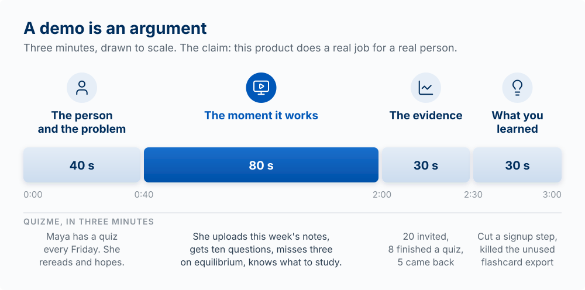

## Why This Matters

You spent the semester finding a truth about a customer and building something in response to it. Now you have to make someone else care. That is a different skill, and it is not optional. The best product loses to a worse one that is explained better. Your [Sprint 6](00-assessments.qmd#sprint-6) demo is a three-minute video, which is to say it is a story, and the ability to tell it well is the same ability you use in a customer interview, a landing page, a sales call, a stakeholder update, and a job interview.

This chapter teaches you to build a supply of stories, to tell them well, and to shape the one story that matters most this semester: the story of what you built, why, and what happened when people used it.

::: {.callout-note title="The running example: QuizMe"}
This chapter continues the example from [Going to Market](12-going-to-market.qmd): QuizMe, an
app that turns a student's lecture notes into a practice quiz, for $4 a month.
:::

<!-- learn -->

## A story has a job

Every story has a purpose, and the first question is always what that purpose is. Work through three steps. The first, Aim, is the same first step as the course's loop in [chapter 01](01-building-with-ai-agents.qmd):

- **Aim.** What are you trying to communicate, and who are you trying to persuade? Persuade an investor, recruit a teammate, get a user to try the thing, help a stakeholder say yes.
- **Approach.** Which story serves that aim? Pick from your database (below), do not invent one on the spot.
- **Act.** Tell it, and watch whether it landed.

If you cannot say what a story is *for*, you are not ready to tell it.

<!-- learn -->

## Build a story database

Skilled storytellers draw on stories they have prepared in advance. Your standing assignment, starting now, is to **brainstorm and keep a running list of at least 20 personal stories** you can tell. Times you were lost, times you failed, the first time or the last time you did something, a near miss, a conflict you resolved, a moment something changed for you. Keep them in a file in your course repo. You will reach for them in interviews, demos, and pitches for the rest of your career.

Prompts for the list: *Tell me about the first time you... the last time you... the best ___ you ever had... a time you were completely lost... a time you helped someone who was stuck... a time you were sure and wrong.*

<!-- learn -->

## Techniques that make a story land

- **Find the five-second moment.** Every good story has a single instant the whole thing turns on. Know exactly where yours is and slow down when you reach it. If a story has no such moment, it is a report.
- **Show change.** A story is a before and an after. The listener needs to feel the difference between how things were and how they became. Without a change, it is not a story.
- **Speak to the rider and the elephant.** Every listener is a rider (conscious, logical) on an elephant (subconscious, emotional). Facts persuade the rider. Stakes, specifics, and feeling move the elephant. You need both. For the rider, lead with your point (the Pyramid Principle: conclusion first, then the support [@minto1978pyramid]). For the elephant, make it concrete and human.
- **Mind your body.** Posture, eye contact, and pace carry as much as words. Slouching weakens a good story. Stand up straight when you tell it.

![Every listener is a small rider (deliberate reasoning) on a large elephant (emotion and intuition). Facts move the rider; stakes, specifics, and feeling move the elephant. The rider can steer only where the elephant is willing to go. Adapted from Jonathan Haidt, *The Happiness Hypothesis* [@haidt2006happiness].](images/diagrams/ch03-rider-elephant.svg){#fig-rider-elephant-story fig-alt="A line drawing of a large elephant walking to the right with a small rider on its back holding the reins. The rider is labeled deliberate reasoning; the elephant is labeled emotion and intuition. Ahead of them the path forks. A dashed branch rising to the upper right is labeled route the rider chooses; a solid branch straight ahead is labeled route the elephant takes, and the elephant is walking onto the straight branch." width="100%"}

*The rider and the elephant is Jonathan Haidt's image (The Happiness Hypothesis, 2006) [@haidt2006happiness], popularized for change by Chip and Dan Heath (Switch, 2010) [@heath2010switch].*

<!-- learn -->

## Make It Stick

Why are some ideas remembered while others are forgotten? Chip and Dan Heath studied ideas that people remember and found six traits, which they abbreviate as **SUCCESs**: **S**imple (one core idea), **U**nexpected (break a pattern, open a gap), **C**oncrete (specific images, not abstractions), **C**redible (a detail or number that makes it believable), **E**motional (make them feel as well as think), and **S**tories (wrap it in a narrative). When your pitch is not working, run it against the six and you will usually find the missing one. For QuizMe, "helps students study more effectively" is abstract; "Maya missed three questions on equilibrium and knew what to study" is Concrete, and "five of the eight students who finished a quiz came back the next week" is Credible.

For structure, Nancy Duarte's advice is to move your audience deliberately between *what is* and *what could be*: open the gap between today's frustrating reality and the better future your product makes possible, then close on a clear call to action. The contrast between the two holds the audience's attention.

![The shape of a persuasive talk. The beginning describes what is; a first turning point, which Duarte calls the call to adventure, shows what could be; the middle moves back and forth between the two; the call to action asks the audience to act, and the end stays on what could be. After Nancy Duarte's sparkline in Resonate [@duarte2010resonate].](images/diagrams/ch15-what-is-what-could-be.svg){#fig-what-is-what-could-be fig-alt="A line moves between two levels, What is at the bottom and What could be at the top, across three spans labeled Beginning, Middle: contrast, and End. In the beginning the line stays on What is, with the QuizMe example Maya rereads her notes. At a turning point labeled Call to adventure it rises to What could be. Through the middle it moves down and up between the two levels twice. At a second turning point labeled Call to action it rises to What could be and stays there through the end, with the example Maya knows what to study." width="100%"}

In a QuizMe demo, *what is* is Maya rereading her notes the night before the quiz, and *what could be* is Maya knowing what to study. The middle of the talk moves between the two, and the call to action is what you want the audience to do next, such as try the app before their next quiz.

*Sticky ideas (SUCCESs) from Chip and Dan Heath, Made to Stick (2007) [@heath2007stick]; story structure from Nancy Duarte, Resonate (2010) [@duarte2010resonate].*

<!-- learn -->

## Storytelling in day-to-day product work

The demo is one setting. The skill generalizes across four variables you can name deliberately:

| Variable | Options |
|---|---|
| **Setting (where/when)** | Async (email, Slack), live call, in-person |
| **Method (what/how)** | Spoken, slides, a written doc, a recorded walkthrough, a live screenshare |
| **Audience (who)** | A senior decision-maker, a peer, a stakeholder, a customer |
| **Purpose (why)** | Align on next steps, win a decision, an interview, a pitch, a resource request |

A demo to a senior decision-maker who needs to say yes is a different story, told differently, than a walkthrough for a peer who needs to give you feedback. Choose on purpose. (The 15-minute sales conversation in [Going to Market](12-going-to-market.qmd) is another case: live, one customer, built around their problem.)

<!-- learn -->

## The Final Demo

**The model:** a demo is an argument. It makes a claim (this product does a real job for a real
person) and supports it in order: the problem, the person, the moment it works, and the evidence.
What you learned comes last.

Your [Sprint 6](00-assessments.qmd#sprint-6) demo is a three-minute video that tells the story of
your product and covers the semester, not only the last sprint. It is graded on the product and on
the telling.

<!-- REVIEW: this chapter previously said the Sprint 6 demo was a five-minute video (1 + 2.5 + 1.5 minutes); 00-assessments.qmd#sprint-6 says it "runs to three minutes." The chapter now follows the assessment. If five minutes is intended, change 00-assessments.qmd and these timings together. -->

| Part | About | What it does in the argument |
|---|---|---|
| **The person and the problem** | 40 seconds | Open with a specific person and a specific moment, not a market-size statistic. What truth about a customer did you find, and why does it matter? This is where the audience starts to care. |
| **The moment it works** | 80 seconds | The real, deployed product doing the real thing, with real data. Not slides, not localhost (the copy running only on your own laptop), not a tour of features nobody asked about. Show the core action a user came for, working end to end. |
| **The evidence** | 30 seconds | What users actually did: your funnel, a cohort curve, three people's behavior, a quote from someone who came back. This is what [Measuring What Matters](14-measuring-what-matters.qmd) was for. |
| **What you learned** | 30 seconds | What failed, what surprised you, what you would do differently, and what you would keep, change, or kill next. An honest account here makes you more credible. |

{#fig-demo-argument fig-alt="A timeline of the three-minute final demo with each part to scale: the person and the problem, 40 seconds; the moment it works, highlighted, 80 seconds, from 0:40 to 2:00; the evidence, 30 seconds; what you learned, 30 seconds. Under each part is the QuizMe example: Maya has a quiz every Friday and studies by rereading her notes; she uploads this week's notes, gets ten questions, misses three on equilibrium, and knows what to study; 20 invited, 8 finished a quiz, 5 came back; cut a signup step and killed the unused flashcard export." width="100%"}

**Evidence at student scale.** Small numbers are fine; invented or inflated ones are not. "Twelve
people tried it, five completed a quiz in their second week, and here is the curve" is strong
evidence. "Three students used it before every quiz for a month, and here is what one of them
said" is evidence too. Remember *resulting* [@duke2018bets], judging a decision only by how it turned out: you are graded on the quality of your
decisions and your learning, not on how big the numbers are. A thoughtful product with three
engaged users and an honest account of what they did beats a rushed one claiming fifty. Leaving
the evidence out entirely leaves the argument unsupported.

**Worked example (QuizMe, in three minutes).** *Person and problem:* "Maya has a chemistry quiz
every Friday. Thursday night she rereads her notes and hopes." *Moment it works:* she uploads this
week's notes, gets ten questions, misses three on equilibrium, and knows what to study. *Evidence:*
twenty students invited, eight completed a quiz, five came back the next week; here is the cohort
curve. *Learned:* the first version asked for a course code before anything else and half the
signups stopped there; after we cut it, the next group of signups reached a first quiz at twice the rate (a before-and-after comparison, so other changes could explain part of it), and we killed the flashcard export nobody used.

### Winning Support: Your Innovation Capital

The demo asks people to back you: users decide whether to trust a stranger's product, mentors
decide whether to spend time on you, and later investors or a boss decide whether to fund you.
Jeff Dyer and his colleagues call the ability to attract that support **innovation capital**, and
they show it is something you build on purpose, from three sources:

- **Human capital:** who you are as a builder, your skills and your visible passion for the problem. You have been building this all semester.
- **Social capital:** who you know, the users, mentors, classmates, and experts who will vouch for you or help you.
- **Reputation capital:** what you have done, your track record. A shipped product with real users is reputation you can point to, and it is the easiest kind for a student to earn: ship the product and show it.

Take an honest inventory of all three before you record. Your demo is far stronger when it shows a
product and also a credible builder, with a network and a track record, standing behind it.

*Innovation capital is from Jeff Dyer, Nathan Furr, and Curtis Lefrandt, Innovation Capital (Harvard Business Review Press, 2019) [@dyer2019innovation].*

### Amplify: Make Them Believe

A demo carries information, and it also persuades. Jeff Dyer and his colleagues catalog the moves innovators use to win support for an idea, their **impression amplifiers**, and a few belong in your final pitch:

- **Materialize.** Show the real, working product, not slides. A working product is more convincing than any number of claims. This is why the demo shows the deployed product doing the core task, not mockups.
- **Compare.** Anchor your product to something the audience already knows: "the [familiar product] for [your customer]." It makes an unfamiliar idea graspable in one line.
- **Story.** Open on a specific person and a specific moment, not a market-size statistic. The story is what moves the elephant.
- **Commit.** Show your own stake, the work you have put in and what you are willing to keep doing. Visible commitment makes others willing to back you.

Used honestly, these help a good product get the hearing it deserves. Used to make a product that does not work look like it does, they become deception, the line the [Product Morality](03-what-is-worth-building.qmd) chapter draws (the book's own cautionary case is Theranos [@carreyrou2018badblood]). Amplify what is true; never invent it.

*The impression amplifiers are from Jeff Dyer, Nathan Furr, and Curtis Lefrandt, Innovation Capital (Harvard Business Review Press, 2019) [@dyer2019innovation].*

### Rehearse

Storytelling is a skill built by repetition. Practice the demo out loud, on camera, more than once. Time it. Watch it back and cut what does not serve the aim. Then tell it to one other person and fix what confused them before you record the final take.

::: {.callout-tip title="Try it"}
Write your demo as five lines: the person, the problem, the moment it works, the evidence, what you learned. Read it aloud with a timer. Which line has no evidence behind it yet? That is what to measure before December 10.
:::

<!-- learn -->

## Key Concepts

- **A story has a job**: aim, approach, act. Know what it is for.
- **Story database**: keep a list of 20+ personal stories, ready to use.
- **Five-second moment**: the single instant the story turns on.
- **Show change**: before and after, or it is not a story.
- **Rider and elephant**: persuade the logic, move the emotion.
- **The demo as an argument**: the person and the problem, the moment it works, the evidence, then what you learned, in three minutes.
- **Innovation capital**: human, social, and reputation capital that make people willing to back you.
- **Impression amplifiers**: materialize, compare, story, commit; used honestly.
