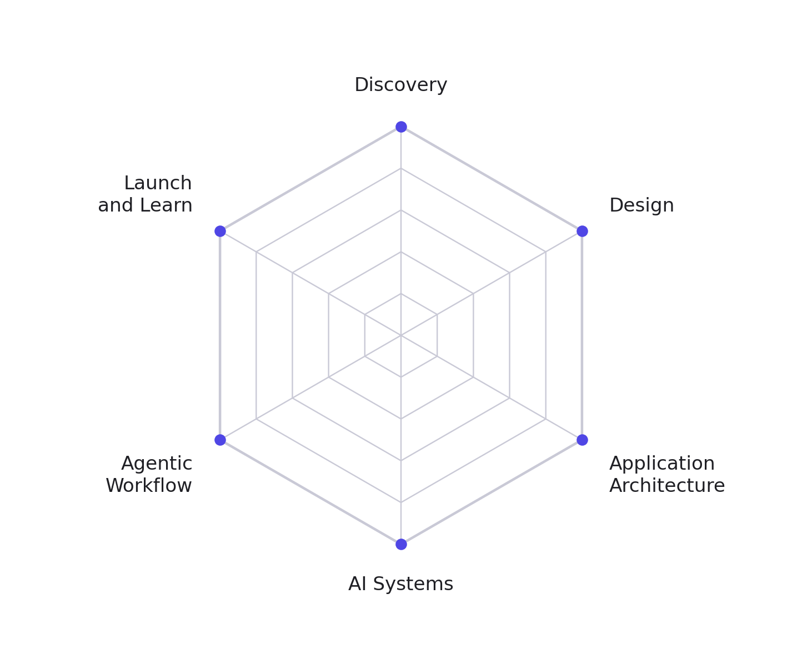

Curated reading, courses, and accounts for becoming an AI product builder, organized by the six
Builder axes.



**How to use this.** Do not work through it top to bottom. Find your lowest axis on your baseline
profile, start with the one item marked **Start here**, and come back for the rest when you need
it.

Verified August 2026. Anthropic moved several documentation URLs during 2025 and 2026, so older
links you find elsewhere may redirect or break.

## Discovery

What to build, and for whom.

| Resource | Format | Why |
|---|---|---|
| **Start here:** [The Mom Test](https://www.momtestbook.com/), Rob Fitzpatrick | Book, short | Fixes the most common failure in the room: asking questions that produce flattering lies |
| [Continuous Discovery Habits](https://www.producttalk.org/continuous-discovery-habits/), Teresa Torres | Book | Turns "talk to users" into a weekly team habit rather than a good intention |
| [Prioritize Opportunities, Not Solutions](https://www.producttalk.org/prioritize-opportunities/), Teresa Torres | Article, free | The clearest free explainer of the opportunity solution tree |
| [The Lean Product Playbook](https://dan-olsen.com/book/), Dan Olsen | Book | The cleanest operational definition of product-market fit, six steps from customer to MVP |
| [SVPG articles](https://www.svpg.com/articles/), Marty Cagan | Articles, free | Free and still updated. Start with how strong product teams differ from feature teams |
| [Shape Up](https://basecamp.com/shapeup), Ryan Singer | Book, free | Fixed appetite and betting instead of backlog grooming. Free full text |
| [Lenny's Newsletter](https://www.lennysnewsletter.com/) | Newsletter | The highest density of practitioner tactics anywhere in product |
| [Mental models for building products people love](https://www.youtube.com/watch?v=kLe-zy5r0Mk), Stewart Butterfield, Nov 2025 | Podcast | The Slack and Flickr founder on how he decides what is worth building |

**Create your own curated study plan from these resources.** Copy this into Claude Code.
It reads the sources above, finds out what you already know, and teaches against your own
project rather than a tutorial app.

```bash
Context first, because you do not know any of this yet.

I am a student in a BYU course that trains AI product builders: people who
can carry an idea from a user problem to a working product that someone
actually uses, with AI as both the material and the tool.

We track six skills, called the Builder axes:

  1. Discovery, what to build and for whom
  2. Design, the surface and the flow
  3. Application Architecture, how the app is structured, shipped, and kept
     safe
  4. AI Systems, the intelligence inside the product: context windows,
     prompting, tool use, RAG, hallucination and verification, evals, cost
     and latency
  5. Agentic Workflow, AI as the way you build: coding agents, agent loops,
     project instruction files, memory, skills, hooks, subagents, MCP, and
     reviewing code an agent wrote
  6. Launch and Learn, instrumentation, metrics, activation and retention,
     experiments, positioning and pricing

I rated myself 1 to 5 on every axis and got back a six-sided chart of my
profile. I am working on one axis at a time, starting with my weakest.

You are my tutor for Discovery: what to build, and for whom.

First, ask me at most four questions to find out where I actually am. Do not
skip this and do not ask more than four.

Then build me an ordered plan from the sources below, with a rough time
estimate for each step. Read each source yourself before you teach from it.

Sources:
https://www.momtestbook.com/
https://www.producttalk.org/prioritize-opportunities/
https://www.svpg.com/articles/
https://basecamp.com/shapeup
https://www.youtube.com/watch?v=kLe-zy5r0Mk

How to teach me:
- One concept per session, thirty minutes maximum. Say where we stopped.
- After each concept, give me one small exercise against my own project. Not a
  toy example. If I do not have a project yet, help me pick one first.
- Make me explain it back, or show you the work. If I am hand-waving, say so
  and stay on it.
- If a source is out of date or wrong, tell me. Do not summarize uncritically.
- Skip anything I already know. Prove it by asking, not by assuming.

We are done when I can state a real user problem, the evidence that it is
real, and the smallest thing you could build to test it, in one page.
When we get there, tell me plainly what I still cannot do.
```

## Design

The surface and the flow.

| Resource | Format | Why |
|---|---|---|
| **Start here:** [Refactoring UI](https://www.refactoringui.com/) | Book | Written for engineers who need work to look designed without becoming designers |
| [Laws of UX](https://lawsofux.com/), Jon Yablonski | Site, free | The cognitive principles that explain why an interface works, one page each |
| [The Definition of User Experience](https://www.nngroup.com/articles/definition-user-experience/), Norman and Nielsen | Article, free | The foundational framing, from the people who coined the term |
| [Handmade Designs: The New Trust Signal](https://www.nngroup.com/articles/handmade-designs/), NN/g | Article, 2026 | Directly on the UI critique row: as AI polish becomes free, imperfection starts reading as trust |
| [shadcn/ui](https://ui.shadcn.com/docs) | Docs | The component system agents actually write against, built to be legible to an LLM |
| [Apple Human Interface Guidelines](https://developer.apple.com/design/human-interface-guidelines/) | Docs | Canonical reference for platform-native patterns and component behavior |
| [The design process is dead. Here's what's replacing it.](https://www.lennysnewsletter.com/p/the-design-process-is-dead), Jenny Wen | Article, 2026 | Head of design at Claude on why discovery, mock, iterate is obsolete, and what taste means when prototyping is free |
| [The Looking Glass](https://lg.substack.com/), Julie Zhuo | Newsletter | Ex-Facebook VP of Design on judgment and critique culture |
| [Why AI makes design, craft, and quality the new moat](https://www.youtube.com/watch?v=WyJV6VwEGA8), Figma's CEO, Oct 2025 | Podcast | The argument that as building gets cheap, taste becomes the differentiator |
| [How to build real taste, and why AI makes it matter more](https://www.youtube.com/watch?v=RJjl1TwyfWM), Tony Fadell, Jun 2026 | Podcast | The iPod and Nest creator on where taste comes from and how to develop it |

**Create your own curated study plan from these resources.** Copy this into Claude Code.
It reads the sources above, finds out what you already know, and teaches against your own
project rather than a tutorial app.

```bash
Context first, because you do not know any of this yet.

I am a student in a BYU course that trains AI product builders: people who
can carry an idea from a user problem to a working product that someone
actually uses, with AI as both the material and the tool.

We track six skills, called the Builder axes:

  1. Discovery, what to build and for whom
  2. Design, the surface and the flow
  3. Application Architecture, how the app is structured, shipped, and kept
     safe
  4. AI Systems, the intelligence inside the product: context windows,
     prompting, tool use, RAG, hallucination and verification, evals, cost
     and latency
  5. Agentic Workflow, AI as the way you build: coding agents, agent loops,
     project instruction files, memory, skills, hooks, subagents, MCP, and
     reviewing code an agent wrote
  6. Launch and Learn, instrumentation, metrics, activation and retention,
     experiments, positioning and pricing

I rated myself 1 to 5 on every axis and got back a six-sided chart of my
profile. I am working on one axis at a time, starting with my weakest.

You are my tutor for Design: the surface and the flow.

First, ask me at most four questions to find out where I actually am. Do not
skip this and do not ask more than four.

Then build me an ordered plan from the sources below, with a rough time
estimate for each step. Read each source yourself before you teach from it.

Sources:
https://www.refactoringui.com/
https://lawsofux.com/
https://www.nngroup.com/articles/definition-user-experience/
https://www.nngroup.com/articles/handmade-designs/
https://www.lennysnewsletter.com/p/the-design-process-is-dead
https://ui.shadcn.com/docs

How to teach me:
- One concept per session, thirty minutes maximum. Say where we stopped.
- After each concept, give me one small exercise against my own project. Not a
  toy example. If I do not have a project yet, help me pick one first.
- Make me explain it back, or show you the work. If I am hand-waving, say so
  and stay on it.
- If a source is out of date or wrong, tell me. Do not summarize uncritically.
- Skip anything I already know. Prove it by asking, not by assuming.

We are done when I can take a screen an agent generated for you and name
five specific things wrong with it, each with a reason a designer would
accept.
When we get there, tell me plainly what I still cannot do.
```

## Application Architecture

How the application is structured, shipped, and kept safe.

| Resource | Format | Why |
|---|---|---|
| **Start here:** [Learn Next.js](https://nextjs.org/learn), Vercel | Course, free | Sixteen chapters building a real full-stack app: routing, data, auth, deploy |
| [Supabase docs](https://supabase.com/docs) and the [auth guide](https://supabase.com/docs/guides/auth) | Docs | Postgres, auth, storage, realtime in one set. The auth guide covers row level security, which most tutorials skip |
| [Designing Data-Intensive Applications, 2nd ed.](https://martin.kleppmann.com/2026/03/24/designing-data-intensive-applications-2e.html), Kleppmann and Riccomini | Book, 2026 | The reference for how data systems really behave. The second edition rewrites the consistency chapter and adds the cloud reality |
| [Pro Git](https://git-scm.com/book/en/v2) | Book, free | Complete and free. Read chapters 1 to 3 and stop until you need more |
| [OWASP Top 10:2025](https://owasp.org/Top10/2025/) | Standard | The 2025 edition adds software supply chain failures. If a syllabus cites the 2021 list, it is stale |
| [Web Security Academy](https://portswigger.net/web-security), PortSwigger | Labs, free | Hands-on labs for the attacks OWASP describes. Reading about SQL injection is not the same as doing one |
| [Use The Index, Luke!](https://use-the-index-luke.com/), Markus Winand | Book, free | SQL indexing for developers. Almost nothing else covers this well |
| [The Pragmatic Engineer](https://newsletter.pragmaticengineer.com/), Gergely Orosz | Newsletter | How production systems and engineering practice actually work inside real companies |

Lenny's Podcast has almost nothing on this axis. Product podcasts do not cover schema design or
deploys, which is part of why it is the weakest axis across the Foundry cohort.

**Create your own curated study plan from these resources.** Copy this into Claude Code.
It reads the sources above, finds out what you already know, and teaches against your own
project rather than a tutorial app.

```bash
Context first, because you do not know any of this yet.

I am a student in a BYU course that trains AI product builders: people who
can carry an idea from a user problem to a working product that someone
actually uses, with AI as both the material and the tool.

We track six skills, called the Builder axes:

  1. Discovery, what to build and for whom
  2. Design, the surface and the flow
  3. Application Architecture, how the app is structured, shipped, and kept
     safe
  4. AI Systems, the intelligence inside the product: context windows,
     prompting, tool use, RAG, hallucination and verification, evals, cost
     and latency
  5. Agentic Workflow, AI as the way you build: coding agents, agent loops,
     project instruction files, memory, skills, hooks, subagents, MCP, and
     reviewing code an agent wrote
  6. Launch and Learn, instrumentation, metrics, activation and retention,
     experiments, positioning and pricing

I rated myself 1 to 5 on every axis and got back a six-sided chart of my
profile. I am working on one axis at a time, starting with my weakest.

You are my tutor for Application Architecture: how the application is
structured, shipped, and kept safe.

First, ask me at most four questions to find out where I actually am. Do not
skip this and do not ask more than four.

Then build me an ordered plan from the sources below, with a rough time
estimate for each step. Read each source yourself before you teach from it.

Sources:
https://nextjs.org/learn
https://supabase.com/docs/guides/auth
https://use-the-index-luke.com/
https://owasp.org/Top10/2025/
https://portswigger.net/web-security
https://git-scm.com/book/en/v2

How to teach me:
- One concept per session, thirty minutes maximum. Say where we stopped.
- After each concept, give me one small exercise against my own project. Not a
  toy example. If I do not have a project yet, help me pick one first.
- Make me explain it back, or show you the work. If I am hand-waving, say so
  and stay on it.
- If a source is out of date or wrong, tell me. Do not summarize uncritically.
- Skip anything I already know. Prove it by asking, not by assuming.

We are done when I can walk a stranger through your repo: what runs where,
what the schema is, who can see which rows, and what happens between your
machine and the live app.
When we get there, tell me plainly what I still cannot do.
```

## AI Systems

The intelligence inside the product.

| Resource | Format | Why |
|---|---|---|
| **Start here:** [Deep Dive into LLMs like ChatGPT](https://www.youtube.com/watch?v=7xTGNNLPyMI), Andrej Karpathy | Video, 3.5h | Pretraining through hallucination, tool use, and RLHF, pitched at builders rather than researchers |
| [Context windows](https://platform.claude.com/docs/en/build-with-claude/context-windows) and [prompt caching](https://platform.claude.com/docs/en/build-with-claude/prompt-caching), Anthropic | Docs | What actually counts against the window, and the most direct lever you have on cost and latency |
| [Tool use with Claude](https://platform.claude.com/docs/en/agents-and-tools/tool-use/overview) | Docs | Canonical reference for function calling and the agentic loop |
| [Interactive prompt engineering tutorial](https://github.com/anthropics/prompt-eng-interactive-tutorial) and [Claude Cookbooks](https://github.com/anthropics/claude-cookbooks) | Notebooks, free | Runnable examples for RAG, tool use, evals, caching, and cost |
| [Patterns for Building LLM-based Systems and Products](https://eugeneyan.com/writing/llm-patterns/), Eugene Yan | Article, free | The single best map of the field: evals, RAG, caching, guardrails, defensive UX |
| [AI Evals email course](https://ai.hamel.dev/eval-course), Hamel Husain and Shreya Shankar | Course, free | Seventeen parts plus two free ebooks. Evals are the axis item nobody has, and this is the on-ramp |
| [AI Engineering](https://www.oreilly.com/library/view/ai-engineering/9781098166298/), Chip Huyen | Book | The standard reference for the job title. Free chapter notes at [aie-book](https://github.com/chiphuyen/aie-book) |
| [Effective context engineering for AI agents](https://www.anthropic.com/engineering/effective-context-engineering-for-ai-agents), Anthropic | Article | Context engineering as the discipline that succeeded prompt engineering |
| [Why AI evals are the hottest new skill for product builders](https://www.youtube.com/watch?v=BsWxPI9UM4c), Hamel Husain, Sep 2025 | Podcast | The best introduction to why evals matter, from the person who teaches them |
| [AI Engineering 101](https://www.youtube.com/watch?v=qbvY0dQgSJ4), Chip Huyen, Oct 2025 | Podcast | The book's author covering the same ground in an hour |

**Create your own curated study plan from these resources.** Copy this into Claude Code.
It reads the sources above, finds out what you already know, and teaches against your own
project rather than a tutorial app.

```bash
Context first, because you do not know any of this yet.

I am a student in a BYU course that trains AI product builders: people who
can carry an idea from a user problem to a working product that someone
actually uses, with AI as both the material and the tool.

We track six skills, called the Builder axes:

  1. Discovery, what to build and for whom
  2. Design, the surface and the flow
  3. Application Architecture, how the app is structured, shipped, and kept
     safe
  4. AI Systems, the intelligence inside the product: context windows,
     prompting, tool use, RAG, hallucination and verification, evals, cost
     and latency
  5. Agentic Workflow, AI as the way you build: coding agents, agent loops,
     project instruction files, memory, skills, hooks, subagents, MCP, and
     reviewing code an agent wrote
  6. Launch and Learn, instrumentation, metrics, activation and retention,
     experiments, positioning and pricing

I rated myself 1 to 5 on every axis and got back a six-sided chart of my
profile. I am working on one axis at a time, starting with my weakest.

You are my tutor for AI Systems: the intelligence inside the product.

First, ask me at most four questions to find out where I actually am. Do not
skip this and do not ask more than four.

Then build me an ordered plan from the sources below, with a rough time
estimate for each step. Read each source yourself before you teach from it.

Sources:
https://www.youtube.com/watch?v=7xTGNNLPyMI
https://platform.claude.com/docs/en/build-with-claude/context-windows
https://platform.claude.com/docs/en/build-with-claude/prompt-caching
https://platform.claude.com/docs/en/agents-and-tools/tool-use/overview
https://eugeneyan.com/writing/llm-patterns/
https://ai.hamel.dev/eval-course
https://www.anthropic.com/engineering/effective-context-engineering-for-ai-agents

How to teach me:
- One concept per session, thirty minutes maximum. Say where we stopped.
- After each concept, give me one small exercise against my own project. Not a
  toy example. If I do not have a project yet, help me pick one first.
- Make me explain it back, or show you the work. If I am hand-waving, say so
  and stay on it.
- If a source is out of date or wrong, tell me. Do not summarize uncritically.
- Skip anything I already know. Prove it by asking, not by assuming.

We are done when I can explain where your AI feature could be wrong, how you
would find out, and roughly what one use of it costs.
When we get there, tell me plainly what I still cannot do.
```

## Agentic Workflow

AI as the way you build. This axis moves fastest, so favor docs and primary sources over books.

| Resource | Format | Why |
|---|---|---|
| **Start here:** [Building Effective Agents](https://www.anthropic.com/engineering/building-effective-agents), Anthropic | Article | The shared vocabulary of the field: workflows versus agents, patterns over frameworks |
| [Claude Code documentation](https://code.claude.com/docs/en/overview) | Docs | CLAUDE.md, memory, skills, hooks, subagents, and MCP, all in one place. Note the URL moved in 2025 |
| [Anthropic Academy](https://anthropic.skilljar.com/) | Courses, free | Around 23 free courses with certificates, including Claude Code in Action, MCP, skills, and subagents |
| [Agentic Engineering Patterns](https://simonwillison.net/guides/agentic-engineering-patterns/), Simon Willison | Guide, free | Six chapters on principles, testing, and annotated real prompts. The best free text on loop design |
| [How we built our multi-agent research system](https://www.anthropic.com/engineering/multi-agent-research-system), Anthropic | Article | Orchestrator and subagent architecture, when parallelism wins, and the token cost it carries |
| [Writing effective tools for agents](https://www.anthropic.com/engineering/writing-tools-for-agents), Anthropic | Article | Read before you write an MCP server, not after |
| [Model Context Protocol](https://modelcontextprotocol.io) and [AGENTS.md](https://agents.md/) | Specs | Both are now multi-vendor open standards rather than one company's idea |
| [How far can we push AI autonomy in code generation?](https://martinfowler.com/articles/pushing-ai-autonomy.html), Birgitta Böckeler | Article | The most rigorous treatment of where human review is still non-negotiable |
| [Vibe coding and agentic engineering are getting closer than I'd like](https://simonwillison.net/2026/May/6/vibe-coding-and-agentic-engineering/), Simon Willison | Article | An honest admission that review discipline is eroding, from one of its advocates |
| [What happens after coding is solved](https://www.youtube.com/watch?v=We7BZVKbCVw), Boris Cherny, Feb 2026 | Podcast | The head of Claude Code on where agentic development is going. The most watched episode on this list |
| [Claude Code and Cowork](https://www.youtube.com/watch?v=Ybrl4FYM57c), Fiona Fung, Jun 2026 | Podcast | The follow-up, four months later, on how the workflow changed again |

**Create your own curated study plan from these resources.** Copy this into Claude Code.
It reads the sources above, finds out what you already know, and teaches against your own
project rather than a tutorial app.

```bash
Context first, because you do not know any of this yet.

I am a student in a BYU course that trains AI product builders: people who
can carry an idea from a user problem to a working product that someone
actually uses, with AI as both the material and the tool.

We track six skills, called the Builder axes:

  1. Discovery, what to build and for whom
  2. Design, the surface and the flow
  3. Application Architecture, how the app is structured, shipped, and kept
     safe
  4. AI Systems, the intelligence inside the product: context windows,
     prompting, tool use, RAG, hallucination and verification, evals, cost
     and latency
  5. Agentic Workflow, AI as the way you build: coding agents, agent loops,
     project instruction files, memory, skills, hooks, subagents, MCP, and
     reviewing code an agent wrote
  6. Launch and Learn, instrumentation, metrics, activation and retention,
     experiments, positioning and pricing

I rated myself 1 to 5 on every axis and got back a six-sided chart of my
profile. I am working on one axis at a time, starting with my weakest.

You are my tutor for Agentic Workflow: AI as the way you build.

First, ask me at most four questions to find out where I actually am. Do not
skip this and do not ask more than four.

Then build me an ordered plan from the sources below, with a rough time
estimate for each step. Read each source yourself before you teach from it.

Sources:
https://www.anthropic.com/engineering/building-effective-agents
https://code.claude.com/docs/en/overview
https://simonwillison.net/guides/agentic-engineering-patterns/
https://www.anthropic.com/engineering/writing-tools-for-agents
https://www.anthropic.com/engineering/multi-agent-research-system
https://martinfowler.com/articles/pushing-ai-autonomy.html
https://modelcontextprotocol.io

How to teach me:
- One concept per session, thirty minutes maximum. Say where we stopped.
- After each concept, give me one small exercise against my own project. Not a
  toy example. If I do not have a project yet, help me pick one first.
- Make me explain it back, or show you the work. If I am hand-waving, say so
  and stay on it.
- If a source is out of date or wrong, tell me. Do not summarize uncritically.
- Skip anything I already know. Prove it by asking, not by assuming.

We are done when I can set your project up so an agent does good work in it,
and review what it wrote well enough to catch what it got wrong.
When we get there, tell me plainly what I still cannot do.
```

## Launch and Learn

Getting it in front of people and finding out whether it worked.

| Resource | Format | Why |
|---|---|---|
| **Start here:** [Product/Market Fit Survey](https://pmfsurvey.com), Sean Ellis | Tool | The 40 percent "very disappointed" test. Run it on your own product rather than reading about it |
| [How Superhuman built an engine to find PMF](https://review.firstround.com/how-superhuman-built-an-engine-to-find-product-market-fit/), Rahul Vohra | Article, free | Turns that survey into a repeatable loop. They went from 22 to 58 percent |
| [What is good retention?](https://www.lennysnewsletter.com/p/what-is-good-retention-issue-29), Lenny Rachitsky and Casey Winters | Article | Benchmarks by business model. Answers the question "is our number bad" |
| [North Star Playbook](https://amplitude.com/books/north-star/amplitudes-north-star-metric-and-inputs), Amplitude | Playbook, free | The standard reference for choosing a metric that would actually move |
| [Obviously Awesome](https://www.aprildunford.com/books), April Dunford | Book | Positioning, which determines what activation even means |
| [Growth Loops are the New Funnels](https://www.reforge.com/blog/growth-loops), Reforge | Article | The essay that reframed growth from linear funnels to compounding loops |
| [Trustworthy Online Controlled Experiments](https://experimentguide.com/), Kohavi, Tang and Xu | Book | The A/B testing reference. Chapter 1 and the FAQ are free on the companion site |
| [The new AI growth playbook for 2026](https://www.lennysnewsletter.com/p/the-new-ai-growth-playbook-for-2026-elena-verna), Elena Verna | Article, 2026 | Argues AI-native products have to re-find product-market fit every few months rather than once |
| [Finding hidden growth opportunities in your product](https://www.youtube.com/watch?v=2BKmNmnEj9w), Albert Cheng, Oct 2025 | Podcast | Duolingo and Uber growth work, concrete enough to copy on Monday |
| [What world-class go-to-market looks like in 2026](https://www.youtube.com/watch?v=RmnWHz8HD74), Jeanne DeWitt Grosser, Nov 2025 | Podcast | Vercel and Stripe on positioning and pricing, the two rows this axis is weakest on |

**Create your own curated study plan from these resources.** Copy this into Claude Code.
It reads the sources above, finds out what you already know, and teaches against your own
project rather than a tutorial app.

```bash
Context first, because you do not know any of this yet.

I am a student in a BYU course that trains AI product builders: people who
can carry an idea from a user problem to a working product that someone
actually uses, with AI as both the material and the tool.

We track six skills, called the Builder axes:

  1. Discovery, what to build and for whom
  2. Design, the surface and the flow
  3. Application Architecture, how the app is structured, shipped, and kept
     safe
  4. AI Systems, the intelligence inside the product: context windows,
     prompting, tool use, RAG, hallucination and verification, evals, cost
     and latency
  5. Agentic Workflow, AI as the way you build: coding agents, agent loops,
     project instruction files, memory, skills, hooks, subagents, MCP, and
     reviewing code an agent wrote
  6. Launch and Learn, instrumentation, metrics, activation and retention,
     experiments, positioning and pricing

I rated myself 1 to 5 on every axis and got back a six-sided chart of my
profile. I am working on one axis at a time, starting with my weakest.

You are my tutor for Launch and Learn: getting it in front of people and
finding out whether it worked.

First, ask me at most four questions to find out where I actually am. Do not
skip this and do not ask more than four.

Then build me an ordered plan from the sources below, with a rough time
estimate for each step. Read each source yourself before you teach from it.

Sources:
https://pmfsurvey.com
https://review.firstround.com/how-superhuman-built-an-engine-to-find-product-market-fit/
https://amplitude.com/books/north-star/amplitudes-north-star-metric-and-inputs
https://www.lennysnewsletter.com/p/what-is-good-retention-issue-29
https://www.aprildunford.com/books
https://experimentguide.com/

How to teach me:
- One concept per session, thirty minutes maximum. Say where we stopped.
- After each concept, give me one small exercise against my own project. Not a
  toy example. If I do not have a project yet, help me pick one first.
- Make me explain it back, or show you the work. If I am hand-waving, say so
  and stay on it.
- If a source is out of date or wrong, tell me. Do not summarize uncritically.
- Skip anything I already know. Prove it by asking, not by assuming.

We are done when I can name the one metric that would move if your product
were working, say how you would instrument it, and say what number would
make you kill the feature.
When we get there, tell me plainly what I still cannot do.
```

## Who to follow

Moved. The accounts worth following, alongside the product management voices, are on the
[Thought Leaders](97-thought-leaders.qmd) page.
