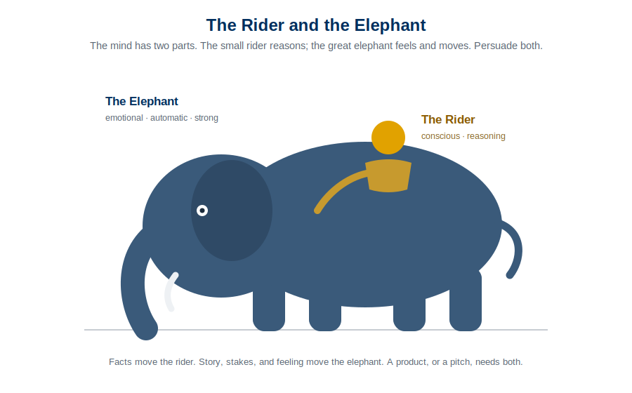

> "Discoveries latent with such potent power, either for the blessing or the destruction of human beings as to make men's responsibility in controlling them the most gigantic ever placed in human hands. ... This age is fraught with limitless perils, as well as untold possibilities." [@mckay1966] *--David O. McKay, in Conference Report, Oct. 1966, 4.*

## Why This Matters

Most of this course is about discovering what is true and building in response to it. But truth-seeking answers only half the question. It tells you what *is*: what users want, what will bring them back, what will make money. It does not tell you what you *ought* to build. A product can be perfectly validated, well reasoned, and flawlessly shipped, and still leave its users worse off.

That second question, not "will it work" but "should we build it," is the **aim**. It is chosen by values, not decided by evidence, and it is the part of product work a metrics dashboard will never settle for you. This chapter is about aiming well. It maps directly to [Learning Outcome 3](00-assessments.qmd): analyzing the physical, mental, and spiritual impact your product is likely to have on the people who use it.

## Understanding human nature cuts both ways

To build something people actually use, you have to understand how people actually work: the emotional elephant beneath the rational rider [@haidt2006happiness] (Daniel Kahneman's fast, automatic System 1 and slow, deliberate System 2 [@kahneman2011thinking]), the cognitive shortcuts and defaults, the cravings and the loops. That knowledge is exactly what makes a product feel effortless and worth returning to.

{fig-alt="An illustration of a small rider seated on a large elephant. The rider is labeled conscious and reasoning; the elephant is labeled emotional, automatic, and strong."}

It is also exactly what makes a product manipulative. The same understanding of human defaults that lets you remove friction lets you engineer compulsion. The line between a product that serves a person and one that exploits them runs right through the knowledge you are gaining in this class. Which is why the knowledge comes with a responsibility.

### Moral Foundations Theory

People are not blank slates about right and wrong. Research on moral foundations finds a handful of intuitions that recur across cultures: care versus harm, fairness versus cheating, loyalty, authority, sanctity, and liberty [@haidt2012righteous]. You need not adopt the theory wholesale to take its practical point: your users bring moral intuitions to your product, and they feel it when a product treats them unfairly, wastes them, or degrades them, even when they cannot name why. Building against those intuitions costs you trust, which is the one asset a product cannot fake.

### Hooked: engagement or exploitation

Habit-forming products run a loop: a trigger, an action, a variable reward, and an investment that brings the user back [@eyal2014hooked]. The mechanics are neutral. A fitness app and a slot machine use the same loop. The difference is entirely in the aim.

The honest test is simple: **would your user, in a calm and reflective moment, be glad you designed it this way?** A habit that helps someone do the thing they already want to do is a gift. A habit engineered to override their judgment and consume time they never meant to give is a harm, no matter how good the retention numbers look. This is where engagement metrics can lie to you, the ones you will learn to track later in [Measuring What Matters](08-measuring-what-matters.qmd): engagement a user would disown on reflection is not success, it is extraction.

### Algorithms and amplification

The moment your product recommends, ranks, or personalizes, it stops being a neutral tool and starts shaping what people see, want, and believe. An algorithm optimized purely for engagement will reliably discover that outrage, anxiety, and compulsion engage. If you build one, you own what it amplifies. Optimizing for a number without asking what that number does to a person is not a technical decision; it is a moral one you made by declining to make it.

## Aiming well: virtue and the golden mean

If the aim is a question of values, it helps to be precise about what a good aim looks like. Aristotle gave the most durable answer [@aristotlenicomachean]. A virtue, he argued, is not a feeling or a one-time act but a **settled disposition to choose well**, and it lies in a **mean between two vices**: one of excess and one of deficiency. Courage is the mean between cowardice and recklessness. Generosity is the mean between stinginess and waste. His formal definition: virtue is "a state concerned with choice, lying in a mean relative to us, this being determined by reason." The vices are the two ways of missing.

That structure maps onto a working table of virtues, each flanked by the vice of too little and the vice of too much:

| Deficiency (too little) | Virtue (the mean) | Excess (too much) | Category |
|---|---|---|---|
| Corrupt | Honest | Legalistic | Integrity |
| Foolish | Discerning | Judgmental | Discernment |
| Selfish | Loving | Enabling | Love / Care |
| Self-abasing | Humble | Prideful | Self-regard |
| Slothful | Diligent | Overworked | Work / Industry |
| Self-indulgent | Temperate | Austere | Pleasure / Appetite |
| Cowardly | Courageous | Foolhardy | Courage |
| Stingy | Generous | Wasteful | Generosity |
| Cynical | Trusting | Naïve | Trust |
| Halting | Decisive | Impulsive | Action / Initiative |
| Deceptive | Truthful | Blunt | Honesty about Self |
| Cold | Friendly | Ingratiating | Sociability |
| Short-tempered | Patient | Indifferent | Anger / Emotion |

The point for a builder is twofold. First, **most product decisions are a mean, not a maximum.** More engagement is not always better; the virtue of engagement design is temperance, the mean between exploitation and neglect. Persuasion is a mean between manipulation and passivity. Honest marketing is a mean between deception and tactless bluntness. When you find yourself maximizing a single quantity, ask what vice of excess you are walking into.

Second, and this is where Aristotle meets [the Hooked loop](#hooked-engagement-or-exploitation): we become what we repeatedly do. "Excellence," in Will Durant's well-known summary of Aristotle, "is not an act, but a habit." [@durant1926philosophy] Aristotle held that character is built by habituation, by doing courageous things until courage becomes a disposition. A product that shapes a habit is therefore shaping its users' character, a little, in one direction or another. That is an enormous thing to hold in your hands. Aim the habits your product builds at something the user, on reflection, would choose to become.

### A directional test

The Sprint 2 framework gives you a practical way to check your aim. For the needs your product touches, ask:

- **Agency.** Does it expand what users can do and choose, or does it quietly narrow them?
- **Becoming.** Does it help them grow and become more capable, or keep them dependent and stuck?
- **Connection.** Does it strengthen real relationships, or substitute a thinner thing for them?

Not every product touches all three. The question is directional: for the needs you do touch, are you on the right side of them? A product that expands agency, supports becoming, and deepens connection is aimed well, and it tends to earn the durable trust that cheaper tactics never can.

## Key Concepts

- **The aim is a values question**: truth-seeking tells you what is; it does not tell you what to build.
- **Human nature cuts both ways**: the knowledge that removes friction can also engineer compulsion.
- **The reflection test**: would your user, calm and reflective, be glad you built it this way?
- **Engagement can lie**: retention a user would disown is extraction, not success.
- **You own what your algorithm amplifies.**
- **The golden mean**: most product virtues are a mean between a vice of excess and a vice of deficiency.
- **Habits build character**: a product that shapes habits is shaping who its users become.
